# CSS 高级技巧

## 1. 精灵图

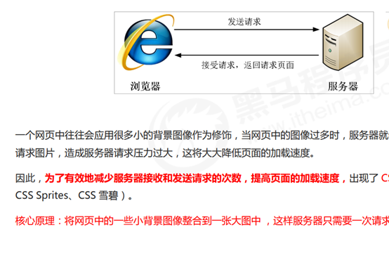

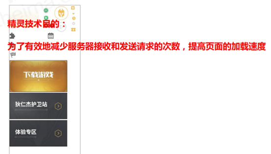

## 1.2 精灵图（sprites）的使用

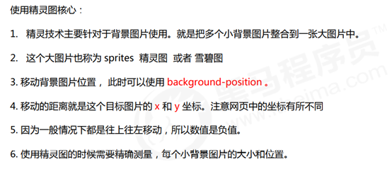

## 2. 字体图标

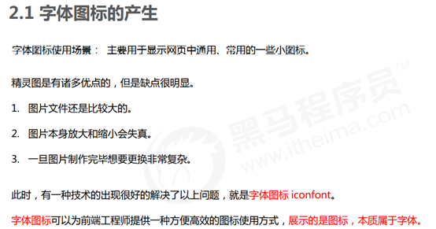

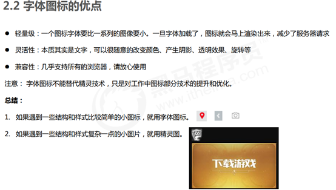

### 2.3 字体图标的下载

推荐下载网站：

 icomoon 字库 http##//icomoon.io 推荐指数 ★★★★★

IcoMoon 成立于 2011 年，推出了第一个自定义图标字体生成器，它允许用户选择所需要的图标，使它们成一字型。该字库内容种类繁多，非常全面，唯一的遗憾是国外服务器，打开网速较慢。

 阿里 iconfont 字库 http##//www.iconfont.cn/ 推荐指数 ★★★★★

这个是阿里妈妈 M2UX 的一个 iconfont 字体图标字库，包含了淘宝图标库和阿里妈妈图标库。可以使用 AI制作图标上传生成。 重点是，免费！

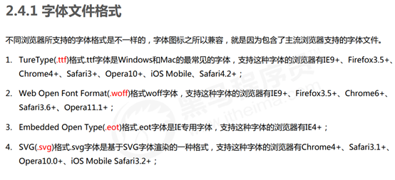

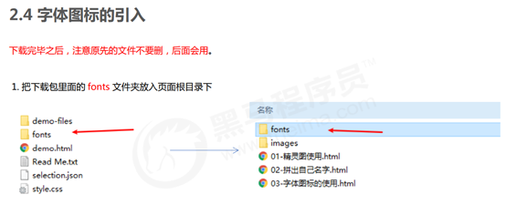

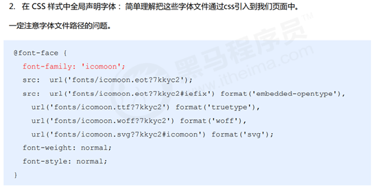

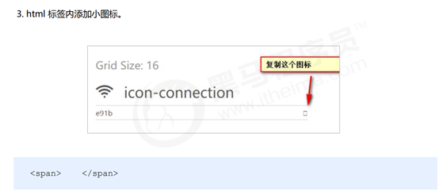

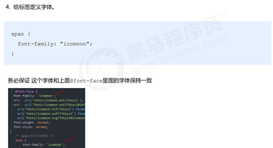

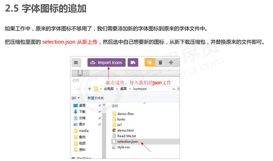

## 3. CSS 三角

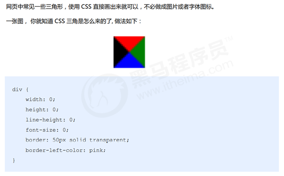

## 4. CSS 用户界面样式

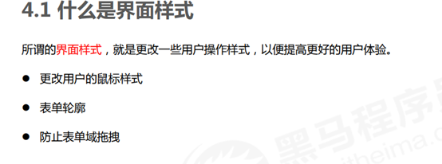

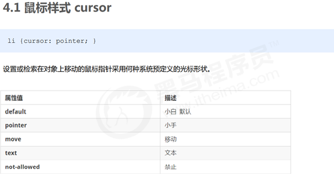

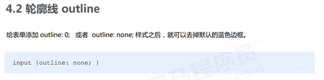

## 5. vertical-align 属性应用

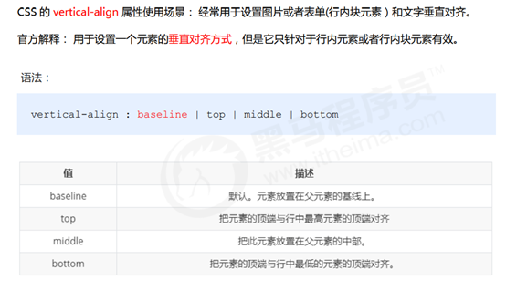

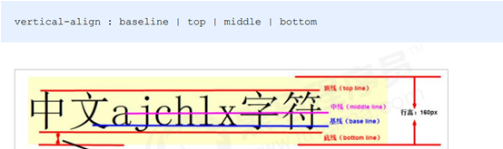

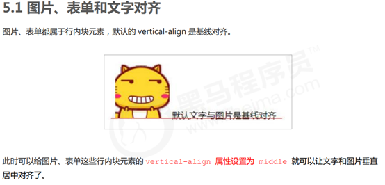

## 6. 溢出的文字省略号显示

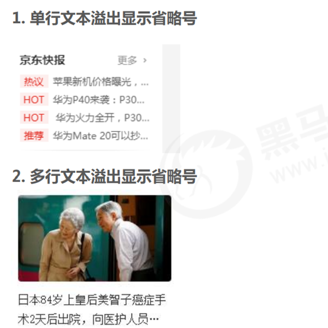

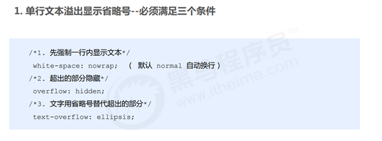

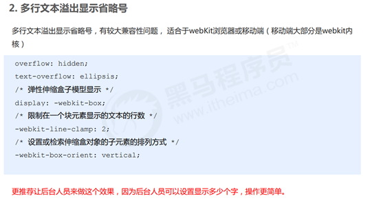

## 7. 常见布局技巧

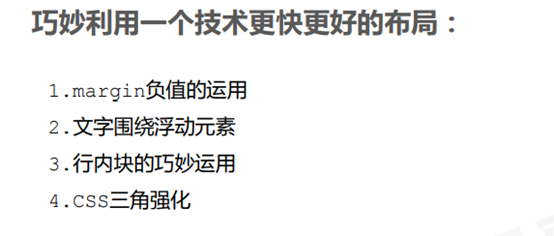

### 1. margin负值运用

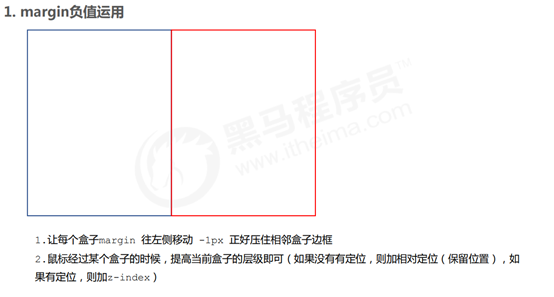

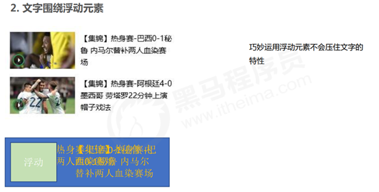

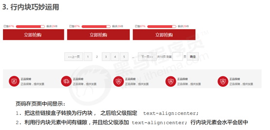

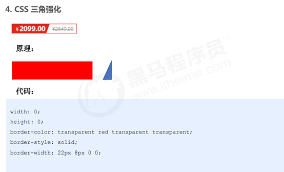

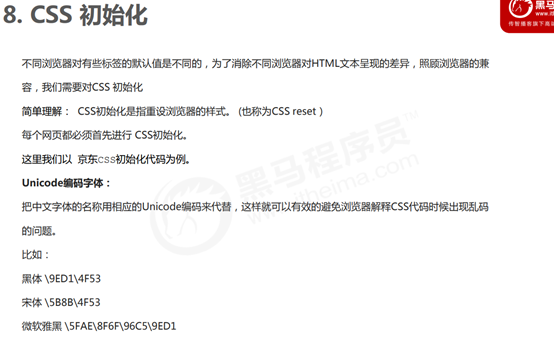

# CSS3 的其他新特性

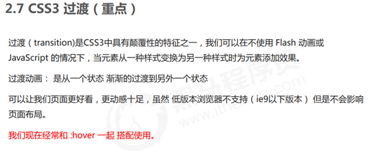

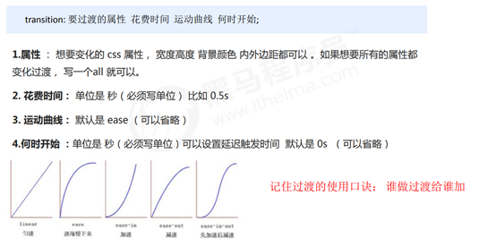

# CSS3 2D转换

# CSS3 动画

# CSS3 3D转换

# 项目经验

## 网站 favicon 图标

## 网站TDK三大标签SEO优化

