## 1. 字体图标

## 2. 2D 转换

转换（transform）是 CSS3 中具有颠覆性的特征之一，可以实现元素的位移、旋转、缩放等效果。

- 移动：translate
- 旋转：rotate
- 缩放：scale

`不会影响到其他元素的位置`

改变盒子在平面内的形态（位移、旋转、缩放）


### 位移 translate

2D 移动是 2D 转换里面的一种功能，可以改变元素在页面中的位置，类似定位。


语法

```
transform: translate(水平方向的位置,垂直方向的位置);
transform: translate(100px,50px);

单独设置某个方向的移动距离：translateX() & translateY()
transform: translateX(x);
transform: translateY(y);
x,y取值（正负均可）:
	像素单位数值
	百分比（参照物为盒子自身尺寸）
```

注意：

- X 轴正向为右，Y 轴正向为下
- 不会影响到其他元素的位置
- 对行内标签没有效
- translate()如果只给出一个值, 表示 x 轴方向移动距离

常用：

 定位居中

```
 position: absolute;
 left: 50%;
 top: 50%;
 transform: translate(-50%,-50%);
```

### 旋转 rotate

#### 转换之旋转 rotate

语法

```
transform:rotate(度数)
```

重点

- rotate 里面跟度数， 单位是 deg 比如 rotate(45deg)
- 角度为正时，顺时针，负时，为逆时针
- 默认旋转的中心点是元素的中心点

案例 画三角形


```
p::before {
 content: '';
 position: absolute;
 right: 20px;
 top: 10px;
 width: 10px;
 height: 10px;
 border-right: 1px solid #000;
 border-bottom: 1px solid #000;
 transform: rotate(45deg);
}
```

#### 转换中心点 transform-origin

我们可以设置元素转换的中心点

语法

```
transform-origin: x y;
```

重点

- 注意后面的参数 x 和 y 用空格隔开
- x y 默认转换的中心点是元素的中心点 (50% 50%)
- 还可以给 x y 设置 像素 或者 方位名词 （top bottom left right center）

### 缩放 scale

缩放，顾名思义，可以放大和缩小。 只要给元素添加上了这个属性就能控制它放大还是缩小。

语法

```
transform: scale(x轴缩放倍数, y轴缩放倍数);
一般情况下, 只为scale设置一个值, 表示x轴和y轴等比例缩放:
transform: scale(缩放倍数);
transform:scale(2) ：只写一个参数，第二个参数则和第一个参数一样，相当于 scale(2,2)

```

注意

- 注意其中的 x 和 y 用逗号分隔
- 缩放 值不带单位 ,1 没有缩放 , 大于 1 放大 , 小于 1 缩小
- sacle 缩放最大的优势：可以设置转换中心点缩放，默认以中心点缩放的，而且不影响其他盒子

### 2D 转换综合写法

1.同时使用多个转换，其格式为：transform: translate() rotate() scale() ...等， 2. 其顺序会影转换的效果。（先旋转会改变坐标轴方向） 3. 当我们同时有位移和其他属性的时候，记得要将位移放到最

## 3. 渐变背景

目标：使用 background-image:linear-gradient 属性实现渐变背景效果

- 渐变是多个颜色逐渐变化的视觉效果
  一般用于设置盒子的背景


语法：

```
background-image:linear-gradient(
	颜色1，
	颜色2
);

常用： 一般情况直接写background;

background: linear-gradient(red,blue);
```

语法 2

```
background-image:linear-gradient(
	方向,
	颜色1，
	颜色2
);

常用： 一般情况直接写background;

background: linear-gradient( to right, red,blue);
```

方向可取值:

 deg

 to bottom (to +方位名词)

## 浏览器私有前缀


## 4. 3D 转换(空间转换)

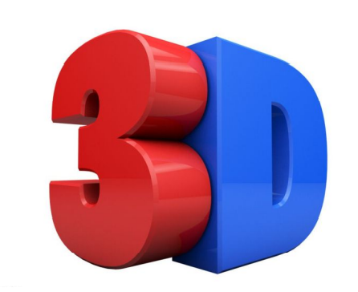

特点

- 近大远小。
- 物体后面遮挡不可

主要知识点

1. 3D 位移: translate3d(x,y,z)
2. 透视: perspective
3. 3D 旋转: rotate3d(x,y,z,deg)
4. 3D 呈现 transfrom-style

### 三维坐标系

 三维坐标系其实就是指立体空间，立体空间是由 3 个轴共同组成的。

- x 轴：水平向右 注意： x 右边是正值，左边是负值
- y 轴：垂直向下 注意： y 下面是正值，上面是负值
- z 轴：垂直屏幕 注意： 往外面是正值，往里面是负值

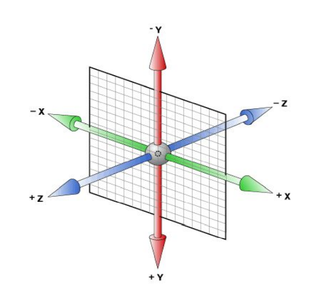

### 1. 3D 移动 translate3d

3D 移动在 2D 移动的基础上多加了一个可以移动的方向，就是 z 轴方向。

语法：

```
translform:translateX(100px)：仅仅是在x轴上移动

translform:translateY(100px)：仅仅是在Y轴上移动

translform:translateZ(100px)：仅仅是在Z轴上移动（注意：translateZ一般用px单位）

transform:translate3d(x,y,z)：其中 x、y、z 分别指要移动的轴的方向的距离 因为z轴是垂直屏幕，由里指向外面，所以默认是看不到元素在z轴的方向上移
```

取值（正负均可）

- 像素单位数值
- 百分比

### 2. 透视 perspective

在 2D 平面产生近大远小视觉立体，但是只是效果二维的
如果想要在网页产生 3D 效果需要透视（理解成 3D 物体投影在 2D 平面内）。
模拟人类的视觉位置，可认为安排一只眼睛去看

透视距离也称为视距，所谓的视距就是人的眼睛到屏幕的距离。

总结透视作用： 空间转换时，为元素添加近大远小、近实远虚的视觉效果

- 距离视觉点越近的在电脑平面成像越大，越远成像越小
- 透视的单位是像素

注意:

==透视写在被观察元素的父盒子上面的==

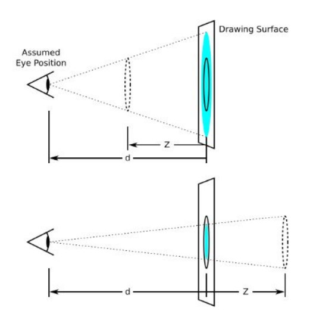

```
perspective: 值;

取值：像素单位数值， 数值一般在800 – 1200。
```

translform:translateZ(100px)：仅仅是在 Z 轴上移动。
有了透视，就能看到 translateZ 引起的变化了

### 3. 3D 旋转 rotate3d

3D 旋转指可以让元素在三维平面内沿着 x 轴，y 轴，z 轴或者自定义轴进行旋转

语法

```
transform:rotateX(45deg)：沿着x轴正方向旋转 45度
transform:rotateY(45deg) ：沿着y轴正方向旋转 45deg
transform:rotateZ(45deg) ：沿着Z轴正方向旋转 45deg 与2D的rotate效果相同
transform:rotate3d(x,y,z,deg)： 沿着自定义轴旋转 deg为角度（了解即可，很少使用）
```

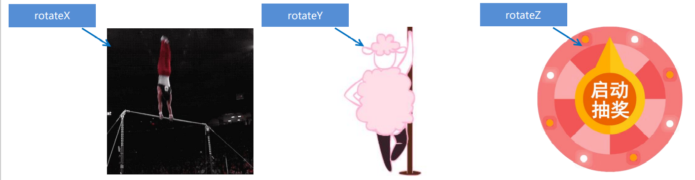

左手准则

左手的手拇指指向 x 轴的正方向

- 其余手指的弯曲方向就是该元素沿着 x 轴旋转的方向

左手的手拇指指向 y 轴的正方向

- 其余手指的弯曲方向就是该元素沿着 y 轴旋转的方向（正值）

Z 轴顺时针

transform:rotate3d(x,y,z,deg)： 沿着自定义轴旋转 deg 为角度（了解即可）
xyz 是表示旋转轴的矢量，是标示你是否希望沿着该轴旋转，最后一个标示旋转的角度。

transform:rotate3d(1,0,0,45deg) 就是沿着 x 轴旋转 45deg
 transform:rotate3d(1,1,0,45deg) 就是沿着对角线旋转 45deg

### 4. 3D 呈现 transfrom-style

- 控制子元素是否开启三维立体环境。

- transform-style: flat 子元素不开启 3d 立体空间 默认的

- transform-style: preserve-3d; 子元素开启立体空间

- 代码写给父级，但是影响的是子盒子

  ```
  transform-style: preserve-3d
  ```

  

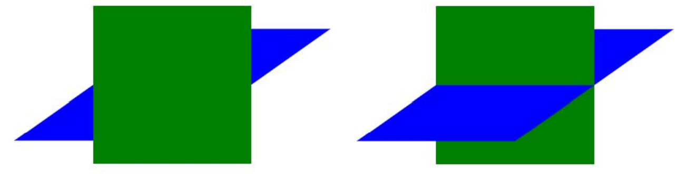

### 空间缩放(了解)

```
语法
Ø transform: scaleX(倍数);
Ø transform: scaleY(倍数);
Ø transform: scaleZ(倍数);
Ø transform: scale3d(x, y, z)
```

## 5. 动画

动画（animation）是 CSS3 中具有颠覆性的特征之一，可通过设置多个节点来精确控制一个或一组动画，常用来实现复杂的动画效果。

相比较过渡，动画可以实现更多变化，更多控制，连续自动播放等效果。

动画序列

0% 是动画的开始，100% 是动画的完成。这样的规则就是动画序列。
在 @keyframes 中规定某项 CSS 样式，就能创建由当前样式逐渐改为新样式的动画效果。
动画是使元素从一种样式逐渐变化为另一种样式的效果。您可以改变任意多的样式任意多的次数。
请用百分比来规定变化发生的时间，或用关键词 "from" 和 "to"，等同于 0% 和 100%

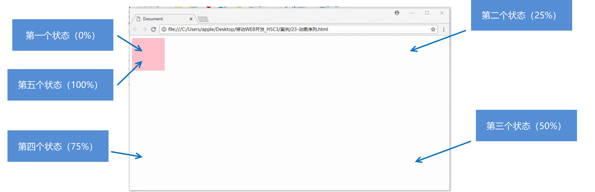

### 1. 定义动画 @keyframes

```
@keyframes 动画名称 {
 0%{
 width:100px;
 }
 100%{
 width:200px;
 }
}
```

### 2.元素使用动画

```
div {
 width: 200px;
 height: 200px;
 background-color: aqua;
 margin: 100px auto;
 /* 调用动画 */
 /* animation-name: 动画名称;*/
 /* 持续时间 */
 /* animation-duration: 持续时间;*/
 /* 通常使用简写方法*/
 animation:动画名称 时间 ;
 }

```

### 动画属性

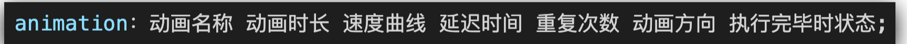

```
animation: myfirst 5s linear 2s infinite alternate;
```

动画名称和动画时长必须赋值

取值不分先后顺序

如果有 2 个时间值，第一个时间表示动画时长，第二个时间表示延迟时间

简写属性里面不包含 animation-play-state
暂停动画：animation-play-state: puased; 经常和鼠标经过等其他配合使用
想要动画走回来 ，而不是直接跳回来：animation-direction ： alternate
盒子动画结束后，停在结束位置： animation-fill-mode ： forwards

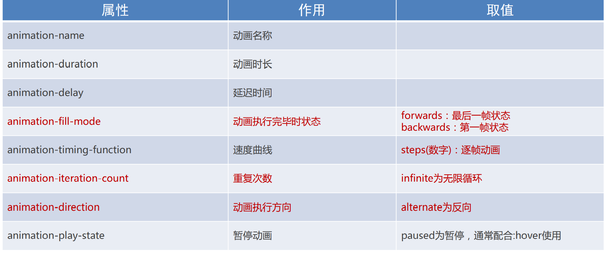

### 速度曲线细节

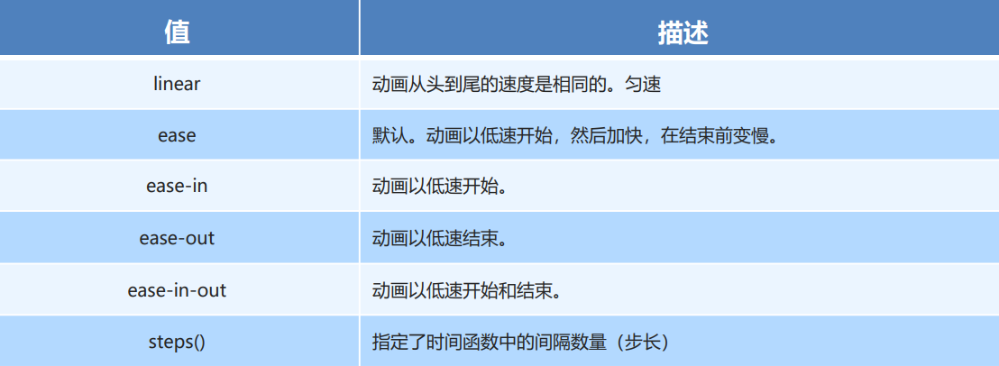

animation-timing-function：规定动画的速度曲线，默认是“ease”

#### 使用 steps 实现逐帧动画

逐帧动画：帧动画。开发中，一般配合精灵图实现动画效果。

```
animation-timing-function: steps(N)；

将动画过程等分成N份
```

1 准备显示区域
设置盒子尺寸是一张小图的尺寸，背景图为当前精灵图
2 定义动画
改变背景图的位置（移动的距离就是精灵图的宽度）
3 使用动画
添加速度曲线 steps(N)，N 与精灵图上小图个数相同
添加无限重复效果

## 6. 移动端特点

### 移动端和 PC 端网页不同点

PC 端网页和移动端网页的有什么不同？

- PC 屏幕大，网页固定版心
- 手机屏幕小， 网页宽度多数为 100%

如何在电脑里面边写代码边调试移动端网页效果？

- Chrome DevTools（谷歌浏览器）的模拟手机调试

### 分辨率

屏幕尺寸-----指的是屏幕对角线的长度，一般用英寸来度量

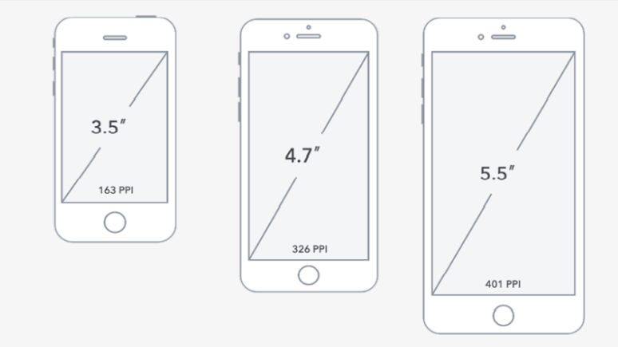

PC 分辨率

- 1920 \* 1080
- 1920 \* 1080

缩放 150%

（1920/150%）\*（1080/150%）

硬件分辨率（出厂设置） ----- 物理分辨率
缩放调节的分辨率（软件设置） --逻辑分辨率

移动端主流设备分辨率

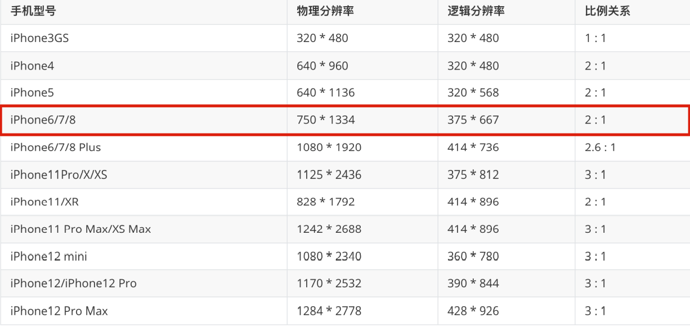

制作网页按照逻辑分辨率

设计图为硬件像素

2 倍图像素需要除 2

### 视口

视口（viewport）就是浏览器显示页面内容的屏幕区域。 视口可以分为布局视口、视觉视口和理想视口

手机屏幕尺寸都不同， 网页宽度为 100%
网页的宽度和逻辑分辨率尺寸相同

默认网页宽度是 980px。

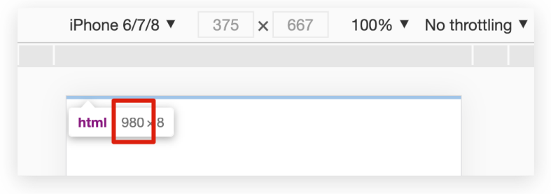

- 视口就是浏览器显示页面内容的屏幕区域
- 视口分为布局视口、视觉视口和理想视口
- 我们移动端布局想要的是理想视口就是手机屏幕有多宽，我们的布局视口就有多宽
- 想要理想视口，我们需要给我们的移动端页面添加 meta 视口标签

目标：网页宽度和设备宽度(分辨率)相同。
解决办法：添加视口标签。
视口：显示 HTML 网页的区域，用来约束 HTML 尺寸。

#### meta 视口标签

```
<meta name="viewport" content="width=device-width, user-scalable=no,
initial-scale=1.0, maximum-scale=1.0, minimum-scale=1.0">
```

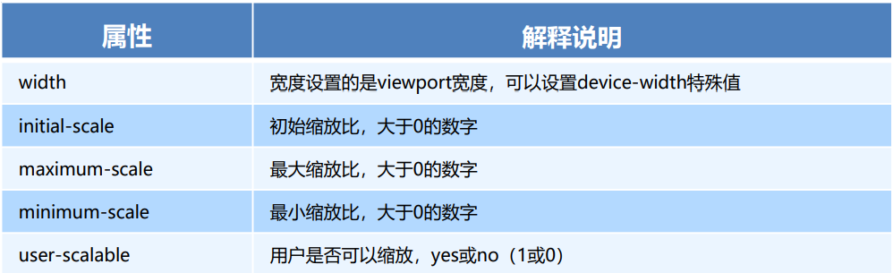

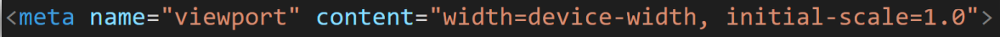

viewport：视口
width=device-width：视口宽度 = 设备宽度
initial-scale=1.0：缩放 1 倍（不缩放）

标准的 viewport 设置

视口宽度和设备保持一致
 视口的默认缩放比例 1.0
 不允许用户自行缩放
 最大允许的缩放比例 1.0
 最小允许的缩放比例 1.0

### 二倍图

图片分辨率, 为了高分辨率下图片不会模糊失真

现阶段设计稿参考 iPhone6/7/8，设备宽度 375px 产出设计稿。
二倍图设计稿尺寸：750px。

使用软件 像素大厨

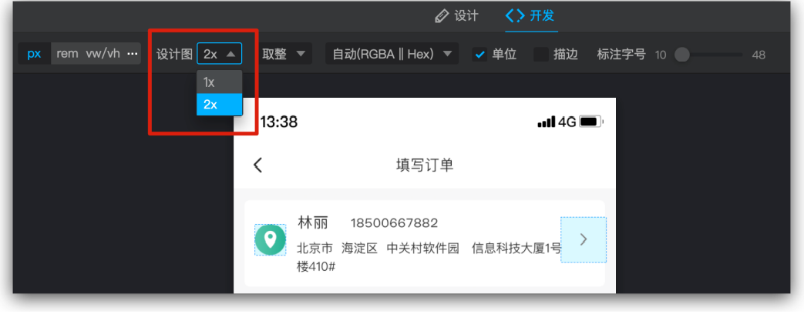

多倍图切图 cutterma

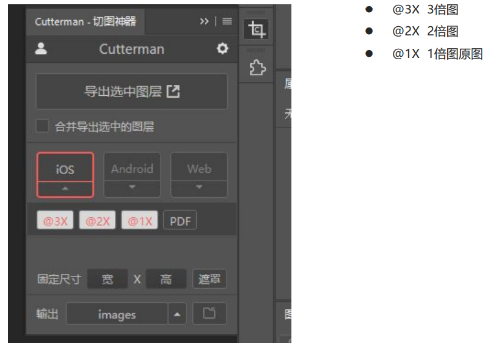

二倍精灵图做法

在 firework 里面把精灵图等比例缩放为原来的一半
之后根据大小 测量坐标
注意代码里面 background-size 也要写： 精灵图原来宽度的一半

### 移动端开发选择

1.单独制作移动端页面（主流）

2.响应式页面兼容移动端（其次）

#### 移动端技术解决方案

CSS 初始化 normalize.css

移动端 CSS 初始化推荐使用 normalize.css/
 Normalize.css：保护了有价值的默认值
 Normalize.css：修复了浏览器的 bug
 Normalize.css：是模块化的
 Normalize.css：拥有详细的文档

官网地址： http://necolas.github.io/normalize.c

## 7. 百分比布局（流式布局）

流式布局，就是百分比布局，也称非固定像素布局。
 通过盒子的宽度设置成百分比来根据屏幕的宽度来进行伸缩，不受固定像素的限制，内容向两侧填充。
 流式布局方式是移动 web 开发使用的比较常见的布局方式。

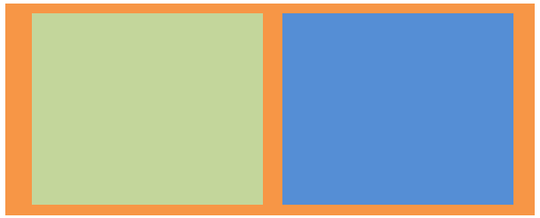

max-width 最大宽度 （max-height 最大高度）

min-width 最小宽度 （min-height 最小高)

效果： 宽度自适应，高度固定。

优：无兼容性问题，缺：不好设置高度

## 8. flex 布局

伸缩布局 = 弹性布局 = 伸缩盒布局 = 弹性盒布局 =flex

Flex 布局/弹性布局：

- 是一种浏览器提倡的布局模型
- 布局网页更简单、灵活
- 避免浮动脱标的问题
- 百分比布局 （优：无兼容，缺：不会设置高度）

如果是 PC 端页面布局，我们还是传统布局。

如果是移动端或者不考虑兼容性问题的 PC 端页面布局，我们还是使用 flex 弹性布局

### Flex 布局模型构成

1.作用
基于 Flex 精确灵活控制块级盒子的布局方式，避免浮动布局中脱离文档流现象发生。
Flex 布局非常适合结构化布局

2.设置方式
父元素添加 display: flex，子元素可以自动的挤压或拉伸

3.组成部分
弹性容器
弹性盒子
主轴
侧轴 / 交叉轴

当我们为父盒子设为 flex 布局以后，子元素的 float、clear 和 vertical-align 属性将失效。

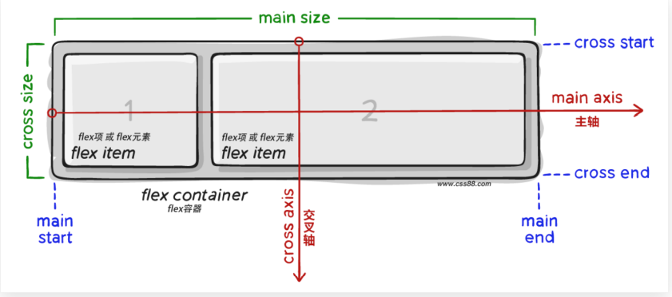

### 1-主轴对齐方式(父)

在 Flex 布局模型中，调节主轴或侧轴的对齐方式来设置盒子之间的间距。

修改主轴对齐方式属性: justify-content

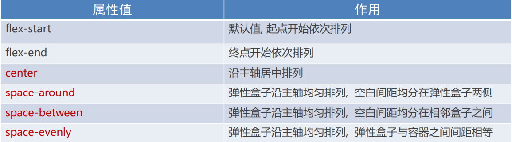

### 2-侧轴对齐方式

修改侧轴对齐方式属性:

#### align-items (单行)（添加到弹性容器）

 添加给父元素

取值：

```
father {
	align-items: center;
 }
```

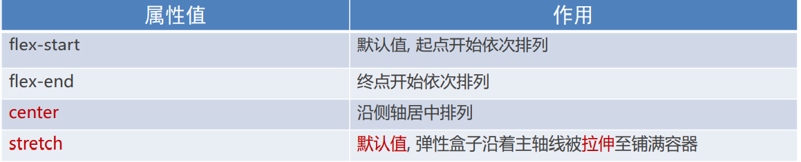

#### align-content (多行) (添加到弹性容器)

 添加给父元素 , 只有开启换行且有换行时

 调整行对齐方式 ：
​ 取值与 justify-content 基本相同

```
father {
	align-content: flex-start;
 }
```

#### align-self (自己)（添加到弹性盒）

添加给子元素

控制某个弹性盒子自己在侧轴的对齐方式（添加到弹性盒子）

 align-self 属性允许单个项目有与其他项目不一样的对齐方式，可覆盖 align-items 属性

 默认值为 auto，表示继承父元素的 align-items 属性，如果没有父元素，则等同于 stretch。

```
span:nth-child(2) {
 /* 设置自己在侧轴上的排列方式 */
 align-self: flex-end;
 }

```

### 3-伸缩比 flex (子)

属性
Ø flex : 值;
取值分类
Ø 数值(整数)

```
.item {
 flex: <number>; /* default 0 */
}
```

注意 : 只占用父盒子剩余尺寸

### 4-主轴方向(父)

主轴默认是水平方向, 侧轴默认是垂直方向
修改主轴方向属性: flex-direction

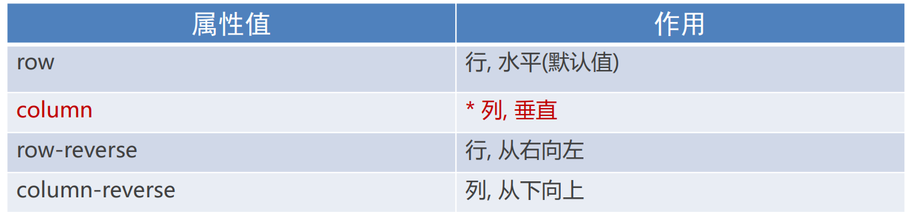

### 5-弹性盒子换行(父)

弹性盒子换行显示 : flex-wrap: wrap;

```
 flex-wrap: wrap; //换行
 flex-wrap: nowrap; //默认值 不换行
```


order 定义项目的排列顺序

数值越小，排列越靠前，默认为 0。
注意：和 z-index 不一样。

```
.item {
 order: <number>;
}
```

flex-flow

flex-flow 属性是 flex-direction 和 flex-wrap 属性的复合属

```
flex-flow 属性是 flex-direction 和 flex-wrap 属性的复合属
```

flex-direction：设置主轴的方向
justify-content：设置主轴上的子元素排列方式
flex-wrap：设置子元素是否换行  align-content：设置侧轴上的子元素的排列方式（多行）
align-items：设置侧轴上的子元素排列方式（单行）
flex-flow：复合属性，相当于同时设置了 flex-direction 和 flex-wra

## 9. 移动适配

1. 页面布局文字能否随着屏幕大小变化而变化？
2. 流式布局和flex布局主要针对于宽度布局，那高度如何设置？
3. 怎么样让屏幕发生变化的时候元素高度和宽度等比例缩放？

px单位或百分比布局可以实现吗？
	 px单位是绝对单位
 	百分比布局特点宽度自适应，高度固定
适配方案
	rem

​	vw/vh

目标：实现在不同宽度设备中等比缩放的网页效果

rem ： 目前多数企业在用的解决方案
vw / vh：未来的解决方案

### rem 

rem (root em)是一个相对单位，类似于em，em是父元素字体大小。

不同的是rem的基准是相对于html元素的字体大小,1rem = 1倍HTML字号大小.

比如，根元素（html）设置font-size=12px; 非根元素设置width:2rem; 则换成px表示就是24px。

rem的优势：

​		父元素文字大小可能不一致， 但是整个页面只有一个html，可以很好来控制整个页面的元素大小.
​	 	屏幕宽度不同，网页元素尺寸不同（等比缩放）

```
/* 根html 为 12px */
html {
 font-size: 12px;
}
/* 此时 div 的字体大小就是 24px */ 
div {
 font-size: 2rem;
}
```

### vw / vh

相对单位

- 相对视口的尺寸计算结果

 vw：viewport width

- 1vw = 1/100视口宽度

 vh：viewport height (基本不用，只用在设置全屏)

- 1vh = 1/100视口高度


vw单位尺寸
1. 确定设计稿对应的vw尺寸 （1/100视口高度）

  查看设计稿宽度 → 确定参考设备高度 (视口高度) → 确定vw尺寸 （1/100 视口高度）

2. vw单位的尺寸 = px单位数值 / ( 1/100 视口高度 )


思考：开发中，会不会vw和vh混用呢？
Ø 不会。
Ø vh是1/100视口高度，全面屏视口高度尺寸大，如果混用可能会导致盒子变形


### 媒体查询

什么是媒体查询

媒体查询（Media Query）是CSS3新语法。
 使用 @media 查询，可以针对不同的媒体类型定义不同的样式
 @media 可以针对不同的屏幕尺寸设置不同的样式
 当你重置浏览器大小的过程中，页面也会根据浏览器的宽度和高度重新渲染页面
 目前针对很多苹果手机、Android手机，平板等设备都用得到多媒体查询


媒体查询能够检测视口的宽度，然后编写差异化的 CSS 样式
当某个条件成立, 执行对应的CSS样式

语法规范

```
@media 媒体类型 关键字 (媒体特性) {
	 选择器{
 		css属性
 	  }
}	

// 关键字 and not only
```

1. 媒体类型

将不同的终端设备划分成不同的类型，称为媒体类型

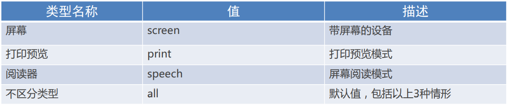

​	2.关键字

关键字将媒体类型或多个媒体特性连接到一起做为媒体查询的条件。

and：可以将多个媒体特性连接到一起，相当于“且”的意思。
not： 排除某个媒体类型，相当于“非”的意思，可以省略。
only：指定某个特定的媒体类型，可以省略。

​	3.媒体特性

每种媒体类型都具体各自不同的特性，根据不同媒体类型的媒体特性设置不同的展示风格。

注意他们要加小括号包含

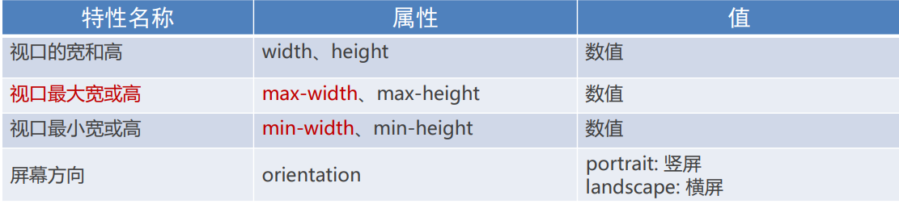


外链式CSS引入

```
<link rel="stylesheet" media=" 媒体类型 关键字 (媒体特性)" herf="xx.css">
```


应用:

 媒体查询+rem实现元素动态大小变化:

rem单位是跟着html来走的，有了rem页面元素可以设置不同大小尺寸
媒体查询可以根据不同设备宽度来修改样式
媒体查询+rem 就可以实现不同设备宽度，实现页面元素大小的动态变化

检测了3个视口，分别设置了根字号，有什么弊端吗？
 	答：手机设备多，屏幕尺寸不一，视口不仅仅有这3个

### rem 适配 flexible.js

目标:

​	 让一些不能等比自适应的元素，达到当设备尺寸发生改变的时候，等比例适配当前设备。


 方案:

1. 按照设计稿与设备宽度的比例，（通过媒体查询）动态计算并设置 html 根标签的 font-size 大小；

2. CSS 中，设计稿元素的宽、高、相对位置等取值，按照同等比例换算为 rem 为单位的值；


rem 实际开发适配方案:

​	简洁高效的rem适配方案flexible.js

​	使用flexible.js配合rem实现在不同宽度的设备中，网页元素尺寸等比缩放效果

​	flexible.js是手淘开发出的一个用来适配移动端的js框架。
​	核心原理就是根据不同的视口宽度给网页中html根节点设置不同的font-size。


目前rem布局方案中，将网页等分成10份， HTML标签的字号为视口宽度的 1/10

​	先导入js

```
<script src="./js/flexible.js" ></script>
```

1. 确定设计稿对应的设备的HTML标签字号
   查看设计稿宽度 → 确定参考设备宽度(视口宽度) → 确定基准根字号（1/10视口宽度）

   设计稿宽度(750--2倍图)/2/10 rem =>得出根字号  @rootsize:37.5rem ;

2. rem单位的尺寸
N * 37.5 = 68 → N = 68 / 37.5
rem单位的尺寸 = px单位数值 / 基准根字号

3. 元素大小取值方法

    页面元素的rem值 = 页面元素值（px） / @rootsize


rem中精灵图的使用

只需要把px转换为rem 

```
span{
		  width: (40 / @rootsize);
          height: (42 / @rootsize);
          background: url('../images/jd_icons.png') no-repeat;
          background-size: (250/ @rootsize) (200/ @rootsize);
          background-position: 0 (-50/ @rootsize);
}
```


github地址：https://github.com/amfe/lib-flexible


### Less 基础

维护 css 的弊端

- CSS 是一门非程序式语言，没有变量、函数、SCOPE（作用域）等概念。
- CSS 需要书写大量看似没有逻辑的代码，CSS 冗余度是比较高的。
- 不方便维护及扩展，不利于复用。
- CSS 没有很好的计算能力
- 非前端开发工程师来讲，往往会因为缺少 CSS 编写经验而很难写出组织良好且易于维护的 CSS 代码项目。


Less 介绍

Less （Leaner Style Sheets 的缩写） 是一门 CSS 扩展语言，也称为CSS预处理器。
做为 CSS 的一种形式的扩展，它并没有减少 CSS 的功能，而是在现有的 CSS 语法上，为CSS加入程序式语言的特性。
它在 CSS 的语法基础之上，引入了变量，Mixin（混入），运算以及函数等功能，大大简化了 CSS 的编写，并且降低了 CSS 的维护成本，就像它的名称所说的那样，Less 可以让我们用更少的代码做更多的事情。

注意：浏览器不识别Less代码，目前阶段，网页要引入对应的CSS文件。

Less中文网址： http://lesscss.cn/
常见的CSS预处理器：Sass、Less、Stylus

Less 安装（注意如果使用vscode无需安装less）

① 安装nodejs，可选择版本(8.0)，网址：http://nodejs.cn/download/
② 检查是否安装成功，使用cmd命令（win10 是 window +r 打开 运行输入cmd） --- 输入“ node –v ”查看版本即可
③ 基于nodejs在线安装Less，使用cmd命令“ npm install -g less ”即可
④ 检查是否安装成功，使用cmd命令“ lessc -v ”查看版本即


Less 使用

我们首先新建一个后缀名为less的文件， 在这个less文件里面书写less语句。


#### 1.Less 运算

任何数字、颜色或者变量都可以参与运算。

就是Less提供了加（+）、减（-）、乘（*）、除（/）算术运算。

```
/*Less 里面写*/
div {
 witdh: 10px + 5;
 height: 200px-100px;
 font-size: 2px*10px;
 // 除法 需要加括号或者. 
 line-height: (300px/3px);
}

/*生成的css*/
div {
 witdh: 15px;
 height: 100px;
 font-size: 20px;
 line-height:100px
}

```

注意：

乘号（*）和除号（/）的写法 

 运算符中间左右有个空格隔开 1px + 5
 对于两个不同的单位的值之间的运算，运算结果的值取第一个值的单位
 如果两个值之间只有一个值有单位，则运算结果就取该单位


#### 2.Less 嵌套

我们经常用到选择器的嵌套

```
//正常css写法
#header .logo {
 width: 300px;
}

//Less 嵌套写法
#header {
 .logo {
 width: 300px;
 }
}

```

如果遇见 （交集|伪类|伪元素选择器）
 & 符号，表示当前元素。

```
a:hover{
 color:red;
}
Less 嵌套写法
a{
 &:hover{
 color:red;
 }
}

```


####  3.Less 变量

变量是指没有固定的值，可以改变的。因为我们CSS中的一些颜色和数值等经常使用。

```
@变量名:值;
```

变量命名规范

必须有@为前缀
 不能包含特殊字符
 不能以数字开头
 大小写敏感

 变量使用规范

```
//直接使用
@color: pink;
body{
 color:@color;
}
a:hover{
 color:@color;
}
```

#### 4.混入

```
.box {
    width: 200px;
    height: 300px;
    background-color: skyblue;
}
.box1 {
    //直接应用.box的样式
    .box(); 
}
```


#### 5.导入

```
// 如果引入的是less文件  可以省略后缀名
@import "./02-less嵌套";
@import "./base.css";

或者: (不常用)
@import url(./02-less嵌套);
```

#### 6.导出

1.插件设置导出位置

 设置 → 搜索EasyLess → 在setting.json中编辑 → 添加代码（注意，必须是双引号）

```
“less.compile":{
	"out":"../css/"
}
```

2.Less文件第一行添加代码, 注意文件夹名称后面添加 /

```
// out: ./css/
```

值为false 时 ,表示不导出

```
// out: false  
```


Less 编译

本质上，Less 包含一套自定义的语法及一个解析器，用户根据这些语法定义自己的样式规则，这些规则最终会通过解析器，编译生成对应的 CSS 文件。
所以，我们需要把我们的 less文件，编译生成为css文件，这样我们的html页面才能使用。

 vocode Less 插件

Easy LESS 插件用来把less文件编译为css文件
安装完毕插件，重新加载下 vscode。
只要保存一下Less文件，会自动生成CSS文件


## 10 BootStrap

1 响应式开发原理

就是使用媒体查询针对不同宽度的设备进行布局和样式的设置，从而适配不同设备的目的。

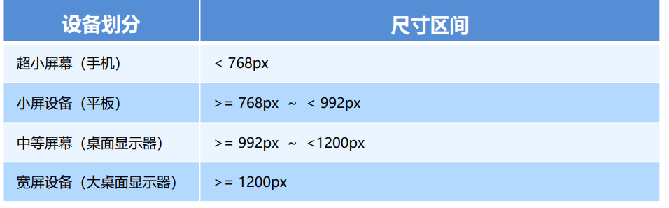

2 响应式布局容器

响应式需要一个父级做为布局容器，来配合子级元素来实现变化效果

原理就是在不同屏幕下，通过媒体查询来改变这个布局容器的大小，再改变里面子元素的排列方式和大小，从而实现不同屏幕下，看到不同的页面布局和样式变化。


平时我们的响应式尺寸划分

超小屏幕（手机，小于 768px）：设置宽度为 100%
 小屏幕（平板，大于等于 768px）：设置宽度为 750px
 中等屏幕（桌面显示器，大于等于 992px）：宽度设置为 970px
 大屏幕（大桌面显示器，大于等于 1200px）：宽度设置为 1170px 

但是我们也可以根据实际情况自己定义划分


### 1. Bootstrap 简介

Bootstrap 来自 Twitter（推特），是目前最受欢迎的前端框架。Bootstrap 是基于 HTML、CSS 和 JAVASCRIPT 的，它简洁灵活，使得 Web 开发更加快捷。

中文官网：http://www.bootcss.com/
官网：http://getbootstrap.com/
推荐使用：http://bootstrap.css88.com/

框架：顾名思义就是一套架构，它有一套比较完整的网页功能解决方案，而且控制权在框架本身，有预制样式库、组件和插件。使用者要按照框架所规定的某种规范进行开发。


优点

标准化的html+css编码规范

- 提供了一套简洁、直观、强悍的组件
- 有自己的生态圈，不断的更新迭代
- 让开发更简单，提高了开发的效率


### 2 Bootstrap 使用

#### 步骤

下载   https://www.bootcss.com/

使用

1. 引入： BootStrap提供的CSS代码

```
<link rel="stylesheet" href="bootstrap/css/bootstrap.min.css">
```

2. 调用类：使用BootStrap提供的样式

   ​	container：响应式布局版心类等待

   

   

#### 1.Bootstrap 栅格系统

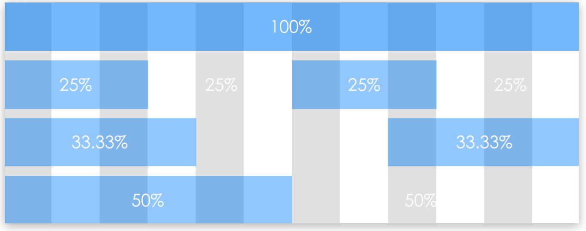


栅格系统简介

栅格系统英文为“grid systems”,也有人翻译为“网格系统”，它是指将页面布局划分为等宽的列，然后通过列数的定义来模块化页面布局。
Bootstrap 提供了一套响应式、移动设备优先的流式栅格系统，随着屏幕或视口（viewport）尺寸的增加，系统会自动分为最多12列。


1.栅格选项参数

Bootstrap 需要为页面内容和栅格系统包裹一个 .container 容器，它提供了两个作此用处的类。

(1).container 类

响应式布局的容器 固定宽度
 大屏 ( >=1200px) 宽度定为 1170px
 中屏 ( >=992px) 宽度定为 970px
 小屏 ( >=768px) 宽度定为 750px
 超小屏 (100%

(2).container-fluid 类

流式布局容器 百分百宽度
 占据全部视口（viewport）的容器

注意: 
1. container类自带间距15px;
2. row类自带间距-15px


2.分别使用.row类名和 .col类名定义栅格布局的行和列。

栅格系统用于通过一系列的行（row）与列（column）的组合来创建页面布局，你的内容就可以放入这些创建好的布局中

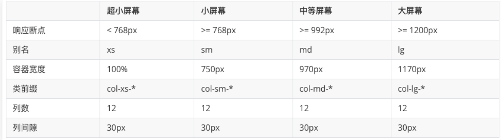

按照不同屏幕划分为1~12 等份

- 行（row） 可以去除父容器作用15px的边距
- xs-extra small：超小； sm-small：小； md-medium：中等； lg-large：大；
- 列（column）大于 12，多余的“列（column）”所在的元素将被作为一个整体另起一行排列
- 每一列默认有左右15像素的 padding
- 可以同时为一列指定多个设备的类名，以便划分不同份数 例如 class="col-md-4 col-sm-6"


3.列嵌套

栅格系统内置的栅格系统将内容再次嵌套。简单理解就是一个列内再分成若干份小列。我们可以通过添加一个新的 .row 元素和一系列 .col-sm-* 元素到已经存在的 .col-sm-* 元素内。

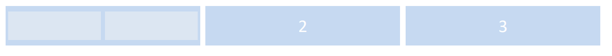

```
<!-- 列嵌套 -->
 <div class="col-sm-4">
 <div class="row">
 <div class="col-sm-6">小列</div>
 <div class="col-sm-6">小列</div>
 </div>
</div>
```

列偏移

使用 .col-md-offset-* 类可以将列向右侧偏移。这些类实际是通过使用 * 选择器为当前元素增加了左侧的边距（margin）。

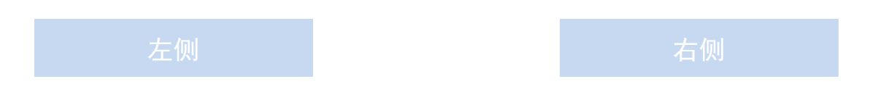

```
 <!-- 列偏移 -->
 <div class="row">
 <div class="col-lg-4">1</div>
 <div class="col-lg-4 col-lg-offset-4">2</div>
 </div>
```

列排序

通过使用 .col-md-push-* 和 .col-md-pull-* 类就可以很容易的改变列（column）的顺序。

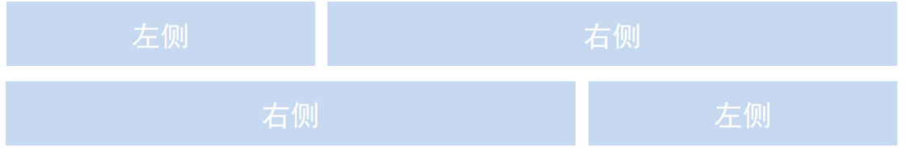

```
<!-- 列排序 -->
 <div class="row">
 <div class="col-lg-4 col-lg-push-8">左侧</div>
 <div class="col-lg-8 col-lg-pull-4">右侧</div>
 </div>
```


响应式工具

为了加快对移动设备友好的页面开发工作，利用媒体查询功能，并使用这些工具类可以方便的针对不同设备展示或隐藏页面内容。

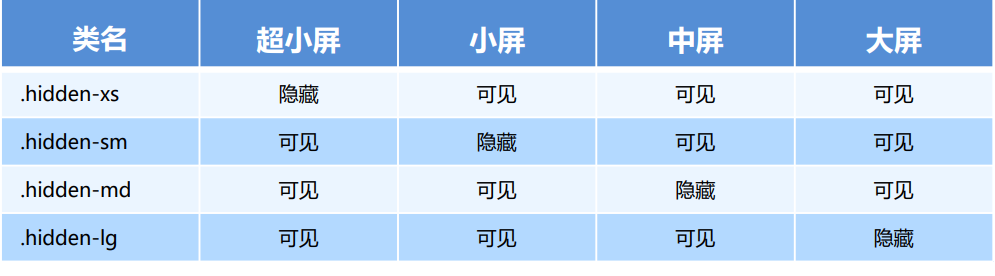

#### 2.组件， 插件

添加类：

​	表格-----为任意 `<table>` 标签添加 `.table` 类可以为其赋予基本的样式

​	等等全局Css样式

组件：

​	复制代码--修改代码

js插件：

​	引入js

​	复制代码