## 1.字体图标


## 2.2D转换

转换（transform）是CSS3中具有颠覆性的特征之一，可以实现元素的位移、旋转、缩放等效果。

- 移动：translate
- 旋转：rotate
- 缩放：scal

改变盒子在平面内的形态（位移、旋转、缩放）


### 位移 translate

2D移动是2D转换里面的一种功能，可以改变元素在页面中的位置，类似定位。

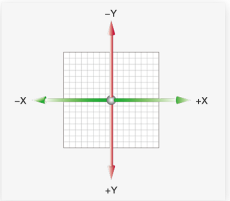


语法

```
transform: translate(水平方向的位置,垂直方向的位置);
transform: translate(100px,50px);

单独设置某个方向的移动距离：translateX() & translateY()
transform: translateX(x);
transform: translateY(y);
x,y取值（正负均可）:
	像素单位数值
	百分比（参照物为盒子自身尺寸）
```


注意：

- X轴正向为右，Y轴正向为下
- 不会影响到其他元素的位置
- 对行内标签没有效
-  translate()如果只给出一个值, 表示x轴方向移动距离
  

常用：

​		定位居中

```
 position: absolute;
 left: 50%;
 top: 50%;
 transform: translate(-50%,-50%);
```


### 旋转 rotate

####  转换之旋转 rotate

语法

```
transform:rotate(度数)
```

 重点

- rotate里面跟度数， 单位是 deg 比如 rotate(45deg) 
-  角度为正时，顺时针，负时，为逆时针
-  默认旋转的中心点是元素的中心点

案例 画三角形

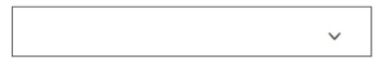

```
p::before {
 content: '';
 position: absolute;
 right: 20px;
 top: 10px;
 width: 10px;
 height: 10px;
 border-right: 1px solid #000;
 border-bottom: 1px solid #000;
 transform: rotate(45deg);
}
```

####  转换中心点 transform-origi

我们可以设置元素转换的中心点

语法

```
transform-origin: x y;
```

重点

- 注意后面的参数 x 和 y 用空格隔开
-  x y 默认转换的中心点是元素的中心点 (50% 50%)
- 还可以给x y 设置 像素 或者 方位名词 （top bottom left right center）


### 缩放scale

缩放，顾名思义，可以放大和缩小。 只要给元素添加上了这个属性就能控制它放大还是缩小。

语法

```
transform: scale(x轴缩放倍数, y轴缩放倍数);
一般情况下, 只为scale设置一个值, 表示x轴和y轴等比例缩放:
transform: scale(缩放倍数);
transform:scale(2) ：只写一个参数，第二个参数则和第一个参数一样，相当于 scale(2,2)

```

 注意

- 注意其中的x和y用逗号分隔
- 缩放 值不带单位  ,1 没有缩放   , 大于1 放大 , 小于1缩小
-  sacle缩放最大的优势：可以设置转换中心点缩放，默认以中心点缩放的，而且不影响其他盒子

### 2D 转换综合写法

   1.同时使用多个转换，其格式为：transform: translate() rotate() scale() ...等，
2. 其顺序会影转换的效果。（先旋转会改变坐标轴方向）
3. 当我们同时有位移和其他属性的时候，记得要将位移放到最


## 3.渐变背景

目标：使用background-image属性实现渐变背景效果

- 渐变是多个颜色逐渐变化的视觉效果
   一般用于设置盒子的背景

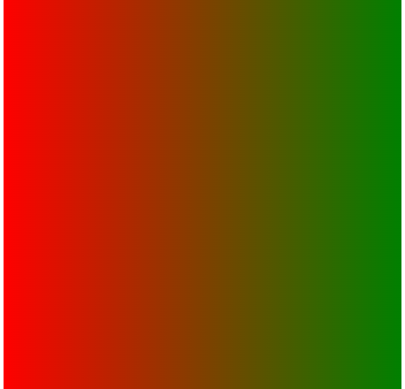

语法：

```
background-image:linear-gradient(
	颜色1，
	颜色2
);

常用： 一般情况直接写background;

background: linear-gradient(red,blue);
```


# 浏览器私有前缀


# CSS3 动画


# CSS3 3D转换


# 移动WEB开发之流式布局

## 移动端基础

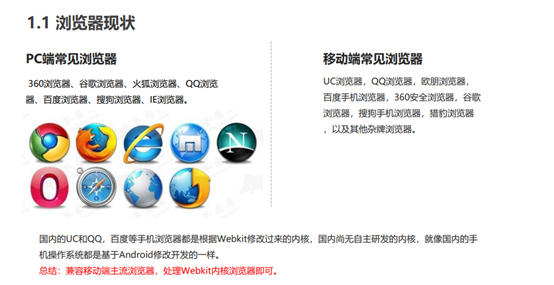


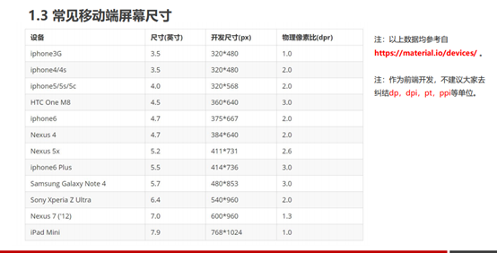

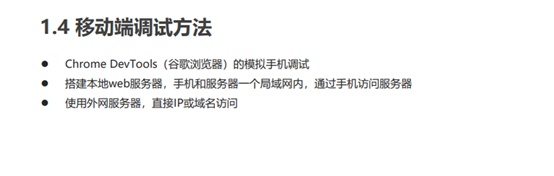

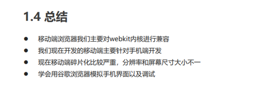

## 视口

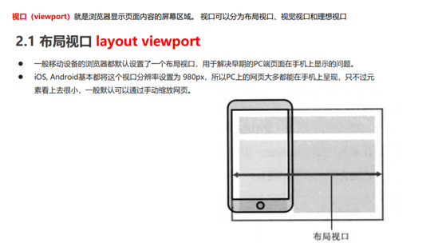

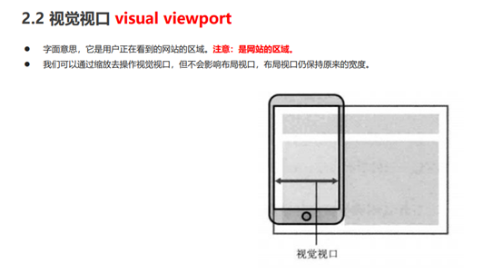

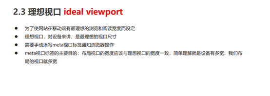

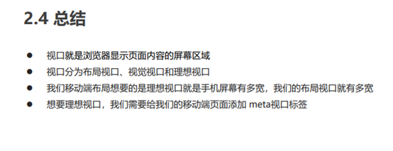

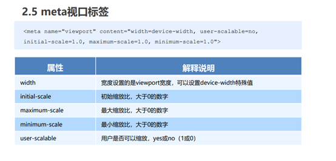

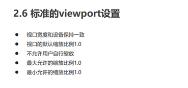

## 二倍图

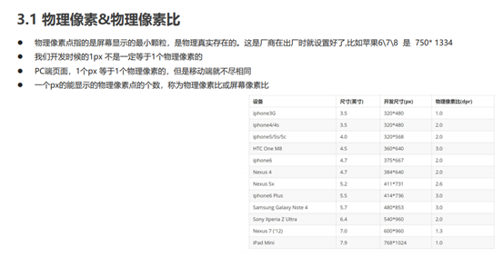

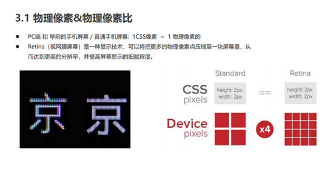

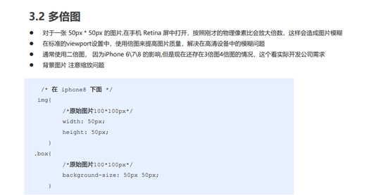

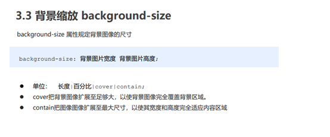

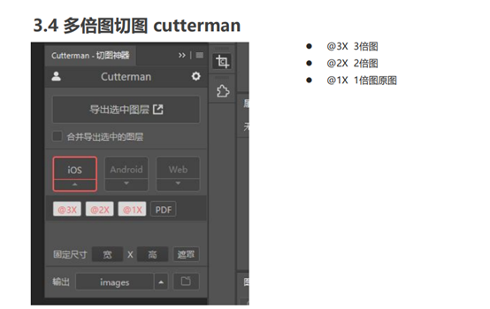

## 移动端开发选择

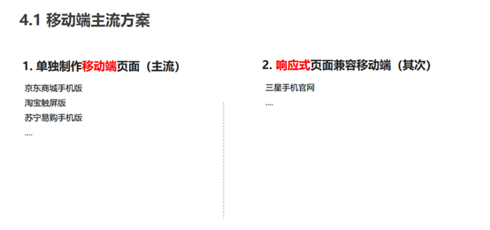


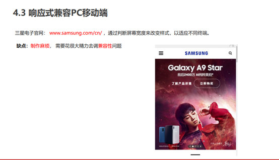

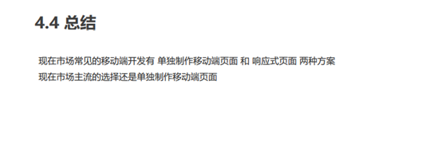

## 移动端技术解决方案

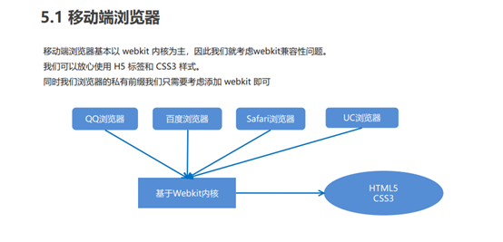


官网地址： http://necolas.github.io/normalize.c

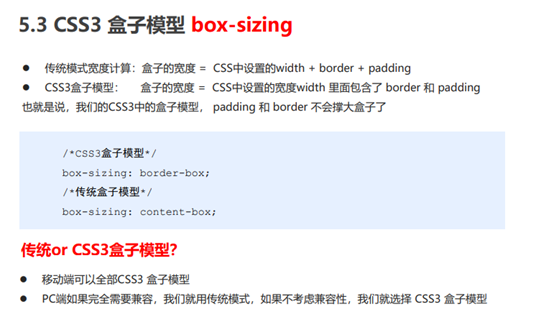

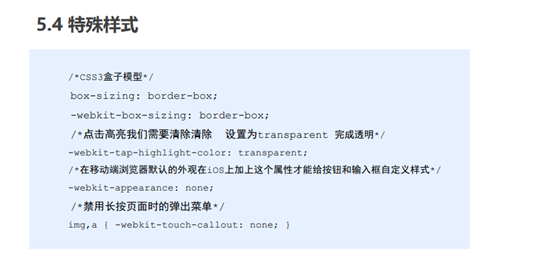

## 移动端常见布局

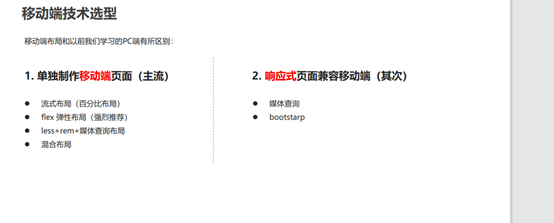

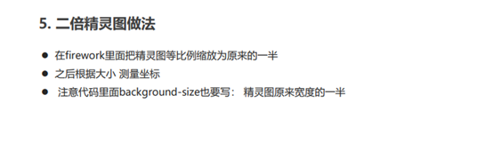

## 流式布局（百分比布局

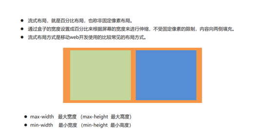

# flex布局 

## flex 布局体验 

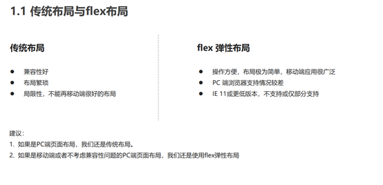

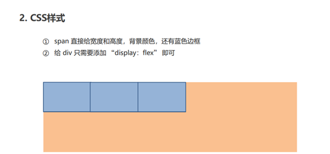

## flex 布局原理

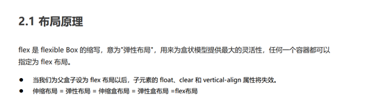

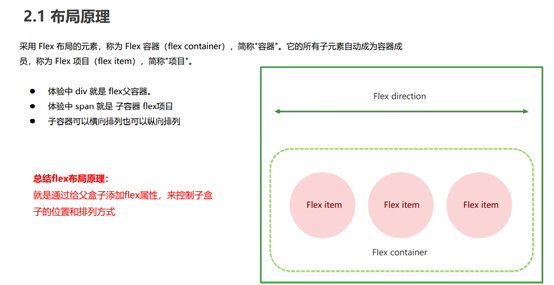

## flex 布局父项常见属性

display:flex

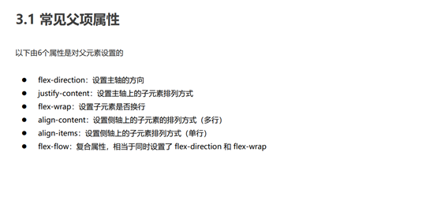

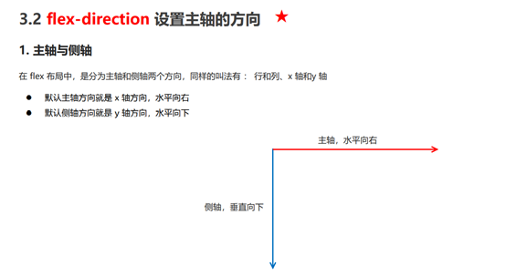

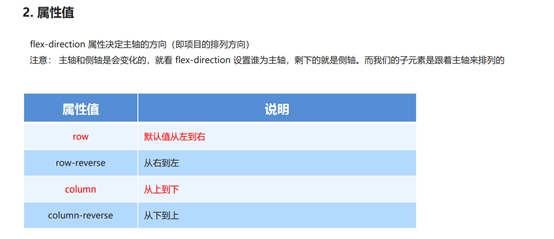

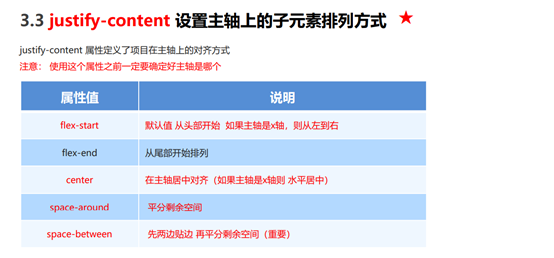

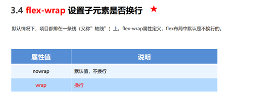

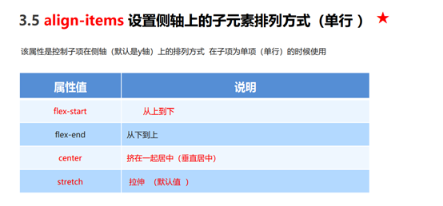

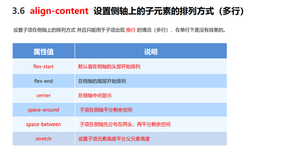

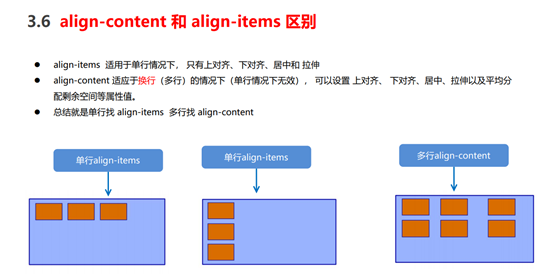

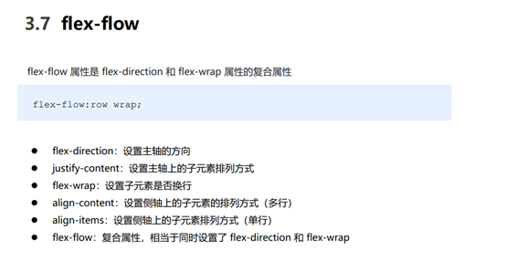

##  flex 布局子项常见属性

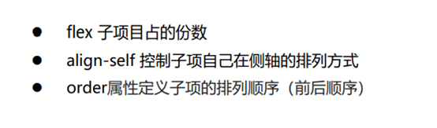

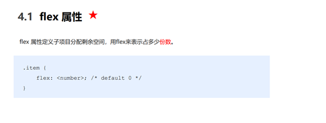

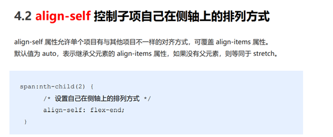

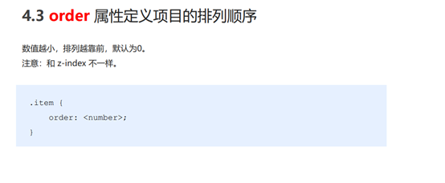

# rem适配布局 

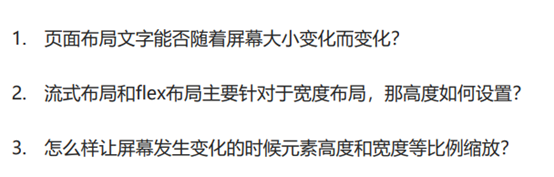

##  rem 基础 

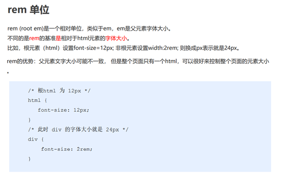

##  媒体查询 


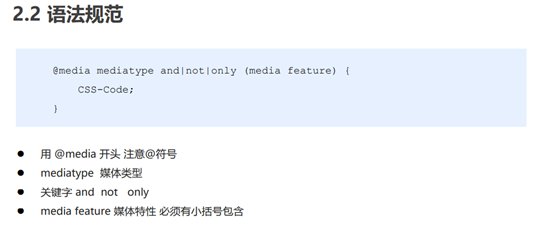

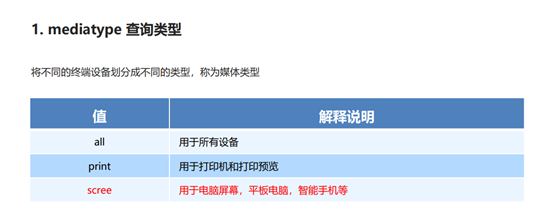

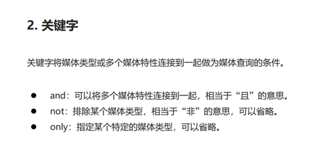

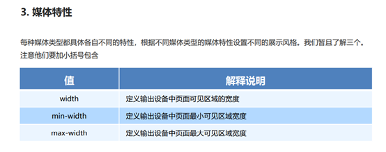


##  Less 基础 


## rem 适配方案


# 响应式布局

## 响应式开发 


## Bootstrap前端开发框架 


##  Bootstrap栅格系统


