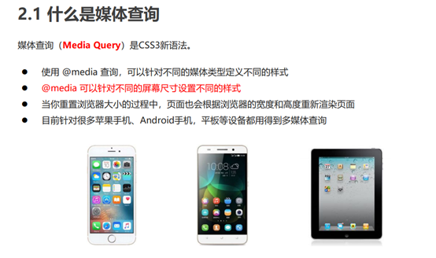

## 1. 字体图标

## 2. 2D 转换

转换（transform）是 CSS3 中具有颠覆性的特征之一，可以实现元素的位移、旋转、缩放等效果。

- 移动：translate
- 旋转：rotate
- 缩放：scale

`不会影响到其他元素的位置`

改变盒子在平面内的形态（位移、旋转、缩放）


### 位移 translate

2D 移动是 2D 转换里面的一种功能，可以改变元素在页面中的位置，类似定位。


语法

```
transform: translate(水平方向的位置,垂直方向的位置);
transform: translate(100px,50px);

单独设置某个方向的移动距离：translateX() & translateY()
transform: translateX(x);
transform: translateY(y);
x,y取值（正负均可）:
	像素单位数值
	百分比（参照物为盒子自身尺寸）
```

注意：

- X 轴正向为右，Y 轴正向为下
- 不会影响到其他元素的位置
- 对行内标签没有效
- translate()如果只给出一个值, 表示 x 轴方向移动距离

常用：

​ 定位居中

```
 position: absolute;
 left: 50%;
 top: 50%;
 transform: translate(-50%,-50%);
```

### 旋转 rotate

#### 转换之旋转 rotate

语法

```
transform:rotate(度数)
```

重点

- rotate 里面跟度数， 单位是 deg 比如 rotate(45deg)
- 角度为正时，顺时针，负时，为逆时针
- 默认旋转的中心点是元素的中心点

案例 画三角形


```
p::before {
 content: '';
 position: absolute;
 right: 20px;
 top: 10px;
 width: 10px;
 height: 10px;
 border-right: 1px solid #000;
 border-bottom: 1px solid #000;
 transform: rotate(45deg);
}
```

#### 转换中心点 transform-origin

我们可以设置元素转换的中心点

语法

```
transform-origin: x y;
```

重点

- 注意后面的参数 x 和 y 用空格隔开
- x y 默认转换的中心点是元素的中心点 (50% 50%)
- 还可以给 x y 设置 像素 或者 方位名词 （top bottom left right center）

### 缩放 scale

缩放，顾名思义，可以放大和缩小。 只要给元素添加上了这个属性就能控制它放大还是缩小。

语法

```
transform: scale(x轴缩放倍数, y轴缩放倍数);
一般情况下, 只为scale设置一个值, 表示x轴和y轴等比例缩放:
transform: scale(缩放倍数);
transform:scale(2) ：只写一个参数，第二个参数则和第一个参数一样，相当于 scale(2,2)

```

注意

- 注意其中的 x 和 y 用逗号分隔
- 缩放 值不带单位 ,1 没有缩放 , 大于 1 放大 , 小于 1 缩小
- sacle 缩放最大的优势：可以设置转换中心点缩放，默认以中心点缩放的，而且不影响其他盒子

### 2D 转换综合写法

1.同时使用多个转换，其格式为：transform: translate() rotate() scale() ...等， 2. 其顺序会影转换的效果。（先旋转会改变坐标轴方向） 3. 当我们同时有位移和其他属性的时候，记得要将位移放到最

## 3. 渐变背景

目标：使用 background-image 属性实现渐变背景效果

- 渐变是多个颜色逐渐变化的视觉效果
  一般用于设置盒子的背景


语法：

```
background-image:linear-gradient(
	颜色1，
	颜色2
);

常用： 一般情况直接写background;

background: linear-gradient(red,blue);
```

语法 2

```
background-image:linear-gradient(
	方向,
	颜色1，
	颜色2
);

常用： 一般情况直接写background;

background: linear-gradient( to right, red,blue);
```

方向可取值:

​ deg

​ to bottom (to +方位名词)

## 浏览器私有前缀


## 4. 3D 转换(空间转换)


特点

- 近大远小。
- 物体后面遮挡不可

主要知识点

1. 3D 位移: translate3d(x,y,z)
2. 3D 旋转: rotate3d(x,y,z)
3. 透视: perspective
4. 3D 呈现 transfrom-style

### 三维坐标系

​ 三维坐标系其实就是指立体空间，立体空间是由 3 个轴共同组成的。

- x 轴：水平向右 注意： x 右边是正值，左边是负值
- y 轴：垂直向下 注意： y 下面是正值，上面是负值
- z 轴：垂直屏幕 注意： 往外面是正值，往里面是负值


### 1. 3D 移动 translate3d

3D 移动在 2D 移动的基础上多加了一个可以移动的方向，就是 z 轴方向。

语法：

```
translform:translateX(100px)：仅仅是在x轴上移动

translform:translateY(100px)：仅仅是在Y轴上移动

translform:translateZ(100px)：仅仅是在Z轴上移动（注意：translateZ一般用px单位）

transform:translate3d(x,y,z)：其中 x、y、z 分别指要移动的轴的方向的距离 因为z轴是垂直屏幕，由里指向外面，所以默认是看不到元素在z轴的方向上移
```

取值（正负均可）

- 像素单位数值
- 百分比

### 2.透视 perspective

在 2D 平面产生近大远小视觉立体，但是只是效果二维的
如果想要在网页产生 3D 效果需要透视（理解成 3D 物体投影在 2D 平面内）。
模拟人类的视觉位置，可认为安排一只眼睛去看

透视距离也称为视距，所谓的视距就是人的眼睛到屏幕的距离。

总结透视作用： 空间转换时，为元素添加近大远小、近实远虚的视觉效果

- 距离视觉点越近的在电脑平面成像越大，越远成像越小
- 透视的单位是像素

注意:

==透视写在被观察元素的父盒子上面的==


```
perspective: 值;

取值：像素单位数值， 数值一般在800 – 1200。
```

translform:translateZ(100px)：仅仅是在 Z 轴上移动。
有了透视，就能看到 translateZ 引起的变化了

### 3D 旋转 rotate3d

3D 旋转指可以让元素在三维平面内沿着 x 轴，y 轴，z 轴或者自定义轴进行旋转

语法

```
transform:rotateX(45deg)：沿着x轴正方向旋转 45度
transform:rotateY(45deg) ：沿着y轴正方向旋转 45deg
transform:rotateZ(45deg) ：沿着Z轴正方向旋转 45deg 与2D的rotate效果相同
transform:rotate3d(x,y,z,deg)： 沿着自定义轴旋转 deg为角度（了解即可，很少使用）
```


左手准则

左手的手拇指指向 x 轴的正方向

- 其余手指的弯曲方向就是该元素沿着 x 轴旋转的方向

左手的手拇指指向 y 轴的正方向

- 其余手指的弯曲方向就是该元素沿着 y 轴旋转的方向（正值）

Z 轴顺时针

transform:rotate3d(x,y,z,deg)： 沿着自定义轴旋转 deg 为角度（了解即可）
xyz 是表示旋转轴的矢量，是标示你是否希望沿着该轴旋转，最后一个标示旋转的角度。

transform:rotate3d(1,0,0,45deg) 就是沿着 x 轴旋转 45deg
 transform:rotate3d(1,1,0,45deg) 就是沿着对角线旋转 45deg

### 3D 呈现 transfrom-style

- 控制子元素是否开启三维立体环境。
- transform-style: flat 子元素不开启 3d 立体空间 默认的
- transform-style: preserve-3d; 子元素开启立体空间
- 代码写给父级，但是影响的是子盒子


### 空间缩放(了解)

```
语法
Ø transform: scaleX(倍数);
Ø transform: scaleY(倍数);
Ø transform: scaleZ(倍数);
Ø transform: scale3d(x, y, z)
```

## 5. 动画

动画（animation）是 CSS3 中具有颠覆性的特征之一，可通过设置多个节点来精确控制一个或一组动画，常用来实现复杂的动画效果。

相比较过渡，动画可以实现更多变化，更多控制，连续自动播放等效果。

动画序列

0% 是动画的开始，100% 是动画的完成。这样的规则就是动画序列。
在 @keyframes 中规定某项 CSS 样式，就能创建由当前样式逐渐改为新样式的动画效果。
动画是使元素从一种样式逐渐变化为另一种样式的效果。您可以改变任意多的样式任意多的次数。
请用百分比来规定变化发生的时间，或用关键词 "from" 和 "to"，等同于 0% 和 100%


### 1. 定义动画 @keyframes

```
@keyframes 动画名称 {
 0%{
 width:100px;
 }
 100%{
 width:200px;
 }
}
```

### 2.元素使用动画

```
div {
 width: 200px;
 height: 200px;
 background-color: aqua;
 margin: 100px auto;
 /* 调用动画 */
 /* animation-name: 动画名称;*/
 /* 持续时间 */
 /* animation-duration: 持续时间;*/
 /* 通常使用简写方法*/
 animation:动画名称 时间 ;
 }

```

### 动画属性


```
animation: myfirst 5s linear 2s infinite alternate;
```

动画名称和动画时长必须赋值

取值不分先后顺序

如果有 2 个时间值，第一个时间表示动画时长，第二个时间表示延迟时间

简写属性里面不包含 animation-play-state
暂停动画：animation-play-state: puased; 经常和鼠标经过等其他配合使用
想要动画走回来 ，而不是直接跳回来：animation-direction ： alternate
盒子动画结束后，停在结束位置： animation-fill-mode ： forwards


### 速度曲线细节


animation-timing-function：规定动画的速度曲线，默认是“ease”

#### 使用 steps 实现逐帧动画

逐帧动画：帧动画。开发中，一般配合精灵图实现动画效果。

```
animation-timing-function: steps(N)；

将动画过程等分成N份
```

1 准备显示区域
设置盒子尺寸是一张小图的尺寸，背景图为当前精灵图
2 定义动画
改变背景图的位置（移动的距离就是精灵图的宽度）
3 使用动画
添加速度曲线 steps(N)，N 与精灵图上小图个数相同
添加无限重复效果

## 6. 移动端特点

### 移动端和 PC 端网页不同点

PC 端网页和移动端网页的有什么不同？

- PC 屏幕大，网页固定版心
- 手机屏幕小， 网页宽度多数为 100%

如何在电脑里面边写代码边调试移动端网页效果？

- Chrome DevTools（谷歌浏览器）的模拟手机调试

### 分辨率

屏幕尺寸-----指的是屏幕对角线的长度，一般用英寸来度量


PC 分辨率

- 1920 \* 1080
- 1920 \* 1080

缩放 150%

（1920/150%）\*（1080/150%）

硬件分辨率（出厂设置） ----- 物理分辨率
缩放调节的分辨率（软件设置） --逻辑分辨率

移动端主流设备分辨率


制作网页按照逻辑分辨率

设计图为硬件像素

2 倍图像素需要除 2

### 视口

视口（viewport）就是浏览器显示页面内容的屏幕区域。 视口可以分为布局视口、视觉视口和理想视口

手机屏幕尺寸都不同， 网页宽度为 100%
网页的宽度和逻辑分辨率尺寸相同

默认网页宽度是 980px。


- 视口就是浏览器显示页面内容的屏幕区域
- 视口分为布局视口、视觉视口和理想视口
- 我们移动端布局想要的是理想视口就是手机屏幕有多宽，我们的布局视口就有多宽
- 想要理想视口，我们需要给我们的移动端页面添加 meta 视口标签

目标：网页宽度和设备宽度(分辨率)相同。
解决办法：添加视口标签。
视口：显示 HTML 网页的区域，用来约束 HTML 尺寸。

#### meta 视口标签

```
<meta name="viewport" content="width=device-width, user-scalable=no,
initial-scale=1.0, maximum-scale=1.0, minimum-scale=1.0">
```


viewport：视口
width=device-width：视口宽度 = 设备宽度
initial-scale=1.0：缩放 1 倍（不缩放）

标准的 viewport 设置

视口宽度和设备保持一致
 视口的默认缩放比例 1.0
 不允许用户自行缩放
 最大允许的缩放比例 1.0
 最小允许的缩放比例 1.0

### 二倍图

图片分辨率, 为了高分辨率下图片不会模糊失真

现阶段设计稿参考 iPhone6/7/8，设备宽度 375px 产出设计稿。
二倍图设计稿尺寸：750px。

使用软件 像素大厨


多倍图切图 cutterma


二倍精灵图做法

在 firework 里面把精灵图等比例缩放为原来的一半
之后根据大小 测量坐标
注意代码里面 background-size 也要写： 精灵图原来宽度的一半

### 移动端开发选择

1.单独制作移动端页面（主流）

2.响应式页面兼容移动端（其次）

#### 移动端技术解决方案

CSS 初始化 normalize.css

移动端 CSS 初始化推荐使用 normalize.css/
 Normalize.css：保护了有价值的默认值
 Normalize.css：修复了浏览器的 bug
 Normalize.css：是模块化的
 Normalize.css：拥有详细的文档

官网地址： http://necolas.github.io/normalize.c

## 7. 百分比布局（流式布局）

流式布局，就是百分比布局，也称非固定像素布局。
 通过盒子的宽度设置成百分比来根据屏幕的宽度来进行伸缩，不受固定像素的限制，内容向两侧填充。
 流式布局方式是移动 web 开发使用的比较常见的布局方式。


max-width 最大宽度 （max-height 最大高度）

min-width 最小宽度 （min-height 最小高)

效果： 宽度自适应，高度固定。

优：无兼容性问题，缺：不好设置高度

## 8. flex 布局

伸缩布局 = 弹性布局 = 伸缩盒布局 = 弹性盒布局 =flex

Flex 布局/弹性布局：

- 是一种浏览器提倡的布局模型
- 布局网页更简单、灵活
- 避免浮动脱标的问题
- 百分比布局 （优：无兼容，缺：不会设置高度）

如果是 PC 端页面布局，我们还是传统布局。

如果是移动端或者不考虑兼容性问题的 PC 端页面布局，我们还是使用 flex 弹性布局

### Flex 布局模型构成

1.作用
基于 Flex 精确灵活控制块级盒子的布局方式，避免浮动布局中脱离文档流现象发生。
Flex 布局非常适合结构化布局

2.设置方式
父元素添加 display: flex，子元素可以自动的挤压或拉伸

3.组成部分
弹性容器
弹性盒子
主轴
侧轴 / 交叉轴

当我们为父盒子设为 flex 布局以后，子元素的 float、clear 和 vertical-align 属性将失效。


### 1-主轴对齐方式(父)

在 Flex 布局模型中，调节主轴或侧轴的对齐方式来设置盒子之间的间距。

修改主轴对齐方式属性: justify-content


### 2-侧轴对齐方式

修改侧轴对齐方式属性:

#### align-items (单行)（添加到弹性容器）

​ 添加给父元素

取值：

```
father {
	align-items: center;
 }
```


#### align-content (多行) (添加到弹性容器)

​ 添加给父元素 , 只有开启换行且有换行时

​ 调整行对齐方式 ：
​ 取值与 justify-content 基本相同

```
father {
	align-content: flex-start;
 }
```

#### align-self (自己)（添加到弹性盒）

添加给子元素

控制某个弹性盒子自己在侧轴的对齐方式（添加到弹性盒子）

​ align-self 属性允许单个项目有与其他项目不一样的对齐方式，可覆盖 align-items 属性

​ 默认值为 auto，表示继承父元素的 align-items 属性，如果没有父元素，则等同于 stretch。

```
span:nth-child(2) {
 /* 设置自己在侧轴上的排列方式 */
 align-self: flex-end;
 }

```

### 3-伸缩比 flex (子)

属性
Ø flex : 值;
取值分类
Ø 数值(整数)

```
.item {
 flex: <number>; /* default 0 */
}
```

注意 : 只占用父盒子剩余尺寸

### 4-主轴方向(父)

主轴默认是水平方向, 侧轴默认是垂直方向
修改主轴方向属性: flex-direction


### 5-弹性盒子换行(父)

弹性盒子换行显示 : flex-wrap: wrap;

```
 flex-wrap: wrap; //换行
 flex-wrap: nowrap; //默认值 不换行
```

### order 定义项目的排列顺序

数值越小，排列越靠前，默认为 0。
注意：和 z-index 不一样。

```
.item {
 order: <number>;
}
```

### flex-flow

flex-flow 属性是 flex-direction 和 flex-wrap 属性的复合属

```
flex-flow 属性是 flex-direction 和 flex-wrap 属性的复合属
```

flex-direction：设置主轴的方向
justify-content：设置主轴上的子元素排列方式
flex-wrap：设置子元素是否换行  align-content：设置侧轴上的子元素的排列方式（多行）
align-items：设置侧轴上的子元素排列方式（单行）
flex-flow：复合属性，相当于同时设置了 flex-direction 和 flex-wra

# rem 适配布局


## rem 基础


## 媒体查询




## Less 基础


## rem 适配方案


# 响应式布局

## 响应式开发


## Bootstrap 前端开发框架


## Bootstrap 栅格系统


