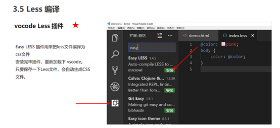

# 移动WEB开发之流式布局

## 移动端基础

## 视口

## 二倍图

## 移动端开发选择

## 移动端技术解决方案

官网地址： http://necolas.github.io/normalize.c

## 移动端常见布局

## 流式布局（百分比布局

# flex布局 

## flex 布局体验 

## flex 布局原理

## flex 布局父项常见属性

display:flex

##  flex 布局子项常见属性

# rem适配布局 

##  rem 基础 

##  媒体查询 

##  Less 基础 

## rem 适配方案

# 响应式布局

## 响应式开发 

## Bootstrap前端开发框架 

##  Bootstrap栅格系统

