## CSS书写顺序


## CSS 语法规范

CSS：层叠样式表（Cascading style sheets


1.选择器是用于指定 CSS 样式的 HTML 标签，花括号内是对该对象设置的具体样式

2.属性和属性值以“键值对”的形式出现

3.属性是对指定的对象设置的样式属性，例如字体大小、文本颜色等

4.属性和属性值之间用英文“：”分开

5.多个“键值对”之间用英文“;”进行区分


###  代码风格


## 1.CSS 引入方式

按照 CSS 样式书写的位置（或者引入的方式），CSS 样式表可以分为三大类：

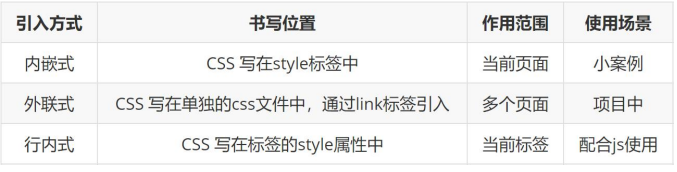

## 2.基础选择器


### 1.标签选择器


### 2.类选择器

如果想要差异化选择不同的标签，单独选一个或者某几个标签，可以使用类选择器.

类选择器在 HTML 中以 class 属性表示，在 CSS 中，类选择器以一个点“.”号显示。


① 类选择器使用“.”（英文点号）进行标识，后面紧跟类名（自定义，我们自己命名的）。 

② 可以理解为给这个标签起了一个名字，来表示。 


命名规范

1.类名可以由数字、字母、下划线、中划线组成，但不能以数字或者中划线开头

2.命名要有意义，尽量使别人一眼就知道这个类名的目的。 

3.不要使用纯数字、中文等命名，尽量使用英文字母来表示。

4..长名称或词组可以使用中横线来为选择器命名。

3. 一个标签可以同时有多个类名，类名之间以空格隔开
4. 类名可以重复，一个类选择器可以同时选中多个标签 

#### 类选择器-多类名

我们可以给一个标签指定多个类名，从而达到更多的选择目的。 这些类名都可以选出这个标签.
简单理解就是一个标签有多个名字.


(1) 在标签class 属性中写 多个类名

(2) 多个类名中间必须用空格分开

(3) 这个标签就可以分别具有这些类名的样式

 简单理解：就是给某个标签添加了多个类，或者这个标签有多个名字

 这个标签就可以分别具有这些类名的样式

 从而节省CSS代码,统一修改也非常方便.

 多类名选择器在后期布局比较复杂的情况下，还是较多使用的


多类名开发中使用场景 

(1) 可以把一些标签元素相同的样式(共同的部分)放到一个类里面. 

(2) 这些标签都可以调用这个公共的类,然后再调用自己独有的类.

(3) 从而节省CSS代码,统一修改也非常方便.

### 3.id 选择器

id 选择器可以为标有特定 id 的 HTML 元素指定特定的样式。 

HTML 元素以 id 属性来设置 id 选择器，CSS 中 id 选择器以“#" 来定义。

```
#id属性值 {
	css属性名：属性值；
}
```


id 选择器和类选择器的区别

① 类选择器（class）好比人的名字，一个人可以有多个名字，同时一个名字也可以被多个人使用。

② id 选择器好比人的身份证号码，全中国是唯一的，不得重复。

③ id 选择器和类选择器最大的不同在于使用次数上。

④ 类选择器在修改样式中用的最多，id 选择器一般用于页面唯一性的元素上，经常和 JavaScript 搭配使用。

### 4.通配符选择器

在 CSS 中，通配符选择器使用“*”定义，它表示选取页面中所有元素（标签）。

```
* {
	css属性名：属性值；
   } 
```


## 3.CSS 字体属性

CSS Fonts (字体)属性用于定义字体系列、大小、粗细、和文字样式（如斜体）。


### 1 字体系列font-family


### 2 字体大小font-size


### 3字体粗细font-weight


### 4 文字样式font-style（字体倾斜）


### 5 字体复合属性font


​	font-style与font-weight可以换位置

## 4.CSS 文本属性

CSS Text（文本）属性可定义文本的外观，比如文本的颜色、对齐文本、装饰文本、文本缩进、行间距等。


### 1 文本颜色


### 2 对齐文本


### 3 装饰文本


### 4 文本缩进


### 5 行间距


取值：
	• 数字+px
	• 倍数（当前标签font-size的倍数）

**应用**

1. 让单行文本垂直居中可以设置 line-height : 文字父元素高度
2. 网页精准布局时，会设置 line-height : 1 可以取消上下间距

行高与font连写：
• 如果同时设置了行高和font连写，注意覆盖问题
• font : style weight size/line-height family 

## 5.复合选择器

在 CSS 中，可以根据选择器的类型把选择器分为基础选择器和复合选择器，复合选择器是建立在基础选择器之上，对基本选择器进行组合形成的。

- 复合选择器可以更准确、更高效的选择目标元素（标签）

- 复合选择器是由两个或多个基础选择器，通过不同的方式组合而成的


常用的复合选择器包括：后代选择器、子选择器、并集选择器、交集选择器、伪类选择器等等


### 1后代选择器


### 2子选择器


### 3并集选择器


并集选择器中的每组选择器通常一行写一个，提高代码的可读性

### 4交集选择器

```
选择器1选择器2 { css }
```

（既又原则）找到页面中 既 能被选择器1选中，又 能被选择器2选中的标签，设置样式

注意点：
1. 交集选择器中的选择器之间是紧挨着的，没有东西分隔
2. 交集选择器中如果有标签选择器，标签选择器必须写在最前面

### 5链接伪类选择器

伪类选择器用于向某些选择器添加特殊的效果，比如给链接添加特殊效果，或选择第1个，第n个元素。

伪类选择器书写最大的特点是用冒号（:）表示，比如 :hover 、 :first-child 。

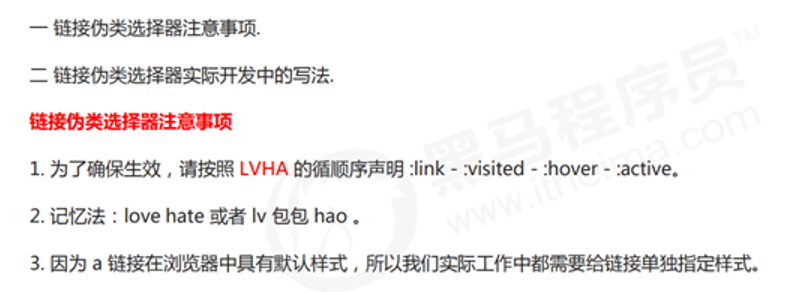

```
	/* 未访问 */
    a:link{
      color: red;
    }
    /* 访问过的 */
    a:visited{
      color: rgb(44, 88, 168);
    }
    /* 鼠标放上去效果 */
    a:hover{
      font-size: 20px;
    }
    /* 点击时效果 */
    a:active{
      font-size: 30px;
      color: orange;
    }
```

a:visited因为浏览器安全可能不生效

#### a:hover 最常用

hover可作用到任何元素

```
.outer:hover .inner{
	鼠标放到outer  作用到inner
}
```


## 6. 元素显示模式

元素显示模式就是元素（标签）以什么方式进行显示，比如自己占一行，比如一行可以放多个个<i><</i>span>。

HTML 元素一般分为块元素和行内元素两种类型。


#### 行内块元素缝隙问题

```
 body {
            /* 行内块元素缝隙问题 给父元素添加font-size 0  */
            font-size: 0;
        }
```

​	或者浮动

### 元素显示模式转换

特殊情况下，我们需要元素模式的转换，简单理解：

 一个模式的元素需要另外一种模式的特性比如想要增加链接 <i><</i>a> 的触发范围。


一个小技巧 单行文字垂直居中的代码

: 让文字的行高等于盒子的高度 就可以让文字在当前盒子内垂直居中

## 7.背景

通过 CSS 背景属性，可以给页面元素添加背景样式。
背景属性可以设置背景颜色、背景图片、背景平铺、背景图片位置、背景图像固定等。


### 1背景颜色


### 2 背景图片


### 3 背景平铺


### 4 背景图片位置


### 5 背景图像固定（背景附着）


### 6 背景复合写法


### 7 背景图片大小

​	设置背景图片的大小

```
 语法
 background-size：宽度 高度；
 
 例：
 background-size: 400px 400px;
```

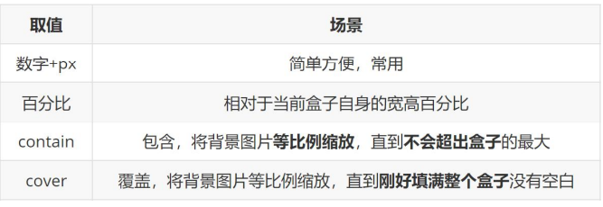

### 8 背景色半透明


​					opacity:0.2	

​					整体透明，包括内容


## 8.CSS 的三大特性

CSS 有三个非常重要的三个特性：层叠性、继承性、优先级。

### 8.1层叠性


### 8.2继承性


### 8.3优先级


## 9. CSS盒子模型----第三天结束

页面布局要学习三大核心, 盒子模型, 浮动 和 定位. 

学习好盒子模型能非常好的帮助我们布局页面.

### 盒模型认知


####     盒子模型（Box Model）组成 


### 1   边框（border）


CSS 边框属性允许你指定一个元素边框的样式和颜色。


####    合并表格边框


#### 边框会影响盒子实际大小


​							3.使用Css3盒子(box-sizing:border-box)

### 2 内边距（padding）


#### padding不会撑大盒子的特殊情况

1. 如果子盒子没有设置宽度，此时宽度默认是父盒子的宽度
2. 此时给子盒子设置左右的padding或者左右的border，此时不会撑大子盒子

#### 行内元素的margin和padding无效情况

 场景：给行内元素设置margin和padding时
结果：

1. 水平方向的margin和padding布局中有效！
2. 垂直方向的margin和padding布局中无效！

总结：可以给行内元素加左右边距，不能加上下边距.

### 3 外边距（margin）


#### margin百分比单位的参考系

margin百分比单位的参考系：不管是margin还是padding，使用百分比作为单位，参考的都是父元素的宽度。


#### 外边距塌陷


####  清除内外边距


#### margin负值运用


### 4 Css3盒模型

#### 1. Css3盒模型

CSS3 中可以通过 box-sizing 来指定盒模型，有2个值：

即可指定为 content-box、border-box，这样我们计算盒子大小的方式就发生了改变。

如果盒子模型我们改为了box-sizing: border-box ， 那padding和border就不会撑大盒子了（前提padding
和border不会超过width宽度）

总结：可以分成两种情况：
1. box-sizing: content-box 盒子大小为 width + padding + border （以前默认的）

2. box-sizing: border-box 盒子大小为 width

   

只需在盒子中加入：

```
box-sizing : border-box
```

可以

```
*{
	box-sizing : border-box
}
```


#### 圆角边框


## 10.CSS3选择器

CSS3 给我们新增了选择器，可以更加便捷，更加自由的选择目标元素。
1. 属性选择器

2. 结构伪类选择器

3. 伪元素选择器

   

   注意：类选择器、属性选择器、伪类选择器，权重为 10。

### 属性选择器

属性选择器可以根据元素特定属性的来选择元素。 这样就可以不用借助于类或者id选择器。

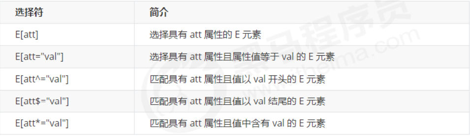


### 结构伪类选择器

结构伪类选择器主要根据文档结构来选择器元素， 常用于根据父级选择器里面的子元素

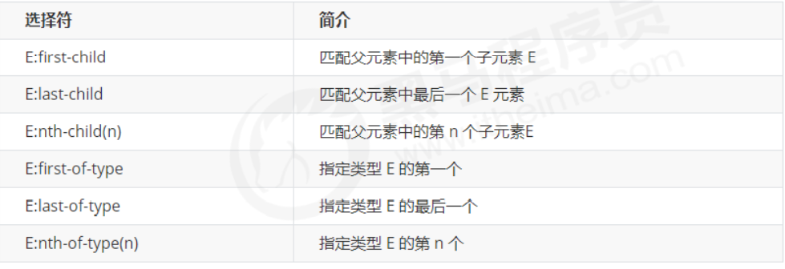

nth-child（n） 选择某个父元素的一个或多个特定的子元素（重点）

 n 可以是数字，关键字和公式
 n 如果是数字，就是选择第 n 个子元素， 里面数字从1开始…
 n 可以是关键字：even 偶数，odd 奇数
 n 可以是公式：常见的公式如下 ( 如果n是公式，则从0开始计算，但是第 0 个元素或者超出了元素的个数会被忽略 )

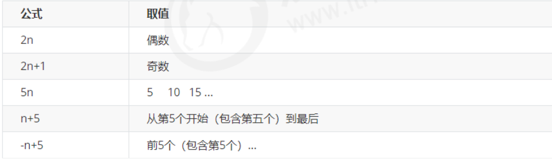

 区别：

1. nth-child 对父元素里面所有孩子排序选择（序号是固定的） 先找到第n个孩子，然后看看是否和E匹配
2. nth-of-type 对父元素里面指定子元素进行排序选择。 先去匹配E ，然后再根据E 找第n个孩子

小结

结构伪类选择器一般用于选择父级里面的第几个孩子
 nth-child 对父元素里面所有孩子排序选择（序号是固定的） 先找到第n个孩子，然后看看是否和E匹配
nth-of-type 对父元素里面指定子元素进行排序选择。 先去匹配E ，然后再根据E 找第n个孩子
关于 nth-child（n） 我们要知道 n 是从 0 开始计算的，要记住常用的公式
如果是无序列表，我们肯定用 nth-child 更多
类选择器、属性选择器、伪类选择器，权重为 10。

### 伪元素选择器（重点）

伪元素选择器可以帮助我们利用CSS创建新标签元素，而不需要HTML标签，从而简化HTML结构。

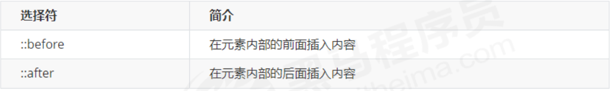

注意：

before 和 after 创建一个元素，但是属于行内元素
 新创建的这个元素在文档树中是找不到的，所以我们称为伪元素

```
语法： 
element::before {
			content:"" 
} 
```


 before 和 after 必须有 content 属性

 before 在父元素内容的前面创建元素，after 在父元素内容的后面插入元素
 伪元素选择器和标签选择器一样，权重为 1


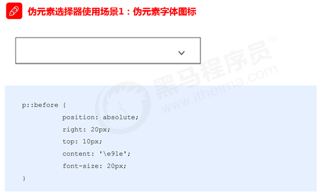

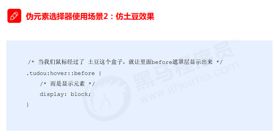

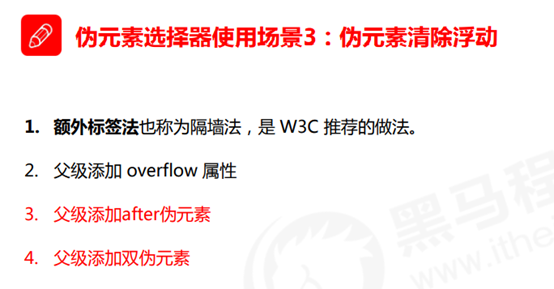

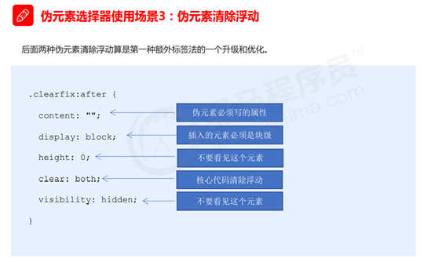

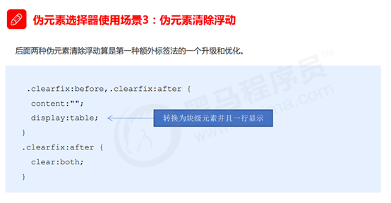


### 表单伪类选择器

#### :focus 伪类选择器

:focus伪类选择器用于 选取获得焦点的表单元素。
焦点就是光标，一般情况 <i><</i>input> 类表单元素才能获取，因此这个选择器也主要针对于表单元素来说。

```
input:focus{
	background-color:yellow;
}
```

#### :checked            

/* 单选或者多选按钮选中的时候选中标签 */

```
input:checked{
	background-color:yellow;
}
```

#### 拓展

```
/* + 兄弟选择器  选择下一个兄弟元素 */
.box input:checked + label{
	选取checkec选中的下一个兄弟元素
}

/* ~ 兄弟选择器  选择下面所有的兄弟元素 */
 section ~ p{
	选取section标签选中的下全部兄弟元素(P标签)
	}
 
        

         
```


## 11.浮动

### 浮动的作用

早期的作用：图文环绕


现在的作用：网页布局

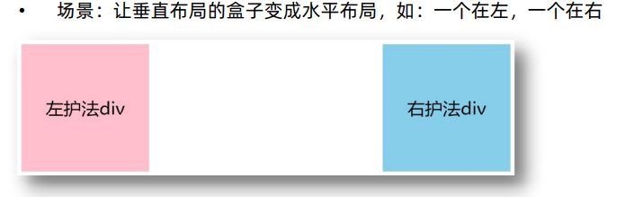

​	一行水平显示多个块等

垂直居中 水平居中 等使用：行内块 


### 浮动的使用


### 浮动特性：

​        1.浮动后具有行内块元素特征，

​			1一行多个，且没有缝隙，

​            2可设置宽高

​            3默认大小由内容撑开

​        2.脱标 

> ​          1.高出标准流半个级别，可以覆盖标准流，不能覆盖文字，行内元素，行内块
>

​              2浮动找浮动

​              3顶部对齐

​              4自动换行

​              5不占位

​              6只影响后面的标准流，不影响前面、且会受到上边元素影响

​        3.一般使用会搭配标准流父盒子

#### 注意点：

  0.浮动的元素不能通过text-align:center或者margin:0 auto，让浮动元素本身水平居中

1. 浮动和标准流的父盒子搭配。
    先用标准流的父元素排列上下位置, 之后内部子元素采取浮动排列左右位置
    2.2 浮动布局注意点

2. 一个元素浮动了，理论上其余的兄弟元素也要浮动。
    一个盒子里面有多个子盒子，如果其中一个盒子浮动了，那么其他兄弟也应该浮动，以防止引起问题。
    浮动的盒子只会影响浮动盒子后面的标准流,不会影响前面的标准流.

  


### 清除浮动

含义：清除浮动带来的影响
• 影响：如果子元素浮动了，此时子元素不能撑开标准流的块级父元素
Ø 原因：
• 子元素浮动后脱标 → 不占位置
Ø 目的：
• 需要父元素有高度，从而不影响其他网页元素的布

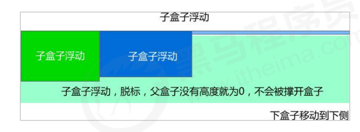

#### 清除浮动本质

清除浮动的本质是清除浮动元素造成的影响
 如果父盒子本身有高度，则不需要清除浮动
 清除浮动之后，父级就会根据浮动的子盒子自动检测高度。父级有了高度，就不会影响下面的标准流了


#### 清除浮动方法

##### 额外标签法也称为隔墙法，是 W3C 推荐的做法。

 优点： 通俗易懂，书写方便

 缺点： 添加许多无意义的标签，结构化较差

```
   /*额外标签法，在最后一个浮动元素后面加一个块元素，
        然后给这个元素添加Css  {clear:both}*/
        
      .clear {
        /* 清除浮动核心代码 */
        clear: both;
      }
```

​		注：这个元素必须是块级元素

#####  :after 伪元素法

优点：没有增加标签，结构更简单
 缺点：照顾低版本浏览器
 代表网站： 百度、淘宝网、网易等

```
 .clearfix::after{
        content: "";
        display: block;
        clear: both;
        line-height: 0;
        font-size: 0;
        visibility: hidden;
      }
      .clearfix {
        *zoom: 1;
      }
```

##### 双伪元素清除法

优点:项目中使用，直接给标签加类即可清除浮动

```
	  .clearfix::before,
      .clearfix::after{
        content: "";
        display: table;
        
        line-height: 0;
        font-size: 0;
        visibility: hidden;
      }
      .clearfix::after{
        clear: both;
      }
      .clearfix {
        *zoom: 1;
      }
```


##### 清除浮动 —— 父级添加 overflow

优点：方便

```
直接给父元素设置 overflow : hidden
```


####  清除浮动总结


### BFC（拓展补充）

块格式化上下文（Block Formatting Context）：BFC

• 是Web页面的可视CSS渲染的一部分，是块盒子的布局过程发生的区域，也是浮动元素与其他元素交互的区域。

Ø 创建BFC方法：

1. html标签是BFC盒子
2. 浮动元素是BFC盒子
3. 行内块元素是BFC盒子
4. overflow属性取值不为visible。如：auto、hidden…
5. ……
Ø BFC盒子常见特点：
1. BFC盒子会默认包裹住内部子元素（标准流、浮动）→ 应用：清除浮动
2. BFC盒子本身与子元素之间不存在margin的塌陷现象 → 应用：解决margin的塌陷
3. ……

## 12CSS 定位


### 1定位前情提要

#### (1)为什么需要定位


#### (2)定位组成


1.3 静态定位 static（了解）


### 2相对定位 relative（重要）


### 3绝对定位 absolute（重要）


### (4)固定定位 fixed （重要)


1.8 粘性定位 sticky（了解）


### 定位扩展

#### 子绝父相的由来


#### 定位叠放次序 z-index


#### 定位盒子居中


```
	方法 1 
	.box {
			width:200px;
			height:200px;
            position: absolute;
             /* 水平居中  */
            left: 50%;
            margin-left=-100px;
            /* 垂直居中  */
            top: 50%;
           	margin-top=-100px; 
            background-color: orange;
        }
        
	方法2 
	.box {
            position: absolute;
            left: 50%;
            top: 50%;
            /* 百分比数值 相对于自身 */
            /* 水平居中 垂直居中  */
            transform: translate(-50%,-50%);
            background-color: orange;
        }
```


## 13 Css3技巧(装饰)

### 1.vertical-align 属性应用


### 2.CSS 用户界面样式


### 3.CSS 三角


### 4.阴影

#### 盒子阴影box-shadow


```
.box {
            width: 300px;
            height: 300px;
            margin: 100px auto;
            background-color: skyblue;
            /* 水平方向的位置 垂直方向的位置 是阴影必须给的属性 */
            /* box-shadow:水平方向的位置 垂直方向的位置 模糊程度 阴影大小 颜色 */
            /* 盒子阴影 不占有位置   */
            /* outset 外阴影不能写 */
            box-shadow: 3px 2px 16px 3px  rgba(0, 0, 0, .3);
            /* inset 内阴影 */
            /* box-shadow: 3px 2px 16px 3px  rgba(0, 0, 0, .3) inset; */

        }
```


#### 文字阴影text-shadow


### 4.精灵图


####  精灵图（sprites）的使用

使用步骤:

1. 创建一个盒子
2. 通过PxCook(或者ps)量取小图片大小，将小图片的宽高设置给盒子
3. 将精灵图设置为盒子的背景图片
4. 通过PxCook测量小图片左上角坐标，分别取负值设置给盒子的background-position：x y

```
	例:
    .icon1 {
            /* 准备能放下图片的盒子 */
            width: 24px;
            height: 24px;
            /* 插入背景图片 */
            background: url("./images/taobao.png") no-repeat;
            /* 移动背景图片   背景图片默认左上角对齐  背景图片往左移动和往上移动 所以都是负值 */
            background-position: 0 -352px;
        }
```


###  6.字体图标

​	目标：使用字体图标技巧实现网页中简洁的图标效果

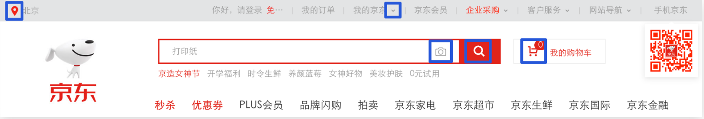

- ​		字体图标展示的是图标，本质是字体。
- ​		处理简单的、颜色单一的图片

#### 字体图标的产生

精灵图是有诸多优点的，但是缺点很明显。
1. 图片文件还是比较大的。

2. 图片本身放大和缩小会失真。

3. 一旦图片制作完毕想要更换非常复杂。

  此时，有一种技术的出现很好的解决了以上问题，就是字体图标 iconfont。

  

- 字体图标的优点：
  灵活性：灵活地修改样式，例如：尺寸、颜色等
-  轻量级：体积小、渲染快、降低服务器请求次数
-  兼容性：几乎兼容所有主流浏览器
-  使用方便：下载字体包    使用字体图标

总结：

   1.如果遇到一些结构和样式比较简单的小图标，就用字体图标。

2. 如果遇到一些结构和样式复杂一点的小图片，就用精灵图。


#### 字体图标的下载

推荐下载网站：

 icomoon 字库 http##//icomoon.io 推荐指数 ★★★★★

IcoMoon 成立于 2011 年，推出了第一个自定义图标字体生成器，它允许用户选择所需要的图标，使它们成一字型。该字库内容种类繁多，非常全面，唯一的遗憾是国外服务器，打开网速较慢。


字体文件格式

不同浏览器所支持的字体格式是不一样的，字体图标之所以兼容，就是因为包含了主流浏览器支持的字体文件。

```
1. TureType(.ttf)格式.ttf字体是Windows和Mac的最常见的字体，支持这种字体的浏览器有IE9+、Firefox3.5+、
   Chrome4+、Safari3+、Opera10+、iOS Mobile、Safari4.2+；
2. Web Open Font Format(.woff)格式woff字体，支持这种字体的浏览器有IE9+、Firefox3.5+、Chrome6+、
   Safari3.6+、Opera11.1+；
3. Embedded Open Type(.eot)格式.eot字体是IE专用字体，支持这种字体的浏览器有IE4+；
4. SVG(.svg)格式.svg字体是基于SVG字体渲染的一种格式，支持这种字体的浏览器有Chrome4+、Safari3.1+、
   Opera10.0+、iOS Mobile Safari3.2+；
```


#### 字体图标的引入

1.把下载包里面的 fonts 文件夹放入页面根目录下

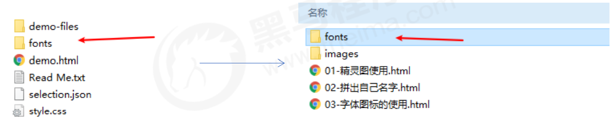

2.在 CSS 样式中全局声明字体： 简单理解把这些字体文件通过css引入到我们页面中。
一定注意字体文件路径的问题。

```
@font-face {
 font-family: 'icomoon';
 src: url('fonts/icomoon.eot?7kkyc2');
 src: url('fonts/icomoon.eot?7kkyc2#iefix') format('embedded-opentype'),
 url('fonts/icomoon.ttf?7kkyc2') format('truetype'),
 url('fonts/icomoon.woff?7kkyc2') format('woff'),
 url('fonts/icomoon.svg?7kkyc2#icomoon') format('svg');
 font-weight: normal;
 font-style: normal;
 }
```

3.html 标签内添加小图标。

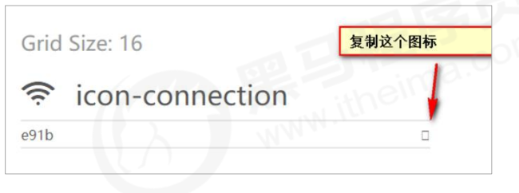

```
<span>口</span>
```

4.给标签定义字体。

```
span {
 font-family: "icomoon";
}

```

这个字体和上面@font-face里面的字体保持一致


2.5 字体图标的追加

如果工作中，原来的字体图标不够用了，我们需要添加新的字体图标到原来的字体文件中。
把压缩包里面的 selection.json 从新上传，然后选中自己想要新的图标，从新下载压缩包，并替换原来的文件即可。

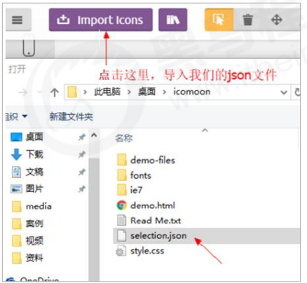


 阿里 iconfont 字库 http##//www.iconfont.cn/ 推荐指数 ★★★★★

这个是阿里妈妈 M2UX 的一个 iconfont 字体图标字库，包含了淘宝图标库和阿里妈妈图标库。可以使用 AI制作图标上传生成。 重点是，免费！

下载字体包：
 登录 → 选择图标库 → 选择图标，加入购物车 → 购物车 → 添加至项目 → 下载至本地

使用字体图标：
l Unicode编码

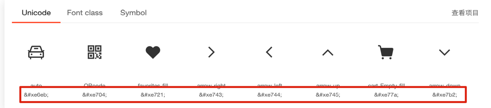

```
  /* 1. 把字体文件引入到页面当中 */
        /* 字体声明 */
        @font-face {
            /* 给字体文件起名字 */
            font-family: "iconfont";
            /* Project id  */
            /* 注意路径的问题 */
            src: url('./iconfont/iconfont.ttf?t=1641862389150') format('truetype');
        }
        /* 2. 复制图标对应的编码到标签当中 */
        span {
            /* 3. 给标签设置字体 */
            font-family: "iconfont";
            font-size: 100px;
            color: blue;
        }
```

- 引入样式表：iconfont.css
-  复制粘贴图标对应的Unicode编码
- 设置文字字体


类名

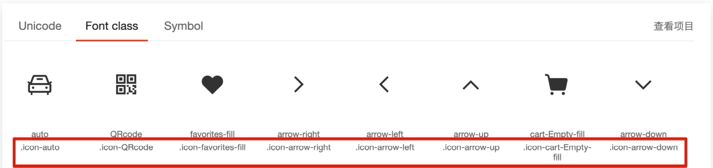

```
 /* 1. 引入iconfont.css文件 */
        /* 2. 类名使用 必须添加 iconfont类 */
        /* 3. 挑选图标对应的类名 */
        .icon-delete {
            font-size: 100px;
            color: skyblue;
        }
```


- 引入字体图标样式表

- 调用图标对应的类名，必须调用2个类名

  iconfont类：基本样式，包含字体的使用等
  icon-xxx：图标对应的类名


### 7.过渡


```
.box {
            width: 200px;
            height: 200px;
            background-color: skyblue;
            /* 变换的属性 花费时间  必须给的属性 */
            /* transition: 变换的属性 花费时间 延迟时间 运动曲线; */
            /* s 秒  ms毫秒  1s=1000ms  */
            /* linear 匀速 */
            /* transition: width 2s 1s linear , height 1s linear; */
            transition: all 1s ;
            /* 谁做过渡给谁加 */
        }
```


### CSS3 的其他不常用新特性


## 14元素的显示与隐藏

类似网站广告，当我们点击关闭就不见了，但是我们重新刷新页面，会重新出现！
本质：让一个元素在页面中隐藏或者显示出来。

1. display 显示隐藏元素 但是不保留位置
2. visibility 显示隐藏元素 但是保留原来的位置
3. overflow 溢出显示隐藏 但是只是对于溢出的部分处理

### display 属性

display 属性用于设置一个元素应如何显示。

```
	display: none ；隐藏对象
	display：block ；除了转换为块级元素之外，同时还有显示元素的意思		
```


display 隐藏元素后，**不再占有原来的位置**。

后面应用及其广泛，搭配 JS 可以做很多的网页特效。

### visibility 可见性

visibility 属性用于指定一个元素应可见还是隐藏。

```
	 visibility：visible ; 元素可视
	 visibility：hidden; 元素隐藏
```

visibility 隐藏元素后，**继续占有**原来的位置。
如果隐藏元素想要原来位置， 就用 visibility：hidden
如果隐藏元素不想要原来位置， 就用 display：none (用处更多 重点)

### overflow 溢出

overflow 属性指定了如果内容溢出一个元素的框（超过其指定高度及宽度） 时，会发生什么

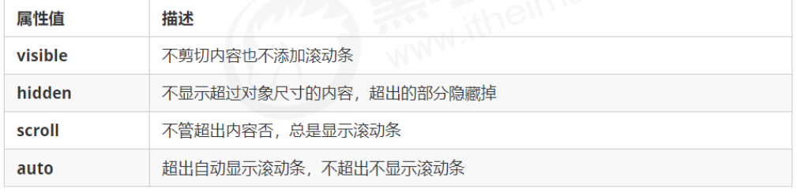

一般情况下，我们都不想让溢出的内容显示出来，因为溢出的部分会影响布局。
但是如果有定位的盒子， 请慎用overflow:hidden 它会隐藏多余的部分。


## 布局总结

### 传统网页布局的三种方式

网页布局的本质——用 CSS 来摆放盒子。 把盒子摆放到相应位置.
1.1 传统网页布局的三种方式
CSS 提供了三种传统布局方式(简单说,就是盒子如何进行排列顺序)：
普通流（标准流）
 浮动
 定位

#### 标准流

所谓的标准流: 就是标签按照规定好默认方式排列.

1. 块级元素会独占一行，从上向下顺序排列。
   常用元素：div、hr、p、h1~h6、ul、ol、dl、form、table
2. 行内元素会按照顺序，从左到右顺序排列，碰到父元素边缘则自动换行。
   常用元素：span、a、i、em 等
    1.2 标准流（普通流/文档流）
    以上都是标准流布局，我们前面学习的就是标准流，标准流是最基本的布局方式。
    这三种布局方式都是用来摆放盒子的，盒子摆放到合适位置，布局自然就完成了。

  

注意：实际开发中，一个页面基本都包含了这三种布局方式（后面移动端学习新的布局方式） 。

### 常见网页布局


### 常见布局技巧


### 网页布局总结


## 项目经验

### SEO三大标签

SEO（Search Engine Optimization）：搜索引擎优化
Ø 作用：让网站在搜索引擎上的排名靠前
Ø 提升SEO的常见方法：
1. 竞价排名
2. 将网页制作成html后缀
3. 标签语义化（在合适的地方使用合适的标签）


1. title：网页标题标签
2. description：网页描述标签
3. keywords：网页关键词标签

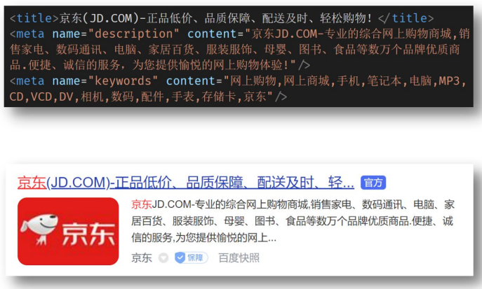

### ico图标设置


### 版心

场景：把页面的主体内容约束在网页中间
Ø 作用：让不同大小的屏幕都能看到页面的主体内容

版心类名常用：container、wrapper、w 等

```
.container{
	width:1200px;
	margin:0 auto;
}
```

### 溢出的文字省略号显示


### 项目结构

#### 文件和目录准备

1. 新建项目文件夹 xtx-pc-client，在VScode中打开
   • 在实际开发中，项目文件夹不建议使用中文
   • 所有项目相关文件都保存在 xtx-pc-client 目录中

2. 复制 favicon.ico 到 xtx-pc-client 目录
    • 一般习惯将ico图标放在项目根目录

3. 复制 images 和 uploads 目录到 xtx-pc-client 目录中
    • images ：存放网站 固定使用 的图片素材，如：logo、样式修饰图片… 等
    • uploads：存放网站 非固定使用 的图片素材，如：商品图片、宣传图片…等

4. 新建 index.html 在根目录

5. 新建 css 文件夹保存网站的样式，并新建以下CSS文件：
    • base.css：基础公共样式
    • common.css：该网站中多个网页相同模块的重复样式，如：头部、底部
    • index.css：首页样式

  

  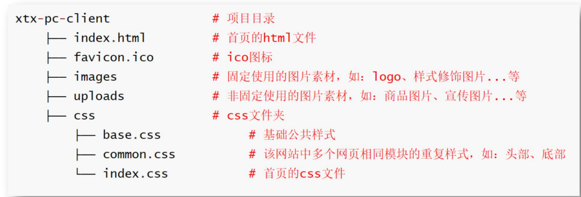


#### 基础公共样式(初始化)

场景：一般项目开始前，首先会 去除掉浏览器默认样式，设置为 当前项目需要的初始化样式
Ø 作用：防止不同浏览器中标签默认样式不同的影响，统一不同浏览器的默认显示效果，方便后续项目开发

#### index页面骨架

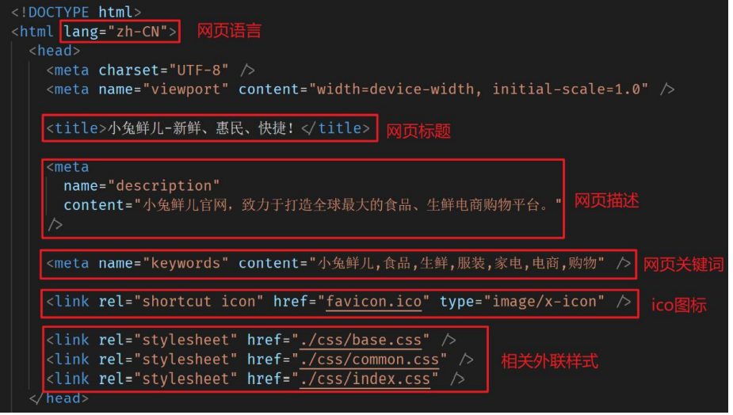

