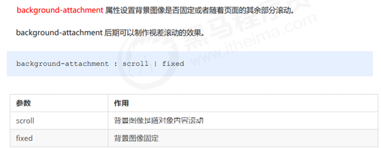

# CSS书写顺序


# CSS 语法规范


 1.选择器是用于指定 CSS 样式的 HTML 标签，花括号内是对该对象设置的具体样式

2.属性和属性值以“键值对”的形式出现

3.属性是对指定的对象设置的样式属性，例如字体大小、文本颜色等

4.属性和属性值之间用英文“##”分开

5.多个“键值对”之间用英文“;”进行区分


##  1.2代码风格


## 2.选择器


### 标签选择器


### 类选择器

如果想要差异化选择不同的标签，单独选一个或者某几个标签，可以使用类选择器.

类选择器在 HTML 中以 class 属性表示，在 CSS 中，类选择器以一个点“.”号显示。


① 类选择器使用“.”（英文点号）进行标识，后面紧跟类名（自定义，我们自己命名的）。 

② 可以理解为给这个标签起了一个名字，来表示。 

③ 长名称或词组可以使用中横线来为选择器命名。

④ 不要使用纯数字、中文等命名，尽量使用英文字母来表示。 

⑤ 命名要有意义，尽量使别人一眼就知道这个类名的目的。 

⑥ 命名规范：见附件（ Web 前端开发规范手册.doc）

### 类选择器-多类名

我们可以给一个标签指定多个类名，从而达到更多的选择目的。 这些类名都可以选出这个标签.
简单理解就是一个标签有多个名字.


(1) 在标签class 属性中写 多个类名

(2) 多个类名中间必须用空格分开

(3) 这个标签就可以分别具有这些类名的样式

 

 简单理解：就是给某个标签添加了多个类，或者这个标签有多个名字

 这个标签就可以分别具有这些类名的样式

 从而节省CSS代码,统一修改也非常方便.

 多类名选择器在后期布局比较复杂的情况下，还是较多使用的


多类名开发中使用场景 

(1) 可以把一些标签元素相同的样式(共同的部分)放到一个类里面. 

(2) 这些标签都可以调用这个公共的类,然后再调用自己独有的类.

(3) 从而节省CSS代码,统一修改也非常方便.

### id 选择器

id 选择器可以为标有特定 id 的 HTML 元素指定特定的样式。 

HTML 元素以 id 属性来设置 id 选择器，CSS 中 id 选择器以“#" 来定义。


id 选择器和类选择器的区别

① 类选择器（class）好比人的名字，一个人可以有多个名字，同时一个名字也可以被多个人使用。

② id 选择器好比人的身份证号码，全中国是唯一的，不得重复。

③ id 选择器和类选择器最大的不同在于使用次数上。

④ 类选择器在修改样式中用的最多，id 选择器一般用于页面唯一性的元素上，经常和 JavaScript 搭配使用。

### 通配符选择器

在 CSS 中，通配符选择器使用“*”定义，它表示选取页面中所有元素（标签）。


# CSS 引入方式

按照 CSS 样式书写的位置（或者引入的方式），CSS 样式表可以分为三大类：


# 3.CSS 字体属性

CSS Fonts (字体)属性用于定义字体系列、大小、粗细、和文字样式（如斜体）。


## 3.1 字体系列font-family


## 3.2 字体大小font-size


## 3.3字体粗细font-weight


## 3.4 文字样式font-style


## 3.5 字体复合属性font


# 4.CSS 文本属性—-第一天结束

CSS Text（文本）属性可定义文本的外观，比如文本的颜色、对齐文本、装饰文本、文本缩进、行间距等。


## 4.1 文本颜色


## 4.2 对齐文本


## 4.3 装饰文本


## 4.4 文本缩进


## 4.5 行间距


# 5.复合选择器

在 CSS 中，可以根据选择器的类型把选择器分为基础选择器和复合选择器，复合选择器是建立在基础选择器之上，对基本选择器进行组合形成的。

 复合选择器可以更准确、更高效的选择目标元素（标签）

 复合选择器是由两个或多个基础选择器，通过不同的方式组合而成的

常用的复合选择器包括：后代选择器、子选择器、并集选择器、伪类选择器等等


## 5.1后代选择器


## 5.2子选择器


## 5.3并集选择器


## 5.4伪类选择器

伪类选择器用于向某些选择器添加特殊的效果，比如给链接添加特殊效果，或选择第1个，第n个元素。

伪类选择器书写最大的特点是用冒号（##）表示，比如 ##hover 、 ##first-child 。


# 6. 元素显示模式

元素显示模式就是元素（标签）以什么方式进行显示，比如自己占一行，比如一行可以放多个个<-span>。

HTML 元素一般分为块元素和行内元素两种类型。


## 元素显示模式转换

特殊情况下，我们需要元素模式的转换，简单理解## 一个模式的元素需要另外一种模式的特性比如想要增加链接 <-a> 的触发范围。


一个小技巧 单行文字垂直居中的代码

解决方案## 让文字的行高等于盒子的高度 就可以让文字在当前盒子内垂直居中

# 7.背景—-第二天结束

通过 CSS 背景属性，可以给页面元素添加背景样式。
背景属性可以设置背景颜色、背景图片、背景平铺、背景图片位置、背景图像固定等。


## 7.1背景颜色


## 3.2 背景图片


## 3.3 背景平铺


## 3.4 背景图片位置


## 3.5 背景图像固定（背景附着）



## 3.6 背景复合写法


## .7 背景色半透明


# 8.CSS 的三大特性.

CSS 有三个非常重要的三个特性：层叠性、继承性、优先级。


# 9. CSS盒子模型----第三天结束

页面布局要学习三大核心, 盒子模型, 浮动 和 定位. 

学习好盒子模型能非常好的帮助我们布局页面.

## 1.1 看透网页布局的本质


## 1.2    盒子模型（Box Model）组成 


## 1.2    边框（border）


CSS 边框属性允许你指定一个元素边框的样式和颜色。


## 1.2    表格的细线边框


## 1.5边框会影响盒子实际大小


## 1.6内边距（padding）


## 1.7 外边距（margin）


## 1.8 外边距合并


## 1.9 清除内外边距


## 1.10圆角边框


## 1.11盒子阴影box-shadow


## 1.12文字阴影text-shadow


# 10浮动


## 10.1传统网页布局的三种方式


## 10.2 浮动特性（重难点）


## 10.3 浮动元素经常和标准流父级搭配使用


## 10.4常见网页布局


## 10.5 浮动布局注意点


## 10.6清除浮动


### 10.6.1 清除浮动方法


 ##after 伪元素法

##after 方式是额外标签法的升级版。也是给父元素添加

```css
.clearfix##after { 
 content## ""; 
 display## block; 
 height## 0; 
 clear## both; 
 visibility## hidden; 
} 
.clearfix { /* IE6、7 专有 */ 
 *zoom## 1;
}

```

 优点：没有增加标签，结构更简单

 缺点：照顾低版本浏览器

 代表网站： 百度、淘宝网、网易等


### 3.4 清除浮动总结


# 11CSS 定位


1.1  为什么需要定位


1.1  
定位组成


1.3 静态定位 static（了解）


1.1  
相对定位 relative（重要）


1.5绝对定位 absolute（重要）


1.6 子绝父相的由来


1.7 固定定位 fixed （重要）


1.8 粘性定位 sticky（了解）


1.10 定位叠放次序 z-index


1.11 定位的拓展


3. 网页布局总结


# 4. 元素的显示与隐藏


