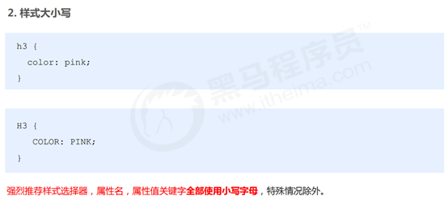
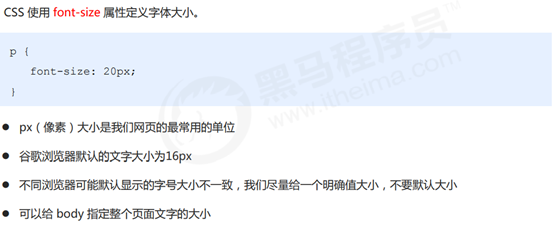
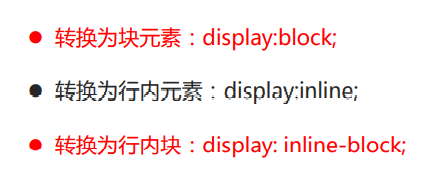
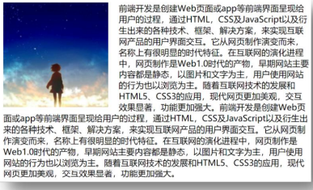

## CSS书写顺序


## CSS 语法规范

​		CSS：层叠样式表（Cascading style sheets


1.选择器是用于指定 CSS 样式的 HTML 标签，花括号内是对该对象设置的具体样式

2.属性和属性值以“键值对”的形式出现

3.属性是对指定的对象设置的样式属性，例如字体大小、文本颜色等

4.属性和属性值之间用英文“##”分开

5.多个“键值对”之间用英文“;”进行区分


###  1.2代码风格





## 1.CSS 引入方式

按照 CSS 样式书写的位置（或者引入的方式），CSS 样式表可以分为三大类：


## 2.基础选择器


### 1.标签选择器


### 2.类选择器

如果想要差异化选择不同的标签，单独选一个或者某几个标签，可以使用类选择器.

类选择器在 HTML 中以 class 属性表示，在 CSS 中，类选择器以一个点“.”号显示。


① 类选择器使用“.”（英文点号）进行标识，后面紧跟类名（自定义，我们自己命名的）。 

② 可以理解为给这个标签起了一个名字，来表示。 


命名规范

1.类名可以由数字、字母、下划线、中划线组成，但不能以数字或者中划线开头

2.命名要有意义，尽量使别人一眼就知道这个类名的目的。 

3.不要使用纯数字、中文等命名，尽量使用英文字母来表示。

4..长名称或词组可以使用中横线来为选择器命名。

3. 一个标签可以同时有多个类名，类名之间以空格隔开
4. 类名可以重复，一个类选择器可以同时选中多个标签 

#### 类选择器-多类名

我们可以给一个标签指定多个类名，从而达到更多的选择目的。 这些类名都可以选出这个标签.
简单理解就是一个标签有多个名字.


(1) 在标签class 属性中写 多个类名

(2) 多个类名中间必须用空格分开

(3) 这个标签就可以分别具有这些类名的样式

 

 简单理解：就是给某个标签添加了多个类，或者这个标签有多个名字

 这个标签就可以分别具有这些类名的样式

 从而节省CSS代码,统一修改也非常方便.

 多类名选择器在后期布局比较复杂的情况下，还是较多使用的


多类名开发中使用场景 

(1) 可以把一些标签元素相同的样式(共同的部分)放到一个类里面. 

(2) 这些标签都可以调用这个公共的类,然后再调用自己独有的类.

(3) 从而节省CSS代码,统一修改也非常方便.

### 3.id 选择器

id 选择器可以为标有特定 id 的 HTML 元素指定特定的样式。 

HTML 元素以 id 属性来设置 id 选择器，CSS 中 id 选择器以“#" 来定义。

```
#id属性值 {
	css属性名：属性值；
}
```


id 选择器和类选择器的区别

① 类选择器（class）好比人的名字，一个人可以有多个名字，同时一个名字也可以被多个人使用。

② id 选择器好比人的身份证号码，全中国是唯一的，不得重复。

③ id 选择器和类选择器最大的不同在于使用次数上。

④ 类选择器在修改样式中用的最多，id 选择器一般用于页面唯一性的元素上，经常和 JavaScript 搭配使用。

### 4.通配符选择器

在 CSS 中，通配符选择器使用“*”定义，它表示选取页面中所有元素（标签）。

```
* {
	css属性名：属性值；
   } 
```


## 3.CSS 字体属性

CSS Fonts (字体)属性用于定义字体系列、大小、粗细、和文字样式（如斜体）。


### 1 字体系列font-family


### 2 字体大小font-size



### 3字体粗细font-weight


### 4 文字样式font-style（字体倾斜）


### 5 字体复合属性font


​	font-style与font-weight可以换位置

## 4.CSS 文本属性—-第一天结束

CSS Text（文本）属性可定义文本的外观，比如文本的颜色、对齐文本、装饰文本、文本缩进、行间距等。


### 1 文本颜色


### 2 对齐文本


### 3 装饰文本


### 4 文本缩进


### 5 行间距


取值：
	• 数字+px
	• 倍数（当前标签font-size的倍数）

**应用**

1. 让单行文本垂直居中可以设置 line-height : 文字父元素高度
2. 网页精准布局时，会设置 line-height : 1 可以取消上下间距

行高与font连写：
• 如果同时设置了行高和font连写，注意覆盖问题
• font : style weight size/line-height family 

## 5.复合选择器

在 CSS 中，可以根据选择器的类型把选择器分为基础选择器和复合选择器，复合选择器是建立在基础选择器之上，对基本选择器进行组合形成的。

- 复合选择器可以更准确、更高效的选择目标元素（标签）

- 复合选择器是由两个或多个基础选择器，通过不同的方式组合而成的


常用的复合选择器包括：后代选择器、子选择器、并集选择器、交集选择器、伪类选择器等等


### 1后代选择器


### 2子选择器


### 3并集选择器


并集选择器中的每组选择器通常一行写一个，提高代码的可读性

### 4交集选择器

```
选择器1选择器2 { css }
```

（既又原则）找到页面中 既 能被选择器1选中，又 能被选择器2选中的标签，设置样式

注意点：
1. 交集选择器中的选择器之间是紧挨着的，没有东西分隔
2. 交集选择器中如果有标签选择器，标签选择器必须写在最前面

### 5链接伪类选择器

伪类选择器用于向某些选择器添加特殊的效果，比如给链接添加特殊效果，或选择第1个，第n个元素。

伪类选择器书写最大的特点是用冒号（:）表示，比如 :hover 、 :first-child 。


```
	/* 未访问 */
    a:link{
      color: red;
    }
    /* 访问过的 */
    a:visited{
      color: rgb(44, 88, 168);
    }
    /* 鼠标放上去效果 */
    a:hover{
      font-size: 20px;
    }
    /* 点击时效果 */
    a:active{
      font-size: 30px;
      color: orange;
    }
```

a:visited因为浏览器安全可能不生效

#### a:hover 最常用

hover可作用到任何元素

#### :focus 伪类选择器

:focus伪类选择器用于选取获得焦点的表单元素。
焦点就是光标，一般情况 <i><</i>input> 类表单元素才能获取，因此这个选择器也主要针对于表单元素来说。

```
input:focus{
	background-color:yellow;
}

```


## 6. 元素显示模式

元素显示模式就是元素（标签）以什么方式进行显示，比如自己占一行，比如一行可以放多个个<i><</i>span>。

HTML 元素一般分为块元素和行内元素两种类型。


### 元素显示模式转换

特殊情况下，我们需要元素模式的转换，简单理解：

 一个模式的元素需要另外一种模式的特性比如想要增加链接 <i><</i>a> 的触发范围。



一个小技巧 单行文字垂直居中的代码

: 让文字的行高等于盒子的高度 就可以让文字在当前盒子内垂直居中

## 7.背景—-第二天结束

通过 CSS 背景属性，可以给页面元素添加背景样式。
背景属性可以设置背景颜色、背景图片、背景平铺、背景图片位置、背景图像固定等。


### 1背景颜色


### 2 背景图片


```
背景图片可以通过：
 background-size: x大小，大小;
 进行控制
 例：
 background-size: 400px 400px;
```


### 3 背景平铺


### 4 背景图片位置


### 5 背景图像固定（背景附着）


### 6 背景复合写法


### 7 背景色半透明


### 行内块元素缝隙问题

```
 body {
            /* 行内块元素缝隙问题 给父元素添加font-size 0  */
            font-size: 0;
        }
```


## 8.CSS 的三大特性.

CSS 有三个非常重要的三个特性：层叠性、继承性、优先级。

### 8.1层叠性


### 8.2继承性


### 8.3优先级


## 9. CSS盒子模型----第三天结束

页面布局要学习三大核心, 盒子模型, 浮动 和 定位. 

学习好盒子模型能非常好的帮助我们布局页面.

### 1 盒模型认知


####     盒子模型（Box Model）组成 


### 2   边框（border）


CSS 边框属性允许你指定一个元素边框的样式和颜色。


####    表格的细线边框


#### 边框会影响盒子实际大小


### 3内边距（padding）


#### padding不会撑大盒子的特殊情况

1. 如果子盒子没有设置宽度，此时宽度默认是父盒子的宽度
2. 此时给子盒子设置左右的padding或者左右的border，此时不会撑大子盒子

#### 行内元素的margin和padding无效情况

 场景：给行内元素设置margin和padding时
结果：

1. 水平方向的margin和padding布局中有效！
2. 垂直方向的margin和padding布局中无效！

可以给行内元素加左右边距

### 4 外边距（margin）


#### 外边距塌陷


####  清除内外边距


### 5Css3盒模型

#### 1. Css3盒模型

CSS3 中可以通过 box-sizing 来指定盒模型，有2个值：

即可指定为 content-box、border-box，这样我们计算盒子大小的方式就发生了改变。

如果盒子模型我们改为了box-sizing: border-box ， 那padding和border就不会撑大盒子了（前提padding
和border不会超过width宽度）

可以分成两种情况：
1. box-sizing: content-box 盒子大小为 width + padding + border （以前默认的）

2. box-sizing: border-box 盒子大小为 width

   

只需在盒子中加入：

```
box-sizing : border-box
```

可以

```
*{
	box-sizing : border-box
}
```


#### 圆角边框


#### 盒子阴影box-shadow


#### 文字阴影text-shadow


## 10.CSS3特性

CSS3 给我们新增了选择器，可以更加便捷，更加自由的选择目标元素。
1. 属性选择器

2. 结构伪类选择器

3. 伪元素选择器

   

   注意：类选择器、属性选择器、伪类选择器，权重为 10。

### 属性选择器

属性选择器可以根据元素特定属性的来选择元素。 这样就可以不用借助于类或者id选择器。


### 结构伪类选择器

结构伪类选择器主要根据文档结构来选择器元素， 常用于根据父级选择器里面的子元素


nth-child（n） 选择某个父元素的一个或多个特定的子元素（重点）

 n 可以是数字，关键字和公式
 n 如果是数字，就是选择第 n 个子元素， 里面数字从1开始…
 n 可以是关键字：even 偶数，odd 奇数
 n 可以是公式：常见的公式如下 ( 如果n是公式，则从0开始计算，但是第 0 个元素或者超出了元素的个数会被忽略 )


 区别：

1. nth-child 对父元素里面所有孩子排序选择（序号是固定的） 先找到第n个孩子，然后看看是否和E匹配
2. nth-of-type 对父元素里面指定子元素进行排序选择。 先去匹配E ，然后再根据E 找第n个孩子

小结

结构伪类选择器一般用于选择父级里面的第几个孩子
 nth-child 对父元素里面所有孩子排序选择（序号是固定的） 先找到第n个孩子，然后看看是否和E匹配
nth-of-type 对父元素里面指定子元素进行排序选择。 先去匹配E ，然后再根据E 找第n个孩子
关于 nth-child（n） 我们要知道 n 是从 0 开始计算的，要记住常用的公式
如果是无序列表，我们肯定用 nth-child 更多
类选择器、属性选择器、伪类选择器，权重为 10。

### 伪元素选择器（重点）

伪元素选择器可以帮助我们利用CSS创建新标签元素，而不需要HTML标签，从而简化HTML结构。


注意：

before 和 after 创建一个元素，但是属于行内元素
 新创建的这个元素在文档树中是找不到的，所以我们称为伪元素

```
语法： 
element::before {
			content:"" 
} 
```


 before 和 after 必须有 content 属性

 before 在父元素内容的前面创建元素，after 在父元素内容的后面插入元素
 伪元素选择器和标签选择器一样，权重为 1


## 11.浮动

### 浮动的作用

早期的作用：图文环绕



现在的作用：网页布局


​	一行水平显示多个块等

垂直居中 水平居中 等使用：行内块 


### 浮动的使用


### 浮动特性：

​        1.浮动后具有行内块元素特征，

​			1一行多个，且没有缝隙，

​            2可设置宽高

​            3默认大小由内容撑开

​        2.脱标 

​              1高出标准流半个级别，可以覆盖标准流，不能覆盖文字，行内元素，行内块

​              2浮动找浮动

​              3顶部对齐

​              4自动换行

​              5不占位

​              6只影响后面的标准流，不影响前面、且会受到上边元素影响

​        3.一般使用会搭配标准流父盒子

#### 注意点：

  0.浮动的元素不能通过text-align:center或者margin:0 auto，让浮动元素本身水平居中

1. 浮动和标准流的父盒子搭配。
    先用标准流的父元素排列上下位置, 之后内部子元素采取浮动排列左右位置
    2.2 浮动布局注意点

2. 一个元素浮动了，理论上其余的兄弟元素也要浮动。
    一个盒子里面有多个子盒子，如果其中一个盒子浮动了，那么其他兄弟也应该浮动，以防止引起问题。
    浮动的盒子只会影响浮动盒子后面的标准流,不会影响前面的标准流.

  

### 传统网页布局的三种方式

网页布局的本质——用 CSS 来摆放盒子。 把盒子摆放到相应位置.
1.1 传统网页布局的三种方式
CSS 提供了三种传统布局方式(简单说,就是盒子如何进行排列顺序)：
普通流（标准流）
 浮动
 定位

####  标准流

所谓的标准流: 就是标签按照规定好默认方式排列.

1. 块级元素会独占一行，从上向下顺序排列。
   常用元素：div、hr、p、h1~h6、ul、ol、dl、form、table

2. 行内元素会按照顺序，从左到右顺序排列，碰到父元素边缘则自动换行。
   常用元素：span、a、i、em 等
    1.2 标准流（普通流/文档流）
    以上都是标准流布局，我们前面学习的就是标准流，标准流是最基本的布局方式。
    这三种布局方式都是用来摆放盒子的，盒子摆放到合适位置，布局自然就完成了。

  

注意：实际开发中，一个页面基本都包含了这三种布局方式（后面移动端学习新的布局方式） 。

### 常见网页布局


### 清除浮动

含义：清除浮动带来的影响
• 影响：如果子元素浮动了，此时子元素不能撑开标准流的块级父元素
Ø 原因：
• 子元素浮动后脱标 → 不占位置
Ø 目的：
• 需要父元素有高度，从而不影响其他网页元素的布


#### 清除浮动本质

清除浮动的本质是清除浮动元素造成的影响
 如果父盒子本身有高度，则不需要清除浮动
 清除浮动之后，父级就会根据浮动的子盒子自动检测高度。父级有了高度，就不会影响下面的标准流了


#### 清除浮动方法

##### 额外标签法也称为隔墙法，是 W3C 推荐的做法。

 优点： 通俗易懂，书写方便

 缺点： 添加许多无意义的标签，结构化较差

```
   /*额外标签法，在最后一个浮动元素后面加一个块元素，
        然后给这个元素添加Css  {clear:both}*/
        
      .clear {
        /* 清除浮动核心代码 */
        clear: both;
      }
```

​		注：这个元素必须是块级元素

#####  :after 伪元素法

优点：没有增加标签，结构更简单
 缺点：照顾低版本浏览器
 代表网站： 百度、淘宝网、网易等

```
 .clearfix::after{
        content: "";
        display: block;
        clear: both;
        line-height: 0;
        font-size: 0;
        visibility: hidden;
      }
      .clearfix {
        *zoom: 1;
      }
```

##### 双伪元素清除法

优点:项目中使用，直接给标签加类即可清除浮动

```
.clearfix::before,
      .clearfix::after{
        content: "";
        display: table;
        
        line-height: 0;
        font-size: 0;
        visibility: hidden;
      }
      .clearfix::after{
        clear: both;
      }
      .clearfix {
        *zoom: 1;
      }
```


##### 清除浮动 —— 父级添加 overflow

优点：方便

```
直接给父元素设置 overflow : hidden
```


####  清除浮动总结


### BFC（拓展补充）

块格式化上下文（Block Formatting Context）：BFC

• 是Web页面的可视CSS渲染的一部分，是块盒子的布局过程发生的区域，也是浮动元素与其他元素交互的区域。

Ø 创建BFC方法：

1. html标签是BFC盒子
2. 浮动元素是BFC盒子
3. 行内块元素是BFC盒子
4. overflow属性取值不为visible。如：auto、hidden…
5. ……
Ø BFC盒子常见特点：
1. BFC盒子会默认包裹住内部子元素（标准流、浮动）→ 应用：清除浮动
2. BFC盒子本身与子元素之间不存在margin的塌陷现象 → 应用：解决margin的塌陷
3. ……

# 11CSS 定位


1.1  为什么需要定位


1.1  
定位组成


1.3 静态定位 static（了解）


1.1  
相对定位 relative（重要）


1.5绝对定位 absolute（重要）


1.6 子绝父相的由来


1.7 固定定位 fixed （重要）


1.8 粘性定位 sticky（了解）


1.10 定位叠放次序 z-index


1.11 定位的拓展


3. 网页布局总结


# 4. 元素的显示与隐藏


