# 1.HTML 语法规范

## 1.基本语法概述

1. HTML 标签是由尖括号包围的关键词，例如 <-html>

2. HTML 标签通常是成对出现的，例如 <-html>和 <-/html>，我们称为双标签。标签对中的第一个标签是开始标签，第二个标签是结束标签

3. 有些特殊的标签必须是单个标签（极少情况），例如 <-br/>我们称为单标签。

4. 双标签关系可以分为两类：包含关系和并列关系。

   包含关系 ：      <-head> 

   ​                                 <-title> <-/title> 

   ​							<-/head>

   并列关系：       <-head> <-/head>

   ​							<-body> <-/body>

 

## 2.基本的结构标签（为骨架标签）

页面内容也是在这些基本标签上书写。 HTML页面也称为 HTML 文档.

 

HTML 文档的的后缀名必须是 .html 或 .htm ，浏览器的作用是读取 HTML 文档，并以网页的形式显示出它们。 此时，用浏览器打开这个网页，我们就可以预览我们写的第一个 HTML 文件了。

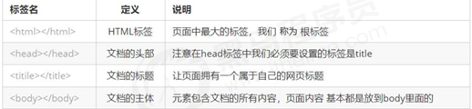

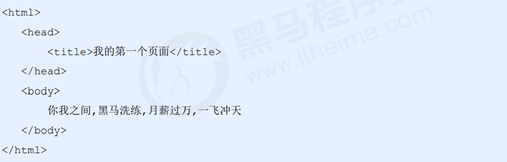

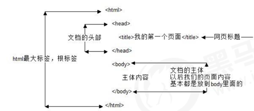

```html
<-!DOCTYPE html>文档类型声明标签,告诉浏览器这个页面采取html5版本来显示页面.
				1. 声明位于文档中的最前面的位置，处于 标签之前。
 				2. 不是一个 HTML 标签，它就是 文档类型声明标签。
<-html lang="en">告诉浏览器或者搜索引擎这是一个英文网站. 本页面采取英文来显示
				en定义语言为英语 2. zh-CN定义语言为中文
<-head>
 <-meta charset="UTF-8">必须写. 采取 UTF-8来保存文字. 如果不写就会乱码
			UTF-8 也被称为万国码，基本包含了全世界所 有国家需要用到的字符
    <-meta http-equiv="X-UA-Compatible" content="IE=edge">
    <-meta name="viewport" content="width=device-width, initial-scale=1.0">
    <-title>1111t<-/title>
<-/head>
<-body>
    1111111
<-/body>
<-/html>

```

# 2.HTML 常用标签上

## 1.标题标签 <- h1>-<- h6>重要

为了使网页更具有语义化，我们经常会在页面中用到标题标签。HTML 提供了 6 个等级的网页标题， 即<-h1>-<-h6>
单词 head 的缩写，意为头部、标题。

1. 加了标题的文字会变的加粗，字号也会依次变大。 
2. 一个标题独占一行。
例：
```
<-h1>标题一共六级选,<-/h1>
<-h2>文字加粗一行显。<-/h2>
<-h3>由大到小依次减，<-/h3>
<-h4>从重到轻随之变。<-/h4>
<-h5>语法规范书写后，<-/h5>
<-h6>具体效果刷新见。<-/h6>
```

 ------pink老师

## 2.段落<- p><- /p>和换行标签<- br />（重要）

paragraph [ˈpærəgræf] 的缩写，意为段落。

在网页中，要把文字有条理地显示出来，就需要将这些文字分段显示。

在 HTML 标签中，<-p>标签用于定义段落，它可以将整个网页分为若干个段落

1. 文本在一个段落中会根据浏览器窗口的大小自动换行。 

2.  段落和段落之间保有空隙。

如果希望某段文本强制换行显示，就需要使用换行标签 <- br />。

1. 是个单标签。 

2. 标签只是简单地开始新的一行，跟段落不一样，段落之间会插入一些垂直的间距。

 

## 3.文本格式化标签

在网页中，有时需要为文字设置粗体、斜体 或下划线等效果，这时就需要用到 HTML 中的文本格式化标签，使 文字以特殊的方式显示。

标签语义: 突出重要性, 比普通文字更重要


## 4.<- div>和<- span>标签（盒子）

<- div>和 <- span>是没有语义的，它们就是一个盒子，用来装内容的。

```html
<-div>这是头部<-/div>
<-Span>今日价格<-/Span>
```

div 是 division 的缩写，表示分割、分区。

span 意为跨度、跨距。

特点：

1. <- div> 标签用来布局，但是现在一行只能放一个<- div>。 大盒子

2. <- span> 标签用来布局，一行上可以多个 <- span>。小盒子

## 5.<- img>（图片）

在 HTML 标签中，<- img>标签用于定义 HTML 页面中的图像。

```
<-img src="url地址"/>
```

单词 image 的缩写，意为图像。

src 是<- img>标签的必须属性，它用于指定图像文件的路径和文件名。 

所谓属性：简单理解就是属于这个图像标签的特性。

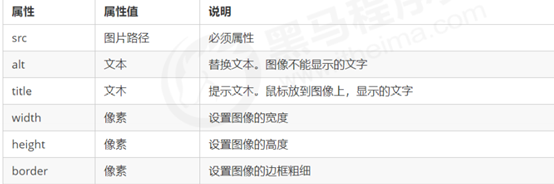

① 图像标签可以拥有多个属性，必须写在标签名的后面。

 ② 属性之间不分先后顺序，标签名与属性、属性与属性之间均以空格分开。 

③ 属性采取键值对的格式，即 key=“value" 的格式，属性 =“属性值”。

###  路径问题:

目录文件夹：就是普通文件夹，里面只不过存放了我们做页面所需要的相关素材，比如 html 文件、图片等。 

根目录：打开目录文件夹的第一层就是根目录                  

1. 相对路径 

以引用文件所在位置为参考基础，而建立出的目录路径。

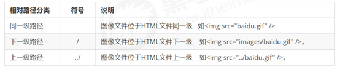

2. 绝对路径                

是指目录下的绝对位置，直接到达目标位置，通常是从盘符开始的路径。 

例如，“D:\web\img\logo.gif”或完整的网络地址“http://www.itcast.cn/images/logo.gif”。

## 6.<- a>超链接标签 (重点）

### 1.语法格式

在 HTML 标签中<-a>标签用于定义超链接，作用是从一个页面链接到另一个页面。

```
<-a herf="跳转目标" target="目标窗口弹出方式">文本或者图像<-/a>
```

单词 anchor [ˈæŋkə(r)] 的缩写，意为：锚。

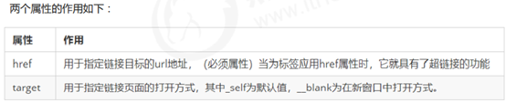

### 2.链接分类：

1. 外部链接: 例如 <- a href="http:// www.baidu.com "> 百度<- /a >。

2. 内部链接:网站内部页面之间的相互链接. 直接链接内部页面名称即可，

​         例如 <- a href="index.html"> 首页 <- /a >。

3. 空链接: 如果当时没有确定链接目标时，<- a href="#"> 首页 <- /a > 。

4. 下载链接: 如果 href 里面地址是一个文件或者压缩包，会下载这个文件。

5. 网页元素链接: 在网页中的各种网页元素，如文本、图像、表格、音频、视频等都可以添加超链接.

6. 锚点链接: 我们点击链接,可以快速定位到页面中的某个位置. 

​          在链接文本的 href 属性中，设置属性值为 #名字 的形式，如<- a href="#two"> 第2集 <- /a>

​          找到目标位置标签，里面添加一个 id 属性 = 刚才的名字 ，如：<- h3 id="two">第2集介绍<- /h3>

## 7.注释和特殊字符

注释：HTML中的注释以“<-!--”开头，以“ -->”结束。

 

特殊字符                                     

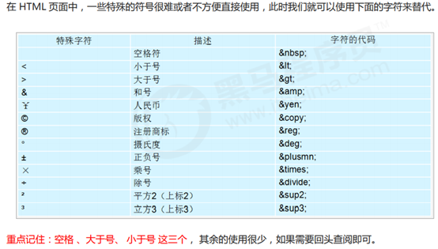

# 3.HTML 常用标签下

## 1.表格

表格主要用于显示、展示数据，因为它可以让数据显示的非常的规整，可读性非常好。

表格不是用来布局页面的,而是用来展示数据的.

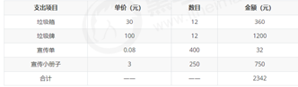

### 2.表格结构标签

使用场景:因为表格可能很长,为了更好的表示表格的语义，可以将表格分割成 表格头部和表格主体两大部分.

在表格标签中，分别用：

<- thead>标签 表格的头部区域、

<- tbody>标签表格的主体区域. 这样可以更好的分清表格结构。

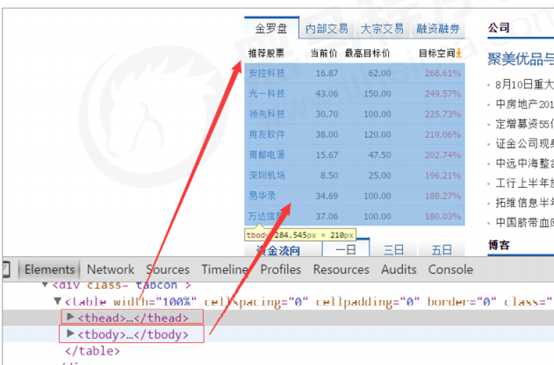

1. <- thead><- /thead>：用于定义表格的头部。<- thead> 内部必须拥有 <- tr> 标签。 一般是位于第一行。

2. <- tbody><- /tbody>：用于定义表格的主体，主要用于放数据本体 。

3. 以上标签都是放在 <- table><- /table> 标签中。

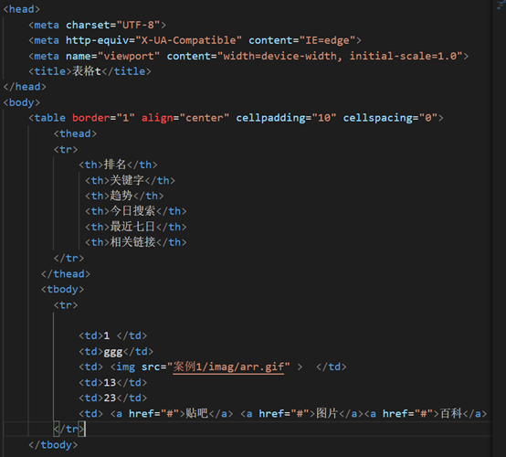

### 3 表格的基本语法

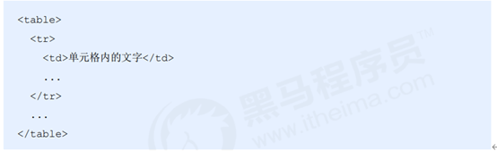

1. <-table> <-/table> 是用于定义表格的标签。

2. <- tr> <- /tr> 标签用于定义表格中的行，必须嵌套在 <- table> <- /table>标签中。

3. <- td> <- /td> 用于定义表格中的单元格，必须嵌套在<- tr><- /tr>标签中。
4. 字母 td 指表格数据（table data），即数据单元格的内容。

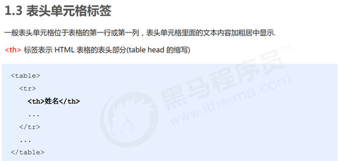

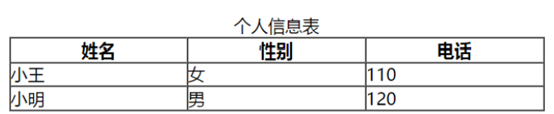

表头单元格也是单元格, 常用于表格第一行, 突出重要性, 表头单元格里面的文字会加粗居中显示.

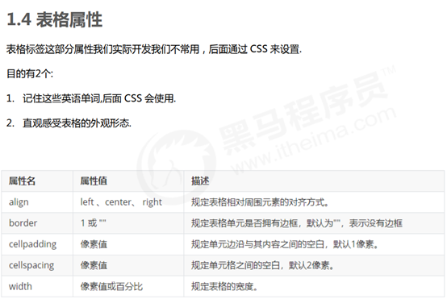

### 6合并单元格

特殊情况下,可以把多个单元格合并为一个单元格, 这里同学们会最简单的合并单元格即可

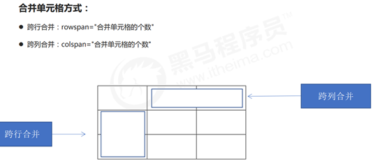

目标单元格：(写合并代码)

 跨行：最上侧单元格为目标单元格, 写合并代码

 跨列：最左侧单元格为目标单元格, 写合并代码

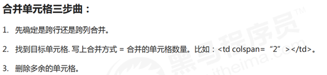

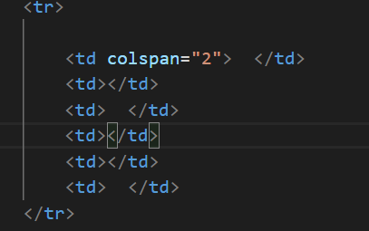

## 2.列表标签

列表就是用来布局的。

列表最大的特点就是整齐、整洁、有序，它作为布局会更加自由和方便。 根据使用情景不同，列表可以分为三大类：无序列表、有序列表和自定义列表。

#### 1 .无序列表ul（重点）

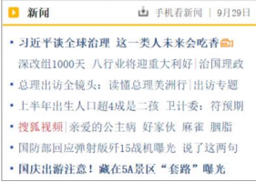

<- ul> 标签表示 HTML 页面中项目的无序列表，一般会以项目符号呈现列表项，而列表项使用 <- li> 标签定义。

 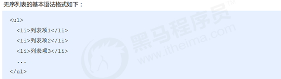

1. 无序列表的各个列表项之间没有顺序级别之分，是并列的。

2. <- ul><- /ul> 中只能嵌套 <- li><- /li>，直接在 <- ul><- /ul> 标签中输入其他标签或者文字的做法是不被允许的。

3. <- li> 与 <- /li> 之间相当于一个容器，可以容纳所有元素。
4. 无序列表会带有自己的样式属性，但在实际使用时，我们会使用 CSS 来设置。

#### 2 .有序列表（理解）


有序列表即为有排列顺序的列表，其各个列表项会按照一定的顺序排列定义。

在 HTML 标签中，<- ol> 标签用于定义有序列表，列表排序以数字来显示，并且使用 <- li> 标签来定义列表项。

 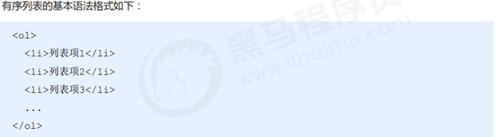

1. <- ol><- /ol>中只能嵌套<- li><- /li>，直接在<- ol><- /ol>标签中输入其他标签或者文字的做法是不被允许的。

2. <- li> 与 <- /li>之间相当于一个容器，可以容纳所有元素。

3. 有序列表会带有自己样式属性，但在实际使用时，我们会使用 CSS 来设置。

#### 3 .自定义列表（重点）

自定义列表的使用场景: 自定义列表常用于对术语或名词进行解释和描述，定义列表的列表项前没有任何项目符号

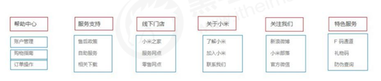

在 HTML 标签中，<-dl> 标签用于定义描述列表（或定义列表），该标签会与
<-dt>（定义项目/名字）和<-dd>（描述每一个项目/名字）一起使用。

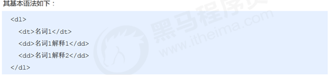

1. <- dl><- /dl> 里面只能包含 <- dt> 和 <- dd>。

2. <-dt> 和 <-dd>个数没有限制，经常是一个<-dt> 对应多个<-dd>。

## 3.表单标签

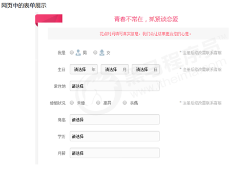

为什么需要表单:

使用表单目的是为了收集用户信息。 

在我们网页中， 我们也需要跟用户进行交互，收集用户资料，此时就需要表单。

表单的组成:

在 HTML 中，一个完整的表单通常由表单域、表单控件（也称为表单元素）和 提示信息3个部分构成。

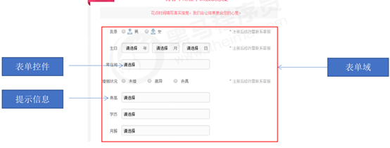

#### 1.表单域

表单域是一个包含表单元素的区域。

在 HTML 标签中， <-form> 标签用于定义表单域，以实现用户信息的收集和传递。

<-form> 会把它范围内的表单元素信息提交给服务器.

 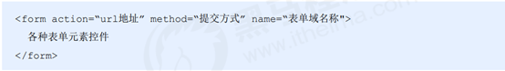

​                                                  

   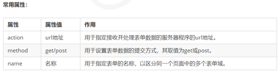

   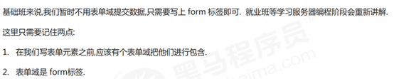

#### 3.3.2表单元素

在表单域中可以定义各种表单元素，这些表单元素就是允许用户在表单中输入或者选择的内容控件。

 

1. 表单元素我们学习了三大组 input 输入表单元素 select 下拉表单元素 textarea 文本域表单元素. 

2. 下面三组表单元素都应该包含在form表单域里面,并且有 name 属性

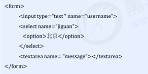

##### 1.<- input>输入表单元素

在英文单词中，input 是输入的意思，而在表单元素中 <-input> 标签用于收集用户信息。


##### 2<- label> 标签

<-label> 标签为 input 元素定义标注（标签）。

<-label> 标签用于绑定一个表单元素, 当点击<-label> 标签内的文本时，浏览器就会自动将焦点(光标)转到或者

选择对应的表单元素上,用来增加用户体验

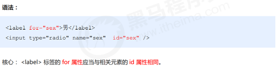

##### 2. <- select> 下拉表单元素

使用场景: 在页面中，如果有多个选项让用户选择，并且想要节约页面空间时，我们可以使用<-select>标签控件定义下sub拉列表。

 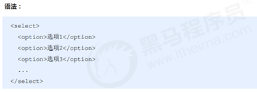

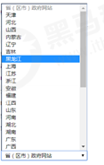

1. <- select> 中至少包含一对<- option> 。

2. 在<- option> 中定义 selected =“ selected " 时，当前项即为默认选中项

##### 3. <- textarea> 文本域元素

使用场景: 当用户输入内容较多的情况下，我们就不能使用文本框表单了，此时我们可以使用 <- textarea> 标签。

在表单元素中，<- textarea> 标签是用于定义多行文本输入的控件。

使用多行文本输入控件，可以输入更多的文字，该控件常见于留言板，评论。

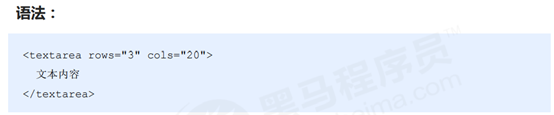

1. 通过 <- textarea> 标签可以轻松地创建多行文本输入框。

2. cols=“每行中的字符数” ，rows=“显示的行数”，我们在实际开发中不会使用，都是用 CSS 来改变大小。

# HTML5 的新特性

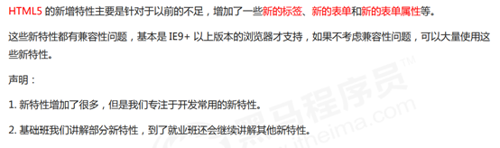


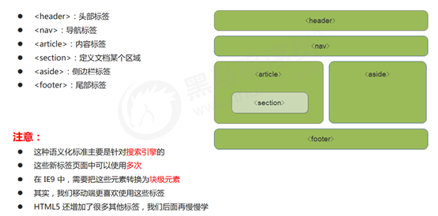

## HTML5 新增的多媒体标签

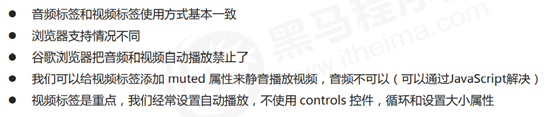

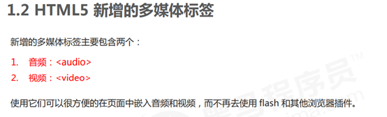

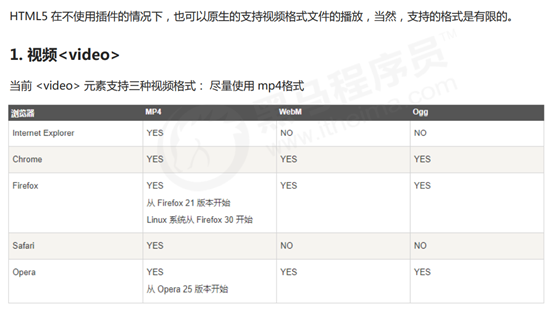

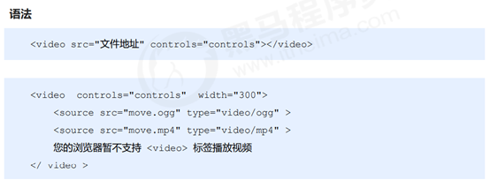


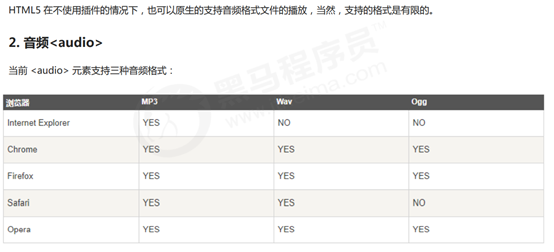

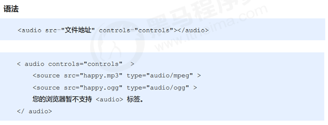

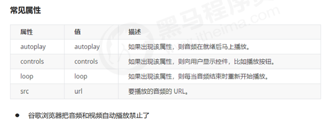

## 1.3 HTML5 新增的 input 类型


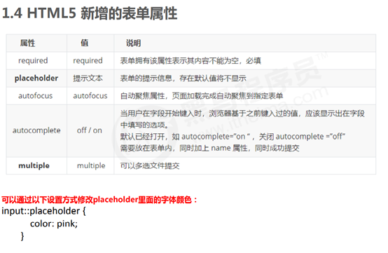

# 学习网站：

## 百度: http://www.baidu.com

## W3C : http://www.w3school.com.cn/

## MDN:https://developer.mozilla.org/zh-CN
