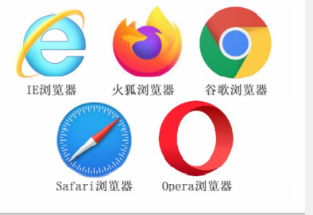

## 基础认知

### 五大浏览器

IE浏览器、火狐浏览器（Firefox）、谷歌浏览器（Chrome）、Safari浏览器、欧朋浏览器（Opera



### 渲染引擎


渲染引擎（浏览器内核）：浏览器中专门对代码进行解析渲染的部分
Ø 浏览器出品的公司不同，内在的渲染引擎也是不同的

注意点：
• 渲染引擎不同，导致解析相同代码时的 速度、性能、效果也不同的
• 谷歌浏览器的渲染引擎速度快、性能高、效果好，所以更吸引用户的喜爱（推荐）

### HTML的概念

HTML（Hyper Text Markup Language）中文译为：超文本标记语言
Ø 专门用于网页开发的语言，主要通过HTML标签对网页中的文本、图片、音频、视频等内容进行描述

### Web标准的构成

不同浏览器的渲染引擎不同，对于相同代码解析的效果会存在差异
• 如果用户想看一个网页，结果用不同浏览器打开效果不同，用户体验极差！
Ø Web标准：让不同的浏览器按照相同的标准显示结果，让展示的效果统一！


## 1.HTML 语法规范


### 1.基本语法概述


1. HTML 标签是由尖括号包围的关键词，例如<i><</i>html>

2. HTML 标签通常是成对出现的，例如 <i><</i>html>和 <i><</i>/html>，我们称为双标签。标签对中的第一个标签是开始标签，第二个标签是结束标签

3. 有些特殊的标签必须是单个标签（极少情况），例如 <i><</i>br/>我们称为单标签。

4. 双标签关系可以分为两类：包含关系和并列关系。

   
   ```js
   包含关系（父子关系） ：
            <head>
               <title> </title> 
			   </head>
   
   并列关系（兄弟关系）：  
            <head> </head>
   		   <body> </body>
   
   ```

### 2. HTML标签的属性


```js
若出现 controls="controls" 属性名与属性值相同情况可简写 =>controls
例： 
	简写前 <video src="./media/video.mp4" controls="controls" >
	简写后 <video src="./media/video.mp4" controls >
```


1. 标签的属性写在开始标签内部
2. 标签上可以同时存在多个属性
3. 属性之间以空格隔开
4. 标签名与属性之间必须以空格隔开
5. 属性之间没有顺序之分

### 3.基本的结构标签（为骨架标签）

页面内容也是在这些基本标签上书写。 HTML页面也称为 HTML 文档.

HTML 文档的的后缀名必须是 .html 或 .htm ，浏览器的作用是读取 HTML 文档，并以网页的形式显示出它们。 此时，用浏览器打开这个网页，我们就可以预览我们写的第一个 HTML 文件了。


```html
<html>
	<head>
		<title>第一个html页面</title>
	</head>
	<body>
		这是一个寂寞的天，下着有些伤心的雨
	</body>
</html>
```


```html
<!DOCTYPE html>文档类型声明标签,告诉浏览器这个页面采取html5版本来显示页面.
				1. 声明位于文档中的最前面的位置，处于 标签之前。
 				2. 不是一个 HTML 标签，它就是 文档类型声明标签。
<html lang="en">告诉浏览器或者搜索引擎这是一个英文网站. 本页面采取英文来显示
				en定义语言为英语 2. zh-CN定义语言为中文
<head>
    <meta charset="UTF-8">必须写. 采取 UTF-8来保存文字. 如果不写就会乱码
			UTF-8 也被称为万国码，基本包含了全世界所 有国家需要用到的字符
    <meta http-equiv="X-UA-Compatible" content="IE=edge">
    <meta name="viewport" content="width=device-width, initial-scale=1.0">
    <title>1111t</title>
</head>
<body>
    1111111
</body>
</html>

```

### 4.注释和特殊字符

注释：HTML中的注释以“<i><</i>!--”开头，以“ -->”结束。

```JS
<!-- 注释语句-->
 快捷键： Ctrl + /
```


特殊字符                                     


## 2.HTML 排版标签

### 1.标题标签 <i><</i> h1>-<i><</i> h6>重要

为了使网页更具有语义化，我们经常会在页面中用到标题标签。HTML 提供了 6 个等级的网页标题， 即<i><</i>h1>-<i><</i>h6>

单词 head 的缩写，意为头部、标题。

1. 加了标题的文字会变的加粗，字号也会依次变大。 

2. 一个标题独占一行。

3. h1-h6重要性依次递减

  例：
```
<h1>标题一共六级选, </h1>
<h2>文字加粗一行显。</h2>
<h3>由大到小依次减，</h3>
<h4>从重到轻随之变。</h4>
<h5>语法规范书写后，</h5>
<h6>具体效果刷README见。</h6>
------pink老师
```

 

### 2.段落<i><</i> p><i><</i> /p>

paragraph [ˈpærəgræf] 的缩写，意为段落。

在网页中，要把文字有条理地显示出来，就需要将这些文字分段显示。

在 HTML 标签中，<i><</i>p>标签用于定义段落，它可以将整个网页分为若干个段落

1. 文本在一个段落中会根据浏览器窗口的大小自动换行。 

2.  段落和段落之间保有空隙。

###  3.<</i> br />换行，<</i> hr />横线

如果希望某段文本强制换行显示，就需要使用换行标签 <i><</i> br />。

1. <i><</i> br />是个单标签。 

2. <i><</i> br />标签只是简单地开始README的一行，跟段落不一样，段落之间会插入一些垂直的间距。

   

分割不同主题内容的水平线

​	1.<</i> hr />单标签
​	2.在页面中显示一条水平

## 3.文本格式化标签

在网页中，有时需要为文字设置粗体、斜体 或下划线等效果，这时就需要用到 HTML 中的文本格式化标签，使 文字以特殊的方式显示。

标签语义: 突出重要性, 比普通文字更重要


## 4.媒体标签

### 1.<i><</i> img>（图片）

在 HTML 标签中，<i><</i> img>标签用于定义 HTML 页面中的图像。

```

```

单词 image 的缩写，意为图像。

src 是<i><</i> img>标签的必须属性，它用于指定图像文件的路径和文件名。 

所谓属性：简单理解就是属于这个图像标签的特性。


1. 图像标签可以拥有多个属性，必须写在标签名的后面。

2. 属性之间不分先后顺序，标签名与属性、属性与属性之间均以空格分开。 

3. 属性采取键值对的格式，即 key=“value" 的格式，属性 =“属性值”。

  4.图像 很少同时设置宽高  设置宽或高会等比例拉伸。

####  路径问题:

目录文件夹：就是普通文件夹，里面只不过存放了我们做页面所需要的相关素材，比如 html 文件、图片等。 

根目录：打开目录文件夹的第一层就是根目录                  

1. 相对路径 

以引用文件所在位置为参考基础，而建立出的目录路径。


​						```		当前目录  ./    ```

2. 绝对路径                

是指目录下的绝对位置，直接到达目标位置，通常是从盘符开始的路径。 

例如，“D:\web\img\logo.gif”或完整的网络地址“http://www.itcast.cn/images/logo.gif”。

### 2.音频，视频标签（H5新增）

```js
视频： <video src="地址" controls autoplay muted loop></video>
音频： <audio src="地址" controls autoplay loop></audio>

```

```js
兼容性写法，很少使用大部分都支持mp4格式，直接使用mp4格式文件.
 <video  controls autoplay muted loop>
        <source src="./media/video.mp4">
        <source src="">
        <source src="">
        <source src="">
        您的浏览器不支持video标签
  </video>
```


- 音频标签和视频标签使用方式基本一致.拥有属性一致.

- 浏览器支持情况不同.

- 谷歌浏览器把音频和视频自动播放禁止了.
- 我们可以给视频标签添加 muted 属性来静音播放视频，音频不可以（可以通过JavaScript解决）.
- 视频标签是重点，我们经常设置自动播放，不使用 controls 控件，循环和设置大小属性.


## 5.<i><</i> a>超链接标签 (重点）


### 1.语法格式

在 HTML 标签中<i><</i>a>标签用于定义超链接，作用是从一个页面链接到另一个页面。

```
<a herf="跳转目标" target="目标窗口弹出方式">文本或者图像</a>
```

单词 anchor [ˈæŋkə(r)] 的缩写，意为：锚。


### 2.链接分类：

1. 外部链接: 例如

   ```
   <a href="http:// www.baidu.com "> 百度<i><</i> /a >
   ```

2. 内部链接:网站内部页面之间的相互链接. 直接链接内部页面名称即可，

   例如 
      ```
      <a href="index.html"> 首页 </a >。
      ```

3. 空链接: 如果当时没有确定链接目标时

   ```
   <a href="#"> 首页 </a > 。
   ```

   

4. 下载链接: 如果 href 里面地址是一个文件或者压缩包，会下载这个文件。

5. 网页元素链接: 在网页中的各种网页元素，如文本、图像、表格、音频、视频等都可以添加超链接.

6. 锚点链接: 我们点击链接,可以快速定位到页面中的某个位置. 
```
1.在链接文本的 href 属性中，设置属性值为 #名字 的形式，
如:
	<a href="#two"> 第2集 </a>
2.找到目标位置标签，里面添加一个 id 属性 = 刚才的名字 ，
如：
	<h3 id="two">第2集介绍</h3>
```


## 6.表格

表格主要用于显示、展示数据，因为它可以让数据显示的非常的规整，可读性非常好。

表格不是用来布局页面的,而是用来展示数据的.


### 1. 表格的基本语法

```HTML
 <table>
     <caption>个人信息表</caption>
        <tr>
            <th>姓名</th>
            <th>性别</th>
            <th>电话</th>
        </tr>
        <tr>
            <td>小王</td>
            <td>女</td>
            <td>110</td>
        </tr>
        <tr>
            <td>小明</td>
            <td>男</td>
            <td>120</td>
        </tr>
  </table>
```


1. <i><</i>table> <i><</i>/table> 是用于定义表格的标签。

2. <i><</i> tr> <i><</i> /tr> 标签用于定义表格中的行，必须嵌套在 <i><</i> table> <i><</i> /table>标签中。

3. <i><</i> td> <i><</i> /td> 用于定义表格中的单元格，必须嵌套在<i><</i> tr><i><</i> /tr>标签中。

    字母 td 指表格数据（table data），即数据单元格的内容。

4. <i><</i> th> <i><</i> /th> 表头单元格  加粗居中 （table hender）

   

   表格属性：

   

### 2.表格结构标签

使用场景:因为表格可能很长,为了更好的表示表格的语义，可以将表格分割成 表格头部和表格主体,表尾.

在表格标签中，分别用：

<i><</i> thead>标签 表格的头部区域、

<i><</i> tbody>标签表格的主体区域. 

<i><</i> tfoot>标签表格的主体区域. 

<i><</i>caption> 表格标题  居中效果.

这样可以更好的分清表格结构。


1. <i><</i> thead><i><</i> /thead>：用于定义表格的头部。<i><</i> thead> 内部必须拥有 <i><</i> tr> 标签。 一般是位于第一行。

2. <i><</i> tbody><i><</i> /tbody>：用于定义表格的主体，主要用于放数据本体 。

3. 以上标签都是放在 <i><</i> table><i><</i> /table> 标签中。

   ```HTML
   <body>
       <!-- thead 表格头部区域 -->
       <!-- tbody 表格主体区域 -->
       <!-- tfoot 表格底部区域 -->
       <!-- caption 表格标题  居中效果-->
       <!-- 如果表格没有写表格结构标签  浏览器会自动生成tbody标签  把所有内容放到tbody里面 -->
       <!-- <h2>我是h标签</h2> -->
       <table border="1" width="350" height="300" align="center" cellspacing="0" cellpadding="20">
           <caption>表格标题</caption>
           <thead>
               <tr>
                   <td>1</td>
                   <td>2</td>
                   <td>3</td>
                   <td>4</td>
                   <td>5</td>
               </tr>
           </thead>
           <tbody>
               <tr>
                   <td>1</td>
                   <td>2</td>
                   <td>3</td>
                   <td>4</td>
                   <td>5</td>
               </tr>
               <tr>
                   <td>1</td>
                   <td>2</td>
                   <td>3</td>
                   <td>4</td>
                   <td>5</td>
               </tr>
               <tr>
                   <td>1</td>
                   <td>2</td>
                   <td>3</td>
                   <td>4</td>
                   <td>5</td>
               </tr>
           </tbody>
           <tfoot>
               <tr>
                   <td>1</td>
                   <td>2</td>
                   <td>3</td>
                   <td>4</td>
                   <td>5</td>
               </tr>
           </tfoot>
       </table>
   </body>
   ```

   

### 3.合并单元格

目标单元格：(写合并代码)

- 跨行：最上侧单元格为目标单元格, 写合并代码
-  跨列：最左侧单元格为目标单元格, 写合并代码

合并单元格步骤：

​        1. 跨行合并 跨列合并    跨行合并 rowspan   跨列合并 colspan   值是要合并几个单元格

​        2. 确定目标单元格       合并代码写到目标单元格身上

​        3. 删除多余单元格 


```js
		<tr>
            <td>1</td>
            <td colspan="2" rowspan="2">2</td>
           
            <td>4</td>
            <td rowspan="3">5</td>
        </tr>
```


## 7.列表标签

列表就是用来布局的。

列表最大的特点就是整齐、整洁、有序，它作为布局会更加自由和方便。 根据使用情景不同，列表可以分为三大类：无序列表、有序列表和自定义列表。

#### 1 .无序列表ul（重点）


<i><</i> ul> 标签表示 HTML 页面中项目的无序列表，一般会以项目符号呈现列表项，而列表项使用 <i><</i> li> 标签定义。

```html
基本语法格式：
	<ul>
        <li>1篮球</li>
        <li>2足球</li>
        <li>3羽毛球</li>
    </ul>	
```

1. 无序列表的各个列表项之间没有顺序级别之分，是并列的。

2. <i><</i> ul><i><</i> /ul> 中只能嵌套 <i><</i> li><i><</i> /li>，直接在 <i><</i> ul><i><</i> /ul> 标签中输入其他标签或者文字的做法是不被允许的。

3. <i><</i> li> 与 <i><</i> /li> 之间相当于一个容器，可以容纳所有元素。
4. 无序列表会带有自己的样式属性，但在实际使用时，我们会使用 CSS 来设置。

#### 2 .有序列表（理解）


有序列表即为有排列顺序的列表，其各个列表项会按照一定的顺序排列定义。

在 HTML 标签中，<i><</i> ol> 标签用于定义有序列表，列表排序以数字来显示，并且使用 <i><</i> li> 标签来定义列表项。

```
基本语法格式：	
	<ol>
        <li>中国</li>
        <li>老美</li>
        <li>小日子过的不错的日本</li>
    </ol>
```

1. <i><</i> ol><i><</i> /ol>中只能嵌套<i><</i> li><i><</i> /li>，直接在<i><</i> ol><i><</i> /ol>标签中输入其他标签或者文字的做法是不被允许的。

2. <i><</i> li> 与 <i><</i> /li>之间相当于一个容器，可以容纳所有元素。

3. 有序列表会带有自己样式属性，但在实际使用时，我们会使用 CSS 来设置。

#### 3 .自定义列表（重点）

自定义列表的使用场景: 自定义列表常用于对术语或名词进行解释和描述，定义列表的列表项前没有任何项目符号


在 HTML 标签中，<i><</i>dl> 标签用于定义描述列表（或定义列表），该标签会与
<i><</i>dt>（定义项目/名字）和<i><</i>dd>（描述每一个项目/名字）一起使用。

```
 基本语法格式：
	 <dl>
        <dt>关注我们</dt>
        <dd><a href="#">README浪微博</a></dd>
        <dd><a href="#">官方微信</a></dd>
        <dd><a href="#">联系我们</a></dd>
        <dd><a href="#">公益基金会</a></dd>
    </dl>
```

1. <i><</i> dl><i><</i> /dl> 里面只能包含 <i><</i> dt> 和 <i><</i> dd>。

2. <i><</i>dt> 和 <i><</i>dd>个数没有限制，经常是一个<i><</i>dt> 对应多个<i><</i>dd>。

## 8.表单标签


为什么需要表单:使用表单目的是为了收集用户信息。 

在我们网页中， 我们也需要跟用户进行交互，收集用户资料，此时就需要表单。

表单的组成:

在 HTML 中，一个完整的表单通常由表单域、表单控件（也称为表单元素）和 提示信息3个部分构成。


#### 1.表单域

表单域是一个包含表单元素的区域。

在 HTML 标签中， <i><</i>form> 标签用于定义表单域，以实现用户信息的收集和传递。

<i><</i>form> 会把它范围内的表单元素信息提交给服务器.

```
	<form action="index.php" method="get" name="username">
        各种表单控件
    </form>                                    
```

   

  

#### 2.表单元素

在表单域中可以定义各种表单元素，这些表单元素就是允许用户在表单中输入或者选择的内容控件。

```
 <form action="index.php" method="post">
        <!-- value 表单元素的值 主要给后台使用 -->
        <!-- name 给表单元素起名字  主要给后台使用 -->
        <!-- placeholder 占位符   提示信息的作用 -->
        <!-- text 文本框 -->
        <!-- maxlength 限制输入框输入的最大字符数 -->
        <p>
            姓名：<input type="text" name="username" value="" placeholder="请输入姓名" maxlength="6">
        </p>
        <p>
            <!-- password 密码框 -->
            密码：<input type="password" name="psw">
        </p>
        <p>
            <!-- radio 单选按钮  可以实现多选一 -->
            <!-- 单选按钮实现多选一 需要有相同的name属性值 -->
            <!-- checked 让单选按钮或者多选按钮 默认选中 -->
            性别： <input type="radio" name="sex" value="1" checked="checked">男
                    <input type="radio" name="sex" value="2">女
        </p>
        <p>
            <!-- checkbox 多选按钮 复选框 可以实现多选多 -->
            <!-- 多选按钮 需要有相同的name属性值  才是同一组多选 -->
            爱好：
            <input type="checkbox" name="hobby" value="1" checked>篮球
            <input type="checkbox" name="hobby" value="2">足球
            <input type="checkbox" name="hobby" value="3" checked>游泳
            <input type="checkbox" name="hobby" value="4">羽毛球
        </p>
        <p>
            <!-- 只有submit可以提交数据  提交按钮只会提交带有name属性的表单元素 -->
            <input type="submit" value="免费注册">
            <!-- reset 重置按钮 让表单元素恢复到初始状态 -->
            <input type="reset" value="重README填写">
        </p>
        <p>
            <!-- file 文件域 -->
            <input type="file">
            <!-- button 普通按钮 没有任何特殊作用-->
            <input type="button" value="获取验证码">
        </p>
        
    </form>
```

##### 1.<i><</i> input>输入表单元素

在英文单词中，input 是输入的意思，而在表单元素中 <i><</i>input> 标签用于收集用户信息。


##### 3.<i><</i>button><i><</i>/button>

```html
<button></button> 与 <input type="button"></input>
<!--效果相同 均为按钮 
	<button></button> 在form表单中默效果认为submit
	所以：
	需要按钮时
	在form中常使用 <input type="button"></input> 不使用<button></button>
	在form外使用<button></button>
-->

```


##### 2. HTML5 新增的 input 类型


#### 2<i><</i> label> 标签

<i><</i>label> 标签为 input 元素定义标注（标签）。

<i><</i>label> 标签用于绑定一个表单元素, 当点击<i><</i>label> 标签内的文本时，浏览器就会自动将焦点(光标)转到或者

选择对应的表单元素上,用来增加用户体验

```
语法：
	<input type="radio" name="sex" id="boy">
    <label for="boy">男</label>
语法2：
     <label>
        <input type="radio" name="marry">未婚
    </label>
  </label>标签for属性与相关元素的id属性相同
```

#### 2. <i><</i> select> 下拉表单元素

使用场景: 在页面中，如果有多个选项让用户选择，并且想要节约页面空间时，我们可以使用<i><</i>select>标签控件定义下sub拉列表。

```
语法:
	<select>
        <option value="">山西省</option>
        <option value="">吉林省</option>
        <option value="" selected>广东省</option>
        <option value="">广西省</option>
        <option value="">山东省</option>
    </select>
```


1. <i><</i> select> 中至少包含一对<i><</i> option> 。

2. 在<i><</i> option> 中定义 selected =“ selected " 时，当前项即为默认选中项

#### 3. <i><</i> textarea> 文本域元素

使用场景: 当用户输入内容较多的情况下，我们就不能使用文本框表单了，此时我们可以使用 <i><</i> textarea> 标签。

在表单元素中，<i><</i> textarea> 标签是用于定义多行文本输入的控件。

使用多行文本输入控件，可以输入更多的文字，该控件常见于留言板，评论。

```
 语法:
 <textarea rows="5" cols="50">请填写意见或建议</textarea>
```


1. 通过 <i><</i> textarea> 标签可以轻松地创建多行文本输入框。
2. cols=“每行中的字符数” ，rows=“显示的行数”，我们在实际开发中不会使用，都是用 CSS 来改变大小。
3. 会渲染空格

## 9.语义化标签

### 4.<i><</i> div>和<i><</i> span>标签（盒子）

<i><</i> div>和 <i><</i> span>是没有语义的，它们就是一个盒子，用来装内容的。

```html
<div>这是头部</div>
<Span>今日价格</Span>
```

div 是 division 的缩写，表示分割、分区。

span 意为跨度、跨距。

特点：

1. <i><</i> div> 标签用来布局，但是现在一行只能放一个<i><</i> div>。 大盒子
2. <i><</i> span> 标签用来布局，一行上可以多个 <i><</i> span>。小盒子


## 学习网站：

### 百度: http://www.baidu.com

### W3C : http://www.w3school.com.cn/

### MDN:https://developer.mozilla.org/zh-CN
