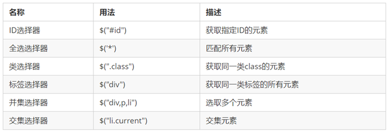
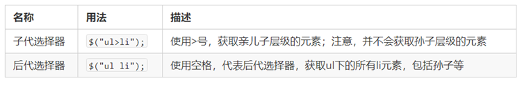
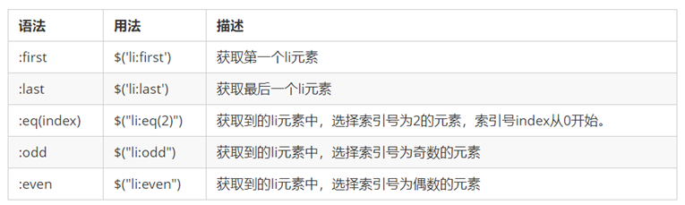
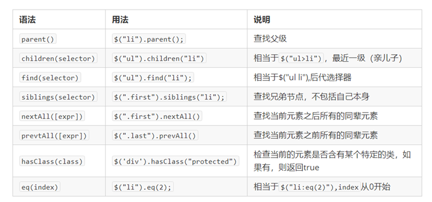
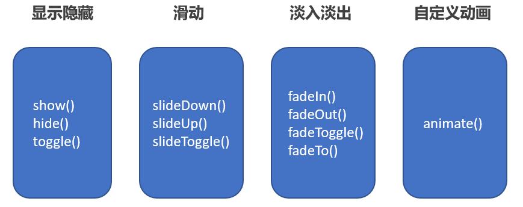
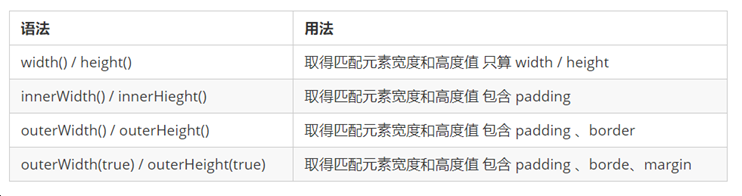

 

## jQuery 概述

### JavaScript 库

\JavaScript 库：即 library，是一个封装好的特定的集合（方法和函数）。从封装一大堆函数的角度理解库，就是在这个库中，封装了很多预先定义好的函数在里面，比如动画 animate、hide、show，比如获取元素等。

简单理解： 就是一个 JS 文件，里面对我们原生 js 代码进行了封装，存放到里面。这样我们可以快速高效的使用这些封装好的功能了。

比如 jQuery，就是为了快速方便的操作 DOM，里面基本都是函数（方法）。

常见的 JavaScript 库

jQuery

Prototype

YUI

Dojo

Ext JS

移动端的 zepto

内部都是用 JavaScript 实现的

### jQuery 的概念

jQuery 是一个快速、简洁的 JavaScript 库，其设计的宗旨是“write Less，Do More”，即倡导写更少的代码，做更多的事情。

j 就是 JavaScript； Query 查询； 意思就是查询 js，把 js 中的 DOM 操作做了封装，我们可以快速的查询使用里面的功能。

jQuery 封装了 JavaScript 常用的功能代码，优化了 DOM 操作、事件处理、动画设计和 Ajax 交互。

学习 jQuery 本质： 就是学习调用这些函数（方法）。

jQuery 出现的目的是加快前端人员的开发速度，我们可以非常方便的调用和使用它，从而提高开发效率。

jQuery 是一个快速、简洁的 JavaScript 库，其设计的宗旨是“write Less，Do More”，即倡导写更少的代码，做更多的事情。

### jQuery 的优点

1.轻量级。核心文件才几十 kb，不会影响页面加载速度

2.跨浏览器兼容。基本兼容了现在主流的浏览器

3.链式编程、隐式迭代

4.对事件、样式、动画支持，大大简化了 DOM 操作

5.支持插件扩展开发。有着丰富的第三方的插件，例如：树形菜单、日期控件、轮播图等

6.免费、开源

## jQuery 的下载与使用

官网地址： https://jquery.com/

版本：

1x ：兼容 IE 678 等低版本浏览器， 官网不再更新

2x ：不兼容 IE 678 等低版本浏览器， 官网不再更新

3x ：不兼容 IE 678 等低版本浏览器， 是官方主要更新维护的版本

各个版本的下载：https://code.jquery.com/

jQuery 的使用步骤

1. 引入 jQuery 文件

2. 使用即可

## jQuery 的基本使用

### jQuery 的入口函数

```
$(function () {

   ...  // 此处是页面 DOM 加载完成的入口

 }) ;
```

```
$(document).ready(function(){

   ...  //  此处是页面DOM加载完成的入口

});
```

1.等着 DOM 结构渲染完毕即可执行内部代码，不必等到所有外部资源加载完成，jQuery 帮我们完成了封装。

2.相当于原生 js 中的 DOMContentLoaded。

3.不同于原生 js 中的 load 事件是等页面文档、外部的 js 文件、css 文件、图片加载完毕才执行内部代码。

4.更推荐使用第一种方式。

### jQuery 的顶级对象 $

1.$ 是 jQuery 的别称，在代码中可以使用 jQuery 代替 $，但一般为了方便，通常都直接使用 $ 。

2.$ 是 jQuery 的顶级对象， 相当于原生 JavaScript 中的 window。把元素利用$包装成 jQuery 对象，就可以调用 jQuery 的方法。

### jQuery 对象和 DOM 对象

1.用原生 JS 获取来的对象就是 DOM 对象

2.jQuery 方法获取的元素就是 jQuery 对象。

3.jQuery 对象本质是： 利用$对 DOM 对象包装后产生的对象（伪数组形式存储）。

注意： 只有 jQuery 对象才能使用 jQuery 方法，DOM 对象则使用原生的 JavaScirpt 方法。

### DOM 对象与 jQuery 对象之间相互转换

因为原生 js 比 jQuery 更大，原生的一些属性和方法 jQuery 没有给我们封装. 要想使用这些属性和方法需要把 jQuery 对象转换为 DOM 对象才能使用。

1. DOM 对象转换为 jQuery 对象： $(DOM 对象)

   `$('div')`

2. jQuery 对象转换为 DOM 对象（两种方式）

`$('div') [index] index 是索引号`

`$('div') .get(index) index 是索引号`

## jQuery 常用 API

### jQuery 选择器

#### jQuery 基础选择器

原生 JS 获取元素方式很多，很杂，而且兼容性情况不一致，因此 jQuery 给我们做了封装，使获取元素统一标准。
$(“选择器”) // 里面选择器直接写 CSS 选择器即可，但是要加引号  
 

#### jQuery 层级选择器



#### jQuery 筛选选择器



#### jQuery 筛选方法



#### jQuery 里面的排他思想

想要多选一的效果，排他思想：当前元素设置样式，其余的兄弟元素清除样式。
$(this).css(“color”,”red”);
$(this).siblings(). css(“color”,””);

#### 链式编程

链式编程是为了节省代码量，看起来更优雅。
$(this).css('color', 'red').sibling().css('color', '');  
 使用链式编程一定注意是哪个对象执行样式.

### 隐式迭代（重要）

遍历内部 DOM 元素（伪数组形式存储）的过程就叫做隐式迭代。
​ 简单理解：给匹配到的所有元素进行循环遍历，执行相应的方法，而不用我们再进行循环，简化我们的操作，方便我们调用。

### jQuery 样式操作

jQuery 可以使用 css 方法来修改简单元素样式； 也可以操作类，修改多个样式。

#### 操作 css 方法

    	1. 参数只写属性名，则是返回属性值
    		$(this).css(''color'');
    
    	2.  参数是属性名，属性值，逗号分隔，是设置一组样式，属性必须加引号，值如果是数字可以不用跟单位和引号
    		$(this).css(''color'', ''red'');
    	3.  参数可以是对象形式，方便设置多组样式。属性名和属性值用冒号隔开， 属性可以不用加引号，
    		$(this).css({ "color":"white","font-size":"20px"});


​    	

#### 设置类样式方法

作用等同于以前的 classList，可以操作类样式， 注意操作类里面的参数不要加点。

		1. 添加类
			$(“div”).addClass(''current'');
		2.  移除类
	$(“div”).removeClass(''current'');
	3.  切换类
	$(“div”).toggleClass(''current'');

#### 类操作与className区别

原生 JS 中 className 会覆盖元素原先里面的类名。
jQuery 里面类操作只是对指定类进行操作，不影响原先的类名。

​	

### jQuery 效果

jQuery 给我们封装了很多动画效果，最为常见的如下：



#### 显示隐藏效果

    	显示语法规范
    		show([speed,[easing],[fn]])
    	隐藏语法规范
    		hide([speed,[easing],[fn]])
    	切换语法规范
    		toggle([speed,[easing],[fn]])
    	参数
    		（1）参数都可以省略， 无动画直接显示。
    		（2）speed：三种预定速度之一的字符串(“slow”,“normal”, or “fast”)或表示动画时长的毫秒数值(如：1000)。
    （3）easing：(Optional) 用来指定切换效果，默认是“swing”，可用参数“linear”。
    （4）fn:  回调函数，在动画完成时执行的函数，每个元素执行一次。

#### 滑动效果

    	下滑效果语法规范
    		slideDown([speed,[easing],[fn]])
    	上滑效果语法规范
    		slideUp([speed,[easing],[fn]])
    	滑动切换效果语法规范
    		slideToggle([speed,[easing],[fn]])
    	参数
    		（1）参数都可以省略。
    		（2）speed：三种预定速度之一的字符串(“slow”,“normal”, or “fast”)或表示动画时长的毫秒数值(如：1000)。
    （3）easing：(Optional) 用来指定切换效果，默认是“swing”，可用参数“linear”。
    （4）fn:  回调函数，在动画完成时执行的函数，每个元素执行一次。

#### 事件切换

    	hover([over,]out)
    	（1）over:鼠标移到元素上要触发的函数（相当于mouseenter）
    	（2）out:鼠标移出元素要触发的函数（相当于mouseleave）
    	（3）如果只写一个函数，则鼠标经过和离开都会触发它
    动画队列及其停止排队方法

#### 动画或效果队列

动画或者效果一旦触发就会执行，如果多次触发，就造成多个动画或者效果排队执行。 2. 停止排队
stop()
(1）stop() 方法用于停止动画或效果。

(2) 注意： stop() 写到动画或者效果的前面， 相当于停止结束上一次的动画。

#### 淡入淡出效果

    	1. 淡入效果语法规范
    		fadeIn([speed,[easing],[fn]])
    	1. 淡出效果语法规范
    		fadeOut([speed,[easing],[fn]])
    	1. 淡入淡出切换效果语法规范
    		fadeToggle([speed,[easing],[fn]])
    	渐进方式调整到指定的不透明度
    		fadeTo([[speed],opacity,[easing],[fn]])
    		opacity 透明度必须写，取值 0~1 之间。
    	参数
    		（1）参数都可以省略。
    		（2）speed：三种预定速度之一的字符串(“slow”,“normal”, or “fast”)或表示动画时长的毫秒数值(如：1000)。
    （3）easing：(Optional) 用来指定切换效果，默认是“swing”，可用参数“linear”。
    （4）fn:  回调函数，在动画完成时执行的函数，每个元素执行一次。

#### 自定义动画 animate

语法
`animate(params,[speed],[easing],[fn])`
参数
（1）params: 想要更改的样式属性，以对象形式传递，必须写。 属性名可以不用带引号， 如果是复合属性则需要采取驼峰命名法 borderLeft。其余参数都可以省略。
（2）speed：三种预定速度之一的字符串(“slow”,“normal”, or “fast”)或表示动画时长的毫秒数值(如：1000)。
（3）easing：(Optional) 用来指定切换效果，默认是“swing”，可用参数“linear”。
（4）fn: 回调函数，在动画完成时执行的函数，每个元素执行一次。

## jQuery 属性操作

### 设置或获取元素固有属性值 prop()

`所谓元素固有属性就是元素本身自带的属性，比如 <a> 元素里面的 href ，比如 <input> 元素里面的 type。 `

    	1. 获取属性语法
    		prop(''属性'')
    
    	2. 设置属性语法
    		prop(''属性'', ''属性值'')


​    	
​    

### 设置或获取元素自定义属性值 attr()

	用户自己给元素添加的属性，我们称为自定义属性。 比如给 div 添加 index =“1”。
	
	1. 获取属性语法
		attr(''属性'')      // 类似原生 getAttribute()
	
	2. 设置属性语法
		attr(''属性'', ''属性值'')   // 类似原生 setAttribute()
		改方法也可以获取 H5 自定义属性
###  5.3  数据缓存 data()


​	
​	data() 方法可以在指定的元素上存取数据，并不会修改 DOM 元素结构。一旦页面刷新，之前存放的数据都将被移除。
​	
	1. 附加数据语法
		data(''name'',''value'')   // 向被选元素附加数据
	
	2. 获取数据语法
		date(''name'')             //   向被选元素获取数据
	同时，还可以读取 HTML5 自定义属性  data-index ，得到的是数字型


## jQuery 文本属性值

   主要针对元素的内容还有表单的值操作。

1. 普通元素内容 html()（ 相当于原生inner HTML)
	html()             // 获取元素的内容
	html(''内容'')   // 设置元素的内容
2. 普通元素文本内容 text()   (相当与原生 innerText)
	text()                     // 获取元素的文本内容
	text(''文本内容'')   // 设置元素的文本内容
3. 主要针对元素的内容还有表单的值操作。
    表单的值 val()（ 相当于原生value)
    val()              // 获取表单的值
    val(''内容'')   // 设置表单的值
4. index()
    获取当前索引号-item

## jQuery 元素操作

主要是遍历、创建、添加、删除元素操作。

### 遍历元素

jQuery 隐式迭代是对同一类元素做了同样的操作。 如果想要给同一类元素做不同操作，就需要用到遍历。

	语法1
		$("div").each(function (index, domEle) { xxx; }）
	
		1. each() 方法遍历匹配的每一个元素。主要用DOM处理。 each 每一个
2.  里面的回调函数有 2 个参数： index 是每个元素的索引号; demEle 是每个 DOM 元素对象，不是 jquery 对象

3.  所以要想使用 jquery 方法，需要给这个 dom 元素转换为 jquery 对象 $(domEle)

        语法2
        	$.each(object，function (index, element) { xxx; }）
        	1. $.each()方法可用于遍历任何对象。主要用于数据处理，比如数组，对象
        	2.里面的函数有 2 个参数： index 是每个元素的索引号; element 遍历内容
### 创建元素

    $(''<li></li>'');  
     动态的创建了一个 <li>  


### 添加元素

```
1. 内部添加
	element.append(''内容'')
		把内容放入匹配元素内部最后面，类似原生 appendChild。
	element.prepend(''内容'')
		把内容放入匹配元素内部最前面。
```

1. 外部添加
    element.after(''内容'') // 把内容放入目标元素后面
    element.before(''内容'') // 把内容放入目标元素前面
    内部添加元素，生成之后，它们是父子关系。
    外部添加元素，生成之后，他们是兄弟关系。

### 删除元素

  element.remove() // 删除匹配的元素（本身）
  element.empty() // 删除匹配的元素集合中所有的子节点
  element.html('''') // 清空匹配的元素内容
  remove 删除元素本身。
  empt() 和 html('''') 作用等价，都可以删除元素里面的内容，只不过 html 还可以设置内容。

## jQuery 尺寸、位置操作

### 7.1 jQuery 尺寸


以上参数为空，则是获取相应值，返回的是数字型。

如果参数为数字，则是修改相应值。
参数可以不必写单位。 

### 位置主要有三个：

 offset()、position()、scrollTop()/scrollLeft() 

1. offset() 设置或获取元素偏移
offset() 方法设置或返回被选元素相对于文档的偏移坐标，跟父级没有关系。
该方法有 2 个属性 left、top 。offset().top 用于获取距离文档顶部的距离，offset().left 用于获取距离文档左侧的距离。
可以设置元素的偏移：offset({ top: 10, left: 30 }); 2. position() 获取元素偏移
position() 方法用于返回被选元素相对于带有定位的父级偏移坐标，如果父级都没有定位，则以文档为准。
该方法有 2 个属性 left、top。position().top 用于获取距离定位父级顶部的距离，position().left 用于获取距离定位父级左侧的距离。
该方法只能获取。 3. scrollTop()/scrollLeft() 设置或获取元素被卷去的头部和左侧
scrollTop() 方法设置或返回被选元素被卷去的头部。
不跟参数是获取，参数为不带单位的数字则是设置被卷去的头部。

## jQuery 事件

### jQuery 事件注册

 单个事件注册
​ element.事件(function(){})  
​ $(“div”).click(function(){ 事件处理程序 })  
​ 其他事件和原生基本一致。
比如 mouseover---鼠标经过、
mouseout----鼠标离开、
blur、focus、change、
keydown---按下、
keyup---松开、
resize---窗口大小改变、
scroll 等

### jQuery 事件处理

#### on() 绑定事件

 on() 方法在匹配元素上绑定一个或多个事件的事件处理函数
​ element.on(events,[selector],fn)

1. events:一个或多个用空格分隔的事件类型，如"click"或"keydown" 

2.  selector: 元素的子元素选择器 。

3.  fn:回调函数 即绑定在元素身上的侦听函数。

#### on 方法优势

     on() 方法优势 1：
    ​ 可以绑定多个事件，多个处理事件处理程序。
    ​ $(“div”).on({
    mouseover: function(){},
    mouseout: function(){},
    click: function(){}
    });
    
    如果事件处理程序相同
    $(“div”).on(“mouseover mouseout”, function() {
    $(this).toggleClass(“current”);
    });  
     on() 方法优势 2：
    可以事件委派操作 。事件委派的定义就是，把原来加给子元素身上的事件绑定在父元素身上，就是把事件委派给父元素。
    $('ul').on('click', 'li', function() {
    alert('hello world!');
    });
    
        		在此之前有bind(), live() delegate()等方法来处理事件绑定或者事件委派，最新版本的请用on替代他们。
        	on() 方法优势3：
    
    动态创建的元素，click() 没有办法绑定事件， on() 可以给动态生成的元素绑定事件
    $(“div").on("click",”p”, function(){
    alert("俺可以给动态生成的元素绑定事件")
    });
    
    $("div").append($("<p>我是动态创建的 p</p>"));
    
    

#### off() 解绑事件

    	off() 方法可以移除通过 on() 方法添加的事件处理程序。
    	$("p").off() // 解绑p元素所有事件处理程序
    	$("p").off( "click")  // 解绑p元素上面的点击事件 后面的 foo 是侦听函数名
    	$("ul").off("click", "li");   // 解绑事件委托

#### one() --只触发一次

#### trigger() 自动触发事件

    	​	有些事件希望自动触发, 比如轮播图自动播放功能跟点击右侧按钮一致。可以利用定时器自动触发右侧按钮点击事件，不必鼠标点击触发。
    	​	element.click()  // 第一种简写形式
    	​	element.trigger("type") // 第二种自动触发模式
    	​	$("p").on("click", function () {
    
    	  alert("hi~");
    	});
    	$("p").trigger("click"); // 此时自动触发点击事件，不需要鼠标点击
    
    element.triggerHandler(type) // 第三种自动触发模式
    triggerHandler 模式不会触发元素的默认行为，这是和前面两种的区别。


### jQuery 事件对象

 事件被触发，就会有事件对象的产生。
​ element.on(events,[selector],function(event) {})  
​ 阻止默认行为：event.preventDefault() 或者 return false
​ 阻止冒泡： event.stopPropagation()

## jQuery 其他方法

###  jQuery 拷贝对象

 如果想要把某个对象拷贝（合并） 给另外一个对象使用，此时可以使用 $.extend() 方法
​			$.extend([deep], target, object1, [objectN])    
​			1. deep: 如果设为true 为深拷贝， 默认为false  浅拷贝 
​			2. target: 要拷贝的目标对象
​			3. object1:待拷贝到第一个对象的对象。
​			4. objectN:待拷贝到第N个对象的对象。
​			5. 浅拷贝是把被拷贝的对象复杂数据类型中的地址拷贝给目标对象，修改目标对象会影响被拷贝对象。
​			6. 深拷贝，前面加true， 完全克隆(拷贝的对象,而不是地址)，修改目标对象不会影响被拷贝对象。

### 多库共存

​		问题概述：
​			jQuery使用$作为标示符，随着 jQuery 的流行,其他 js 库也会用这$作为标识符， 这样一起使用会引起冲突。
​		客观需求：
​			需要一个解决方案，让jQuery 和其他的js库不存在冲突，可以同时存在，这就叫做多库共存。
​		jQuery 解决方案：
​			1. 把里面的 $ 符号 统一改为 jQuery。 比如 jQuery(''div'')
​			2.  jQuery 变量规定新的名称：$.noConflict() var xx = $.noConflict();

###  jQuery 插件

 jQuery 功能比较有限，想要更复杂的特效效果，可以借助于 jQuery 插件完成。
注意: 这些插件也是依赖于 jQuery 来完成的，所以必须要先引入 jQuery 文件，因此也称为 jQuery 插件。
​ jQuery 插件常用的网站：

1.  jQuery 插件库 http://www.jq22.com/
2.  jQuery 之家 http://www.htmleaf.com/  
     jQuery 插件使用步骤：
3.  引入相关文件。（jQuery 文件 和 插件文件）
4.  复制相关 html、css、js (调用插件)。
    jQuery 插件演示：
5.  瀑布流
6.  图片懒加载（图片使用延迟加载在可提高网页下载速度。它也能帮助减轻服务器负载）
    当我们页面滑动到可视区域，再显示图片。
    我们使用 jquery 插件库 EasyLazyload。 注意，此时的 js 引入文件和 js 调用必须写到 DOM 元素（图片）最后面
7.  全屏滚动（fullpage.js）
    gitHub： https://github.com/alvarotrigo/fullPage.js
    中文翻译网站： http://www.dowebok.com/demo/2014/77/
		
### bootstrap

https://v3.bootcss.com/components/#wells
bootstrap JS 插件：
bootstrap 框架也是依赖于 jQuery 开发的，因此里面的 js 插用 ，也必须引入 jQuery 文件。
还要引入 css