## Web APIs 简介

### Web APIs 和 JS 基础关联性


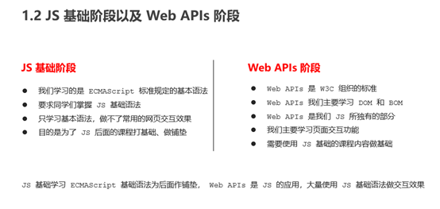

### API 和 Web API


## DOM

###  DOM 简介

#### 什么是Dom？

   文档对象模型（Document Object Model，简称 DOM），是 W3C 组织推荐的处理可扩展标记语言（HTML或者XML）的标准编程接口。

   W3C 已经定义了一系列的 DOM 接口，通过这些 DOM 接口可以改变网页的内容、结构和样式。

#### Dom树


### DOM 重点核心(复习)


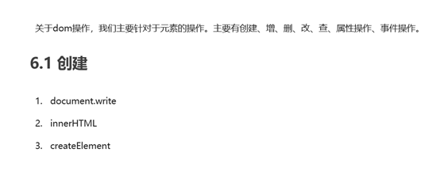

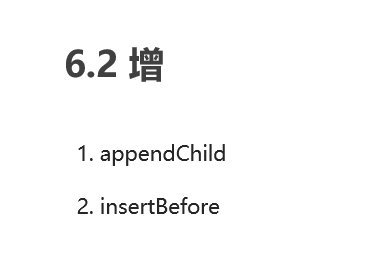

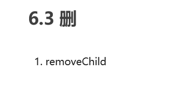

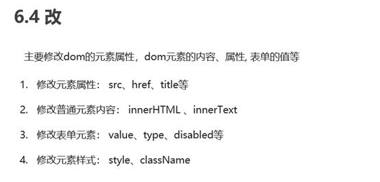

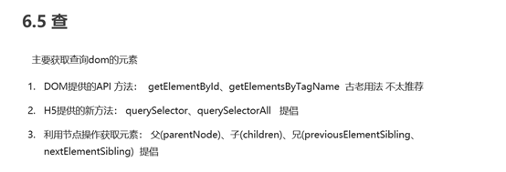

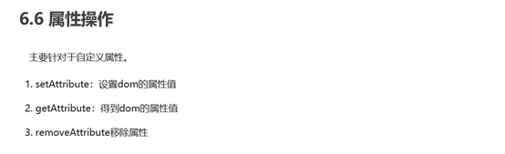

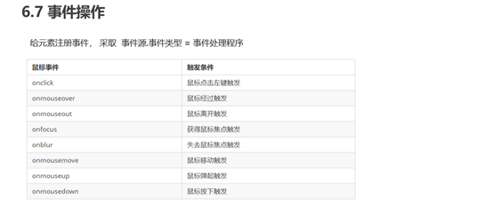


## 1.事件基础

### 事件概述

​		JavaScript 使我们有能力创建动态页面，而事件是可以被 JavaScript 侦测到的行为。简单理解： 触发--- 响应机制。
​		网页中的每个元素都可以产生某些可以触发 JavaScript 的事件，
例如，我们可以在用户点击某按钮时产生一个 事件，然后去执行某些操作。

### 事件三要素->执行事件的步骤

1. 事件源 （谁）                          1. 获取事件源

2. 事件类型 （什么事件） --->   2. 注册事件（绑定事件）

3. 事件处理程序 （做啥）           3. 添加事件处理程序（采取函数赋值形式）
			 例：点击后隐藏

    ```
    var sp = document.querySelector('span')
    sp.onclick = function() {
            di.style.display = 'none'
        }
    ```
    
    

## 2.获取元素

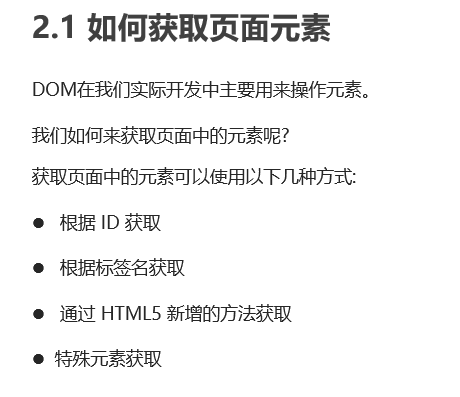

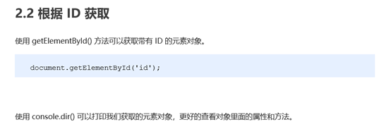

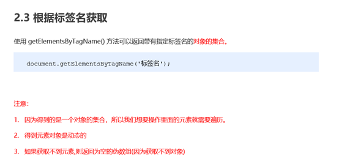

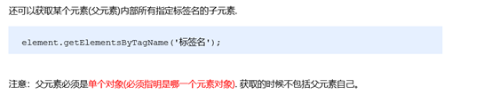

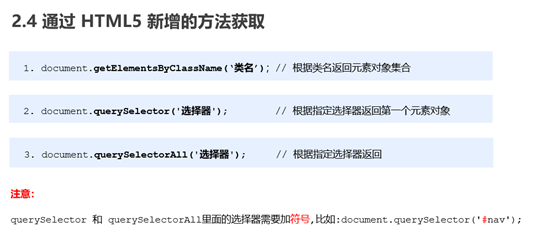

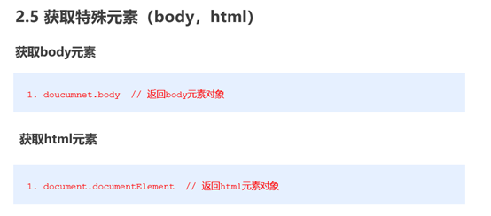

 

## 3.注册事件（绑定事件）

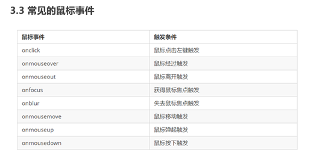


##   4.操作元素

JavaScript 的 DOM 操作可以改变网页内容、结构和样式，我们可以
利用 DOM 操作元素来改变元素里面的内容 、属性等。                      
注意以下都是属性


### 改变元素内容

1.起始位置到终止位置的全部内容，包括 html 标签，同时保留空格和换行

```
element.innerHTML
```

2.从起始位置到终止位置的内容, 但它去除 html 标签， 同时空格和换行也会去掉

```
element.innerText
```


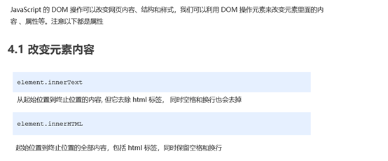

### 属性的操作


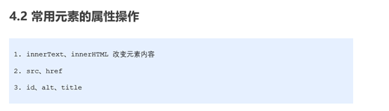

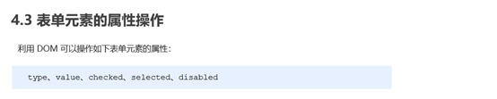

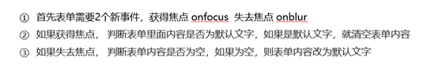

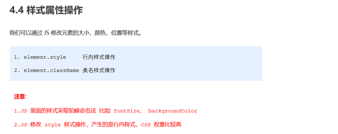


##   5.节点操作

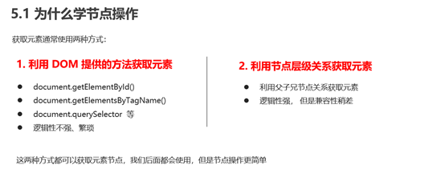

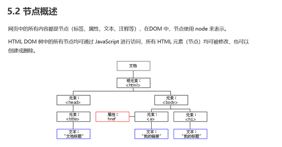

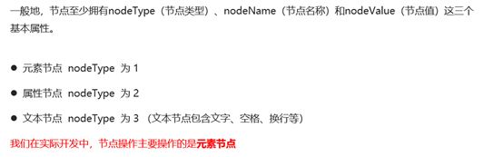

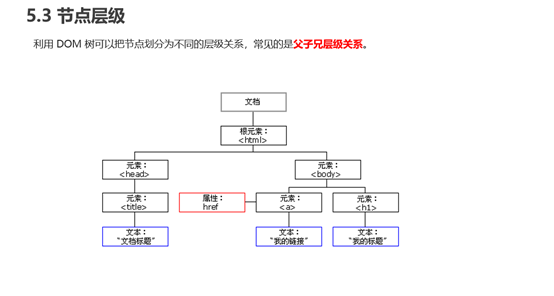

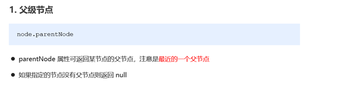

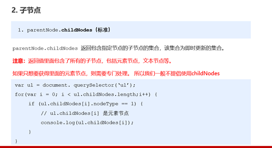

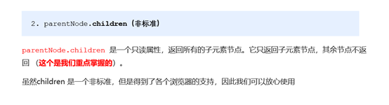

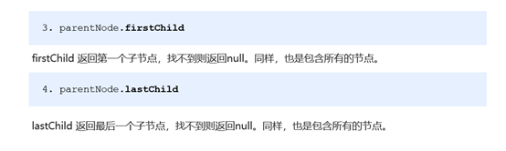


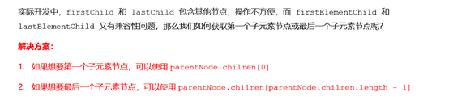

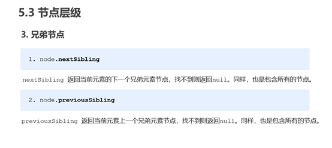

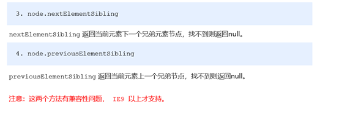


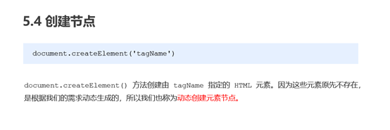

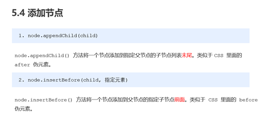

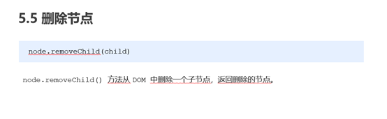

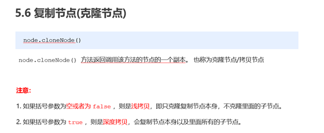

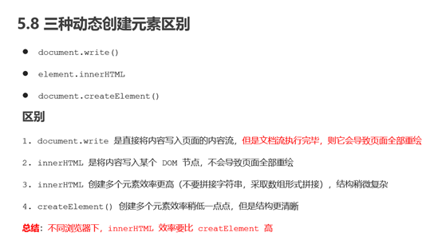

# 

# 事件高级

## 注册事件（绑定事件）

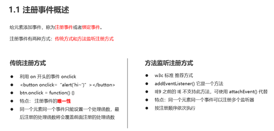

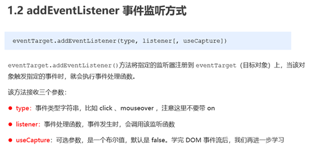


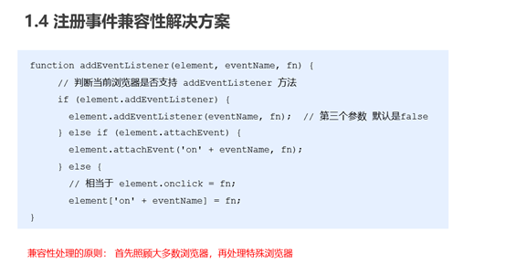

## 删除事件（解绑事件）

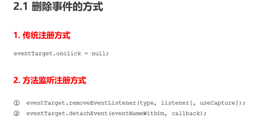

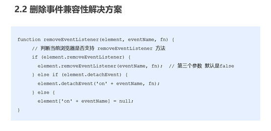

## DOM事件流

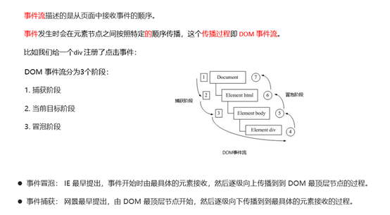

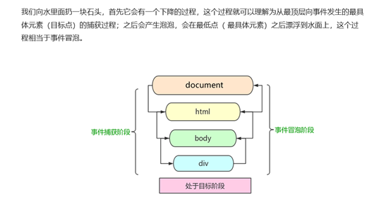

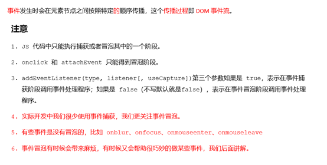

## 事件对象

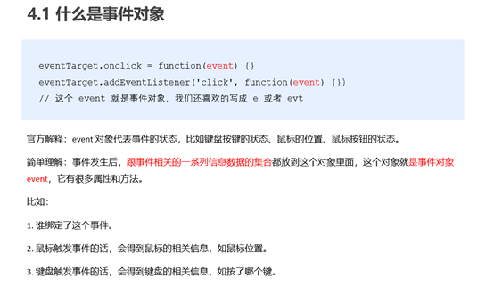

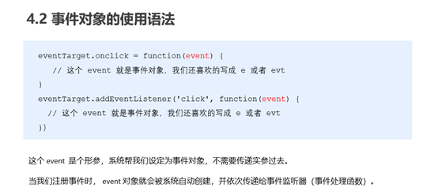

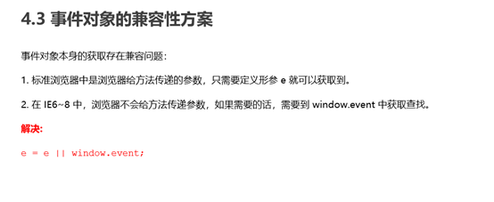


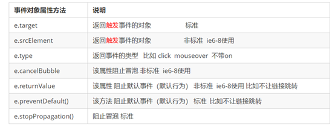

## 阻止事件冒泡

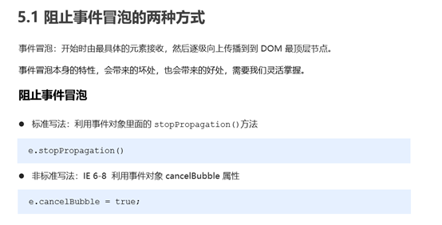

**5.2 阻止事件冒泡的兼容性解决方案** 

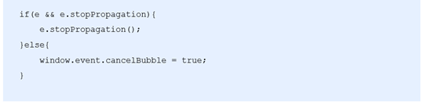

## 事件委托（代理、委派）


## 常用的鼠标事件


## 常用的键盘事件


# BOM 浏览器对象模型

## BOM 概述


## window 对象的常见事件


## 定时器


## JS 执行机制


## location 对象


## navigator 对象


## history 对象


