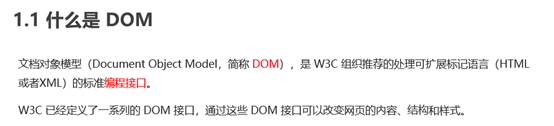
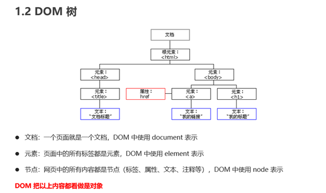
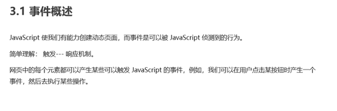
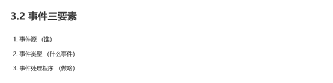
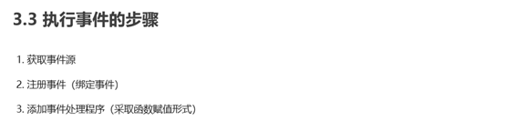
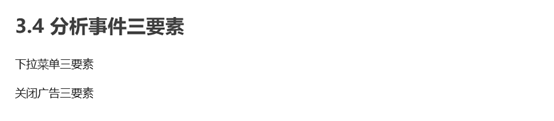
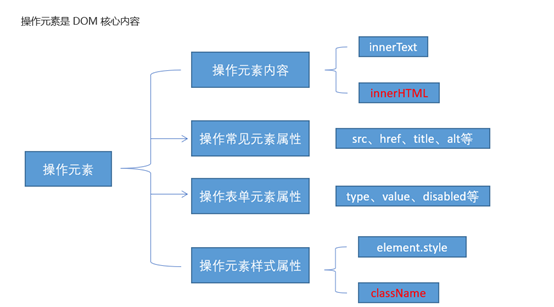

# Web APIs 简介

## Web APIs 和 JS 基础关联性

## API 和 Web API

# DOM

 DOM 简介

##   获取元素

 事件基础

##   操作元素

##   节点操作

# DOM 重点核心

# 事件高级

## 注册事件（绑定事件）

## 删除事件（解绑事件）

## DOM事件流

## 事件对象

## 阻止事件冒泡

**5.2 阻止事件冒泡的兼容性解决方案** 

## 事件委托（代理、委派）

## 常用的鼠标事件

## 常用的键盘事件

# BOM 浏览器对象模型

## BOM 概述

## window 对象的常见事件

## 定时器

## JS 执行机制

## location 对象

## navigator 对象

## history 对象

