## Web APIs 简介

### Web APIs 和 JS 基础关联性

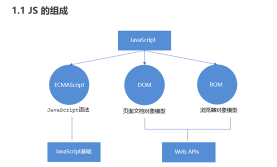

### API 和 Web API

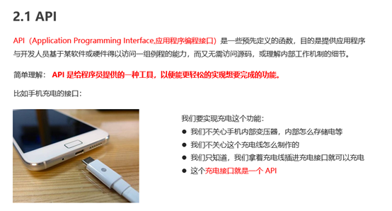


##  DOM简介

**什么是Dom？**

   文档对象模型（Document Object Model，简称 DOM），是 W3C 组织推荐的处理可扩展标记语言（HTML或者XML）的标准编程接口。

   W3C 已经定义了一系列的 DOM 接口，通过这些 DOM 接口可以改变网页的内容、结构和样式。

DOM

​                D   document    html 文档

​                O   对象(在 HTML 文档中的任何一个标签都是一个对象)

​                M   模型

​                    JS 将一个 HTML 文档中的所有的标签，都描述成一棵"树"的结构


​                DOM 树作用

​                    JS 通过修改 DOM 树上的内容，会即时的反应在页面上。


​                DOM树 与 页面之间关系? 类似于 皮影戏

**Dom树**

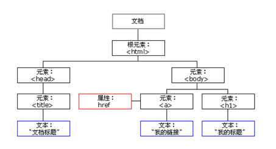


## 一. 获取元素

### 1.根据 ID 获取

使用 getElementById() 方法可以获取带有ID 的元素对象。

​	.之前只能是document

```
 document.getElementById('id');
```

使用 console.dir() 可以打印我们获取的元素对象，更好的查看对象里面的属性和方法。

 注意：

​            如果获取不到返回的是 null

​            如果获取成功返回的是 一个 标签对象


### 2. 根据标签名获取

使用 getElementsByTagName() 方法可以返回带有指定标签名的对象的集合。

```
 document.getElementsByTagName('标签名');
 //document可以换成别的elment
```

说明：

​               返回的是一个集合(集合就是一个伪数组，可以像真数组一样通过下标读取元素，可以进行遍历操作，也可以通过.length 读取长度)

注意：

​                就算没有读取到元素,也会返回一个空间的伪数组

​                就算只读取到一个元素，也以是以数组的形式返回。


**限制获取范围**

```
  //父元素.getElementsByTagName('标签名')
```


### 3.通过class 属性获取

```
 document.getElementsByClassName('class 属性值')
 // 根据类名返回元素对象集合
```


### 4.通过Css选择器获取(最常用)

```
document.querySelector('选择器');       
// 根据指定选择器返回第一个元素对象
```

```
 document.querySelectorAll('选择器');    
 // 根据指定选择器返回一个集合
```

**注意：** 

querySelector 和 querySelectorAll里面的选择器需要加符号,比如:document.querySelector('#nav'); 


### 5 获取特殊元素（body，html）

 获取body元素

```
1. doucumnet.body  // 返回body元素对象

```

获取html元素

```
1. document.documentElement  // 返回html元素对象

```


## 二.操作元素

JavaScript 的 DOM 操作可以改变网页内容、结构和样式，我们可以
利用 DOM 操作元素来改变元素里面的内容 、属性等。                      


### 1. 属性的操作

#### **(1) 标准属性操作**

​	html 标签默认具有的属性      

```
//语法：  标签对象.属性名
elment.src
elment.id

设置值:
	elment.src = ''
```


#### **style样式属性操作**

我们可以通过 JS 修改元素的大小、颜色、位置等样式。

```
element.style     //获取

element.style.backgroundColor = 'red' //设置
```

**注意**：

​	1.JS 里面的样式采取驼峰命名法 比如 fontSize、 backgroundColor

​	2.JS 修改 style 样式操作，产生的是行内样式，CSS 权重比较高

​	3.如果样式修改较多，可以采取操作类名方式更改元素样式。 


#### (2) 自定义属性

**H5新方法:**

html 推荐使用  data- 前缀 在 html 标签上进行设置

在js 中读取时，需要使用 dataset.自定义属性

```
html:
	 
 	// 在 html 标签上使用 data- 前缀
js:
 	let oImg = document.getElementById('pic')
 	console.log(oImg.dataset.age);
 	 //在 js 中读取时，使用  标签对象.dataset.自定义属性
 	 
 	设置值:
	oImg.dataset.h = "100"
```


#### (3) class属性

class标签属性很特殊，不能使用.class 进行操作

**① 使用 .className 进行操作**

```
//获取
elment.className
//设置
elment.className = ''
```

​			可以读取

​            可以设置，对于设置是属于全覆盖式设置

​            clssName 更适用于对仅具有1个class属性值的情况。

注意：

​            className 虽然 能读取 class 属性的值，但以于设置操作，className 会全覆盖已有的类


**② 使用 .classList 进行操作**

```
//获取
elment.classList  //一个集合
//操作
elment.classList.add() 添加
elment.classList.remove() 移除
elment.classList.toggle() 切换

例: oDiv.classList.add('clsB')
```


**表单元素的属性操作**

利用 DOM 可以操作如下表单元素的属性：

```
  type、value、checked、selected、disabled

```


#### (4) 布尔类型属性操作

 在 html 标签上有一些属性，这类属性，仅有属性名，没有属性值。

这些属性要么出现在标签，要么不出现在标签

根据出不出现，标签就有不现的显示 效果

这类属性我们就起个名子叫布尔类型属性

在 JS 阶段，html 标签上的布尔类型属性需要为其赋值布尔类型的值 

```
<input type="text" >
 
let oText = document.querySelector('input')
oText.disabled = true
 
```


### 2. 操作标签内容

#### (1) .textContent

用于获取文本性的内容    出于 w3c

去除 html 标签， 同时空格和换行也会去掉

```
//获取
elment.textContent
//设置
elment.textContent = ''
```

#### (2) .innerText

用于获取文本性的内容    出于 微软 兼容性比较好

去除 html 标签， 同时空格和换行也会去掉

```
//获取
elment.textContent
//设置
elment.textContent = ''
```


#### (3) .innerHTML   

用于获取双边标签的内容(文本与标签会被一同获取出来)        

包括 html 标签，同时保留空格和换行

```
element.innerHTML
element.innerHTML = 'hello <big>world</big>'
```


#### (4) 表单元素值的获取操作

```
表单元素.value 
```

 一个属性(获取文本框初始显示的内容)

```
.defaultValue   获取文本框初始显示的内容
```


### 3. 操作属性的 api (通用)

```
element.getAttribute('属性');

操作属性的 api
            .getAttribute(属性名)           获取指定的属性值
            .setAttribute(属性名,属性值)     设置
            .removeAttribute(属性名)        移除
```

```
//  获取属性
// console.log(oBox.getAttribute('class'))

// 设置属性
// oBox.setAttribute('age','20')
 // oBox.setAttribute('data-sex','男')

// 尝试操作 class 属性，(class 很特殊，可能具有多个属性值)，
 // oBox.setAttribute('class','clsB') // 也会完全覆盖
```


### 补充

#### this

在事件处理函数 中也有 this，this 代表调用这个方法的那个标签对象

 以后，只要在事件处理函数中，获取当前对象就使用 this


#### 排他思想

如果有同一组元素，我们想要某一个元素实现某种样式， 需要用到循环的排他思想算法：

1. 所有元素全部清除样式（干掉其他人）

2. 给当前元素设置样式 （留下我自己）

3. 注意顺序不能颠倒，首先干掉其他人，再设置自己

#### 阻止默认行为

方案1：自宫，a 链接自己就没有跳转的功能 --

```
<a href="javascript:">
```

方案2：js 阻止 a 链接的默认行为

​            // 在事件处理函数中，return false，也可以阻止a 链接的默认行为


## 三. 事件

**事件概述**

​		JavaScript 使我们有能力创建动态页面，而事件是可以被 JavaScript 侦测到的行为。简单理解： 触发--- 响应机制。
​		网页中的每个元素都可以产生某些可以触发 JavaScript 的事件，
例如，我们可以在用户点击某按钮时产生一个 事件，然后去执行某些操作。

事件: 就是浏览者通过设备来浏览页面，设备的一些动作就是一个事件。

**事件三要素->执行事件的步骤**

1. 事件源     （谁-标签对象）                     1. 获取事件源
2. 事件类型 （什么事件-点击...） --->         2. 注册事件（绑定事件）
3. 事件处理函数 （做啥）             3. 添加事件处理程序（采取函数赋值形式）

  事件注册语法：

​            事件源.on事件名 = 事件处理函数

例：点击后隐藏

```
var sp = document.querySelector('span')
sp.onclick = function() {
        di.style.display = 'none'
    }
```

​       

​     


### 1. 注册事件（绑定事件）

#### **常见的鼠标事件**


### 2. 事件处理函数

事件源.事件名 = 事件处理函数 

 匿名函数作用为事件处理函数

```
oDiv.onclick = function(){
      console.log('hello world');
}
```


事件处理函数可以是有名也可以是匿名函数

也可以使用有名函数 作为事件处理函数，仅提供函数名即可不需要加 括号

```
 oDiv.onclick = clk
        
// 有名函数
function clk(){
    console.log('hello world');
}
```


## 四. 节点操作

**为什么学节点操作**

获取元素通常使用两种方式：

**1.**利用 **DOM** **提供的方法获取元素**

ldocument.getElementById() 

ldocument.getElementsByTagName()

ldocument.querySelector  等

​	逻辑性不强、繁琐

**2.利用节点层级关系获取元素**

利用父子兄节点关系获取元素

逻辑性强， 但是兼容性稍差

这两种方式都可以获取元素节点，我们后面都会使用，但是节点操作更简单


**节点概述**

网页中的所有内容都是节点（标签、属性、文本、注释等），在DOM 中，节点使用 node 来表示。

HTML DOM 树中的所有节点均可通过 JavaScript 进行访问，所有 HTML 元素（节点）均可被修改，也可以创建或删除。


一般地，节点至少拥有nodeType（节点类型）、nodeName（节点名称）和nodeValue（节点值）这三个基本属性。

元素节点  nodeType  为 1

属性节点  nodeType  为 2

文本节点  nodeType  为 3 （文本节点包含文字、空格、换行等）

我们在实际开发中，节点操作主要操作的是**元素节点**


**节点层级**

利用 DOM 树可以把节点划分为不同的层级关系，常见的是**父子兄层级关系**。

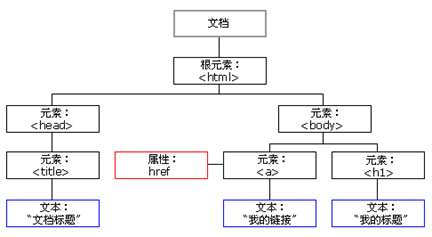


### 1. 获取节点


#### （1）父级节点 

```
 node.parentNode  
```

parentNode 属性可返回某节点的父节点，注意是最近的一个父节点

如果指定的节点没有父节点则返回 null 


#### （2）子节点 

常用：

```
 2. parentNode.children（非标准） 
```

parentNode.children 是一个只读属性，返回所有的子元素节点。它只返回子元素节点，其余节点不返回 （**这个是我们重点掌握的**）。

虽然children 是一个非标准，但是得到了各个浏览器的支持，因此我们可以放心使用

```
 5. parentNode.firstElementChild   
```

firstElementChild  返回第一个子元素节点，找不到则返回null。

```
 6. parentNode.lastElementChild    
```

lastElementChild 返回最后一个子元素节点，找不到则返回null。  

注意：这两个方法有兼容性问题，IE9 以上才支持。


```
 parentNode.childNodes（标准）   
```

parentNode.childNodes 返回包含指定节点的子节点的集合，该集合为即时更新的集合。

**注意：**返回值里面包含了所有的子节点，包括元素节点，文本节点等。

如果只想要获得里面的元素节点，则需要专门处理。 所以我们一般不提倡使用childNodes

```
var ul = document. querySelector(‘ul’);
for(var i = 0; i < ul.childNodes.length;i++) {
if (ul.childNodes[i].nodeType == 1) {    // ul.childNodes[i] 是元素节点
    console.log(ul.childNodes[i]);}
}

```


```
 3. parentNode.firstChild   
```

firstChild 返回第一个子节点，找不到则返回null。同样，也是包含所有的节点。

```
 4. parentNode.lastChild    
```

lastChild 返回最后一个子节点，找不到则返回null。同样，也是包含所有的节点。


实际开发中，firstChild 和 lastChild 包含其他节点，操作不方便，而 firstElementChild 和 lastElementChild 又有兼容性问题，那么我们如何获取第一个子元素节点或最后一个子元素节点呢？

**解决方案：**

1.如果想要第一个子元素节点，可以使用 parentNode.chilren[0] 

2.如果想要最后一个子元素节点，可以使用 parentNode.chilren[parentNode.chilren.length - 1]  


#### （3）兄弟节点 

常用方法：

```
 3. node.nextElementSibling  
```

nextElementSibling 返回当前元素下一个兄弟元素节点，找不到则返回null。

```
 4. node.previousElementSibling    
```

previousElementSibling 返回当前元素上一个兄弟节点，找不到则返回null。


现在不常用；会获取文本节点..

```
 1. node.nextSibling  
```

nextSibling返回当前元素的下一个兄弟元素节点，找不到则返回null。同样，也是包含所有的节点。

```
 2. node.previousSibling    
```

previousSibling返回当前元素上一个兄弟元素节点，找不到则返回null。同样，也是包含所有的节点。


**问：如何解决兼容性问题 ？**

答：自己封装一个兼容性的函数  

```
   function getNextElementSibling(element) {
      var el = element;
      while (el = el.nextSibling) {
        if (el.nodeType === 1) {
            return el;
        }
      }
      return null;
    }  

```


### 2. 操作节点

#### （4）复制节点(克隆节点)

```
 node.cloneNode() 
```

node.cloneNode()
方法返回调用该方法的节点的一个副本。 也称为克隆节点/拷贝节点

**注意**：

1. 如果括号参数为空或者为 false ，则是浅拷贝，即只克隆复制节点本身，不克隆里面的子节点。

2. 如果括号参数为 true ，则是深度拷贝，会复制节点本身以及里面所有的子节点。

#### （6）创建节点

```
 document.createElement('tagName')
```

document.createElement()方法创建由 tagName 指定的 HTML 元素。因为这些元素原先不存在，是根据我们的需求动态生成的，所以我们也称为动态创建元素节点。


#### （5）添加节点

```
 1. node.appendChild(child) 
```

node.appendChild()方法将一个节点添加到指定父节点的子节点列表末尾。类似于 CSS 里面的 after伪元素。

​	插入节点

```
 2. node.insertBefore(child, 指定元素) 
```

node.insertBefore()方法将一个节点添加到父节点的指定子节点前面。类似于 CSS 里面的 before伪元素。


#### （7）替换节点

```
目标元素父元素.replaceChild(新元素,目标元素) 
```

node.removeChild()方法从 DOM 中删除一个子节点，返回删除的节点。


#### （7）删除节点

```
node.removeChild(child) 
```

node.removeChild()方法从 DOM 中删除一个子节点，返回删除的节点。


#### 三种动态创建元素区别

 document.write()

 element.innerHTML

 document.createElement()

**区别**

1. document.write 是直接将内容写入页面的内容流，但是文档流执行完毕，则它会导致页面全部重绘

2. innerHTML 是将内容写入某个 DOM 节点，不会导致页面全部重绘

3. innerHTML 创建多个元素效率更高（不要拼接字符串，采取数组形式拼接），结构稍微复杂

4. createElement() 创建多个元素效率稍低一点点，但是结构更清晰

**总结**：不同浏览器下，innerHTML 效率要比 creatElement 高


# 事件高级

## 注册事件（绑定事件）


## 删除事件（解绑事件）


## DOM事件流


## 事件对象


## 阻止事件冒泡


**5.2 阻止事件冒泡的兼容性解决方案** 


## 事件委托（代理、委派）


## 常用的鼠标事件


## 常用的键盘事件


# BOM 浏览器对象模型

## BOM 概述


## window 对象的常见事件


## 定时器


## JS 执行机制


## location 对象


## navigator 对象


## history 对象


# PC 端网页特效

## 元素偏移量 offset 系列


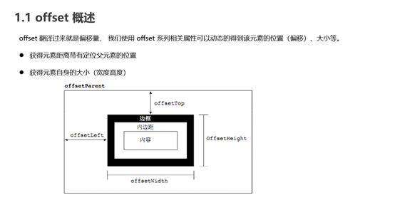

## 元素可视区 client 系列

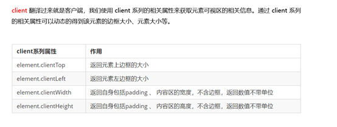

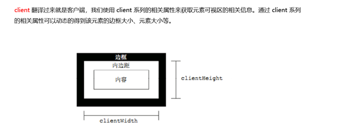

## 元素滚动 scroll 系列


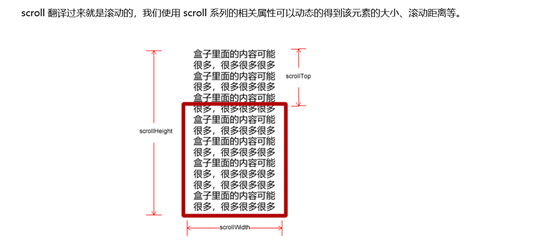


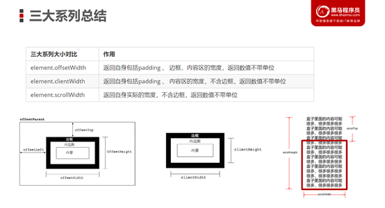


## 动画函数封装

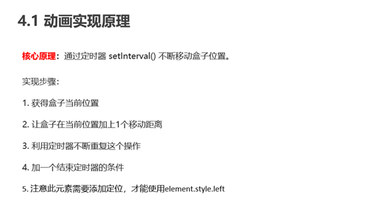

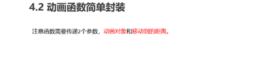


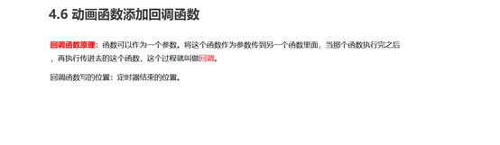

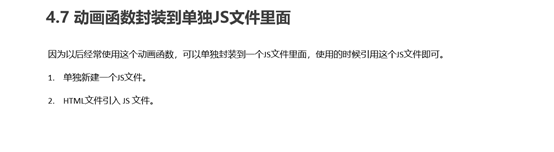

