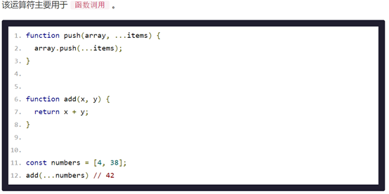
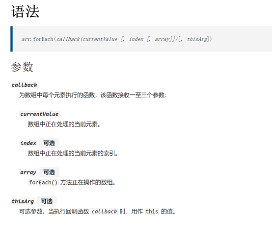

## ES6新语法

## 1、let_VS_var

var 是最早在 JS 定义变量的语法
 而 let es6新增的定义变量的语法，目的就是为了取替 var

1. var 可以重复声明变量，而 let 则不可以

```
var a = 10
var a = 'hello'

let b = 10
let b = 20          // 报错：
```


2. var 定义的变量，访问语句可以在定义之前； let声明的变量必须 遵循先定义后使用

   var 会存在变量声明前置(变量提升)

```
 		console.log(a);         // undefined，原因 var 会存在变量声明前置

        var a = 10

        let b = 20;
        console.log(b);
```


3. var没有块级作用域限制的，let 是有块级作用域限制的。
   块级作用域，只要是语法中带有{}都会形成一个块级作用域


```
       let b = 10
        // if(10>5){
        //     let b = 20
        // }

        {

            let b = 20      // 受块级作用域的限制 ，此处的 b 与外部的 b 不在同一个作用域
            let c = 30
            console.log(c);
        }

        console.log(c);     // 受块级作用域的限制 ，无法访问 c
```


**总结：**

​	**以后声明变量使用 let 就对了；**


## 2、const

 const 也是用于定义变量的, 但是这种 const 定义的变量很特殊
 语法：const 变量名 = 值


1. 声明必须赋初始值；

2. 标识符一般为大写（习惯）；
3. 不允许重复声明；
4. 值不允许修改；引用类型可以修改值的内容；
5. 块儿级作用域（局部变量）；


1. const 定义的变量的值是不允许修改，所以const定义的变量也会被称之为 常量

```
 // const a = 10
 // a = 100     // 报错：const 定义的变量的值是不允许修改，所以const定义的变量也会被称之为 常量
```

2. 如果：const 定义的变量保存的是数组或对象，对象或数组是不可以被替换的，但里面的值是可以修改的。

```
// const a = [10,20]     // 如果：const 定义的变量保存的是数组或对象，对象或数组是不可以被替换的，但里面的值是可以修改的。
 // a[0] = 100          
// console.log(a);
```

3. const 定义变量同时必须赋值,const也有块级作用域限制 

```
        let a
        a = 100;
        // const b;        // 报错：定义同时必须赋值
```


**应用场景：**
**声明对象类型使用 const，非对象类型声明选择 let；**


## 3、ES6 解构赋值

ES6 允许按照一定模式，从数组和对象中提取值，对变量进行赋值，这被称为`解构`（Destructuring）。

以前，为变量赋值，只能直接指定值。

```
1.  let a = 1;
2.  let b = 2;
3.  let c = 3;
```


ES6 允许写成下面这样。

1. let [a, b, c] = [1, 2, 3];
2. 上面代码表示，可以从数组中提取值，按照对应位置，对变量赋值。
3. 本质上，这种写法属于“模式匹配”，只要等号两边的模式相同，左边的变量就会被赋予对应的值。下面是一些使用嵌套数组进行解构的例子。

```
let [a, b, c] = [1, 2, 3];
a //1
b //2
c //3
```


```
1、数组的解构赋值
const F4 = ["大哥","二哥","三哥","四哥"];
let [a,b,c,d] = F4;
// 这就相当于我们声明4个变量a,b,c,d，其值分别对应"大哥","二哥","三哥","四哥"
console.log(a + b + c + d); // 大哥二哥三哥四哥
```


```
// 2、对象的解构赋值
const F3 = {
name : "大哥",
age : 22,
sex : "男",
xiaopin : function(){ // 常用
console.log("我会演小品！");
	}
}
let {name,age,sex,xiaopin} = F3; // 注意解构对象这里用的是{}
console.log(name + age + sex + xiaopin); // 大哥22男
xiaopin(); // 此方法可以正常调用
```

解构不仅可以用于数组，还可以用于对象。

```
1.	let { foo, bar } = { foo: 'aaa', bar: 'bbb' };
2.	foo // "aaa"
3.	bar // "bbb"

```

对象的解构与数组有一个重要的不同。数组的元素是按次序排列的，变量的取值由它的位置决定；而对象的属性没有次序，`变量`必须与`属性`同名，才能取到正确的值。


**不完全解构**

另一种情况是不完全解构，即等号左边 只匹配一部分右边的数组。依然可以成功

```
let [x,y] =[1,2,3]
x //1
y //2
```


如果等号的右边不是数组（或者严格地说，不是可遍历的结构，参见《Iterator》一章），那么将会报错。

```
1.		// 报错
2.	let [foo] = 1;
3.	let [foo] = false;
4.	let [foo] = NaN;
5.	let [foo] = undefined;
6.	let [foo] = null;
7.	let [foo] = {};

ES6 解构赋值解构赋值允许指定默认值。
1.	let [foo = true] = [];
2.	foo // true

```

**应用场景：**

**频繁使用对象方法、数组元素，就可以使用解构赋值形式；**


## 4、模板字符串

 es6新增的定义字符串的新的方式，使用反引号定义

```
 let str = `hello world`
console.log(str);
```

模板字符串的特点

     1. 可以换行定义字符串
        2. 模板字符串，可以解释变量的值，必须 使用 ${变量} 这种格式

```
 			let msg = `欢迎使用学生管理系统
            1. 添加学生
            2. 删除元素
            3. 年龄排序
            4. 查看学和
            0. 退出
            `
            prompt(msg)
```


```
        // 之前办法：将变量的内容嵌入到一个字符中，使用如下方式
        // let strTd = '<td>' + age + '</td>';


        let strTd = `<td>${age}</td>`;
        console.log(strTd);
        
        
```

**应用场景：**
**当遇到字符串与变量拼接的情况使用模板字符串；**


## 5、简化对象和函数写法--

ES6 允许在大括号里面，直接写入变量和函数，作为对象的属性和方法。这样的书写更加简洁；

```
// ES6允许在对象的大括号内直接写入变量和函数作为对象的属性和方法
// 变量和函数
let name = "訾博";
let change = function(){
console.log("活着就是为了改变世界！");
}
//创建对象
const school = {
// 完整写法
// name:name,
// change:change
// 简化写法
name,
change,
// 声明方法的简化
say(){
console.log("言行一致！");
}
}
school.change();
school.say();
```


## 6、箭头函数

ES6允许使用箭头（=>）定义函数，箭头函数提供了一种更加简洁的函数书写方式，箭头函数多用于匿
名函数的定义；

箭头函数的注意点：

1. 如果形参只有一个，则小括号可以省略；
2. 函数体如果只有一条语句，则花括号可以省略，函数的返回值为该条语句的执行结果；
3. 箭头函数 this 指向声明时所在作用域下 this 的值；(没有自己的this)
4. 箭头函数不能作为构造函数实例化；
5. 不能使用 arguments；


特性：

1. 箭头函数的this是静态的，始终指向函数声明时所在作用域下的this的值；

2. 不能作为构造实例化对象；

3. 不能使用 arguments 变量；

  注意：箭头函数不会更改 this 指向，用来指定回调函数会非常合适；

```
// ES6允许使用箭头（=>）定义函数

// 传统写法：无参数
var say = function(){
console.log("hello！");
}
say();

// ES6写法2：无参数
let speak = () => console.log("hello 哈哈！");
speak();

------------------------------------------------------------

// 传统写法：一个参数
var hello = function(name){
return "hello " + name;
}
console.log(hello("訾博"));

// ES6箭头函数：一个参数
let hi = name => "hi " + name
console.log(hi("訾博"));

------------------------------------------------------------

// 传统写法：多个参数
var sum = function(a,b,c){
return a + b + c;
}
console.log(sum(1,2,3));

// ES6箭头函数：多个参数
let he = (a,b,c) => a + b + c;
console.log(he(1,2,3));
------------------------------------------------------------
// 特性
// 1、箭头函数的this是静态的，始终指向函数声明时所在作用域下的this的值
const school = {
name : "大哥",
}
// 传统函数
function getName(){
console.log("getName：" + this.name);
}
// 箭头函数
getName1 = () => console.log("getName1：" + this.name);
window.name = "訾博";
// 直接调用
getName();
getName1();
// 使用call调用
getName.call(school);
getName1.call(school);
// 结论：箭头函数的this是静态的，始终指向函数声明时所在作用域下的this的值
// 2、不能作为构造实例化对象
// let Persion = (name,age) => {
// this.name = name;
// this.age = age;
// }
// let me = new Persion("訾博",24);
// console.log(me);
// 报错：Uncaught TypeError: Persion is not a constructor
// 3、不能使用 arguments 变量
// let fn = () => console.log(arguments);
// fn(1,2,3);
// 报错：Uncaught ReferenceError: arguments is not defined
```


## 7、ES6中函数参数的默认值

ES6允许给函数的参数赋初始值；

```
//1. 形参初始值 具有默认值的参数, 一般位置要靠后(潜规则)
function add(a,b,c=10) {
return a + b + c;
}
let result = add(1,2);
console.log(result); // 13

//2. 与解构赋值结合
// 注意这里参数是一个对象
function connect({host="127.0.0.1", username,password, port}){
console.log(host)
console.log(username)
console.log(password)
console.log(port)
}
connect({
host: 'atguigu.com',
username: 'root',
password: 'root',
port: 3306
})
```


## 8、rest参数

ES6 引入 rest 参数，用于获取函数的实参，用来代替 arguments；

```
// ES6 引入 rest 参数，用于获取函数的实参，用来代替 arguments；
// ES5获取实参的方式
function data(){
		console.log(arguments);
}
data("大哥","二哥","三哥","四哥");
// ES6的rest参数...args，rest参数必须放在最后面
function data(...args){
console.log(args); // fliter some every map
}
data("大哥","二哥","三哥","四哥");

```


### 111111_forEach 遍历数组元素

```
// let arr = [10,20,30,40,50]

        /* 
        // 原来的方式
        // 对数组进行求和
        let sum = 0;

        for(let i=0;i<arr.length;i++){
            sum += arr[i]
        }
        console.log(sum);
         */


        /* 
        
        // forEach 遍历数组
        语法：
            数组.forEach( function(value,index,arr){

                // 算法

            } )

        说明：
            forEach 必须 提供一个函数
            函数的参数说明如下：
                value   每次遍历到数组元素
                index   每次遍历到数组元素的下标
                arr     数组

                forEach 内部会对数组进和遍历，并遍历到的元素，以及元素的下标，赋值给 value与 index 

            arr1.forEach(function(value,index,arr){
                // console.log(value);
                // console.log(index);
                // console.log(arr);
            })
        */

        let sum = 0
        arr.forEach(function(value){
            sum += value
        })
        console.log( sum);
```


### 04_filter筛选数组元素

```
let arr = [19,7,20,5, 8,10,12]

        // 求数组中大于10的所有的元素

        /* 
        // 之前的办法
        let result = []
        for(let i=0;i<arr.length;i++){
            if(arr[i]>10){
                result.push(arr[i])
            }
        }
        console.log(result);
        */

        /* 
        // filter 方法
        语法：
            数组.filter(function(value,index,arr){
                return 筛选条件
            }) 
        说明：
            filter 方法与 forEach 方法的 参数 完全相同
            但是功能不一样
            filter 的主要功能是用于根据条件进行筛选，条件要在 fitler 回调函数 内使用 return 条件   进行表示
            最后把的满足条件的元素会被返回，我们只需要使用一个变量进行接收即可


         arr.filter(function(value,index,arr){
            //  console.log(value);
            //  console.log(index);
            //  console.log(arr);
         })

         */

         let nArr = arr.filter(function(value){
             //  筛选条件
             return value > 10
         })
        //  nArr 里保存的是所有满足条件的元素
         console.log(nArr);

```

### 05_some 检测数组元素

```
let arr = ['刘旬凯','张子铭','东哥','晋升','赖长辉','彭鑫']

        // 需求：判断数组中是否存在  赖长辉 同学，最终以布尔值进行表示
        /* 
        // 之前的方案
        let f = false

        for(let i=0;i<arr.length;i++){
            if(arr[i] == '赖长辉'){
                f = true
            }
        }
        console.log(f);
         */

        /* 
        some()方法
        语法：
            数组.some(function(value,index,arr){
                return 筛选条件
            }) 
        说明：
            filter 方法与 forEach 方法的 参数 完全相同
            但是功能不一样
            some 用于检测数组中是否有满足条件的元素，条件需要在回调函数内部使用 return 条件
            最后返回一个布尔值，来表示数组中是否有满足元素的元素。
         */

        let result = arr.some(function(value){
            return value == '赖长辉'
        })

        console.log(result);
```


### 02_class类

```
// class 是 es6新增的，类
        // 用于对象的
        // 1. 定义一个类
        class Person{
        
        }

        // 2. 实例化
        let obj = new Person()
        console.log(obj);

        /* 
        小结：
            类后面不需要加 小括号号
        */


        // 就将类当一个新的语法来学习。

        /* 
        class的本质仍然 是函数
        
        function fn(){

        }

        console.log(Object.prototype.toString.call(fn));        // '[object Function]'
        console.log(Object.prototype.toString.call(Person));        // '[object Function]'
         */

```

```
// 定义一个类
        class Person{
            // 1. 定义成员：属性 的语法
            name = '';
            age = '';
            
            // 接收实例化对象时传递的数据的构造方法
            // 类中有一个特殊的方法，用于接收实例化时传递的数据
            constructor(n,a){
                // console.log(n,a);
                // 方法内操作属性
                this.name = n
                this.age = a

                // 方法内添加一个新的属性
                this.gender = '男'
            }

            // 2. 定义成员：方法 的语法
            //  并不是在实例对象上
            say(){
                console.log('hello');  
            }
        }

        // 实例化得到一个对象
        let obj = new Person('zhangsan',20)
        // 所以在这里 打印 实例对象是看不到方法，只能看到属性
        console.log(obj);
        // obj.say();


        /* 
        class 类中定义成员
        成员属性
            属性名=值           

        成员方法                
            方法名(){
                
            }
        注意：类中定义属性或方法都不需要加 this，定义的方法并不在实例对象上，
            方法内操作成员需加 this

        关于constructor()   
            用于接收实例化类时传递的参数
            就算不写，系统会自动添加一个空的 constructor

        */
```

```
 class Father{
            // 
            type = 'CN'
            constructor(n,a){
                // 添加
                this.name = n;
                this.age = a
            }
            say(){
                console.log(`我的名子是${this.name},今年${this.age}`);
            }
        }

        // 目标，就是想让 Son 类实例化出来的对象具有 Father 类中定义的成员
        // 继承：
        // 语法：
        //      子类 extends 父类

        class Son extends Father{

        }
        let s = new Son('帝释天',18)
        console.log(s);
        s.say();


        /* 
        继承
        语法：
            子类 extends 父类
        
        属性、方法、构造函数 都会被继承
        */
        
```

```
  class Father{
            
        }

        // 在 JS 中类的本质就是函数，仅是换了一个名子
        // console.log(Object.prototype.toString.call(Father))         // '[object Function]'
        // console.log(Father.prototype);
        
        class Son extends Father{

        }
        console.log(Father.prototype);
        console.log(Son.prototype);         // 指向提 Father 类
        //          Father 类的原型对象             Father 的原型对象
        console.log(Son.prototype.__proto__ === Father.prototype);
        console.log(Son.prototype.__proto__.__proto__ === Object.prototype);

        let s = new Son('帝释天',18)

        /* 
        class 的本质就是 函数

        子类 extends 父类，内部实现方式仍然是原型链那么套。
        这种新的语法，仅仅是在表面上书写代码更简洁，这种简洁有个术语叫 "语法糖"
        
        */
```

```
// overwrite 重写：在子类继承父的过程中，如果存在相同的属性则会发生重写(覆盖)
        /* 
        属性重写
        class Father{
            sex = '男';
            age = 38;
        }

        class Son extends Father{
            // 子类也有这两个成员
            sex = '女';
            age = 18
        }
        
        let s = new Son()
        console.log(s); 
        */
        

        class Father{
            say(){
                console.log('in Father...');
            }
        }

        class Son extends Father{
            say(){
                console.log('in Son...');
            }
        }

        let s = new Son();
        s.say();

        /* 
        重写：
            当子类继承父类时，如果成员同名，则会发生重写
         */

```

```
// 成员的访问原则：子类如果 有就访问子类的，子类如果没有则访问父类的
        class Father{
            say(){
                console.log('in Father...');
            }
        }

        class Son extends Father{
            // say(){
            //     console.log('in Son...');
            // }
        }

        let s = new Son();
        s.say();

        /* 
        子类的访问原则：就近原则，自己有使用自己的，自己没有才找父类。
        */

```

```
// super 关键字的作用：
        class Father{
            constructor(){
                
            }
            // 父类有 say
            say(){
                console.log('in Father');
                
            }
        }

        class Son extends Father{
            constructor(){
                super();            // super()作用，是让父类中的构造函数先执行一次
                this.name = 20
            }

            // 子类也有 say
            say(){
                console.log('in Son');
            }

            // 测试方法
            c(){
                // 通过 this.say()默认调用子类中的
                this.say();

                // 就想调用父类的 say()
                super.say();

            }
        }

        let s = new Son();
        s.c();

        /* 
        语法上强制的要求：
            如果子类上明确的书写了 constructor()父类中无论有没有明确的书写 constructor都会报错
            解决办法使用 super()
        注意：
            构造函数内的 super()语句前不能有 关于 this 的操作代码
        */

        /* 
        super 可以引用父类中被重写的方法
        语法：
            super.方法名()
         */

        /* 
        super 作用1： 解决的问题
            当子类中明确书写了constructor 构造函数时，必须使用 super()来调用一次父类
            此时super()前面不能有操作 this 的代码

        super 作用2： 调用父类中方法 
            在子类中调用父类中被重写的方法
            super.方法名()
        */
```


## 扩展运算符

`扩展运算符`（spread）是三个点（ ... ）。

ES6 引入 rest 参数（形式为`...``变量名`），用于获取函数的多余参数，这样就不需要使用`arguments`对象了。

```
 var a = [1, 2, 3]
        console.log(...a);  //1，2，3

//便历数组
for (var i of a) {
            console.log(i);
        }

```




## Arr.forEach()



```
 var fn = [1, 2, 3, 4, 5, 6]
        fn.forEach(item => {
            console.log(item);
        });

```

