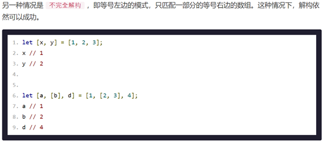

# ES6语法

## let 与 const

### let

`ES6` 新增了`let`命令，用来声明变量。它的用法类似于var，但是所声明的变量，只在let命令所在的代码块内有效。

不存在变量提升：


暂时性死区：

只要块级作用域内存在`let`命令，它所声明的变量就“绑定”`（``binding``）`这个区域，不再受外部的影响，在代码块内，使用let命令声明变量之前，该变量都是不可用的。这在语法上，称为“暂时性死区”（temporal dead zone，简称 TDZ）。

不允许重复声明：

let不允许在相同作用域内，重复声明同一个变量。

 


### Const

`const`声明一个只读的`常量`。一旦声明，常量的值就不能改变。

1. const PI = 3.1415;

const声明的变量不得改变值，这意味着，const一旦声明变量，就必须立即`初始化`，不能留到以后赋值。

const的作用域与let命令相同：只在声明所在的块级`作用域`内有效.

const命令声明的常量也是不提升，同样存在暂时性死区，只能在声明的`位置后面`使用。

## ES6 解构赋值

ES6 允许按照一定模式，从数组和对象中提取值，对变量进行赋值，这被称为`解构`（Destructuring）。

以前，为变量赋值，只能直接指定值。

```
1.    let a = 1;

2.  let b = 2;

3.  let c = 3;
```


ES6 允许写成下面这样。

1. let [a, b, c] = [1, 2, 3];

2. 上面代码表示，可以从数组中提取值，按照对应位置，对变量赋值。

3. 本质上，这种写法属于“模式匹配”，只要等号两边的模式相同，左边的变量就会被赋予对应的值。下面是一些使用嵌套数组进行解构的例子。

 

 

```javascript
1.  let [foo, [[bar], baz]] = [1, [[2], 3]];

2.  foo // 1

3.  bar // 2

4.  baz // 3

5.   

6.   

7.  let [ , , third] = ["foo", "bar", "baz"];

8.  third // "baz"

9.   

10.  

11. let [x, , y] = [1, 2, 3];

12. x // 1

13. y // 3

14.  

15.  

16. let [head, ...tail] = [1, 2, 3, 4];

17. head // 1

18. tail // [2, 3, 4]

19.  

20.  

21. let [x, y, ...z] = ['a'];

22. x // "a"

23. y // undefined    如果解构不成功，变量的值就等于`undefined`。

24. z // []
```


 

如果等号的右边不是数组（或者严格地说，不是可遍历的结构，参见《Iterator》一章），那么将会报错。

```
1.		// 报错
2.	let [foo] = 1;
3.	let [foo] = false;
4.	let [foo] = NaN;
5.	let [foo] = undefined;
6.	let [foo] = null;
7.	let [foo] = {};

ES6 解构赋值解构赋值允许指定默认值。
1.	let [foo = true] = [];
2.	foo // true

```

对象的解构

解构不仅可以用于数组，还可以用于对象。

```
1.	let { foo, bar } = { foo: 'aaa', bar: 'bbb' };
2.	foo // "aaa"
3.	bar // "bbb"

```

对象的解构与数组有一个重要的不同。数组的元素是按次序排列的，变量的取值由它的位置决定；而对象的属性没有次序，`变量`必须与`属性`同名，才能取到正确的值。


## 扩展运算符

`扩展运算符`（spread）是三个点（ ... ）。

ES6 引入 rest 参数（形式为`...``变量名`），用于获取函数的多余参数，这样就不需要使用`arguments`对象了。

```
 var a = [1, 2, 3]
        console.log(...a);  //1，2，3

//便历数组
for (var i of a) {
            console.log(i);
        }

```


## 箭头函数

ES6允许使用箭头`=>`定义函数


```
Var a=Function(){}

Var a= ()=>{}
```


## Arr.forEach()


```
 var fn = [1, 2, 3, 4, 5, 6]
        fn.forEach(item => {
            console.log(item);
        });

```

