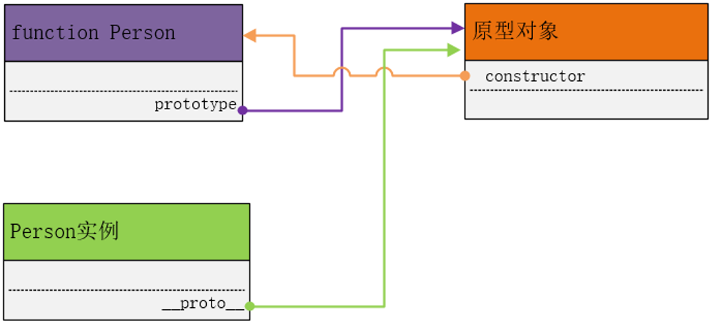
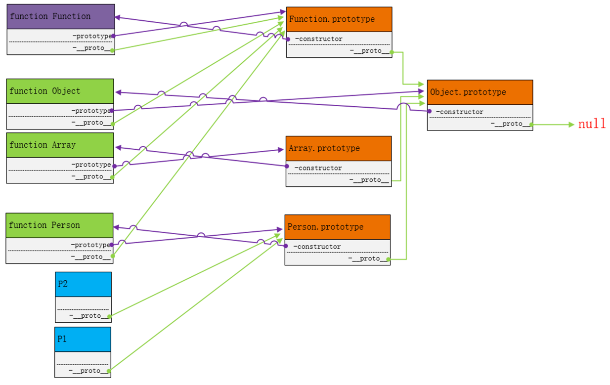

## 一，原型，原型链

### 1.万物皆对象

 **JavaScript是一门基于对象的语言，JS这门语言的基本组成部分就对象。**

  所以在JS中万物皆对象。代码上的体现为 **万物皆可点**

```
let list = [1,2,3]
list.xxx
//数组对象
function obj(){}
obj.xx
//函数对象 ..

```


**现实世界中：**

​        现实世界是一个物质的世界，我们目之所及都可以称之为东西。

​        那么我们仔细分析一下一个东西自身上面有什么？

​        例如：

​            桌子  (长、宽、高、材质...)

​            手机  (品牌、型号、颜色、价格...)    (打电话、发信息、视频...)

​            人       (姓名、性别、年龄...)           (说话、唱歌、跳舞...)

​            由此我们可以下个结论，现实世界的一个东西自身上具有的可以分为两类：

​            1. 信息       数据(属性)

​            2. 能力       功能(方法)

​        更重要的是属性或方法，不能脱离东西(主体)而单独存在，它们必须依附于某个东西(主体)。正所谓"皮之不存，毛将焉附"。这句话很重要。


​        我们再看一下现实中我们对事物的用语结构。

​        每当我们对事物进行描述时总会说 某某某的什么。例如：手机的价格、张三的年龄、李四在说话。这种用语能够准确而严谨的表达了我们的目的。不能省略主体，也不能仅有主体。

​      

**在程序中的体现：**

 	   程序是为了解决现实世界的问题，在解决现实世界的问题时，问题中必定会涉及到现实世界的东西。

​        在程序中为了能像现实世界中准确而严谨的对某个东西进行描述。所以程序语言中设计了一种定义的语法与调用的语法来模拟现实世界中的东西。

      ```
    let moby = {
    	name='xx'
    	fun = function(){
    		xxx
    	}
    }
      ```


### 2.面向对象编程思想

​		 简单来讲，面向对象编程思想就是在使用代码解决问题一种指导思想。

​            这种思想体现在代码上使用对象来解决所有问题。


​            在使用代码解决问题时，代码可以这讲，只分两类：

​            一类是数据，另一类是处理数据的代码。

​            无论是数据，还是处理数据的代码，不能脱离主体而单独存在。

​            所以在使用面向对象编程思想解决问题时，要先设计一个对象。

总结：

​            数据与处理数据的方法，必须依附于某个主体，有就使用，没有就自己设计(对象)


### 3.原型对象 (原型)

原型对象也是一个对象。

只要定义一个函数，js 系统会自动创建一个对象，这个对象就是原型对象

​        被创建原型对象是没有名子，由于没有名子就避免了全局污染问题。

​        没有名子如何来引用这个对象。


​         只要有函数，js 就会自动为这个函数创建一个对应的原型对象

​         这个原型对象肯定是与这个函数相关的，所以想引用这个原型对象，就需要通过 函数

​         `函数.prototype` 这个属性会指向系统创建的那个原型对象。


小结：

​            原型对象    

​                本质就是一个对象，

​                这个对象不是程序员创建的，由系统自动创建的。

​                只要有函数(自定义还是内置)，系统都会为其创建一个原型对象

​                原型对象是没有名子的，只能通过 对象名.prototype 来访问

**在原型对象上，有一个属性 constructor 这个属性指向 Person 构造函数**



#### 操作原型对象

1.创建构造函数

```
// 构造函数
function Mobile(c,p){
    this.color = c
    this.price = p
}
//构造函数创建完成后，js会自动创建一个原型对象
//Mobile.prototype  会指向系统创建的那个原型对象。
```

2.操作原型

```
// 在原型对象上添加一个方法
Mobile.prototype.music = function(){
    console.log('我还是曾经那个少年,没有一丝丝改变');  
}
```

3.实例化对象

```
let phone_a = new Mobile('red', 5000)
let phone_b = new Mobile('gold', 6000)

phone_a.music()  //我还是曾经那个少年,没有一丝丝改变
phone_b.music()  //我还是曾经那个少年,没有一丝丝改变
```


只要是添加到原型对象上的成员，

通过对象的实例都可以访问到。


小结：

​            以后所有实例对象要共享的方法，就添加到原型对象上。


#### 实例对象访问原型对象

实例对象：可以通过 `__proto__`这样的一个属性找到 原型对象

```
继续使用上方的例子
console.log(Mobile.prototype === phone_a.__proto__)     // true
```

 返回 true 说明 `Mobile.prototype`中"保存"的对象与 `phone_a.__proto__`中"保存"的对象是同一个对象

 实例对象，通过`__proto__`也能找到构造函数的原型对象。

 当一个对象，访问一个成员时,如果成员不存在则会自动到原型对象上找。


小结：

​            原型对象：系统自动创建的对象

​            构造函数.prototype 可以访问这个原型对象

​            实例对象.`__proto__` 也可以访问这个原型对象

​            当实例对象访问某个成员时，如果实例对象上没有，则会自动到原型对象上查找。


#### 构造函数-原型对象-实例对象总结


第1步：紫色的线 在 Person 上添加一个属性 prototype 这个属性指向 原型对象

```
Person.prototype = {}
```


 第2步：会在原型对象上，添加一个属性 constructor 这个属性指向 Person 构造函数 

```
//原型对象
 Person.prototype = {
     constructor:Person 

}
```


第3步：当 new Person 得到一个实例对象时，js 还会向这个 p1实例对象上添加一个属性`__proto__`，这个属性指向原型对象

```
 p1.__proto__ = Person.prototype
```


三角关系

​            构造函数.prototype = 原型对象

​            原型对象.constructor = 构造函数

​            实例对象.__proto__ = 构造函数.prototype


#### 向原型对象上添加成员的原则

影响原则的方面：看成员是否需要共享，还是独享。

​            原则就是：共享(只有一份)的，添加到原型对象上

​            独享的：定义在构造函数内

原则：

​            共享成员(属性与方法)定义在原型对象上

​            独享的成员定义在构造函数内


#### 成员的访问规则

```
function Person(){
            // 构造函数里定义的是属于实例自己拥有
            this.say = function(){
                console.log('我还是曾经那个少年,没有一丝丝改变');
            }
        }

        // 定义在原型对象上的，并不是实例所拥有，但可以被实例访问
        Person.prototype.say = function(){
            console.log('你撒谎....');
        }

        let obj = new Person()
        obj.say();
        */
```


 当访问一个对象的成员时，首先在实例上查找，如果有就使用，如果没有就向原型对象上查找

```
function Mobile(){

        }

        Mobile.prototype.model = 'plus'

        let m = new Mobile()
        // 这并不是修改原型对象上的成员，而是修改实例对象上的成员
        m.model = 'max'
```


#### 数组的方法保存位置

```
        let arr_a = new Array(10,20,30);        // let arr_a = [10,20,30]
        let arr_b = new Array('a','b','c');     // let arr_b = ['a','b','c']

        // arr_a.pop();
        // arr_b.pop();

        // pop()方法是保存在各自的实例对象上么？
        console.log(arr_a.__proto__);
```

 小结：

​            通过观察 数组的实例，以后自己定义的方法，如果是被所有的

​            实例对象所共有，就定义在 构造函数.prototype 原型对象上。


### 4. 替换原型对象

```
 function CC(){ }

 // 向默认的原型对象上定义一个 type 属性
 // CC.prototype = {}   // 系统默认创建了一个对象，并保存到 CC.prototype 属性上
 CC.prototype.type = 'CN'

 // 创建另一个对象
 let other = {
     type:'EN'
 }

 // 原型对象就是一个对象， 保存到 CC.prototype 属性中
 // protype 属性中的原型对象，也可以使用另一个对象替换掉
 CC.prototype = other

 let o = new CC()
 console.log(o.type);    // EN
```


原型对象是可以使用其他对象替换的


### 5. 继承

继承：子承父业。体现在代码就是一个对象能访问另一个对象上的成员

```
function Person(){}

// 原型对象上有成员
Person.prototype.money = '1000w'
Person.prototype.ability = function(){
    console.log('躺着都能赚钱');
}


function Poor(){}

// 解决办法：使用 Person.prototype 这个原型对象，将Poor.prototype 中的原型对象替换掉
Poor.prototype = Person.prototype

// Poor.prototype原型上没有 money 与 ability 成员
// 就导致由 Poor实例化出来的对象，也访问不到 money 与 ability
let o1 = new Poor()

// 问题：o1想访问 Person.prototype上的成员

console.log(o1.money);
```


小结：
    你实例化对象那一刻，构造函数 指向了哪个原型对象，
    那么你实例化出来的实例对象，上的`__proto__`就指向哪个原型对象
    使用别一个对象来替换原型对象实现的继承 就称之为 替换原型继承

```
function A(){}
function B(){}

B.prototype.fn = function(){}
// 替换原型
A.prototype = B.prototype

let o = new A()
```


### 6. 原型链

 原型链：就是由原型对象形成一个链条。
 而且在 JS 中一切皆对象
 任何一个对象都有原型对象
 通过函数找原型对象使用的是 `prototype` 这个属性
 非函数找原型对象使用 `__proto__` 这个属性

```
function Person(){}
let o = new Person()

// 原型对象是不是对象
console.log(o.__proto__)                // 从实例对象起的第一级原型对象
console.log(o.__proto__.__proto__)      // 从实例对象起的第二级原型对象(第一级原型对象 的 原型对象)
console.log(o.__proto__.__proto__ === Object.prototype);    
// true 这就证明了 
// 实例对象起的第二级原型对象(第一级原型对象 的 原型对象) 是 Object.prototype

console.log(o.__proto__.__proto__.__proto__)    // 从实例对象起的第三级原型对象 是 null


```

小结：
    原型链：就是由原型对象形成一个链条
    原型链可以人为的构造出很多环节，默认从实例对象起有四级
    第一级：实例对象
    第二级：构造函数.prototype(实例对象.__proto__)
    第三级：Object.prototype
    第四级：null

构造函数上有 prototype 属性，
非函数对象上有 __proto__，但没有 prototype 属性，只有函数 才有 prototype 这个属性


### 构造函数的原型链

```
// Date构造函数是内置的不需要创建，所以系统会自动创建与之对应原型对象

let myDate = new Date()     // 获取时间相关信息 

 console.log(Date.prototype);        // Date构造函数指向的原型对象

console.log(Date.prototype.__proto__);  // 指向的是原型对象的原型对象
        
// 原型对象的原型对象，都指向 Object.prototype
 console.log(Date.prototype.__proto__ === Object.prototype);
        
// Object.prototype 自己的原型对象 是 null
console.log(Object.prototype.__proto__);
 
 默认：
     原型对象的原型对象，都指向 Object.prototype
     Object.prototype 自己的原型对象 是 null

```

```
// Array也是系统预定义的
        // 

        let arr = new Array();
        console.log(arr.__proto__ === Array.prototype);
        // 原型对象的原型对象指向 Object.prototype
        console.log(Array.prototype.__proto__ === Object.prototype);
        console.log(arr.__proto__.__proto__ === Object.prototype);

        // Object.prototype原型对象，本身的原型对象 指向 null
        console.log(Array.prototype.__proto__.__proto__);
        console.log(arr.__proto__.__proto__.__proto__);
        console.log(Object.prototype.__proto__);
```

```
 let str1 = new String('hello')      // 
        let str2 = 'hello'

        console.log(str1.__proto__ === String.prototype);
        console.log(str2.__proto__ === String.prototype);

        console.log(str2.__proto__.__proto__ === Object.prototype);
        console.log(Object.prototype.__proto__);
        console.log(str2.__proto__.__proto__.__proto__)
        
```

 DOM元素也有自己的原型链，最终都会指向 Object.prototype 这个原型对象

### Function 构造函数

```
// 所有的函数(内置函数，自定义的函数)都是 Function 构造函数的实例对象

/* 

function fn(a){
    console.log(a)
}

*/

/* 
// 相当于定义一个函数，没有参数没有代码体
let fn = new Function()
console.log(fn);
 */

// 相当于定义了一个函数，有一个形参 a，函数内的代码 console.log(a)
let fn = new Function('a','console.log(a)')

console.log(fn);
fn(10)

/* 

构造函数也是对象

构造函数            构造相应对象的
Number()            构造 number 类型对象
String()            构造 string 类型对象
Date()
Array()
Boolean()
Object()            构造 object 类型对象

Person()

*/

/* 
小结：
    Function 这个构造函数，构造出了所有的其他的构造函数，
    其他所有的构造函数，就是Function这个构造函数的实例对象.
    Function 构造函数也构造了自己
    在 JS 中，最 NX 是 Function()
 */
```

### Function 构造函数的 prototype

```
// Function 是一个函数，那么它也有一个与之对应的原型对象
 console.log(Function.prototype);
 console.log(Function.prototype.__proto__);

 // Function构造函数的原型对象的原型对象 也是 Object.prototype
 console.log(Function.prototype.__proto__ === Object.prototype);

 /* 
 Function构造函数，虽然 构造了其他的构造函数(Number\Array...)，但
 它的原型链与其他被构造出来的构造函数的原型链几乎相同。
 */
```

### 所有函数对象的原型链

```
// 本小节，不要把函数当成构造函数，仅当成一个实例对象(Function 的实例对象)
// 所有函数的 __proto__ 都指向 Function.prototype

console.log(Array.__proto__ === Function.prototype)
console.log(Number.__proto__ === Function.prototype)
console.log(Date.__proto__ === Function.prototype)
console.log(String.__proto__ === Function.prototype)
console.log(Boolean.__proto__ === Function.prototype)
console.log(Object.__proto__ === Function.prototype)


// 自定义函数
function Person(){}
console.log(Person.__proto__ === Function.prototype)

console.log(Function.__proto__ === Function.prototype)


/* 
小结：
    所有函数的 __proto__ 都指向 Function.prototype 原型对象
*/
```


### 7.完整的原型链



​        默认：

​            Object.prototype "管理"所有的原型对象

​            Function.prototype "管理"所有函数实例对象


​        原型链相关的属性总结 

​            函数即有 prototype 还有__proto__

​            实例对象(非函数)只有 __proto__没有 prototype

​            constructor 原型对象有

​    

### 7. instanceof

​        // 通过 原型对象 判断 实例对象 与 构造函数的关系，

​        // 当构造函数将实例对象构造出来后，两者之间就没有直接的联系，所以需要通过原型对象

​        // 语法：

​        //     实例对象 instanceof 构造函数 

​        // 注意：前面是实例对象，后面是构造函数

​        //      判断 构造函数.prototype 是否在以 实例对象 为起点的原型链上

​        //      如果在就返回 true,否则返回 false

```

        function A(){}
        function B(){}

        let o = new A()

        console.log(o instanceof A);

        // 以 o 为起点的原型链上的，没有哪个原型对象，是 B.prototype 原型对象，把以返回 false
        console.log(o instanceof B);            // false

        console.log(o instanceof Object);            // true        

        // 尝试解释如下结果 
        console.log('---------尝试解释如下结果-----------');
        //          实例对象            构造函数
        console.log(Function instanceof Function);
        console.log(Function instanceof Object);
        console.log(Number instanceof Object);
```


### 8.Object.prototype

```
 // 默认所有的 对象的原型最终都会指向 Object.prototype 原型对象
        // 所以 JS 中所有的对象都可以调用 Object.prototype 原型上的成员

        console.log(Object.prototype);
        
        // 介绍 一个 Object.prototype 原型对象上成员
        /* 
        // 1. .hasOwnProperty('属性名')
        // 用于判断 成员是不是当前对象所拥有
        let obj = {
            // name 确定是 obj 对象所拥有的
            name:'zhangsan'
        }
        // age 虽然 可以访问，但并不属于 obj 所拥有
        obj.__proto__.age = 20
        console.log(obj.name);
        console.log(obj.age);

        console.log(obj.hasOwnProperty('name'));        // true
        console.log(obj.hasOwnProperty('age'));         // false
         */

/* 
        // 2. A.isPrototypeOf(B)
        //  判断 A 对象是不是 B 的原型对象
        function Person(){}

        let o = new Person();
        console.log(Person.prototype.isPrototypeOf(o))      // true

        let oa = {}
        console.log(Person.prototype.isPrototypeOf(oa))     // false

 */
/* 
        // 3. 对象.valueOf()
        //  有于获取对象的原始值(真实的)
        let arr = [10,20]
        console.log(arr.valueOf());
        console.log(arr);

        let obj = {name:'zhangsan'}
        console.log(obj.valueOf())
        console.log(obj)
         */
/* 
        // 4. 对象.toString()
        // 返回一个表示对象的字符串
        let arr = [10,20]
        let obj = {name:'zhangsan'}
        let a = 10
        function fn(){
            console.log('hello world');
            
        }
        console.log(arr.toString());        // '10,20'
        console.log(obj.toString());        // '[object Object]'
        console.log(a.toString());        // '10'
        console.log(fn.toString());
         */


        // 5. 对象.propertyIsEnumerable('属性名')
        // 判断对象的 属性是否可以被遍历出来
        let obj = {
            name:'zhangsan',
            age:20,
            sex:'女',
            salary:'10w'
        }

        // 通过 Object.defineProperty(对象,'属性名',{配置对象})
        //  对一个对象的属性进行详细的设置
        Object.defineProperty(obj,'salary',{
            enumerable:false,   //配置是否可以被遍历
            writable:false,     // 配置是否可以被修改
            configurable:false, // 是否允许被删除
        })

        obj.salary = '20w'
        delete(obj.salary)

        console.log(obj);
        

        for(let key in obj){
            console.log(key);
        }

        console.log(obj.propertyIsEnumerable('age'));       // true
        console.log(obj.propertyIsEnumerable('salary'));    // false
        

        /* 
        小结：
            Object.prototype 也有一些方法，方法有时也可能会用
        */

```


### 9. 实例成员与静态成员


```
/* 
        // 实例成员
        function Person(n,a){
            // this.xxx =xxx 向实例化出来的对象上添加成员
            this.name = n;
            this.age = a
        }

        // 得到一个 Personr 实例
        let p1 = new Person('zhangsan',20)
        // 构造函数内的 this.name =n  this.age =a 就是 实例对象 p1的 实例成员
        console.log(p1.name);
        console.log(p1.age);

        // name 与 age 虽然定义在 Person 函数内，但是属于构造出来的对象的成员 
        
     */
    </script>

    <script>
        
/*         // 静态成员
        function Person(n,a){
            this.name = n;
            this.age = a
        }

        let p1 = new Person('lisi',20)

        // 函数 也是对象，向函数对象上添加成员
        // 这个是加给函数 对象本身，这种加在函数对象上的成员就称之为 静态成员
        Person.gender = '男' */


        /* 
        小结：
            实例成员：
                属于实例对象的，代码体现 this.xxx = xxx

            静态成员：
                属于函数这个对象，代码体现  函数.xxx = xxx
         */
```


## 二，闭包

###  1 什么是闭包

  闭包：闭包就是一种代码形式(套路)，内部函数访问外部函数的局部变量。

```
// 外部函数
function outer(){
    // 外部函数的局部变量
    let n = 10 
    // 内部函数
    function inner(){
        console.log(n);
    }
    // 将内部函数return 出去，这样外部才可以调用
    return inner
}

let fn = outer();

console.log(fn);

fn();
```


### 2. 闭包的作用

1 .可以延长变量的生命周期


  变量的生命周期

​            全局变量：从声明开始 直到 页面关闭

​            局部变量：从声明开始 函数执行结束

```
// 全局变量
let n = 10
function ck(){
    console.log(n);
}

function outer(){
    // 局部变量：特点一只能在函数 内部访问
    //      另一个特点，函数执行结束后就会被销毁
    let b = 20
    // console.log(b);

    function inner(){
        console.log(b);
    }

    return inner
}

let ckb = outer();

// 尝试在外部访问， 这样直接读取必定报错
// console.log(b);
```


作用2：提供了有限制的访问权限

```
function data(){
  let age = 18
  
  // 读取操作，一种操作
  function getAge(){
      return age
  }

  // 设置操作
  function setAge(n){
      // 在赋值时，所赋的值进行合理的校验
      if(n>0 && n <100){
          age = n
      }
  }

  return {
      getAge:getAge,
      setAge:setAge
  }
}

let op = data();        // 
op.setAge(80)
op.setAge(180)
console.log(op.getAge())
```


作用3：声明私有属性


私有属性:
   // 私有属性一词来源于纯正面向对象语言。
   // 简单来讲私有属性只能通过调用对象的方法才能操作的数据就是私有属性。
   作用3与作用2几乎相同，这里仅是为了突出一个 私有属性 术语

```
// 普通属性
function Person(n,a){
   this.name = n
   this.age = a
}

let p = new Person('zhangsan', 18)
p.age = 20
console.log(p);
*/


// 私有属性
function Person(n,a){
   let name = n
   let age = a

   this.setAge = function(age){
       if(ag>0 && ag < 100){
           age = ag;
       }
   }

   this.getAge = function(){
       console.log(age);
   }

}
let p = new Person('zhangsan', 18)
p.setAge(120)
p.setAge(12)
p.getAge();
```

### 3. 闭包的注意事项

因为：
    外部函数如果多次调用时，每次都会创建不同的作用域，
    不同的作用域内创建不同的局部变量，创建不同的内部函数，
    返回的也是不同的内部函数
    

​	每次调用接收到返回函数，操作都是各自的作用域内的局部变量

所要注意:
    出自同一次外部函数调用，而得到的内部函数，在多次调用时操作的是同一个局变量。
    如果不是同一次外部函数调用，而得到的内部函数，在多次调用时操作的不是同一个局变量。

```
function outer(){
    let n = Math.floor(Math.random() * 100)
    function inner(){
        console.log(n);
    }
    return inner
}

/* 
let fn = outer();       // 仅调用一次外部函数
// 出自同一次外部函数调用，得到的内部函数，被多次调用
fn();
fn();
fn();
 */


let fna = outer()
fna();          // 是不是一样的
let fnb = outer()
fnb();          // 是不是一样的
let fnc = outer()
fnc();          // 是不是一样的

```


思考

```
 /* 
        window.name = 'window'

        let obj = {

            name:'zhangsan',

            getName: function(){
                return function(){
                    // 当前函数不是方法，所以使用 this 需要向上找
                    return this.name
                }
            }
        }

        console.log(   obj.getName()  ()    );     // ?输出什么

 */


        window.name = 'window'

        let obj = {
            name:'zhangsan',
            getName: function(){
                let that = this
                return function(){
                    return that.name
                }
            }
        }

        console.log(obj.getName()());

    </script>


    <script>
        // 作用域链：由多层嵌套的函数的作用域开成的一个作用域的链接 
        // 链式查找： 
        //  当一个函数内使用一个变量时，如果找不到则向上一级作用域查找，****这个变量的声明语句**** 找到就使用

    </script>
```

## 三，沙箱模式

沙箱模式：就是一个自执行函数，用一个自执行函数完成一个相对独立的一个功能
沙箱模式就是让完成一个功能的代码相对独立


沙箱就是使用一个自执行函数，将一个功能封装起来。
默认外部就不能访问里面的数据了。
如果想访问，需要传递一个对象进来，在内部将数据保存到对象的属性上


```
(function(w){

    // ------------ 一个小功能
    // 计算1 - 100 之间的整数和
    let sum = 0
    for(let i=0;i<=100;i++){
        sum += i;
    }

    // 比喻这个 sum 是一个数据，这个数据目前只能在"沙箱"内使用
    console.log(sum);

    // 有时"沙箱"内的数据需要被外部使用,将数据保存到一个对象上
    window.total = sum
    // ------------ 一个小功能

})(window);


// 在外面访问内部的数据
console.log(window.total);

 

```


## 四，递归

### 什么是递归

什么是递归：一个函数在内部再调用自己就是递归

```

/* 
// 递归在代码上的体现就是如下：

function fn(){
    // ...
    // ...
    // ...

    fn()            // fn()为分界线，代码分两部分


    // ...
    // ...
    // ...
}
*/

/* // 递归实现的就是一段的重复调用
// 输出1至5之间的整数，使用 while 循环解决
let i = 1;

while(i<6){             // 
    console.log(i);
    i++;
}
*/
/* 
while 之所有能自己循环执行？while 具有两个必备的能力
    1. while 语法天生具有判断条件的能力
    2. while 语法天生具有根据判断的结果，重复执行代码的能力
而这些就是 while 语法中就已经设计好的
*/

/*      
let i = 1;
function fn(){
    console.log(i);
    i++

    if(i<6){
        fn()
    }
}

fn();
*/

/* 
递归:
    函数内部自己调用自己就是递归 

 */

```


### 递归的执行过程

```
       function fn(a){
            a++                 // 
            console.log(a);   // 1 2 3 4
            if(a<4){
                fn(a)           // fn(1)     fn(2)         
            }
            // console.log(a);      // 4 3 2 1
        }

        fn(0)           //  4 3 2 1


        // 循环：一段代码完全执行结束后，再执行另一次
        // 递归：
        //      递归内的代码可分为两部分
        //      一部分是立即执行，
        //      另一部分是当下一次函数内的代码完全执行结束后再执行，返回来后再执行


/* 

function fn(a){
    a++ 
    if(a<4){
        // fn(a)   
                a++ 
            
                if(a<4){
                    // fn(a)
                                a++ 
                
                                if(a<4){
                                    // fn(a) 

                                            a++ 
            
                                            if(a<4){
                                                fn(a)       
                                            }
                                            console.log(a);


                                }
                                console.log(a);

                        
                }
                console.log(a);

    }
    console.log(a);
}

 */
```


### 递归案例

#### 斐波那契数列

```
// 斐波那契数列：
// 
// 有这样的一组数：
// 位       1   2   3   4   5   6   7   8   9   10         ... n 位

// 数       1   1   2   3   5   8   13  21  34  55         ... 斐波那契数列：     

// 定义一个函数求 第n 位 对应的数是多少
/* 
传的 n 是第几位，return 的就位上对应的数
*/
function fn(n){
    if(n == 1  || n == 2){
        return 1
    }else{
        return fn(n-1) + fn(n-2)
    }
}

console.log(fn(2))
console.log(fn(3))
console.log(fn(4))
console.log(fn(10))
console.log(fn(20))

console.log(fn(39))
```

#### 解决斐波那契数列性能问题

```
/* 
优化方案：
    1. 将计算出来的每1位上对应的数，保存到一个对象中 cache。 位数:值     
    {
        位      值
        1   :  1,
        2   :  1,
        3   :  2,
        4   :  3
     }
    2. 每次调用 fn(n) 时先到 cache 对应中找是否记录有当前的 n 对应的数，
        如果 有就直接从 cache 返回这个数，如果没有再调用 fn()去计算
*/


let m = 0
// 定义一个对象用于记录已计算出来的值 
let cache = {}  

function fn(n){
    // 对于当前的位 先到 cache 对象中查找 是否有对应的位
    if(cache[n]){
        // 有就直接从 cache 中返回，而不是再重新调用 fn 计算一次
        return cache[n]
    }else{
        // else 就是没有才不得已才重新计算一次
        m++;
        if(n == 1  || n == 2){
            // 将计算出来的数与位进行了记录
            cache[n] = 1
            return 1
        }else{
            let v = fn(n-1) + fn(n-2)
            // 将计算出来的数与位进行了记录
            cache[n] = v
            return v
        }
    }
}

console.log(fn(400));


// 位       1   2   3   4   5   6   7   8   9   10         ... n 位

// 数       1   1   2   3   5   8   13  21  34  55         ... 斐波那契数列： 

/* 

                        fn(6)
            fn(4)                                fn(5)
        fn(3)   fn(2)                   fn(3)                       fn(4)   
    f(1)    fn(2)                    f(1)    fn(2)          fn(3) 3      fn(2) 1
                                                        f(1)        fn(2) 

// 位数底的会先得到对应的数‘

let cache = {}
caceh['1'] = 1
caceh['2'] = 1
cache['3'] = 2
*/
```

#### 使用闭包优化斐波那契数列的代码

```
fn 函数，内部依赖(使用) 外部的 cache对象
*/

// 定义一个对象用于记录已计算出来的值 
let fibonacci = (function(){
    let cache = {} 

    function fn(n){
        // 对于当前的位 先到 cache 对象中查找 是否有对应的位
        if(cache[n]){
            // 有就直接从 cache 中返回，而不是再重新调用 fn 计算一次
            return cache[n]
        }else{
            // else 就是没有才不得已才重新计算一次

            if(n == 1  || n == 2){
                // 将计算出来的数与位进行了记录
                cache[n] = 1
                return 1
            }else{
                let v = fn(n-1) + fn(n-2)
                // 将计算出来的数与位进行了记录
                cache[n] = v
                return v
            }
        }
    }

    return fn
})();

console.log(fibonacci(100));

```


## 五，临时借用函数

### 函数上下文件调用模式

 函数借用其他对象的方法有三种形式

  `call()、apply()、bind()`

这三个方法都在 `Fucntion.prototype`上，这个对象是所有的函数对象的原型对象

 所以所有的函数对象都可以调用这方法  函数名.call() 函数名.apply() 


#### 1.call()    

用于被函数对象调用

语法：

​     函数名.call(替换this的对象, 实参列表)

​			call 里的第1个参数，来借用前面的函数，借用的过程中函数内的this 就是替换后的对象

​            call 方法的第1个参数，表示前面的方法由谁调用，第1个之后的参数，是向前面被借用的函数传递的实参

​     字面意思：一个函数对象调用 call 方法时，函数内的 this 会被传递给 call 的第1个形参所代替

​     通俗解释：call()方法就是借用前面的函数，由 call 方法的第1个参数对象来借用。

```
 let zhangsan = {
            fruit:' apple ',
            machine:function(a,b,c){         // 榨汁机
                console.log(a,b,c);
                console.log('榨' + this.fruit + '汁');
            }
        }

        let lisi = {
            fruit:' banana ',
        }

        // zhangsan 的 machine 是一个函数对象，来调用 call()方法
        zhangsan.machine.call(lisi,10,20,30)     
        //相当于 lisi.临时借用machine()这个方法，在临时借用这个时间，machine属于 lisi

```


​           

​       

#### 2.apply() 

apply()  与 call()相同，都可以实现一个方法借用另一个对象使用

​         不同点，体现在为被借用的方法传统参数的格式上。

​         call()在为被借用的函数传递参数时，需要分别传递 (单个值)

​         apply()在为被借用的函数传递参数时，需要组织成数组进行传递

       let zhangsan = {
                machine:function(a,b,c){        // 被借用的函数，形参不是数组，独立的
                    console.log(this);
                    console.log(a,b,c);
                }
            }
      let lisi = {
            name:'lisi'
        }
    
        zhangsan.machine.call(lisi,10,20,30)        // call 传递时要独立传递
    
        zhangsan.machine.apply(lisi,[10,20,30])        // 虽然 形参是独立的，那么必须使用数组进行传递

​        小结：

​            call()与 apply()都可以借用函数，区别在向被借用的函数传递实参的格式

​            apply()要求传递的是数组格式


#### 3.bind()

​	bind()不会自动调用，只会注册

```
// bind()   也可以借用函数
        let zhangsan = {
            machine:function(){
                console.log(this);
            }
        }

        let lisi = {
            name:'lisi'
        }

        // zhangsan.machine.call(lisi)         // 有结果输出！ 意味着这个machine 被立即调用了


        zhangsan.machine.bind(lisi)         // 没有输出！！！ 意味着这个 machine 没有被调用

```


实现将方法借用组其他对象使用。

​        1. call()

​            函数.call(借用的对象,实参列表)

​        2. apply()

​            函数.apply(借用的对象,[实参列表])

​       3. bind()

​            函数.bind(借用的对象,实参列表)


​        说明：

​            将 函数 借用 第1个参数(对象)使用(体现在代码上是 借用的对象 会将 函数内的 this 替换)

​        区别：

​            call() 与 apply()   区别在于 向函数传递参数

​            call()\apply() 与 bind()    区别在于 bind()不会立即调用 而 call()\apply()会立即 调用


### 函数上下文件调用模式注意

1. 任何函数都可以.call() .apply .bind()

​            原因是这三个方法是定义在 `Function.prototype` 原型上的

2. .call() .apply() .bind() 第2及其后的参数才是传递给 被调用的函数的参数

3. 了解 基本数据类型借用其他方法时，this指向

4. 一定要分清楚哪个函数是被借助的


### apply赏心悦目之处

```
// apply 与 call 都可以借用一个函数，并传递参数
 // 但 apply 自身更大的做点是，可以避免数组/伪数组被展开传递

 // 不知道对多少个数据进行求和
 // getSum 里的代码是不能改
 function getSum(){
     let sum = 0
     for(let i=0;i< arguments.length;i++){
         sum += arguments[i]
     }
     console.log(sum); 
 }


 // 如果需要被统计求和的数据是存在多个变量中的，可以直接调用 getSum()，分别 传递即可
 let a = 10
 let b = 20
 let c = 30
 let d = 40
 getSum(a,b,c,d)     // 不需getSum 被调用


 // 另一种情况，需要被统计的数据是数组(对数组中的元素进行统计）
 let arr = [10,20,30,40,50,60,70,80,90]        // 放在实际 应用中，数组中的数组项是不知道有多少个的

 // 由于被借用的 getSum 函数内涉及不到 this，所以使用 null 作为 call 的第一个参数 的占位
 // 如果使用 call 需要将原始数据 展开成多个数据进行传递
 // getSum.call(null,arr[0],arr[1],arr[2],arr[3])       //

 // apply 就解决了这样的问题，而且避免了所提供的数组被展开了
 getSum.apply(null,arr)

 /* 
 小结：
     apply 应用场景，
     被借用的函数要求独立传递参数,
     但实际数据是以数组的形式提供的
 */
```


案例 求数组最大值

```
let arr = [10,20,30,40,30,10]       // 这里的元素的个数是不确定的

        // Math.max()
        //  求多个数中的最大值，Math.max()要求的实参的形式是什么样的，
        //  独立传递实参

        console.log(Math.max(arr))              // NaN
        console.log(Math.max.apply(null,arr))       // 正确

        // 求最小值
        console.log(Math.min.apply(null,arr))       // 正确
```


### 借用构造函数实现继承

```
// 继承：一个对象具可以使用另一个对象上的成员。
/*         
        // 利用替换原型对象实现继承 
        function Person(){

        }
        Person.prototype.say = function(){
            console.log('hello');
        }

        // -------------另一个构造函数
        function Student(){

        }

        // 替换原型实现继承
        Student.prototype = Person.prototype

        let stu = new Student()
        stu.say();

        // ------实现的是继承原型对象上的方法
 */
```

```
 // 借用构造函数实现继承
        function Person(){

            this.age = 20
            this.report = function(){
                console.log(' 我的名子是....');
            }
        }

        // -------------另一个构造函数
        function Student(){
            // 在这里借用 Person构造函数实现继承，构造函数内的成员
            Person.call(this)
        }

        let stu = new Student()
        console.log(stu);

        // Person 构造函数内的两个成员在不在 Person.prototype上 
        // 让 student 实例出来的对象上也要具有 Person 构造函数内的两个成员

        /* 
        小结：
            借用构造函数实现继承
            继承了什么：构造函数内的成员
        
         */
        
```


### 组合继承

```
// 组合继承
        function Person(){
            this.age = 20
            this.report = function(){
                console.log(' 我的名子是....');
            }
        }

        // 原型对象上的方法
        Person.prototype.say = function(){
        console.log('hello');
        }

        // -------------另一个构造函数
        function Student(){
            // a. 利用借用构造函数实现继承
            // 在这里借用 Person构造函数实现继承，构造函数内的成员
            Person.call(this)
        }

        // b. 现利用替换原型对象实现继承
        Student.prototype = Person.prototype

        let stu = new Student()
        console.log(stu);
        stu.say();      // 访问不到

        /* 
        小结：
            两种继承 一起使用
        
        */
```


### 万能数据类型检测

```
// typeof 可以检测数据类型，但对于复杂数据类型不精准
        // 在 JS 中数据类的检测是一个比较麻烦的事
        // 下面的方法虽然不高端，但非常全面，并且很精确

        let str = 'hello'
        let num = 10
        let bool = true
        let nul = null
        let und = undefined
        let arr = [10,20]
        let obj = {}
        function fn(){}

        /* 
        console.log(typeof(str));
        console.log(typeof(num));
        console.log(typeof(bool));
        console.log(typeof(fn));

        console.log(typeof(nul));
        console.log(typeof(und));
        console.log(typeof(arr));
        console.log(typeof(obj));

        */

        // 可以借用 Object.prototype.toString()，来精准的获取数据类型  
        // 将 Object.prototype 上的 toString()方法借用给各种数据类型，就可以得到精确一个字符表示的类型
        console.log(Object.prototype.toString.call(str));       // '[object String]'
        console.log(Object.prototype.toString.call(num));       // '[object Number]'
        console.log(Object.prototype.toString.call(bool));      // '[object Boolean]'
        console.log(Object.prototype.toString.call(und));      // '[object Undefined]'
        console.log(Object.prototype.toString.call(fn));        // '[object Function]'

        console.log(Object.prototype.toString.call(nul));       // '[object Null]'
        console.log(Object.prototype.toString.call(arr));       // '[object Array]'
        console.log(Object.prototype.toString.call(obj));       // '[object Object]'


        // 判断某种数据的类型
        // 以下五种可以使用 typeof 精准的判断数据类型
        console.log(Object.prototype.toString.call(str) === '[object String]');     
        console.log(Object.prototype.toString.call(num) === '[object Number]');     
        console.log(Object.prototype.toString.call(bool) === '[object Boolean]');    
        console.log(Object.prototype.toString.call(bool) === '[object Undefined]');    
        console.log(Object.prototype.toString.call(fn) === '[object Function]');      

        // 以下三种可以使用 以下方法精准的判断
        console.log(Object.prototype.toString.call(nul) === '[object Null]');     
        console.log(Object.prototype.toString.call(arr) === '[object Array]');     
        console.log(Object.prototype.toString.call(obj) === '[object Object]');     

```


## 六，正则表达式

正则：正确的规则

正则就是对字符内容的一个格式上的正确的要求

例如：用户名，就是一个字符串
           用户名只能包含字母、数字、下划线，此处的字母、数字、下划线是不是对用户正确的格式要求。

```
 let str = 'xxxxx';
```

正则是一个规则，体现在代码上就是一个表达式


### 1. 创建方法

**1.字面量 ** /模板/

```
// 创建方法1：字面量
 let reg = /abc/
```

**2,构造函数 ** `new RegExp`


```
// 创建方法2：使用构造函数
let reg1 = new RegExp(/abc/)
console.log(reg1); 
```


### 2.正则的定义

#### 1.自定义类

 正表达式中的字符与字面意思相同

```
// let reg = /ad/          // 字面是 ad，表示的真正的含义就是 ad
// let reg2 = /\d/          // 字面是\d，但表示的真正的含义不是\d，而是数字

 // 示例：
let reg = /world/           // 就表示是 字符串的内容是 world
let str = 'hello world'
console.log(reg.test(str)); 
```


#### 2.预定义的类

预定义的类：正则系统，预先定义好的符号表示不同的含义。

| 代码表示 |         含义         |
| :------: | :------------------: |
|    \d    |   表示任何1位数字    |
|    \D    |      表示非数字      |
|    \w    |  字母、数字、下划线  |
|    \W    | 非字母、数字、下划线 |
|    \s    |     不可以见字符     |
|    \S    |       可见字符       |


```
let str = '9'           // 字符串中包含数字
let reg = /\W/           // 就是自定义的没有特殊含义
console.log(reg.test(str));


        console.log(/\d/.test('a8p'));
        console.log(/\D/.test('a'));
        console.log(/\w/.test('a'));
        console.log(/\w/.test('8'));
        console.log(/\w/.test('_'));
        console.log(/\w/.test('&'));
        console.log(/\W/.test('&'));
        console.log(/\s/.test(' '));
        console.log(/\s/.test(''));
```


#### 3.或，优先级

1.或  `|`   

默认的运算规则  左侧完整匹配  或 右侧完整的匹配

默认匹配左侧与右则完整的部分(贪婪模式)

```
// let reg = /book|look/       // 用于匹配 book 或 look
// console.log(reg.test('book'))
// console.log(reg.test('look'))
// console.log(reg.test('lool')) 
// console.log(reg.test('kook'))
```


2. 优先级  `()`    (左侧|右则)

用于限定或运算左右两侧或的内容

```
		 // 括号内的左而与右的或关系
        let reg1 = /boo(k|l)ook/       //  bookook 或 boolook
        console.log(reg1.test('bookook'));
        console.log(reg1.test('boolook'));
        console.log(reg1.test('book'));
        console.log(reg1.test('look'));

        let reg2 = /boo(k|l)/       //  book 或 bool
```


#### 4.简单类（单字符） 

`[]` 匹配多种  单个字符

```
// 需求： 匹配 a  e  f  d 字符
// let reg = /a|e|f|d/
```

```
let reg = /[aefd]/          // 同一次只能匹配到1个(a或 e 或 f或 d)
// 多个单字符的或  []
 console.log(reg.test('b'))

// 注意：
let reg2 = /aefd/           // 要匹配四个字符   aefd
console.log(reg2.test('b'));
        
// 你所定义的正则能匹配到几个符号
```


#### 5.范围类 

`[开始-结尾]`   匹配【开始-结尾】中任一 一个

```
// 需求： abcd...xyz 所有的符号
// [a-z]    [a-g]      [a-9] 
let reg = /[a-z]/           //  匹配任何一个小写字母
console.log(reg.test('b'))


//  [A-Z]       匹配大写
console.log(/[A-Z]/.test('C'));
```

#### 6.负向类

`[^开始-结尾]`    反向匹配

在范围类最前面加一个 ^ 就反向匹配的意思，注意在中括号内部的前面加^

```
       //  在范围类最前面加一个 ^ 就反向匹配的意思，注意在中括号内部的前面加^
        //      /[^a-z]/        匹配的就是非小写字母

        console.log(/[a-z]/.test('a'));
        console.log(/[^a-z]/.test('a'));
        console.log(/[^a-z]/.test('9'));

        console.log(/[^0-7]/.test('9'));
        console.log(/[^0-7]/.test('5'));


        console.log(/[^aegh]/.test('a'));

       
```


#### 7.组合类

[**开始-结尾**另一开始-结尾]

```
		// 1. 
        // 匹配字母或数字
        // console.log(/[a-z0-9]/.test('a'));
        // console.log(/[a-z0-9]/.test('9'));
        // console.log(/[a-z0-9A-Z]/.test('B'));

        // 2. 组合2
        // 要匹配一个小写字母后面跟着一个数字，这个需要是匹配两个字符
        console.log(/[a-z][0-9]/.test('a9'));


        // 数字前面不能是小写字母
        console.log(/[^a-z][0-9]/.test('A9'));  


        console.log(/[^a-z][0-9]/.test('9A'));  
```


#### 8.边界类

`^`x   以x开头    ；x`$`  以x结尾

默认，如果没有边界(开始与结束)的限制，正则只要匹配字符串的任何一个部分都算成功

```
//      ^       匹配内容的开头      /^a.../     表示以 a 开头
//      $       匹配内容的结尾      /....a$/    表示以 a 结尾

        console.log(/^a/.test('abc'));          // true
        console.log(/^a/.test('bc'));           // false


        // 默认，如果没有边界(开始与结束)的限制，正则只要匹配字符串的任何一个部分都算成功
        console.log(/a/.test('bac'));           // true 

        console.log(/a$/.test('asdfa'));        // true 
        console.log(/a$/.test('asdaf'));        // false 
        
```

#### 9.严格匹配

所谓的严格匹配就是前后都限制   `/^......$/`

必须完全匹配 才会返回true

```
        let reg = /^a/          // 仅限制了开头
        let reg2 = /a$/         // 公限制了结尾


        // 匹配一个字符串全部的内容，内容是 hello
        let reg3 = /hello/
        console.log(reg3.test('hello'));
        console.log(reg3.test('helloasdfasdf'));
        console.log(reg3.test('asdfasdfhelloasdfasdf'));

        let reg4 = /^hello$/
        console.log(reg4.test('hello'));
        console.log(reg4.test('helloasdfasdf'));
        console.log(reg4.test('asdfasdfhelloasdfasdf'));
        
```

#### 10.匹配汉字

由于汉字不向数字与字母一样有顺序。
所汉字只能获取在计算内的编码来匹配 `\u` 表示 unicode  `[\u4e00-\u9fa5]`

```
 // 匹配汉字     /[\u4e00-\u9fa5]/

console.log(/[\u4e00-\u9fa5]/.test('china'));
console.log(/[\u4e00-\u9fa5]/.test('中'));
```


#### 11.数量词

量词：用于修改前面的规则

| 代码表示 |                含意                 |
| :------: | :---------------------------------: |
|    ?     | <=1    有或没有,    如果有只能有1次 |
|    *     |          >=0    次数不限制          |
|    +     |          >=1    至少有1次           |
|   {m}    |         =m      只能是 m 次         |
|   {m,}   |      >=m             至少 m次       |
|  {m,n}   |  >=m && <=n      至少 m次最多 n 次  |

```
/* console.log(/\d/.test(''));      // false
        console.log(/\d?/.test(''));      // true
        console.log(/\d?/.test('1'));      // true

        // 如果有只能有1次
        console.log(/^\d?$/.test('1'));      // true
        console.log(/^\d?$/.test('12'));      // false
*/
 // console.log(/\d*/.test(''));            // true
        // console.log(/\d*/.test('1'));           // true
        // console.log(/\d*/.test(''));            // true
        // console.log(/^\d*$/.test('123'));       // true
        // console.log(/^\d*$/.test('123a'));          // false 

        // console.log(/\d+/.test(''));            // false
        // console.log(/\d+/.test('1'));           // true
        // console.log(/\d+/.test('13'));          // true
```


```
        console.log(/\d{3}/.test('123'));       // true
        console.log(/\d{3}/.test('12'));        // false

        // 正则如果没有限制，表示字符串全部或才部分匹配到都算成功
        console.log(/\d{3}/.test('1245'));      // true


        console.log(/\d{3}/.test('1245'));      // true
        console.log(/\d{3,}/.test('1245'));      // true
        console.log(/\d{3,5}/.test('1245'));      // true
```


#### 12.全局,不区分大小写


```
        //  需求：查 str 字符串，连续出现的数字是什么
        let str = 'asd123fa456s789df'

        // 对于 match 方法，如果想获取所有满足正则规则 的内容，
        // 需要在正则后加 g 
        // g        global(全局)

        let reg = /\d+/g;            // 连续多个数字
        console.log(str.match(reg));

        */
    </script>
    <script>
        let str = 'hello'
        // 默认正则的匹配是区分大小写的
        // 如果不想区分大小写，需要在正则后加 i
        let reg = /HELLO/i

        console.log(reg.test(str));   

        /* 
        小结：
            g   表示全局匹配
            i   表示不区分大小写
         */
```


### 应用:字符方法

```
        // str.match()      
        //      查找字符串的内容
        // let str = 'hello 111'
        // console.log(str.match('111'))


        // 示例1：
        /* 
        //      还可以根据一个正则去查找 内容
        let str = 'hello 2'
        // 在字符串 str查找 数字？有没有明确告诉你查找哪个具体的数字
        let reg = /\d/;
        console.log(str.match(reg))
        // str.match()字符串的方法，也可以根据正确进行匹配内容
        */

        // 示例2：
        //  需求：查 str 字符串，连续出现的数字是什么
        let str = 'asd123fa456s789df'
        let reg = /\d+/;            // 连续多个数字
        console.log(str.match(reg));

```


### 3.正则的使用

正则的方法:test()

有一个正则表示式(正则对象)，后就可以使用 test()来判断一个字符串是否满足正则所表示的规则 

```
let str = 'ab'  
let reg2 = /abc/                // 此处正则的含义是 判断字符串的内容是否包含 abc
console.log(reg2.test(str));    // false
console.log(reg2.test('abc'));    // true
console.log(reg2.test('abcd'));    // true
```


```
// replace()
        // str.replace(查找内容,新内容)
        //  在字符串 str 中 将 查找内容  替换  新内容

        // let str ='hello world'
        // let ret = str.replace('world', '***')
        // console.log(ret);
        

        // 将字符串中连续的数字替换为 ***
        let str = 'sdjf123lkasd456jfga789hsdf'

        // 
        let reg = /\d+/g
        let ret = str.replace(reg,'***')
        console.log(ret);

```


```
// 将字符串内容以连续的数字分割
        let str = 'sdjf123lkasd456jfga789hsdf'
        
        // 
        let reg = /\d+/

        let arr = str.split(reg)
        console.log(arr);

        /* 
        小结：
            replace()方法与 split()方法都可以接收一个正则对象作为参数
        
         */
```


### 分组提取

```
		/* 
        // test()   返回是否匹配成功
        // exec()   可以获取 匹配到的内容

        let str = 'he897llo'
        let reg = /\d+/

        // test()返回的是布尔值
        console.log(reg.test(str));     // true
        // 返回的是匹配到的内容的相关信息
        console.log(reg.exec(str));     // ['897', index: 2, input: 'he897llo', groups: undefined]
        */
    </script>
    <script>
        let str = 'sdf5asd9f'

        let reg = /\d[a-z]+\d/      // 正则的 整体 匹配的是 两端是数字中间是字母
        console.log(reg.exec(str)); 

        // 需求，不想要正则匹配到全部内容，只要要正则匹配到的部分内容
        // 只想要 被数字包含的字母
        let reg2 = /\d([a-z]+)\d/      // 在这个正则中 前后的 \d 是一个参照 ，但没有又不行。
        let arr = reg2.exec(str)
        console.log(arr[0]);        // 5asd9
        console.log(arr[1]);        // asd
        
        /* 
        小结：
            只要正则中有小括号 ()  
            在使用 exec 进行正则在匹配时，整个正则匹配到的内容会返回，
            而且 小括号()   括起来的正则部分，所匹配到的内容也会单独返回。
        */


/* 
        let stra = '123456'

        let rega = /(\d\d)(\d\d)(\d\d)/

        console.log(rega.exec(stra));
         */
```


## 七，浅拷贝与深拷贝

基本数据类型无所谓的浅拷贝与深拷贝

**浅拷贝：**

​            数组或对象在进行赋值时，传递的地址，两个变量共同指向同一个址

  		  在对数组或对象进行赋值时，默认传递的就是数据的地址，这种方式就浅拷贝

**深拷贝：**

​			 深拷贝的目标是得到两份完全独立的数据。

​            在 JS 没有哪个运算可以直接进行简单的赋值就可以实现深拷贝。只能通过编码实现。

​            jQuery 提供了这样的方法

​            $.extend(true, 新对象,原对象)


​            在 JS 中没有哪个赋值运算符，可以帮我们实现，只能自己写代码来实现。

​            但是深拷贝，想得的是完全独立的两份数据

​            可以借助别人写的代码。例如： jQuery

​            `$.extend(新对象,原对象)`

   **深拷贝的原理：**

​            将数据一个个遍历出来，再赋值给新对象即可。

```
let oa = {
  name:'zhangsan',
}

let ob = {}
let oc = oa     // 就是浅拷贝，oc 与 oa 两个变量，中保存的是同一个地址。
// oa 是将地址传递给了 oc

 $.extend(true, ob, oa)    // 内部是通完遍历的形式将数据读取出来再赋值给 ob，实现的是更深层次的数据的复制
// ob = oa 
// ob.name = oa.name

console.log(ob===oa);
ob.name= 'lisi'
console.log(ob.name);
console.log(oa.name);
```

### 编码实现深拷贝

```
function deepCopy(data){
    // 由于传递的数据 可能是对象也可能是数组，要进行判断才能决定是创建对象还是数据 来接收 data 中的数据
    if(Object.prototype.toString.call(data) === '[object Object]'){
        // 创建一个新对象
        let nObj = {};
        // 遍历原对象成员，依次赋值给 nObj
        for(let key in data){
            // 
            nObj[key] = deepCopy(data[key])
        }
        
        return nObj

    }else if(Object.prototype.toString.call(data) === '[object Array]'){
        // 处理的是数组
        let nArr = [];
        for(let i=0;i< data.length;i++){
            nArr[i] = deepCopy(data[i])
        }
        return nArr

    }else{
        // 处理的是普通的数据(非对象与数组)
        return data
    }
}

```

