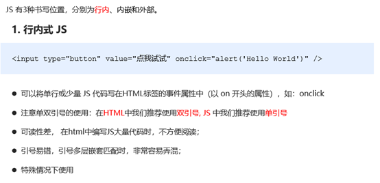
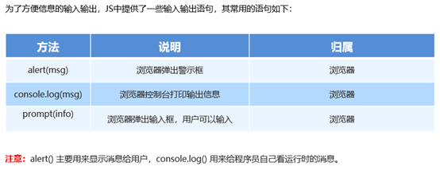
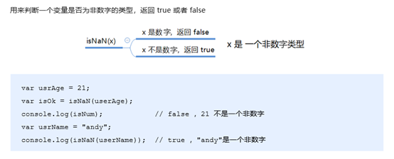
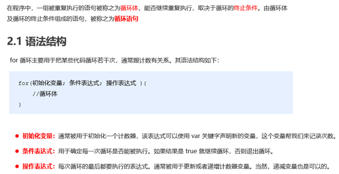
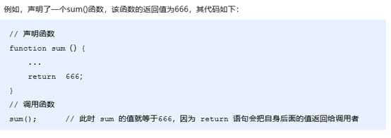
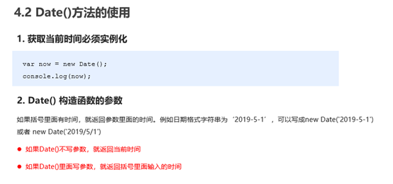

# JS 初体验




## JavaScript注释


# JavaScript 输入输出语句



# 变量


## 1.变量概述


## 2. 变量的使用


## 变量语法扩展


## 1.5 变量命名规范


# 数据类型

## 数据类型简介


## 2. 简单数据类型


### 2.2 数字型 Number


### isNaN



### 字符串型 String


### 2.5  布尔型Boolean


### 2.6  Undefined 和 Null


### 3. 获取变量数据类型


## 数据类型转换


# JavaScript 运算符

运算符（operator）也被称为操作符，是用于实现赋值、比较和执行算数运算等功能的符号。

JavaScript中常用的运算符有：

##  算数运算符


##  递增和递减运算符


##  比较运算符


##  逻辑运算符


##  赋值运算符


## 运算符优先级


# JavaScript 流程控制-分支

## 顺序控制-普通写法就是顺序控制


## 分支流程控制 if 语句


# JavaScript 流程控制-循环

## 循环


## for 循环




## 双重 for 循环


## while 循环


## do while 循环


## continue break


# JavaScript 数组

## 数组的概念


## 创建数组


## 获取数组中的元素


## 遍历数组


## 数组中新增元素


# JavaScript 函数

## 函数的概念


## 函数的使用


## 函数的参数


## 函数的返回值





## arguments的使用


## 函数的两种声明方式


# JavaScript 作用域

## 作用域


## 变量的作用域


## 作用域链


# JavaScript 预解析

## 预解析


## 变量预解析和函数预解析


# JavaScript 对象

## 对象


## 创建对象的三种方式


## new关键字


## 遍历对象属性


# JavaScript 内置对象

MDN:  
https://developer.mozilla.org/zh-CN/

## 内置对象


## 查文档


MDN:   https://developer.mozilla.org/zh-CN/


## Math对象


## 日期对象





## 数组对象


```javascript
查找数组元素 返回数组值
 var obj = arr.find(arr => arr.id === 111114);
再用
arr.indexOf(obj)
获取数组索引  
arr.splice(arr.indexOf(obj), 1) //再删除

```


## 字符串对象


