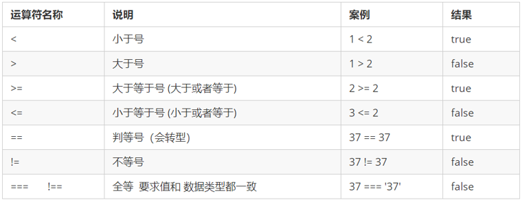

## 一.JavaScript 基本概念

###  1. 书写位置

​    JS 有3种书写位置，分别为行内、内嵌和外部

1. 行内式 JS

```
<input type="button" value="点我试试" onclick="alert('Hello World')" />
```

可以将单行或少量 JS 代码写在HTML标签的事件属性中（以 on 开头的属性），如：onclick

注意单双引号的使用：在HTML中我们推荐使用双引号, JS 中我们推荐使用单引号

可读性差， 在html中编写JS大量代码时，不方便阅读；

引号易错，引号多层嵌套匹配时，非常容易弄混；

特殊情况下使用

2. 内嵌 JS

```
<script>
    alert('Hello  World~!');
 </script>
```

可以将多行JS代码写到 <i><</i>script> 标签中

内嵌 JS 是学习时常用的方式

3. 外部 JS文件

```
<script src="my.js"></script>

```

利于HTML页面代码结构化，把大段 JS代码独立到 HTML 页面之外，既美观，也方便文件级别的复用

引用外部 JS文件的 script 标签中间不可以写代码

适合于JS 代码量比较大的情况


### 2. 注释

为了提高代码的可读性，JS与CSS一样，也提供了注释功能。JS中的注释主要有两种，分别是单行注释和多行注释。


单行注释

单行注释的注释方式如下：

```
// 我是一行文字，不想被 JS引擎 执行，所以 注释起来

//  用来注释单行文字（  快捷键   ctrl  +  /   ）
```


多行注释

多行注释的注释方式如下

```
/*
  获取用户年龄和姓名
  并通过提示框显示出来
*/
/* */  用来注释多行文字（ 默认快捷键  alt +  shift  + a ） 
```

快捷键修改为：   ctrl + shift  +  /  

vscode -> 首选项按钮  ->  键盘快捷方式 ->  查找 原来的快捷键  ->修改为新的快捷键 -> 回车确认


### 3. 基础输入输出语句

为了方便信息的输入输出，JS中提供了一些输入输出语句，其常用的语句如下

|      关键字      |         功能         | 归属   |
| :--------------: | :------------------: | :----- |
|  console.log()   |      控制台输出      | 浏览器 |
|     alert()      |  页面弹框(阻塞式的)  | 浏览器 |
| document.write() | 页面输出(渲染到页面) | 浏览器 |
|     prompt()     |        输入框        | 浏览器 |
|    confirm()     |        确认框        | 浏览器 |


## 二.变量

### 1 变量概述

- 什么是变量

白话：变量就是一个装东西的盒子。

通俗：变量是用于存放数据的容器。 我们通过 变量名 获取数据，甚至数据可以修改。

即：可以改变的量


- 变量在内存中的存储


本质：变量是程序在内存中申请的一块用来存放数据的空间。

类似我们酒店的房间，一个房间就可以看做是一个变量


### 2 变量的使用

Es6之前的变量声明使用var,Es6之后基本不使用var声明变量 改用let 

变量在使用时分为2步： 1. 声明变量   2. 赋值,使用

1. 声明变量

```
//  声明变量   语法: 变量名 = 值;
let age; //  声明一个 名称为age 的变量     
```

age 是程序员定义的变量名，我们要通过变量名来访问内存中分配的空间


2. 赋值

```]
// 语法: 变量名 = 值;
age = 10; // 给 age  这个变量赋值为 10          
```

​	这个 = 在js中叫赋值运算符,运算是从右往左的.

​	

3. 变量的使用

```
 console.log(age + 10);  
 //变量的使用 :取出存在这个空间里的数据来使用
```

声明一个变量并赋值， 我们称之为变量的初始化。


### 3 变量语法扩展


​    1. 变量初始化(变量在声明的同时赋值);

     // let age = 19;


​	2. 更新变量

​	一个变量被重新复赋值后，它原有的值就会被覆盖，变量值将以最后一次赋的值为准

```
var age = 18;

age = 81;   // 最后的结果就是81因为18 被覆盖掉了          

```


​	3. 同时声明多个变量

​	4. 同时声明多个变量的同时批量赋值

​	同时声明多个变量时，只需要写一个 let，多个变量名之间使用英文逗号隔开。

```
var age = 10,  name = 'zs', sex = 2;       

```

​	

​	5. 变量的值可以是其他变量的值.

```
let num1 = 10;
let num2 = num1;
```


注意：

- 变量一定要先声明再使用.
- 变量声明了但是没有赋值,值是undefined.

```
let num1, num2, num3 = 10;
console.log(num1);//undefined
console.log(num2);//undefined
console.log(num3);//10
```


声明变量特殊情况

| **情况**                       | **说明**                | **结果**  |
| ------------------------------ | ----------------------- | --------- |
| var  age ; console.log (age);  | 只声明 不赋值           | undefined |
| console.log(age)               | 不声明 不赋值  直接使用 | 报错      |
| age   = 10; console.log (age); | 不声明   只赋值         | 10        |


例：交换两个数的值

```
//交换操作
let temp = num1; //temp 10  num2 20  num1 10
num1 = num2;     //temp 10  num2 20  num1 20
num2 = temp;     //temp 10  num2 10; num1 20
```

补充:

```
//不使用第三方变量,如何交换2个number类型的变量的值. 

let num1 = 10;
let num2 = 20;

num1 = num1 + num2; //num1 30   num2 20
num2 = num1 - num2; //num1 30   num2 10
num1 = num1 - num2; //num1 20   num2 10
        
console.log(num1,num2);//20, 10
```


### 4. 变量命名规范

由字母(A-Za-z)、数字(0-9)、下划线(_)、美元符号( $ )组成，如：usrAge, num01, _name

严格区分大小写。var app; 和 var App; 是两个变量

不能 以数字开头。  18age   是错误的

不能 是关键字、保留字。例如：var、for、while

变量名必须有意义。 MMD   BBD        nl   →     age  

遵守驼峰命名法。首字母小写，后面单词的首字母需要大写。 myFirstName

推荐翻译网站： 有道    爱词霸


## 三. 数据类型

### 数据类型简介

在计算机中，不同的数据所需占用的存储空间是不同的，为了便于把数据分成所需内存大小不同的数据，充分利用存储空间，于是定义了不同的数据类型。

简单来说，数据类型就是数据的类别型号。比如姓名“张三”，年龄18，这些数据的类型是不一样的。

**变量的数据类型**

变量是用来存储值的所在处，它们有名字和数据类型。变量的数据类型决定了如何将代表这些值的位存储到计算机的内存中。**JavaScript** **是一种弱类型或者说动态语言。**这意味着不用提前声明变量的类型，在程序运行过程中，类型会被自动确定。

```
var age = 10;        // 这是一个数字型
var areYouOk = '是的';   // 这是一个字符串     
```

在代码运行时，变量的数据类型是由 JS引擎 根据 = 右边变量值的数据类型来判断 的，运行完毕之后， 变量就确定了数据类型。

JavaScript 拥有动态类型，同时也意味着相同的变量可用作不同的类型：

```
var x = 6;           // x 为数字
var x = "Bill";      // x 为字符串    

```

数据类型的分类

JS 把数据类型分为两类：

- 简单数据类型 （Number,String,Boolean,Undefined,Null）

-  复杂数据类型 （object)


### 1. 直接量（字面量）

可以直接使用的就是直接量

​	只要js中认识的数据类型的数据就可以作为直接量(字符串类型的数据, 数值类型的数据, 布尔类型的数据 )

​	字面量是在源代码中一个固定值的表示法，通俗来说，就是字面量表示如何表达这个值。

数字字面量：8, 9, 10

字符串字面量：'黑马程序员', "大前端"

布尔字面量：true，false


### 简单数据类型（基本数据类型）

JavaScript 中的简单数据类型及其说明如下：


#### 数字型 Number

JavaScript 数字类型既可以用来保存整数值，也可以保存小数(浮点数）。  

```
var age = 21;       // 整数
var Age = 21.3747;  // 小数     
```

1. 数字型进制

   最常见的进制有二进制、八进制、十进制、十六进制。

```
  // 1.八进制数字序列范围：0~7
 var num1 = 07;   // 对应十进制的7
 var num2 = 019;  // 对应十进制的19
 var num3 = 06;   // 对应十进制的6
  // 2.十六进制数字序列范围：0~9以及A~F
 var num = 0xA;   

```


2. 数字型范围

   JavaScript中数值的最大和最小值

```
alert(Number.MAX_VALUE); // 1.7976931348623157e+308
alert(Number.MIN_VALUE); // 5e-324

```

​	最大值：Number.MAX_VALUE，这个值为： 1.7976931348623157e+308

​	最小值：Number.MIN_VALUE，这个值为：5e-32


3. 数字型三个特殊值

   ① Infinity ，代表无穷大，大于任何数值

   ```
   alert(Infinity);  // Infinity
   ```

   ```
   ② -Infinity ，代表无穷小，小于任何数值
    alert(-Infinity); // -Infinity
   ```
   
   ③  NaN  (Not a number)  代表一个非数值

   ```
    alert(NaN);       // NaN
   ```

   ​	NaN有一个特点. 

   ​       他永远不等于其他的值,包括他自己.
   
```
console.log(NaN == 100);   //false
   console.log(NaN == 'ABC'); //false
console.log(NaN == true);  //false
   console.log(NaN == NaN);   //false
```


##### isNaN()

用来判断一个变量是否为非数字的类型，返回 true 或者 false


```
var usrAge = 21;
var isOk = isNaN(userAge);
console.log(isNum);            // false ，21 不是一个非数字
var usrName = "andy";
console.log(isNaN(userName));  // true ，"andy"是一个非数字

```

​		isNaN()存在类型转换

```
		// 1.1 转换成数字不成功
        // let str = 'abc';
        // let res = isNaN(str); //'str'是一个字符串, 非数字, 是NaN
        // console.log(res);//true

        // 1.2 转换成数字不成功
        // let str = '123abc';
        // let res = isNaN(str);//
        // console.log(res);//true


        // 2. 转成数字成功
        // let str = '123';
        // let res = isNaN(str);//这里会把'123'转成123, 123就是数字, 那就不是NaN.
        // console.log(res);//false
```


#### 字符串型 String


字符串型可以是引号中的任意文本，其语法为 双引号 "" 和 单引号''

```
var strMsg = "我爱北京天安门~";  // 使用双引号表示字符串
var strMsg2 = '我爱吃猪蹄~';    // 使用单引号表示字符串
// 常见错误
var strMsg3 = 我爱大肘子;       // 报错，没使用引号，会被认为是js代码，但js没有这些语法
```

因为 HTML 标签里面的属性使用的是双引号，JS 这里我们更推荐使用单引号。


1. 字符串引号嵌套

JS 可以用单引号嵌套双引号 ，或者用双引号嵌套单引号 (**外双内单，外单内双**)

```
var strMsg = '我是"高帅富"程序猿';   // 可以用''包含""
var strMsg2 = "我是'高帅富'程序猿";  // 也可以用"" 包含''
//  常见错误
var badQuotes = 'What on earth?"; // 报错，不能 单双引号搭配
```


2. 字符串转义符

   类似HTML里面的特殊字符，字符串中也有特殊字符，我们称之为转义符。

   转义符都是 \ 开头的，常用的转义符及其说明如下：

| **转义符** | **解释说明**                      |
| ---------- | --------------------------------- |
| \n         | 换行符，n   是   newline   的意思 |
| \ \        | 斜杠   \                          |
| \\'        | '   单引号                        |
| \\"        | ”双引号                           |
| \t         | tab  缩进                         |
| \b         | 空格 ，b   是   blank  的意思     |


3. 字符串长度

   字符串是由若干字符组成的，这些字符的数量就是字符串的长度。通过字符串的 length 属性可以获取整个字符串的长度。

```
var strMsg = "我是帅气多金的程序猿！";
alert(strMsg.length); // 显示 11
```

4. 字符串拼接

   多个字符串之间可以使用 + 进行拼接，其拼接方式为 字符串 + 任何类型 = 拼接之后的新字符串

   拼接前会把与字符串相加的任何类型转成字符串，再拼接成一个新的字符串

```
//1.1 字符串 "相加"
alert('hello' + ' ' + 'world'); // hello world
//1.2 数值字符串 "相加"
alert('100' + '100'); // 100100
//1.3 数值字符串 + 数值
alert('11' + 12);     // 1112 

```

+ 号总结口诀：数值相加 ，字符相连

​		字符串拼接加强

```
console.log('pink老师' + 18);           // 只要有字符就会相连 
var age = 18;
// console.log('pink老师age岁啦');       // 这样不行哦
console.log('pink老师' + age);          // pink老师18
console.log('pink老师' + age + '岁啦');  // pink老师18岁啦

```

我们经常会将字符串和变量来拼接，因为变量可以很方便地修改里面的值

变量是不能添加引号的，因为加引号的变量会变成字符串

如果变量两侧都有字符串拼接，口诀“引引加加 ”，删掉数字，变量写加中间


##### **字符串补充**

**字符串的不可变**

指的是里面的值不可变，虽然看上去可以改变内容，但其实是地址变了，内存中新开辟了一个内存空间。


```
var str = 'abc';
str = 'hello';
// 当重新给 str 赋值的时候，常量'abc'不会被修改，依然在内存中
// 重新给字符串赋值，会重新在内存中开辟空间，这个特点就是字符串的不可变
// 由于字符串的不可变，在大量拼接字符串的时候会有效率问题
var str = '';
for (var i = 0; i < 100000; i++) {
    str += i;
}
console.log(str); // 这个结果需要花费大量时间来显示，因为需要不断的开辟新的空间

```


```
// 字符串补充

        // 1.在js中用单引号或者双引号引起来的就是字符串
        // ' ' "" 'dfsdf'   "#$%"

        // 2.可以像操作数组一样,用下标的方式去取字符串中的字符. 
        // let str = 'abcdefg';
        // console.log(str[2]);// 'c'
        // console.log(str[7]);// undefined

        // 3.for循环来遍历字符串的每一个字符
        // let str = 'abcdefg';
        // for(let i = 0; i<str.length; i++){
        //     console.log(str[i]);
        // }

        // 4.字符串有恒定性(字符串一旦被声明,就没法更改)
        // let str = 'abcdefg';
        // str[1] = 'B';
        // console.log(str);//'abcdefg'

        // 5.
        let str1 = 'abc';
        str1 = 'def'; //这里修改的是str1这个变量的值,并不是在修改字符串
        console.log(str1); //'def'

        let str2 = 'abc';
        console.log(str2); //'abc'

        str2[1] = 'B';
        console.log(str2); //'abc'

```


#### 布尔型Boolean

布尔类型有两个值：true 和 false ，其中 true 表示真（对），而 false 表示假（错）。

布尔型和数字型相加的时候， true 的值为 1 ，false 的值为 0。

```
console.log(true + 1);  // 2
console.log(false + 1); // 1

```


#### Undefined 和 Null

1. Undefined

   这个数据类型的值只有一个,就是undefined

   变量声明了但是没有赋值,值就是undefined.
   undefined ( 如果进行相连或者相加时，注意结果）

```
var variable;
console.log(variable);           // undefined
console.log('你好' + variable);  // 你好undefined
console.log(11 + variable);     // NaN
console.log(true + variable);   //  NaN
```

2. null

   这个数据类型的值值有一个,就是null

   获取一个dom对象获取不成功的时候为null,

   一个声明变量给 null 值，里面存的值为空（学习对象时，我们继续研究null)

```
var vari = null;
console.log('你好' + vari);  // 你好null
console.log(11 + vari);     // 11
console.log(true + vari);   //  1

```


### 3. 简单检测数据类型 typeof

typeof 可用来获取检测变量的数据类型

语法

```
// typeof (需要检测的数据)
// 这个括号是提升优先级的

var num = 18;
console.log(typeof num) // 结果 number      

```

不同类型的返回值


   控制台上也可以通过颜色来判断类型. 

   黑色的就是字符串类型.


### 4. 简单数据类型转换

什么是数据类型转换

使用表单、prompt 获取过来的数据默认是字符串类型的，此时就不能直接简单的进行加法运算，而需要转换变量的数据类型。通俗来说，就是把一种数据类型的变量转换成另外一种数据类型。

我们通常会实现3种方式的转换：

1. 转换为数字型
2. 转换为字符串类型

3. 转换为布尔型


#### 转换为数字型（重点）


1. Number()

```
	    // let str = false;
        // let res = Number(str);
        // console.log(res);
        // console.log(typeof res);
        //注意:
        //a.如果这个数据('10')可以转成number类型的数那就直接转,如果不能转('abc')就转成NaN.
        //b.空字符串以及空格字符串,转成0
        //c.null转成0, undefined转成NaN.
        //d.true转成1, false转成0.
```


2. parseInt();     //转成整数

```
 
        // let str = '1a12B12C12';
        // let res = parseInt(str);
        // console.log(res);
        // console.log(typeof res);
        //注意:
        //从左往右找,直到找到第一个非数字停下来,前面的就是转换的结果.
        //如果找到的第一个非数字前面没有数字,那就转成NaN.
```

3 parseFloat();

```
		// let str = '1.2.3a4';
        // let res = parseFloat(str);
        // console.log(res);
        // console.log(typeof res);
        //注意:
        //从左往右找,直到找到第一个非数字(不包括第一个小数点)停下来,前面的就是转换的结果.
        //如果找到的第一个非数字前面没有数字,那就转成NaN.
```


注意

-  parseInt 和 parseFloat 单词的大小写，这2个是重点
- 隐式转换是我们在进行算数运算的时候，JS 自动转换了数据类型


#### 转换为字符串


1. String();

```
 		// let num = undefined;
        // let res = String(num);
        // console.log(res);
        // console.log(typeof res);
        //注意: 
        //转成的结果就是原来的数加引号  
```

2. toString();

```
		// let num = 10;
        // let res = num.toString();
        // console.log(res);
        // console.log(typeof res);
        //注意:
        //转成的结果就是原来的数加引号
        //null和undefined不能使用该方式转成字符串.
```


toString() 和 String()  使用方式不一样。

三种转换方式，我们更喜欢用第三种加号拼接字符串转换方式， 这一种方式也称之为隐式转换。

 +号两边如果有一边是字符串,那就会拼接成一个新的字符串.


#### 转换为布尔型


   Boolean();

```
		let num = NaN;
        let res = Boolean(num);
        console.log(res);
        console.log(typeof res);
```

注意:

​	哪些数据能转成布尔类型的false: 0 -0 false "" null undefined NaN

​	 即 代表空、否定的值会被转换为 false  

​	其余值都会被转换为 true

```
console.log(Boolean('')); // false
console.log(Boolean(0)); // false
console.log(Boolean(NaN)); // false
console.log(Boolean(null)); // false
console.log(Boolean(undefined)); // false
console.log(Boolean('小白')); // true
console.log(Boolean(12)); // true

```


#### 隐式类型转换

​	**1.转成number类型**

​        在需要转换的数据前面加上一个+号.

    // let str = '123.45';
    
    // let res = +str;
    
    // console.log(res);
    
     // console.log(typeof res);


​		让需要转换的数据做数学运算(区分字符串的拼接). 

```
 // let str = '100';

 // let res = str - 0;

 // console.log(res);

 // console.log(typeof res);
```


2. **转成string类型** 

   ​	把需要转换的数据和空字符串做拼接. 

      ```
   // let str = true;
   // let res = str + "";
   // console.log(res);
   
   // console.log(typeof res);
      ```


3. **转成boolean类型**

​       取反再取反

     // let str = '';
    
     // let res = !!str;
    
     // console.log(res);
    
    // console.log(typeof res);


### 复杂类型(引用类型)

简单类型  (又称为 值类型)   :  简单数据类型/基本数据类型，在存储时变量中存储的是值本身，因此叫做值类型

 	string number boolean undefined null

复杂类型  (又称为引用类型) : 复杂数据类型，在存储时变量中存储的仅仅是地址（引用），因此叫做引用数据类型

​	通过 new 关键字创建的对象（系统对象、自定义对象），如Object、Array、Date等


#### 1. 存储方式

堆栈空间分配区别：

　　1、栈（操作系统）：由操作系统自动分配释放存放函数的参数值、局部变量的值等。其操作方式类似于数据结构中的栈；

​		简单数据类型存放到栈里面

　　2、堆（操作系统）：存储复杂类型(对象)，一般由程序员分配释放，若程序员不释放，由垃圾回收机制回收。

​		复杂数据类型存放到堆里面


值类型值是存在内存栈中的

引用类型值是存在内存堆中的


**注意：**JavaScript中没有堆栈的概念，通过堆栈的方式，可以让大家更容易理解代码的一些执行方式，便于将来学习其他语言。


**1. 值类型重新赋值**

​	把变量在栈空间里的值复制了一份给形参

​	值类型为相互独立

```
let num1 = 100;
let num2 = num1;
num2 = 200;
console.log(num1);//100
console.log(num2);//200
```


**4.引用类型重新赋值**

把变量在栈空间里保存的堆地址复制给了形参，形参和实参其实保存的是同一个堆地址，所以操作的是同一个对象。

引用类型为传递地址：

​	即例中2个变量指向同一地址

​	任一变量修改，另一变量也会被修改

```
let arr1 = [10,20,30,40];
let arr2 = arr1;
arr2[0] = 1000;
console.log(arr1[0]); //1000
```


#### 2. 数组类型检测

  typeof 监测不了数组类型的

```
console.log(typeof arr); //object
```


 **1.Array.isArray**

 Array.isArray()用于判断一个对象是否为数组，isArray() 是 HTML5 中提供的方法   

```
//语法: Array.isArray(数组名)
// 如果确实是数组就返回true, 如果不是数组就返回false.
let arr=[];
 console.log(Array.isArray(arr)); //true
 console.log(Array.isArray(100)); //false
```


**2.instanceof**

    // 语法: 数组名 instanceof Array
    //      如果是数组就返回true,如果不是数组就返回一个false
    console.log(arr instanceof Array); //true
    console.log(100 instanceof Array); //false
**3.万能数据监测.** Object.prototype.toString.call()

```
console.log(Object.prototype.toString.call(100)); //'[object Number]'
console.log(Object.prototype.toString.call('abc'));//'[object String]'
console.log(Object.prototype.toString.call(true));//'[object Boolean]'
console.log(Object.prototype.toString.call(undefined));//'[object Undefined]'
console.log(Object.prototype.toString.call(null));//'[object Null]'
console.log(Object.prototype.toString.call([10,20,30]));//'[object Array]'
```


#### 3. 函数类型检测

函数也是一个数据类型,是一个复杂的数据类型(引用类型)

```
 //函数的类型检测
function sb(){
	 console.log('哈哈');
}
```

1. typeof

```
 console.log(typeof sb); //'function'
```

2. instanceof

```
console.log(sb instanceof Function);//true
console.log(100 instanceof Function);//false
```

3.万能数据监测

```
console.log(Object.prototype.toString.call(sb));//'[object Function]'
```


## 四. 运算符

运算符（operator）也被称为操作符，是用于实现赋值、比较和执行算数运算等功能的符号。

###  1. 算数运算符

概念：算术运算使用的符号，用于执行两个变量或值的算术运算。

| 运算符 | 描述                  | 实例           |
| ------ | --------------------- | -------------- |
| +      | 加                    | 10+20=30       |
|        | (+还能用来拼接字符串) | '10'+20=> 1020 |
| -      | 减                    | 10-20=-10      |
| *      | 乘                    | 10*20=200      |
| /      | 除                    | 12/20=0.5      |
| %      | 取余(求模)            | 9%2=1          |


浮点数的精度问题

浮点数值的最高精度是 17 位小数，但在进行算术计算时其精确度远远不如整数。

```
var result = 0.1 + 0.2;    // 结果不是 0.3，而是：0.30000000000000004
console.log(0.07 * 100);   // 结果不是 7，  而是：7.000000000000001

```

所以：不要直接判断两个浮点数是否相等 ! 


表达式和返回值

**表达式：**是由数字、运算符、变量等以能求得数值的有意义排列方法所得的组合

简单理解：是由数字、运算符、变量等组成的式子

表达式最终都会有一个结果，返回给我们，我们成为返回值


算术表达式

​        用算术运算符连接起来的式子就是算术表达式.

​         算术表达式是有结果的.

​        结果可以用变量保存,也可以直接打印.


###  2. 递增和递减运算符

如果需要反复给数字变量添加或减去1，可以使用递增（++）和递减（-- **）**运算符来完成。

在 JavaScript 中，递增（++）和递减（ -- ）既可以放在变量前面，也可以放在变量后面。放在变量前面时，我们可以称为前置递增（递减）运算符，放在变量后面时，我们可以称为后置递增（递减）运算符。

**注意：**递增和递减运算符必须和变量配合使用。 

1. 前置递增运算符

   ++num 前置递增，就是自加1，类似于 num =  num + 1，但是 ++num 写起来更简单。

   使用口诀：先自加，后返回值

```
var  num = 10;
alert(++num + 10);   // 21

```


2. 后置递增运算符

   num++ 后置递增，就是自加1，类似于 num =  num + 1 ，但是 num++ 写起来更简单。

   使用口诀：先返回原值，后自加 

```
var  num = 10;
alert(10 + num++);  // 20

```


- 前置递增和后置递增小结
- 前置递增和后置递增运算符可以简化代码的编写，让变量的值 + 1  比以前写法更简单
- 单独使用时，运行结果相同
- 与其他代码联用时，执行结果会不同 
- 后置：先原值运算，后自加（先人后己） 
- 前置：先自加，后运算（先已后人）
- 开发时，大多使用后置递增/减，并且代码独占一行，例如：num++; 或者 num--;


相同点: 不管是前自增还是后自增,都是把参与自增的变量值加1.

​        //不同点: 要看自增表达式的结果

​        //       前自增:先完成自增再赋值给表达式

​        //       后自增:先赋值给表达式再完成自增


###  3. 关系运算符

概念：比较运算符（关系运算符）是两个数据进行比较时所使用的运算符，比较运算后，会返回一个布尔值（true / false）作为比较运算的结果。



​	

**涉及到类型转换分析**

​		==相等  !=不等

1.不涉及类型转换

    // console.log(10 == 10);//true
    // console.log('abc' == 'abc');//true
    
    // console.log(true == true); //true
    // console.log(null == null);//true
    // console.log(undefined == undefined);//true

2.涉及到类型转换. 

```
		//a.把字符串转成number类型再进行比较
        // console.log('123' == 123);//true
        // console.log('123.45' == 123.45);//true

        //b.把布尔类型转成number类型再进行比较
        // console.log(true == 1);
        // console.log(false == 0);

        //c.都转成number类型进行比较
        // console.log(true == '1');//true

        //d.
        // console.log(null == undefined);//true
```


  **等号小结**


```
console.log(18 == '18');
console.log(18 === '18'); 
```


###  4. 逻辑运算符

概念：逻辑运算符是用来进行布尔值运算的运算符，其返回值也是布尔值。后面开发中经常用于多个条件的判断


1.逻辑与表达式

​       规律: 全真才是真,有假就是假.

```
// 关系表达式1  关系表达式2  逻辑与表达式结果
//   true         true           true
//   true         false          false
//   false        true           false
//   false        false          false

// let num1 = 10;
// let num2 = 20;    
// let res = num1 < 0 && num2 < 0;
// console.log(res);
```

2.逻辑或表达式

​       规律:有真就是真,全假才是假.

```
// 关系表达式1    关系表达式2    逻辑或表达式结果
//   true           true           true
//   true           false          true
//   false          true           true
//   false          false          false

// let num1 = 10;
// let num2 = 20;
// let res = num1 > 0 || num2 < 0;
// console.log(res);   
```

3.逻辑非表达式.

​       真变假, 假变真

```
// let num1 = 10;
// let res = !(num1 < 0);
// console.log(res);
```


#### 短路运算（逻辑中断）

短路运算的原理：当有多个表达式（值）时,左边的表达式值可以确定结果时,就不再继续运算右边的表达式的值;

​	如果参与运算的第一式子就能决定整个逻辑表达式的结果,那后面的式子就不会运算了.

1. 逻辑与  

   找假

   语法： 表达式1 && 表达式2

   如果第一个表达式的值为假，则返回表达式1

   如果第一个表达式的值为真，则返回表达式2

```
console.log( 123 && 456 );        // 456
console.log( 0 && 456 );          // 0
console.log( 123 && 456&& 789 );  // 789

```


2. 逻辑或

   找真

   语法： 表达式1 || 表达式2

   如果第一个表达式的值为真，则返回表达式1

   如果第一个表达式的值为假，则返回表达式2

```
console.log( 123 || 456 );         //  123
console.log( 0 ||  456 );          //  456
console.log( 123 || 456 || 789 );  //  123

```


###  5. 赋值运算符

概念：用来把数据赋值给变量的运算符。

先做运算再把算出来的结果赋给参与运算的变量. 

| 运算符 | 描述            | 实例    | 结果 |
| ------ | --------------- | ------- | ---- |
| +=     | 加 等于         | 10 +=20 | 30   |
| -=     | 减 等于         | 10 -=20 | -10  |
| *=     | 乘 等于         | 10 *=20 | 200  |
| /=     | 除 等于         | 12 /=20 | 0.5  |
| %=     | 取余(求模) 等于 | 9 %=2   | 1    |


```
var age = 10;
age += 5;  // 相当于 age = age + 5;
age -= 5;  // 相当于 age = age - 5;
age *= 10; // 相当于 age = age * 10;

```


### 6. 运算符优先级


一元运算符里面的逻辑非优先级很高

逻辑与比逻辑或优先级高


## 流程控制

**流程控制**主要有三种结构，分别是顺序结构、分支结构和循环结构，这三种结构代表三种代码执行的顺序。


顺序控制


顺序结构是程序中最简单、最基本的流程控制，它没有特定的语法结构，程序会按照代码的先后顺序，依次执行，程序中大多数的代码都是这样执行的。


在一个程序执行的过程中，各条代码的执行顺序对程序的结果是有直接影响的。很多时候我们要通过控制代码的执行顺序来实现我们要完成的功能。

简单理解： **普通写法就是顺序控制**

​					流程控制就是来控制我们的代码按照什么结构顺序来执行


## 五. 分支

### 1. if 语句

1. 语法结构

```
// 条件成立执行代码，否则什么也不做
if (条件表达式) {
    // 条件成立执行的代码语句
}

```

语句可以理解为一个行为，循环语句和分支语句就是典型的语句。一个程序由很多个语句组成，一般情况下，会分割成一个一个的语句。


注意:

​       1.小括号里的条件能写什么?

​       只要值为布尔类型的都行:关系表达式,逻辑表达式,true,false,变量

​        2.大括号里面可以写什么?

​      只要符合js语法的代码都可以.


### 2. if else语句（双分支语句）

1. 语法结构

```
// 条件成立  执行 if 里面代码，否则执行else 里面的代码
if (条件表达式) {
    // [如果] 条件成立执行的代码
} else {
    // [否则] 执行的代码
}

```


### 3. if  --  else if 语句(多分支语句)

1. 语法结构

```
// 适合于检查多重条件。
if (条件表达式1) {
    语句1；
} else if (条件表达式2)  {
    语句2；
} else if (条件表达式3)  {
   语句3；
 ....
} else {
    // 上述条件都不成立执行此处代码
}

```


```
var score = prompt('请您输入分数:');
if (score >= 90) {
alert('宝贝，你是我的骄傲');
} else if (score >= 80) {
alert('宝贝，你已经很出色了');
} else if (score >= 70) {
alert('你要继续加油喽');
} else if (score >= 60) {
alert('孩子，你很危险');
} else {
alert('熊孩子，我不想和你说话，我只想用鞭子和你说话');
}

```


### 4. 分支流程控制 switch 语句

switch语句也是多分支语句，它用于基于不同的条件来执行不同的代码。当要针对变量设置一系列的特定值的选项时，就可以使用


语法结构

```
switch( 表达式 ){ 
    case value1:
        // 表达式 等于 value1 时要执行的代码
        break;
    case value2:
        // 表达式 等于 value2 时要执行的代码
        break;
    default:
        // 表达式 不等于任何一个 value 时要执行的代码
}

```

switch ：开关 转换  ， case ：小例子   选项

关键字 switch 后面括号内可以是表达式或值， 通常是一个变量

关键字 case , 后跟一个选项的表达式或值，后面跟一个冒号

switch 表达式的值会与结构中的 case 的值做比较 

如果存在匹配全等(===) ，则与该 case 关联的代码块会被执行，并在遇到 break 时停止，整个 switch 语句代码执行结束

如果所有的 case 的值都和表达式的值不匹配，则执行 default 里的代码

注意： 执行case 里面的语句时，如果没有break，则继续执行下一个case里面的语句。


```
var fruit = prompt('请您输入查询的水果:');
switch (fruit) {
case '苹果':
alert('苹果的价格是 3.5/斤');
break;
case '榴莲':
alert('榴莲的价格是 35/斤');
break;
default:
alert('没有此水果');
}

```


switch 语句和 if else if 语句的区别

①一般情况下，它们两个语句可以相互替换

②switch...case 语句通常处理 case为比较确定值的情况， 而 if…else…语句更加灵活，常用于范围判断(大于、等于某个范围)

③switch 语句进行条件判断后直接执行到程序的条件语句，效率更高。而if…else 语句有几种条件，就得判断多少次。

④当分支比较少时，if… else语句的执行效率比 switch语句高。

⑤当分支比较多时，switch语句的执行效率比较高，而且结构更清晰。 


### 5. 三元表达式

三元表达式也能做一些简单的条件选择。
有三元运算符组成的式子称为三元表达式

1. 语法结构

```
表达式1 ? 表达式2 : 表达式3;
```

2. 执行思路 

   如果表达式1为 true ，则返回表达式2的值，如果表达式1为 false，则返回表达式3的值

   简单理解： 就类似于  if  else （双分支） 的简写


## 六. 循环

循环目的：

- 在实际问题中，有许多具有规律性的重复操作，因此在程序中要完成这类操作就需要重复执行某些语句

在Js 中，主要有三种类型的循环语句：

- for 循环
- while 循环
- do...while 循环

总结：

- 三个循环很多情况下都可以相互替代使用
- 如果是用来计次数，跟数字相关的，三者使用基本相同，但是我们更喜欢用 for
- while和do...while可以做更复杂的判断条件，比for 循环灵活一些
- while和do...while执行顺序不一样，while先判断后执行，do...while先执行一次，再判断执行
- while 和 do...while 执行次数不一样，do...while 至少会执行一次循环体，而 while 可能一次也不执行


### 1. for 循环

在程序中，一组被重复执行的语句被称之为循环体，能否继续重复执行，取决于循环的终止条件。由循环体及循环的终止条件组成的语句，被称之为循环语句

**语法结构**

for 循环主要用于把某些代码循环若干次，通常跟计数有关系。其语法结构如下：

```
for(初始化变量; 条件表达式; 操作表达式 ){
    //循环体
}
```

- 初始化变量：通常被用于初始化一个计数器，该表达式可以使用 var 关键字声明新的变量，这个变量帮我们来记录次数。
- 条件表达式：用于确定每一次循环是否能被执行。如果结果是 true 就继续循环，否则退出循环。
- 操作表达式：每次循环的最后都要执行的表达式。通常被用于更新或者递增计数器变量。当然，递减变量也是可以的。


**执行过程：**

1. 初始化变量，初始化操作在整个 for 循环只会执行一次**。**

2. 执行条件表达式，如果为true，则执行循环体语句，否则退出循环，循环结束。

3. 执行操作表达式，此时第一轮结束。

4. 第二轮开始，直接去执行条件表达式（不再初始化变量），如果为 true ，则去执行循环体语句，否则退出循环。

5. 继续执行操作表达式，第二轮结束。

6. 后续跟第二轮一致，直至条件表达式为假，结束整个 for 循环。


**for** **循环重复相同的代码**

for循环可以重复相同的代码，比如我们要输出10句“媳妇我错了”

```
//  基本写法
for(var i = 1; i <= 10; i++){
    console.log('媳妇我错了~');
}
// 用户输入次数
var num = prompt('请输入次数:')；
for ( var i = 1 ; i <= num; i++) {
    console.log('媳妇我错了~');
} 

```


**for 循环重复不相同的代码**

for 循环还可以重复不同的代码，这主要是因为使用了计数器 ，计数器在每次循环过程中都会有变化。

例如，求输出一个人1到100岁：

```
//  基本写法
for (var i = 1; i <= 100; i++) {
      console.log('这个人今年' + i + '岁了');
}
```


```

// for 里面是可以添加其他语句的 
for (var i = 1; i <= 100; i++) {
 if (i == 1) {
    console.log('这个人今年1岁了， 它出生了');
 } else if (i == 100) {
    console.log('这个人今年100岁了，它死了');
  } else {
       console.log('这个人今年' + i + '岁了');
  }
}


```


### 2. 双重 for 循环

```
for (外循环的初始; 外循环的条件; 外循环的操作表达式) {
    for (内循环的初始; 内循环的条件; 内循环的操作表达式) {  
       需执行的代码;
   }
}
```

- 内层循环可以看做外层循环的语句

- 内层循环执行的顺序也要遵循 for 循环的执行顺序 

- 外层循环执行一次，内层循环要执行全部次数

  

在双重循环的内层循环中去结束外层循环::写外层循环的条件不成立


### 3. while 循环

while 语句可以在条件表达式为真的前提下，循环执行指定的一段代码，直到表达式不为真时结束循环。

while语句的语法结构如下：

```
while (条件表达式) {
    // 循环体代码 
}

```


**执行思路**：

​	①先执行条件表达式，如果结果为 true，则执行循环体代码；如果为 false，则退出循环，执行后	面代码

​	②执行循环体代码

​	③循环体代码执行完毕后，程序会继续判断执行条件表达式，如条件仍为true，则会继续执行循环	体，直到循环条件为 false 时，整个循环过程才会结束


**注意：**

①使用 while 循环时一定要注意，它必须要有退出条件，否则会成为死循环

②while 循环和 for 循环的不同之处在于 while 循环可以做较为复杂的条件判断，比如判断用户名和密码


### 4. do while 循环

do... while 语句其实是 while 语句的一个变体。该循环会先执行一次代码块，然后对条件表达式进行判断，如果条件为真，就会重复执行循环体，否则退出循环。

do... while 语句的语法结构如下：

```
do {
    // 循环体代码 - 条件表达式为 true 时重复执行循环体代码
} while(条件表达式);

```

**执行思路：**

①先执行一次循环体代码 

②再执行条件表达式，如果结果为 true，则继续执行循环体代码，如果为 false，则退出循环，继续执行后面代码

**注意：**先再执行循环体，再判断，我们会发现 do…while
循环语句**至少会执行一次循环体代码**


### 5. 关键字 continue break

**continue** **关键字**

continue 关键字用于立即跳出本次循环，继续下一次循环（本次循环体中 continue 之后的代码就会少执行一次）。
例如，吃5个包子，第3个有虫子，就扔掉第3个，继续吃第4个第5个包子，其代码实现如下：

```
 for (var i = 1; i <= 5; i++) {
     if (i == 3) {
         console.log('这个包子有虫子，扔掉');
         continue; // 跳出本次循环，跳出的是第3次循环 
      }
      console.log('我正在吃第' + i + '个包子呢');
 }

```


**break** **关键字**

break 关键字用于立即跳出整个循环（循环结束）。
例如，吃5个包子，吃到第3个发现里面有半个虫子，其余的不吃了，其代码实现如下：

```
for (var i = 1; i <= 5; i++) {
   if (i == 3) {
       break; // 直接退出整个for 循环，跳到整个for下面的语句
   }
   console.log('我正在吃第' + i + '个包子呢');
 }

```


### 循环应用场景总结

1. 循环体确定,循环次数也确定. 

```
//eg: 打印10次我爱黑马林哥
 for(let i = 0; i< 10 ;i++){
  		console.log('我爱黑马林哥');
 }
```

2. 循环体确定,循环的次数不确定,循环的结束条件确定. 

```
 //eg: 请用户输入密码,只要不是'888888',就要重新输入,直到输入正确为止.
       let password;
       do {
           password = prompt('请输入密码');
           if(password == '888888'){
                alert('密码正确');
           }
        }while(password != '888888')
```

3. 打印指定范围的每一个整数

```
//eg:将1-100之间的整数打印出来.
        for(let i = 1; i<= 100; i++){
            console.log(i);
        } 
```

4. 求指定范围中符合特定条件的数. 

```
//eg:将1-100之间的偶数打印出来. 
       for(let i = 1; i<=100; i++){
            //判断偶数
           if(i % 2 == 0){
                console.log(i);
           }
       }
```

5. 求一堆数的累加和/平均值

```
//eg:计算1-10之间每一个整数的累加和.
        let sum = 0; //求和的变量
        for(let i = 1; i<= 10;i++){
            sum += i;
        }
        console.log(sum);
```

6. 求一堆数的最大值/最小值

```
 //eg:请用户输入5个数,将最大的那个数打印出来. 
        let max = -Infinity; //声明一个'擂主'变量
        for(let i = 1; i<= 5; i++){
            let num = +prompt('请输入第'+i+'个数');
            //打擂
            if(num > max){
                max = num;
            }
        }
        console.log(max);
```

7. 穷举法

```
//eg： 有1个整数至少是2.  这个数除以2余1,这个数除以3余1 这个数除以4余1 ,求这个数最小是多少?
             2 3 4 5 6 7....
         for(let i = 2; true; i++){
             //判断
             if(i % 2 == 1 && i % 3 == 1 && i % 4 == 1){
                 console.log(i);
                 break;
             }
         }
```

8. 计数

```
//eg: 求1-100之间能被7整数的数有多少个. 
         let num = 0; 
         for(let i = 1; i<= 100; i++){
            if(i % 7 == 0){
                console.log('符合条件的数有:' + i);
                 num++;
            }
         }
         console.log('符合条件的数一共有'+num+'个');
```

 即 执行需要重复多次的动作


## 七. 作用域

全局作用域：在函数外声明的变量

局部作用域：在函数中声明的变量

块级作用域：在{}中声明的变量


### **作用域概述**

通常来说，一段程序代码中所用到的名字并不总是有效和可用的，而限定这个名字的可用性的代码范围就是这个名字的**作用域**。作用域的使用提高了程序逻辑的局部性，增强了程序的可靠性，减少了名字冲突。

JavaScript（es6前）中的作用域有两种：

全局作用域

作用于所有代码执行的环境(整个 script 标签内部)或者一个独立的 js 文件。

局部作用域（函数作用域）

作用于函数内的代码环境，就是局部作用域。 因为跟函数有关系，所以也称为函数作用域。


ES6之前 JS 没有块级作用域

```
if(true){
  var num = 123;
  console.log(num); //123
}
console.log(num);   //123

```


ES6 块作用域由 { } 包括。

在其他编程语言中（如 java、c#等），在 if 语句、循环语句中创建的变量，仅仅只能在本 if 语句、本循环语


es6之后 使用let声明的变量为块作用域

```
{
  let num = 123;
   console.log(num); //123
}
console.log(num);   //undefined
```


### 变量的作用域

在JavaScript中，根据作用域的不同，变量可以分为两种：

全局变量

​	全局变量在代码的任何位置都可以使用

​	在全局作用域下 var 声明的变量 是全局变量

​	特殊情况下，在函数内不使用 var 声明的变量也是全局变量（不建议使用）

局部变量

在局部作用域下声明的变量叫做**局部变量**（在函数内部定义的变量）

​	局部变量只能在该函数**内部**使用

​	在函数内部 var 声明的变量是局部变量

​	函数的**形参**实际上就是局部变量


全局变量和局部变量的区别

​	全局变量：在任何一个地方都可以使用，只有在浏览器关闭时才会被销毁，因此比较占内存

​	局部变量：只在函数内部使用，当其所在的代码块被执行时，会被初始化；当代码块运行结束后，就会被销毁，因此更节省内存空间


### 作用域链

​	只要是代码，就至少有一个作用域

​	写在函数内部的局部作用域

​	 如果函数中还有函数，那么在这个作用域中就又可以诞生一个作用域

​	根据在内部函数可以访问外部函数变量的这种机制，用链式查找决定哪些数据能被内部函数访问，就称作作用域链

作用域链：采取**就近原则**的方式来查找变量最终的值。


## 八. 数组

**数组的概念**

数组是指一组数据的集合，其中的每个数据被称作元素，在数组中可以存放任意类型的元素。数组是一种将一组数据存储在单个变量名下的优雅方式。

```
// 普通变量一次只能存储一个值
var  num = 10; 
// 数组一次可以存储多个值
var arr = [1,2,3,4,5];

```


### 1. 创建数组

1.  利用  new 创建数组（内置的构造函数声明数组并初始化）

```
var 数组名 = new Array() ；
var arr = new Array();   // 创建一个新的空数组

arr[0] = 100; //往数组中放入值. 
arr[1] = 200;

//   内置的构造函数声明数组并初始化
let arr2 = new Array(10,20,30,40);
console.log(arr2);// [10,20,30,40]

// 注意: 如果小括号里面只有一个number类型的数,那这个数就是数组的长度.而不是下标为0的元素.
let arr3 = new Array(10);

console.log(arr3[0]);//undefiend
console.log(arr3[1]);//undefiend
```


2.  利用数组字面量创建数组

```
//1. 使用数组字面量方式创建空的数组
var  数组名 = []；
//2. 使用数组字面量方式创建带初始值的数组
var  数组名 = ['小白','小黑','大黄','瑞奇'];

```

- 数组的字面量是方括号 [ ] 
- 声明数组并赋值称为数组的初始化
- 这种字面量方式也是我们以后最多使用的方式  


**数组元素的类型**

数组中可以存放**任意类型**的数据，例如字符串，数字，布尔值等。

```
var arrStus = ['小白',12,true,28.9];
```


### **4. 数组的长度**

使用“数组名.length”可以访问数组元素的数量（数组长度）。  

```
var arrStus = [1,2,3];
alert(arrStus.length);  // 3

```

**注意：** 

- 数组的长度是数组元素的个数 。

- 数组的长度,就是最大的下标+1

- 当我们数组里面的元素个数发生了变化，这个 length 属性跟着一起变化。

- 数组的长度可以更改(改大/改小)

  ​	改大时，未赋值的元素为空

  ​	改小时会丢失元素，且不可逆

**应用**

​	利用数组的长度给数组添加新元素

```
let arr5 = [10,20]; //长度为2
// 添加新元素
arr5[arr5.length] = 30; //经过了这一步之后,此时数组的长度为3
// 添加新元素
arr5[arr5.length] = 40; 
arr5[arr5.length] = 50; 
// 打印数组
console.log(arr5);//[10,20,30,40,50]
```


### 2. 数组中新增(修改)元素

**通过数组索引(修改)新增数组元素**

​	可以通过修改数组索引的方式追加数组元素

​	不能直接给数组名赋值，否则会覆盖掉以前的数据

```
var arr = ['red', 'green', 'blue', 'pink'];
//通过下标新增数组元素值
arr[4] = 'hotpink';
console.log(arr); // ['red', 'green', 'blue', 'pink','hotpink']

//通过下标修改数组元素值
arr[1]='black';
console.log(arr); // ['black', 'green', 'blue', 'pink','hotpink']

```

这种方式也是我们最常用的一种方式。


**通过修改 length 长度新增数组元素**

 	可以通过修改 length 长度来实现数组扩容的目的

​	 length 属性是可读写的

```
var arr = ['red', 'green', 'blue', 'pink'];
arr.length = 7;
console.log(arr);
console.log(arr[4]);
console.log(arr[5]);
console.log(arr[6]);

```

其中索引号是 4，5，6 的空间没有给值，就是声明变量未给值，默认值就是 undefined。


### 3. 获取数组中元素

**数组的索引**

**索引 (下标) ：**用来访问数组元素的序号（数组下标从0 开始）。

```
var  arr = ['小白','小黑','大黄','瑞奇'];
索引号：		0	  1     2      3
```

数组可以通过**索引**来访问、设置、修改对应的数组元素，我们可以通过“数组名[索引]”的形式来获取数组中的元素。

这里的**访问**就是获取得到的意思

```
// 定义数组
var arrStus = [1,2,3];
// 获取数组中的第2个元素
alert(arrStus[1]);    
//修改
arrStus[2]=30;
console.log(arrStus[2]) //[1,2,30]
//添加
arrStus[3]=40;
console.log(arrStus[2]) //[1,2,30,40]
```


### 5. 遍历数组

**遍历:** 就是把数组中的每个元素从头到尾都访问一次。

我们可以通过 for 循环索引遍历数组中的每一项

```
var arr = ['red','green', 'blue'];
for(var i = 0; i < arr.length; i++){
    console.log(arrStus[i]);
}
```


#### 二维数组

数组的元素又是一个数组,那这样的数组称为二维数组. 

```
let arr1 = [
            [10, 20, 30],
            [40, 50, 60],
            [70, 80, 90],
            100
        ];
        
        
// 2.二维数组取值. 

console.log( arr1[2][1]);
console.log(arr2[3][2]);

// 3.遍历二维数组. 
        for(let i = 0; i<arr2.length;i++){
            //arr2[i]  这个元素有可能是一个数组,也有可能是一个普通的元素
            //所以要对这个arr2[i]做一个类判断
            if(Array.isArray(arr2[i]) == true){
                //如果是数组就再来遍历
                for(let j = 0; j<arr2[i].length;j++){
                    console.log(arr2[i][j]);
                }
            }else {
                //不是数组直接打印
                console.log(arr2[i]);
            }
        }
```


## 九. 函数

**函数的概念**

在 JS 里面，可能会定义非常多的相同代码或者功能相似的代码，这些代码可能需要大量重复使用。
虽然 for循环语句也能实现一些简单的重复操作，但是比较具有局限性，此时我们就可以使用 JS 中的函数。

- ​	for循环：同一时刻进行重复操作
- ​	函数：不同时刻进行相同重复操作

函数：就是封装了一段可被重复调用执行的代码块。通过此代码块可以实现大量代码的重复使用。  


### 1. 函数的使用

函数在使用时分为两步：声明函数和调用函数。

#####  **声明函数的两种方式**

  1.  函数声明 (命名函数)

      利用函数关键字 function 自定义函数方式。

```
// 声明函数
function 函数名() {
    //函数体代码
}

函数名();//函数调用
```

​		function 是声明函数的关键字,必须小写

​		调用函数的代码既可以放到声明函数的前面，也可以放在声明函数的后面

 		因为有名字，所以也被称为命名函数

​		由于函数一般是为了实现某个功能才定义的， 所以通常我们将函数名命名为动词，比如 getSum 

​		

2. 函数表达式方式(匿名函数）

```
// 这是函数表达式写法，匿名函数后面跟分号结束
let  fn = function(){...}；

// 调用的方式，函数调用必须写到函数体下面
fn();

```

​	 因为函数没有名字，所以也被称为匿名函数

​	这个fn 里面存储的是一个函数  

​	 函数表达式方式原理跟声明变量方式是一致的

​	 函数调用的代码必须写到函数体后面


##### **调用函数**

```
// 调用函数
函数名();  // 通过调用函数名来执行函数体代码
```

​		调用的时候千万不要忘记添加小括号


**注意：**声明函数本身并不会执行代码，只有调用函数时才会执行函数体代码。

​			口诀：函数不调用，自己不执行。


**函数的封装**

​	函数的封装是把一个或者多个功能通过**函数的方式**封装起来，对外只提供一个简单的函数接口

​	简单理解：封装类似于将电脑配件整合组装到机箱中 ( 类似快递打包）  


### 2. 函数的参数

​	函数可以带参数也可以不带参数

​	 声明函数的时候，函数名括号里面的是形参，形参的默认值为 undefined

​	调用函数的时候，函数名括号里面的是实参

​	 多个参数中间用逗号分隔

​	 形参的个数可以和实参个数不匹配，但是结果不可预计，我们尽量要匹配


##### 形参和实参

在声明函数时，可以在函数名称后面的小括号中添加一些参数，这些参数被称为**形参**，

```
function shangWk(dn,gz) {    //此处的dn gz都为形参
            //形参实际上相当于是函数内部的局部变量
            console.log('打开'+dn+'电脑');
            console.log('倒杯'+gz+'果汁...');
       }
```

而在调用该函数时，同样也需要传递相应的参数，这些参数被称为**实参**。

```
shangWk('苹果','果粒橙')
```


------

参数的作用 : 在函数内部某些值不能固定，我们可以通过参数在调用函数时传递不同的值进去。


```
// 带参数的函数声明
function 函数名(形参1, 形参2 , 形参3...) { // 可以定义任意多的参数，用逗号分隔
  // 函数体
}
// 带参数的函数调用
函数名(实参1, 实参2, 实参3...); 

```


##### 函数参数的传递过程


```
// 声明函数
function getSum(num1, num2) {
    console.log(num1 + num2);
}
// 调用函数
getSum(1, 3); // 4
getSum(6, 5); // 11

```

1. 调用的时候实参值是传递给形参的

2. 形参简单理解为：**不用声明的变量**

3. 实参和形参的多个参数之间用逗号（,）分隔


##### 函数形参和实参个数不匹配问题


```

function sum(num1, num2) {
    console.log(num1 + num2);
}
sum(100, 200);             // 形参和实参个数相等，输出正确结果
sum(100, 400, 500, 700);   // 实参个数多于形参，只取到形参的个数
sum(200);                  // 实参个数少于形参，多的形参定义为undefined，结果为NaN


```

**注意：**在JavaScript中，形参的默认值是undefined。

##### 函数的参数是值类型

```
 // 1. 函数的参数是值类型
        function test1(num1){
            num1 = 100;
        }
        let num = 10;
        test1(num);
        console.log(num);//10
```


##### 函数的参数是引用类型.

```
 function test2(arr1){
            if(arr1 instanceof Array == true){
                arr1[0] = 100;
            }
        }
        let arr = [10,20,30,40];
        test2(arr);
        console.log(arr[0]); //100
```


### 3. 函数的返回值 return

​	**1.return 语句**

​	有的时候，我们会希望函数将值返回给调用者，此时通过使用 return 语句就可以实现。

​	语法格式：

```
// 声明函数
function 函数名（）{
    ...
    return  需要返回的值；
}
// 调用函数
函数名();    // 此时调用函数就可以得到函数体内return 后面的值

```

​	例如，声明了一个sum()函数，该函数的返回值为666，其代码如下：

```
// 声明函数
function sum（）{
    ...
    return  666；
}
// 调用函数
sum();      // 此时 调用 sum 的值就等于666，因为 return 语句会把自身后面的值返回给调用者 

```


**注意:**

1. 在使用 return 语句时，函数会立即 停止执行，并返回指定的值
2. 如果函数没有 return ，返回的值是 undefined
3. 如果函数内部有return,但是return后面没有接内容,那返回值也是undefined.
4. return 会终止函数,return 语句之后的代码不被执行。
5. return 只能返回一个值。如果用逗号隔开多个值，以最后一个为准。

例子：

```
function test1(){
    console.log('哈哈');
}
let res = test1();
console.log(res);  //undefined


function add(num1，num2){
    //函数体
    return num1 + num2; // 注意：return 后的代码不执行
    alert('我不会被执行，因为前面有 return');
}
var resNum = add(21,6); // 调用函数，传入两个实参，并通过 resNum 接收函数返回值
alert(resNum);          // 27
```


**break ,continue ,return 的区别**

​	break ：结束当前的循环体（如 for、while）

​	continue ：跳出本次循环，继续执行下次循环（如 for、while）

​	return ：不仅可以退出循环，还能够返回 return 语句中的值，同时还可以结束当前的函数体内的代码


### 4. 回调函数

如果函数a的参数又是一个函数b,那这个函数b就是这个回调函数.

```
 function sb(num1,num2,fn){
 	//这里fn称为回调函数
    num1 += 10;
    num2 += 20;
    //函数类型判断
    if(fn instanceof Function == true){
        fn(num1,num2); //函数调用,num1,num2就是实参
    }
}

//程序员a:
sb(1,2,function(num1,num2){
    console.log(num1+num2);
}); 

//程序员b:
sb(10,20,function(num1,num2){
    console.log(num1 * num2);
});

```

回调函数的作用是: 函数内部得到的结果要如何处理,取决于调用这个函数的调用者.

### 5. 自调用函数

自调用函数 : 函数自己调用

```
//1.
(function sb1(){
     console.log('哈哈');
 }());
 
//2.
 (function sb2(){
     console.log('呵呵');
 })();
 
 
```

一般情况下, 自调用函数都是一个匿名函数自调用.


自调用函数也是可以传递参数的.也是可以有返回值的

```
let res = (function (num1,num2) {
     console.log('嘿嘿');
     return num1+num2;
 }(10,20));

 console.log(res);
```


```
 			// 3.
           !function(){
               console.log('嘻嘻');
           }();

           // 4.
           +function(){
               console.log('嘻嘻2');
           }();

           // 5.
           -function(){
               console.log('嘻嘻3');
           }();

           // 6.
           ~function(){
               console.log('嘻嘻4');
           }();
```


### 6. arguments的使用

 a.只能在函数内部使用.

 b.不是一个数组,但是他又有length属性和下标,称为伪数组

 c.这个arguments伪数组的元素是实参的值.

d.他和形参一一对应.

​	  形参改了,对应的arguments的元素也改了,

​	  arguments的元素改了,对应的形参也会改.


当我们不确定有多少个参数传递的时候，可以用 arguments 来获取。

arguments实际上它是当前函数的一个内置对象。

所有函数都内置了一个 arguments 对象，arguments 对象中存储了传递的所有实参。

arguments展示形式是一个伪数组，因此可以进行遍历。伪数组具有以下特点：
	具有 length 属性
	按索引方式储存数据
	不具有数组的 push , pop 等方法

```
案例：利用函数求任意个数的最大值 

function maxValue() {
      var max = arguments[0];
      for (var i = 0; i < arguments.length; i++) {
         if (max < arguments[i]) {
                    max = arguments[i];
         }
      }
      return max;
}
 console.log(maxValue(2, 4, 5, 9));
 console.log(maxValue(12, 4, 9));

```


## 十. 对象

**1.什么是对象？**

现实生活中：万物皆对象，对象是一个具体的事物，看得见摸得着的实物。

例如，一本书、一辆汽车、一个人可以是“对象”，一个数据库、一张网页、一个与远程服务器的连接也可以是“对象”。对象是一个具体的存在.

```
  明星    周星驰(星爷)  女朋友    迪丽热巴     班主任    咱们班班主任 

  苹果    这个苹果      手机    pink老师的小米手机     游戏    刺激战场 
```

在 JavaScript 中，对象是一组无序的相关属性和方法的集合，所有的事物都是对象，例如字符串、数值、数组、函数等。

对象是由属性和方法组成的。

属性：事物的**特征，**在对象中用**属性**来表示（常用名词）

方法：事物的**行为，**在对象中用**方法**来表示（常用动词）


**2.为什么需要对象？**

保存一个值时，可以使用**变量，**保存多个值（一组值）时，可以使用**数组**。如果要保存一个人的完整信息呢？

例如，将“张三疯”的个人的信息保存在数组中的方式为：

```
var arr = [‘张三疯’, ‘男', 128,154];
```

JS 中的对象表达结构更清晰，更强大。张三疯的个人信息在对象中的表达结构如下：

```
张三疯.姓名 =  ‘张三疯';   person.name =  ‘张三疯';

张三疯.性别 = ‘男'; 		person.sex = ‘男'; 

张三疯.年龄 = 128; 		 person.age = 128; 

张三疯.身高 = 154； 		person.height = 154； 
```

对象和变量/数组一样,都是用来存放数据的，对象用他的属性和方法来存放数据.

1. 对象可以让代码结构更清晰
2. 对象复杂数据类型object。
3. 本质：对象就是一组无序的相关属性和方法的集合。
4. 构造函数泛指某一大类，比如苹果，不管是红色苹果还是绿色苹果，都统称为苹果。
5. 对象实例特指一个事物，比如这个苹果、正在给你们讲课的pink老师等。
6. for...in 语句用于对对象的属性进行循环操作。


### 1. 创建对象的三种方式

##### (1) 利用字面量创建对象 

​	**对象字面量：**就是花括号 { } 里面包含了表达这个具体事物（对象）的属性和方法。

​    { } 里面采取**键值对**的形式表示 

 	键：相当于属性名

 	值：相当于属性值，可以是任意类型的值（数字类型、字符串类型、布尔类型，函数类型等）

```
let star = {
    name : 'pink',
    age : 18,
    sex : '男',
    sayHi : function(){
        alert('大家好啊~');
    }
};

```


##### (2) 利用 new Object 创建对象

(内置构造函数)

跟我们前面学的 new Array()  原理一致

```
//语法: 
//let 对象名 = new Object();

let andy = new Obect();//空对象
//给andy对象添加属性
andy.name = 'pink';
andy.age = 18;
andy.sex = '男';
//给andy对象添加方法
andy.sayHi = function(){
    alert('大家好啊~');
}
```


######  补:使用函数创建对象

使用函数创建对象

```
// 2.简单工厂模式-代码设计模式
        function createObj(name,age) {
            let pp = new Object();
            pp.name = name;
            pp.age = age;
            pp.sayHi = function () {
                console.log('你好,我的名字是' + this.name + ',我的年龄是' + this.age);
            }
            //返回这个对象.
            return pp;
        }

        //调用createObj函数得到一个对象
        let obj1 = createObj('佩佩',18);
        console.log(obj1);
        obj1.sayHi();

        //调用createObj函数得到一个对象
        let obj2 = createObj('聚磊',22);
        console.log(obj2);
        obj2.sayHi();
```


##### (3) 利用构造函数创建对象 

（自定义构造函数)

**构造函数 ：**是一种特殊的函数，主要用来初始化对象，即为对象成员变量赋初始值，它总与 new 运算符一起使用。我们可以把对象中一些公共的属性和方法抽取出来，然后封装到这个函数里面。

在 js 中，使用构造函数要时要注意以下两点：

​	构造函数用于创建某一类对象，其首字母要大写

​	构造函数要和 new 一起使用才有意义


1.调用test函数前面加了一个new就返回一个对象
	   说明**new关键字会帮我们创建一个对象,并把这个对象返回**

```
function test(){
  }
let res = new test();
console.log(res);
```


2.new关键字做了那些事
        a.创建一个新对象
        b.把this指向这个对象
         c.返回这个对象


2.自定义构造函数
        规范:函数名字一般是一个名词,首字母大写

```
		
        function Student(name, age) {
            
            this.name = name;
            this.age = age;
            this.sayHi = function () {
                console.log('你好,我的名字是' + this.name + ',我的年龄是' + this.age);
            }
           
        }


        //调用Student函数得到一个学生对象
        let obj1 = new Student('佩佩', 18);
        console.log(obj1);
        obj1.sayHi();

        //调用Student函数得到一个学生对象
        let obj2 = new Student('聚磊',22);
        console.log(obj2);
        obj2.sayHi();

```


### 2. new关字总结

new 在执行时会做四件事情：

1. 在内存中创建一个新的空对象。
2. 让 this 指向这个新的对象。
3. 执行构造函数里面的代码，给这个新对象添加属性和方法。
4. 返回这个新对象（所以构造函数里面不需要return）。


### 3. 构造函数中使用返回值

1.如果返回的是一个基本类型(值类型),那就没有用.

```
//构造函数
        function Teacher(name,age){
            this.name = name;
            this.age = age;
            this.teach = function(){
                console.log('你好,我是老师,我的名字是'+this.name+',我在苦口婆心的教呀教...');
            }
            //如果在这里,我就是要用return来返回一个值,会怎么样?
            //a.如果返回的是一个基本类型(值类型),那就没有用.
            // return 100;
            // return 'aab';
            // return true;
            // return undefined;
            // return null;
```

2.如果返回的是一个复杂类型(引用类型),那就会覆盖原来new关键字返回的那个对象.

```
            // return [10,20,30];
            // return function(){};
            // return new Object();
        }

        let t1 = new Teacher('苍老师',20);
        console.log(t1);
```


注意:

1. 构造函数约定首字母大写。

2. 函数内的属性和方法前面需要添加 this ，表示当前对象的属性和方法。

3. 构造函数中不需要 return 返回结果。

4. 当我们创建对象的时候，必须用 new 来调用构造函数。


**构造函数和对象**

构造函数，如 Stars()，抽象了对象的公共部分，封装到了函数里面，它泛指某一大类（class）  

创建对象，如 new Stars()，特指某一个，通过 new 关键字创建对象的过程我们也称为对象实例化 


   


### 4. 对象的使用


对象里面的属性调用 : 对象.属性名 ，这个小点 . 就理解为“ 的 **”**  

对象里面属性的另一种调用方式 : 对象[‘属性名’]**，**注意方括号里面的属性必须加引号，我们后面会用     

 

对象里面的方法调用：对象.方法名() **，**注意这个方法名字后面一定加括号 

```
console.log(star.name)     // 调用名字属性
console.log(star['name'])  // 调用名字属性
star.sayHi();              // 调用 sayHi 方法,注意，一定不要忘记带后面的括号

```


### 变量、属性、函数、方法总结

变量：单独声明赋值，单独存在

属性：对象里面的变量称为属性，不需要声明，用来描述该对象的特征

函数：单独存在的，通过“函数名()”的方式就可以调用

方法：对象里面的函数称为方法，方法不需要声明，使用“对象.方法名()”的方式就可以调用，方法用来描述该对象的行为和功能。 


### 5. 对象方法中this指向

```
 //创建一个对象
        let obj = new Object();
        //添加属性
        obj.name = '潘有礼';
        obj.age = 19;
        //添加方法
        obj.sayHi = function(){
            //console.log('你好,我的名字是'+obj.name+',我的年龄是'+obj.age);
            console.log('你好,我的名字是'+this.name+',我的年龄是'+this.age);
        }

        //调用方法. 
        obj.sayHi();
```

 **谁调用这个方法,那这个方法中的this就是谁,没人调用指向全局**.


### 6. for - in遍历对象

for...in 语句用于对数组或者对象的属性进行循环操作。

其语法如下：

```
for (变量 in 对象名字) {
    // 在此执行代码
}

```

语法中的变量是自定义的，它需要符合命名规范，通常我们会将这个变量写为 k 或者 key。

```
for (var k in obj) {
    console.log(k);      // 这里的 k 是属性名
    console.log(obj[k]); // 这里的 obj[k] 是属性值
}

```


### 7. json

**1.json  JavaScript Object Notation  js对象表示法**

​      数据格式和js对象很像.
​      他的本质是一个字符串.
​      他的特点是属性名必须要用双引号给引起来.

```
       // a.
        let json1 = '[10,20,30,40]';

        // b.
        let json2 = '{"name":"佩佩","age":18,"gender":"男"}';

        // c.
        let json3 = '[{"name":"佩佩","age":18,"gender":"男"},{"name":"大瑶","age":28,"gender":"男"},{"name":"美欣","age":18,"gender":"女"}]';
        
```


**2.json格式的数据转成js对象.** 

`JSON.parse();`

```
       // a.
        // let json1 = '[10,20,30,40]';
        // let obj1 = JSON.parse(json1);
        // console.log(obj1);
        // console.log(obj1[2]);

        // b.
        // let json2 = '{"name":"佩佩","age":18,"gender":"男"}';
        // let obj2 = JSON.parse(json2);
        // console.log(obj2);
        // console.log(obj2.name);

        // c.
        // let json3 =
        //     '[{"name":"佩佩","age":18,"gender":"男"},{"name":"大瑶","age":28,"gender":"男"},{"name":"美欣","age":18,"gender":"女"}]';
        // let obj3 = JSON.parse(json3);
        // console.log(obj3);
        // console.log(obj3[2].name);

        // ----------------------------------------------------------------------

       
    
```


**3.js对象转成json格式的数据**

`JSON.stringify()`

```
       // a.
        // let arr1 = [10,20,30,40];
        // let json1 = JSON.stringify(arr1);
        // console.log(json1); //'[10,20,30,40]'

        // b.
        // let obj1 = {name:'佩佩',age:18,gender:'男'};
        // let json2 = JSON.stringify(obj1);
        // console.log(json2);//'{"name":"佩佩","age":18,"gender":"男"}'
        
        // c.
        // let arr2 = [{name:'佩佩',age:18,gender:'男'},{name:'大瑶',age:28,gender:'女'}];
        // let json3 = JSON.stringify(arr2);
        // console.log(json3);//'[{"name":"佩佩","age":18,"gender":"男"},{"name":"大瑶","age":28,"gender":"女"}]'
```


### 基本包装类型

**基本包装类型**

为了方便操作基本数据类型，JavaScript 还提供了三个特殊的引用类型：String、Number和 Boolean。

**基本包装类型**就是把简单数据类型包装成为复杂数据类型，这样基本数据类型就有了属性和方法。

```
// 下面代码有什么问题？
var str = 'andy';
console.log(str.length);

```

按道理基本数据类型是没有属性和方法的，而对象才有属性和方法，但上面代码却可以执行，这是因为js 会把基本数据类型包装为复杂数据类型，其执行过程如下 ：

```
// 1. 生成临时变量，把简单类型包装为复杂数据类型
var temp = new String('andy');
// 2. 赋值给我们声明的字符变量
str = temp;
// 3. 销毁临时变量
temp = null;

```


Number String Boolean

```
 		 // 1.
        // let num = 10;
        // num.toString();
        // 执行上面代码的时候,实际上js内部会把他变成下面的这种代码.
        // let num = new Number(10); //基本包装类型对象
        // console.log(num);
        // console.log(num.toString()); //'10'
        // console.log(num.valueOf());  //10

        // 2.
        // let str = 'abc';
        // str.toString();
        // 执行上面的代码的时候,js内部会把上面的代码变成下面这样
        // let str = new String('abc');
        // console.log(str);

        // 3.
        // let b1 = true;
        // b1.toString();
        // 执行上面的代码的时候,js内部会把上面的代码转成下面这样
        // let b1 = new Boolean(true);
        // console.log(b1);


        //null和undefined是不能点出toString()的.
        //因为null和undefined不是对象,也没有对应的包装类型


```


## 十一 .内置对象

​	 1. 内置对象就是指 JS 语言自带的一些对象，这些对象供开发者使用，并提供了一些常用的或是最基本而必要的功能（属性和方法）

​	 2. 内置对象最大的优点就是帮助我们快速开发

​	 3.  JavaScript 提供了多个内置对象：Math、 Date 、Array、String等

### 查文档

**MDN**	

学习一个内置对象的使用，只要学会其常用成员的使用即可，我们可以通过查文档学习，可以通过MDN/W3C来查询。

Mozilla 开发者网络（MDN）提供了有关开放网络技术（Open Web）的信息，包括 HTML、CSS 和万维网及 HTML5 应用的 API。

MDN:   https://developer.mozilla.org/zh-CN/

**如何学习对象中的方法**

1.查阅该方法的功能

2.查看里面参数的意义和类型

3.查看返回值的意义和类型

4.通过 demo 进行测试


### 1. Math对象

数字类型的对象 

Math 对象不是构造函数，它具有数学常数和函数的属性和方法。跟数学相关的运算（求绝对值，取整、最大值等）可以使用Math 中的成员。


#### 1.某一个数的多少次幂

`Math.pow(,)`

```
//console.log(Math.pow(2,3)); //2*2*2
```

#### 2.四舍五入

`Math.round()`

```
	  // console.log(Math.round(1.6)); //2
        // console.log(Math.round(1.4)); //1
        // console.log(Math.round(1.5)); //2
        // console.log(Math.round(1.46)); //1
        // console.log(Math.round(1.4999999999)); //1
        // console.log(Math.round(1.5000000001)); //2
```

#### 3.向上取整,天花板函数

`Math.ceil()`

```

        // console.log(Math.ceil(1.6)); //2
        // console.log(Math.ceil(2.000000001)); //3
        // console.log(Math.ceil(2.999999991)); //3
        // console.log(Math.ceil(-2.999999991)); //-2
```


#### 4.向下取整,地板函数

`Math.floor()`

```

        // console.log(Math.floor(1.6)); //1
        // console.log(Math.floor(2.000000001)); //2
        // console.log(Math.floor(2.999999991)); //2
        // console.log(Math.floor(-2.999999991)); //-3
```

#### 5.求绝对值. 

`Math.abs()`

```
      // console.log(Math.abs(5));  //5
        // console.log(Math.abs(-5)); //5
        // console.log(Math.abs(0)); //0
```

#### 6.求一堆数的最大值.

`Math.max(1,2,3)`

```
      // console.log(Math.max(10,55,34,22,45,-78,0,8)); //55
```

#### 7.求一堆数的最小值.

`Math.min(1,2,3)`

```
       // console.log(Math.min(10,55,34,22,45,-78,0,8)); //-78
```

#### 8.求随机数. 0 <= 数 < 1 

`Math.random()`

```
        // console.log(Math.random());
        /0-100之间的整数
        // console.log(Math.floor(Math.random()*100));

        //50-150之间的整数
        // console.log(Math.floor(Math.random()*100)+50);
```


#### 9.圆周率

`Math.PI()`

```
       // console.log(Math.PI);
```


### 2. 数组方法

#### **(1) 添加删除数组元素的方法**

##### 1.push() 向数组的末尾添加一个或更多元素，并返回新的长度 

```
      // let arr = [10,20,30];
        // let res = arr.push(40,50,60);
        // console.log(res, arr);
```

##### 2.pop() 删除并 返回数组的最后一个元素 

```
      // let arr = [10,20,30,40,50];
        // let res = arr.pop();
        // console.log(res, arr);
```

##### 3.unshift() 向数组的开头添加一个或更多元素，并返回新的长度。

```
       // let arr = [10,20,30];
        // let res = arr.unshift(100,200,300);
        // console.log(res, arr);
```

##### 4.shift() 删除并 返回数组的第一个元素 

```
      // let arr = [10,20,30,40,50];
        // let res = arr.shift();
        // console.log(res, arr);
```

#####  5.splice() 删除元素，并向数组添加新元素。

```
       //   splice() 方法用于插入、删除或替换数组的元素。 
        // let arr = [10,20,30,40,50];
        // a.插入元素
        // let arrNew = arr.splice(2,0,100,200);
        // console.log(arrNew,arr);

        // b.删除元素
        // let arrNew = arr.splice(2,2);
        // console.log(arrNew,arr);

        // c.替换元素
        // let arrNew = arr.splice(2,2,100,200);
        // console.log(arrNew, arr);
        
        
 查找数组元素 返回数组值
 var obj = arr.find(arr => arr.id === 111114);
再用
arr.indexOf(obj)
获取数组索引  
arr.splice(arr.indexOf(obj), 1) //再删除

```


#### **(2) 数组排序**

##### 6.reverse() 颠倒数组中元素的顺序。 

```
       // let arr = [10,20,30,40,50];
        // arr.reverse();
        // console.log(arr);
```

##### 7.sort() 对数组的元素进行排序 

```
        // let arr = [10,121,13,23,220,110];
        // //这里如果想要按照数字大小来排序,那就要传入一个回调函数告诉他是按照数字大小来排序的.
        // arr.sort(function(a,b){
     			  return b - a;      // 降a序
   				 // return a - b;   // 升序
        // });
        // console.log(arr);
```


#### (3) 数组索引方法


#### **(4) 数组转换为字符串**


##### 10.toString() 把数组转换为字符串，并返回结果。

```
        // let arr = [10,20,30,40,50];
        // let res = arr.toString();
        // console.log(res); //'10,20,30,40,50'
```

##### 11.join() 把数组的所有元素放入一个字符串。元素通过指定的分隔符进行分隔 

```
       // let arr = ['张三', '李四','王五','二麻子'];
        // let res = arr.join("|");
        // console.log(res);
        // console.log(typeof res);
```


#### (5) 数组数据处理

##### 12.concat() 连接两个或更多的数组，并返回结果 

```

        // 1.1 
        // let arr1 = [10,20,30];
        // let arr2 = [40,50,60];
        // let arr3 = [70,80,90];
        // let arrNew = arr1.concat(arr2,arr3);
        // console.log(arrNew, arr1, arr2,arr3);
        
        // 1.2 
        // let arr1 = [10,20,30];
        // let arrNew = arr1.concat(40,50,60,70);
        // console.log(arrNew, arr1);
```

##### 13.slice() 从某个已有的数组返回选定的元素 

```
       // let arr = [10,20,30,40,50,60,70,80];
        // //let arrNew = arr.slice(2,5); //从下标为2的地方开始,到下标为5的地方结束,不包含下标为5的那个元素.
        // let arrNew = arr.slice(2); //end没有定义,那就从start开始到末尾.
        // console.log(arrNew, arr);
```

##### 14.valueOf() 返回数组对象的原始值 

```
         // Array	返回数组对象本身。
        // let arr = [10,20,30,40];
        // let res = arr.valueOf();
        // console.log(res);
        // console.log(res === arr);//true
```


### 3. 日期对象

​	**Date 对象和 Math 对象不一样，他是一个构造函数，所以我们需要实例化后才能使用.**

​	 必须先new Date（）

##### 1.根据系统当前时间来创建日期对象. 

 `new Date()`

```
// let date1 = new Date();
// // console.dir(date1); 
//如果要查看该对象,就要使用console.dir()   	
```


```
 // // console.log(date1); //用console.log()输出这个对象,实际上内部调用了toString方法
// // console.log(date1.toString()); //得到的结果和上面是一样的
// console.log(date1.toLocaleString()); //2022/2/13 15:18:02
// console.log(date1.toLocaleDateString()); //2022/2/13
// console.log(date1.toLocaleTimeString()); //15:18:02
```


##### 2. 指定一个时间来创建一个日期对象. 指定时间是用的字符串

`new Date(传一个时间字符串)`

`new Date(传一个时间戳)`

```
// let date2 = new Date('2022-1-1 20:20:20');
// console.log(date2.toLocaleString());  //2022/1/1 20:20:20
// console.log(date2.toLocaleDateString()); //2022/1/1
// console.log(date2.toLocaleTimeString()); //20:20:20
```


##### 3 指定一个时间来创建一个日期对象. 指定时间是用的时间戳

 时间戳: 从1970年1月1号 8点0分0秒开始  到某一个时间的 毫秒数

```
// let date3 = new Date(1644737042699);
 // console.log(date3.toLocaleString());
```


##### 4.获取当前时间的时间戳.

```
// let res = Date.now(); //可以直接使用，不用先new Date()
 // console.log(res);
```


##### 5.获取日期对象中的各个部分.

```
        // let date1 = new Date();
        // console.log(date1.toLocaleString());
        // console.log(date1.getFullYear()); //年
        // console.log(date1.getMonth()+1); //月,从0开始算的
        // console.log(date1.getDate()); // 日
        // console.log(date1.getDay()); // 星期几
        // console.log(date1.getHours()); // 时
        // console.log(date1.getMinutes()); // 分
        // console.log(date1.getSeconds()); // 秒
        // console.log(date1.getMilliseconds()); // 毫秒
```


**获取日期的总的毫秒形式**

Date 对象是基于1970年1月1日（世界标准时间）起的毫秒数

[为什么计算机起始时间从1970年开始](https://www.zhihu.com/question/27005396/answer/34868386)?


我们经常利用总的毫秒数来计算时间，因为它更精确

```
// 实例化Date对象
var now = new Date();
// 1. 用于获取对象的原始值
console.log(date.valueOf())	
console.log(date.getTime())	
// 2. 简单写可以这么做
var now = + new Date();			
// 3. HTML5中提供的方法，有兼容性问题
var now = Date.now();

```


 

 


### 4.字符串对象

字符串所有的方法，都不会修改字符串本身(字符串是不可变的)，操作完成会返回一个新的字符串。

#### 1.根据字符返回位置

##### .indexOf() 检索字符串 

```
 // 如果检索有这个字符或者字符串,那就返回第一次出现的下标; 如果没有就返回-1
        // 3.1 
        // let str = 'abcdefg';
        // let res = str.indexOf('bbb');
        // console.log(res);
        // 3.2 
        // let str = 'abcdefgabc';
        // let res = str.indexOf('b',4);
        // console.log(res);

```

##### .lastIndexOf() 从后向前搜索字符串。 

```
// let str = 'abcdefgabc';
// let res = str.lastIndexOf('b');
// console.log(res);
```


#### 2.字符串提取

可以直接使用下标

#####  .charAt() 返回在指定位置的字符。

```
 // let str = 'abcdefg';
        // let res = str.charAt(2);
        // console.log(res);
```

##### .substr(开始位置,个数) 方法可在字符串中抽取从 start 下标开始的指定数目的字符。

```
	 // let str = 'abcdefgabc';
        // let res = str.substr(3,4); //从下标为3的地方开始,截取4个
        // console.log(res);
```

##### .substring(开始位置,结束位置) 方法用于提取字符串中介于两个指定下标之间的字符。

```
 // let str = 'abcdefgabc';
        // let res = str.substring(3,5); //从下标为3的地方开始,到下标为5的地方结束,不包含5
        // console.log(res);
```

##### .slice(开始位置，结束位置) 方法可提取字符串的某个部分，并以新的字符串返回被提取的部分。

```
 // let str = 'abcdefgabc';
        // let strNew = str.slice(3,6); //从下标为3的地方开始,到下标为6的地方停止,不包含6.
        // console.log(strNew,str);
```

##### 


#### 3.字符串操作方法


#####  .concat(str1,str2...) 连接字符串。 

```
 // let str1 = 'abc';
        // let str2 = 'def';
        // let strNew = str1.concat(str2);
        // console.log(strNew, str1, str2);
```

#####  5.replace() 替换字符串中的字符

```
 // let str = 'abcdefgabc';
// let strNew = str.replace('b','B');
// console.log(strNew, str);
       
```


#####   7.split() 方法用于把一个字符串分割成字符串数组

```
 // let str = "闻东辉|李婷|赖长辉|唐子皓";
        // let arr = str.split('|');
        // console.log(arr);
```


##### 10.toLowerCase() 把字符串转换为小写。 

```
// let str = 'abCDeFg';
        // let res = str.toLowerCase();
        // console.log(res,str);
```


##### 11.toUpperCase() 把字符串转换为大写 

```
 // let str = 'abCDeFg';
        // let res = str.toUpperCase();
        // console.log(res, str);
```

#####  12.valueOf() 返回某个字符串对象的原始值。

```
         // let str = 'abcd';
        // let strNew = str.valueOf();
        // console.log(strNew);
```


## JavaScript 预解析

### 预解析

JavaScript 代码是由浏览器中的 JavaScript 解析器来执行的。JavaScript 解析器在运行 JavaScript 代码的时候分为两步：预解析和代码执行。

l**预解析：**在当前作用域下, JS 代码执行之前，浏览器会默认把带有 var 和 function 声明的变量在内存中进行提前声明或者定义。

l**代码执行：** 从上到下执行JS语句。

预解析只会发生在通过 var 定义的变量和 function 上。学习预解析能够让我们知道为什么在变量声明之前访问变量的值是 undefined，为什么在函数声明之前就可以调用函数。


### 变量预解析和函数预解析

变量预解析（变量提升）

预解析也叫做变量、函数提升。

**变量提升：** 变量的声明会被提升到当前作用域的最上面，变量的赋值不会提升。

```
console.log(num);  // 结果是多少？
var num = 10;      // ？

```


 函数预解析（函数提升）

函数提升： 函数的声明会被提升到当前作用域的最上面，但是不会调用函数。

```
fn();
function fn() {
    console.log('打印');
}

```

**解决函数表达式声明调用问题**

```
fn();
var  fn = function() {
    console.log('想不到吧');
}

```

