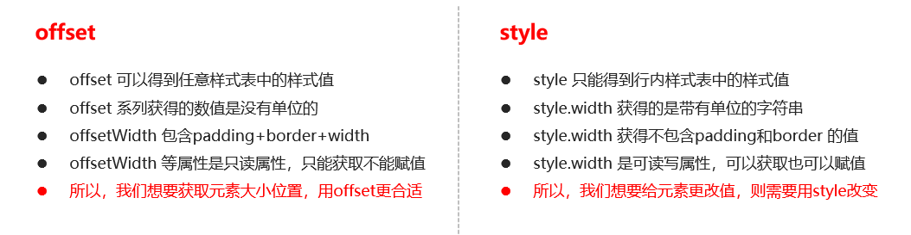
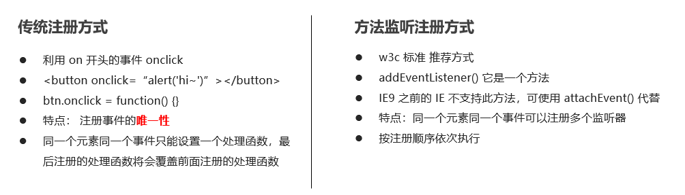

##  Web APIs 简介

### Web APIs 和 JS 基础关联性


### API 和 Web API


##  Ⅰ. DOM

**什么是Dom？**

   文档对象模型（Document Object Model，简称 DOM），是 W3C 组织推荐的处理可扩展标记语言（HTML或者XML）的标准编程接口。

   W3C 已经定义了一系列的 DOM 接口，通过这些 DOM 接口可以改变网页的内容、结构和样式。

DOM

​                D   document    html 文档

​                O   对象(在 HTML 文档中的任何一个标签都是一个对象)

​                M   模型

​                    JS 将一个 HTML 文档中的所有的标签，都描述成一棵"树"的结构


​                DOM 树作用

​                    JS 通过修改 DOM 树上的内容，会即时的反应在页面上。


​                DOM树 与 页面之间关系? 类似于 皮影戏

**Dom树**


## 一. 获取元素

### 1.根据 ID 获取

使用 getElementById() 方法可以获取带有ID 的元素对象。

​	.之前只能是document

```
 document.getElementById('id');
```

使用 console.dir() 可以打印我们获取的元素对象，更好的查看对象里面的属性和方法。

 注意：

​            如果获取不到返回的是 null

​            如果获取成功返回的是 一个 标签对象


### 2. 根据标签名获取

使用 getElementsByTagName() 方法可以返回带有指定标签名的对象的集合。

```
 document.getElementsByTagName('标签名');
 //document可以换成别的elment
```

说明：

​               返回的是一个集合(集合就是一个伪数组，可以像真数组一样通过下标读取元素，可以进行遍历操作，也可以通过.length 读取长度)

注意：

​                就算没有读取到元素,也会返回一个空间的伪数组

​                就算只读取到一个元素，也以是以数组的形式返回。


**限制获取范围**

```
  //父元素.getElementsByTagName('标签名')
```


### 3.通过class 属性获取

```
 document.getElementsByClassName('class 属性值')
 // 根据类名返回元素对象集合
```


### 4.通过Css选择器获取(最常用)

```
document.querySelector('选择器');       
// 根据指定选择器返回第一个元素对象
```

```
 document.querySelectorAll('选择器');    
 // 根据指定选择器返回一个集合
```

**注意：** 

querySelector 和 querySelectorAll里面的选择器需要加符号,比如:document.querySelector('#nav'); 


### 5 获取特殊元素（body，html）

 获取body元素

```
1. doucumnet.body  // 返回body元素对象

```

获取html元素

```
1. document.documentElement  // 返回html元素对象

```


## 二.操作元素

JavaScript 的 DOM 操作可以改变网页内容、结构和样式，我们可以
利用 DOM 操作元素来改变元素里面的内容 、属性等。                      


### 1. 属性的操作

#### **(1) 标准属性操作**

​	html 标签默认具有的属性      

```
//语法：  标签对象.属性名
elment.src
elment.id

设置值:
	elment.src = ''
```


####   (1.5) style样式属性操作

我们可以通过 JS 修改元素的大小、颜色、位置等样式。

```
element.style     //获取
element.style.backgroundColor = 'red' //设置
```

**注意**：

​	1.JS 里面的样式采取驼峰命名法 比如 fontSize、 backgroundColor

​	2.JS 修改 style 样式操作，产生的是行内样式，CSS 权重比较高

​	3.如果样式修改较多，可以采取操作类名方式更改元素样式。 


通过element.style.xxx只能获取行内样式

通用样式需要通过

​    `getComputedStyle(标签对象)[样式名]`

获取

```
//console.log(getComputedStyle(oDiv).width); //也可以

console.log(getComputedStyle(oDiv)['width']); 
```


#### (2) 自定义属性

**H5新方法:**

html 推荐使用  data- 前缀 在 html 标签上进行设置

在js 中读取时，需要使用 dataset.自定义属性

```
html:
	 
 	// 在 html 标签上使用 data- 前缀
js:
 	let oImg = document.getElementById('pic')
 	console.log(oImg.dataset.age);
 	 //在 js 中读取时，使用  标签对象.dataset.自定义属性
 	 
 	设置值:
	oImg.dataset.h = "100"
```


#### (3) class属性

class标签属性很特殊，不能使用.class 进行操作

**① 使用 .className 进行操作**

```
//获取
elment.className
//设置
elment.className = ''
```

​			可以读取

​            可以设置，对于设置是属于全覆盖式设置

​            clssName 更适用于对仅具有1个class属性值的情况。

注意：

​            className 虽然 能读取 class 属性的值，但以于设置操作，className 会全覆盖已有的类


**② 使用 .classList 进行操作**

```
//获取
elment.classList  //一个集合
//操作
elment.classList.add() 添加
elment.classList.remove() 移除
elment.classList.toggle() 切换

例: oDiv.classList.add('clsB')
```


**表单元素的属性操作**

利用 DOM 可以操作如下表单元素的属性：

```
  type、value、checked、selected、disabled

```


#### (4) 布尔类型属性操作

 在 html 标签上有一些属性，这类属性，仅有属性名，没有属性值。

这些属性要么出现在标签，要么不出现在标签

根据出不出现，标签就有不现的显示 效果

这类属性我们就起个名子叫布尔类型属性

在 JS 阶段，html 标签上的布尔类型属性需要为其赋值布尔类型的值 

```
<input type="text" >
 
let oText = document.querySelector('input')
oText.disabled = true
 
```


### 2. 操作标签内容

#### (1) .textContent

用于获取文本性的内容    出于 w3c

去除 html 标签， 同时空格和换行也会去掉

```
//获取
elment.textContent
//设置
elment.textContent = ''
```

#### (2) .innerText

用于获取文本性的内容    出于 微软 兼容性比较好

去除 html 标签， 同时空格和换行也会去掉

```
//获取
elment.textContent
//设置
elment.textContent = ''
```


#### (3) .innerHTML   

用于获取双边标签的内容(文本与标签会被一同获取出来)        

包括 html 标签，同时保留空格和换行

```
element.innerHTML
element.innerHTML = 'hello <big>world</big>'
```


#### (4) 表单元素值的获取操作

```
表单元素.value 
```

 一个属性(获取文本框初始显示的内容)

```
.defaultValue   获取文本框初始显示的内容
```


### 3. 操作属性的 api (通用)

```
element.getAttribute('属性');

操作属性的 api
            .getAttribute(属性名)           获取指定的属性值
            .setAttribute(属性名,属性值)     设置
            .removeAttribute(属性名)        移除
```

```
//  获取属性
// console.log(oBox.getAttribute('class'))

// 设置属性
// oBox.setAttribute('age','20')
 // oBox.setAttribute('data-sex','男')

// 尝试操作 class 属性，(class 很特殊，可能具有多个属性值)，
 // oBox.setAttribute('class','clsB') // 也会完全覆盖
```


### 补充

#### this

在事件处理函数 中也有 this，this 代表调用这个方法的那个标签对象

 以后，只要在事件处理函数中，获取当前对象就使用 this


this的指向在函数定义的时候是确定不了的，只有函数执行的时候才能确定this到底指向谁，一般情况下this的最终指向的是那个调用它的对象


1. 全局作用域或者普通函数中this指向全局对象window（注意定时器里面的this指向window）

2. 方法调用中谁调用this指向谁

  3.构造函数中this指向构造函数的实例

​	4.回调函数this指向window


#### 排他思想

如果有同一组元素，我们想要某一个元素实现某种样式， 需要用到循环的排他思想算法：

1. 所有元素全部清除样式（干掉其他人）

2. 给当前元素设置样式 （留下我自己）

3. 注意顺序不能颠倒，首先干掉其他人，再设置自己

#### 阻止默认行为

方案1：自宫，a 链接自己就没有跳转的功能 --

```
<a href="javascript:">
```

方案2：js 阻止 a 链接的默认行为

 // 在事件处理函数中，return false，也可以阻止默认行为


## 三. 事件

**事件概述**

​		JavaScript 使我们有能力创建动态页面，而事件是可以被 JavaScript 侦测到的行为。简单理解： 触发--- 响应机制。
​		网页中的每个元素都可以产生某些可以触发 JavaScript 的事件，
例如，我们可以在用户点击某按钮时产生一个 事件，然后去执行某些操作。

事件: 就是浏览者通过设备来浏览页面，设备的一些动作就是一个事件。

**事件三要素->执行事件的步骤**

1. 事件源     （谁-标签对象）                     1. 获取事件源
2. 事件类型 （什么事件-点击...） --->         2. 注册事件（绑定事件）
3. 事件处理函数 （做啥）             3. 添加事件处理程序（采取函数赋值形式）

  事件注册语法：

​            事件源.on事件名 = 事件处理函数

例：点击后隐藏

```
var sp = document.querySelector('span')
sp.onclick = function() {
        di.style.display = 'none'
    }
```

​       

​     


### 1. 注册事件（绑定事件）

onscroll 滚动事件

可以设置 window或 html

```
window.onscroll = function(){ 
        //     console.log('hello'); 
// }
```


#### **常见的鼠标事件**


**mouseenter** **鼠标事件**

当鼠标移动到元素上时就会触发 mouseenter 事件

 类似 mouseover，它们两者之间的差别是

 mouseover 鼠标经过自身盒子会触发，经过子盒子还会触发。 mouseenter  只会经过自身盒子触发

之所以这样，就是因为mouseenter不会冒泡

跟mouseenter搭配 鼠标离开 mouseleave  同样不会冒泡


### 2. 事件处理函数

事件源.事件名 = 事件处理函数 

 匿名函数作用为事件处理函数

```
oDiv.onclick = function(){
      console.log('hello world');
}
```


事件处理函数可以是有名也可以是匿名函数

也可以使用有名函数 作为事件处理函数，仅提供函数名即可不需要加 括号

```
 oDiv.onclick = clk
        
// 有名函数
function clk(){
    console.log('hello world');
}
```


## 四. 节点操作

**为什么学节点操作**

获取元素通常使用两种方式：

**1.**利用 **DOM** **提供的方法获取元素**

document.getElementById() 

document.getElementsByTagName()

document.querySelector  等

​	逻辑性不强、繁琐

**2.利用节点层级关系获取元素**

利用父子兄节点关系获取元素

逻辑性强， 但是兼容性稍差

这两种方式都可以获取元素节点，我们后面都会使用，但是节点操作更简单


**节点概述**

网页中的所有内容都是节点（标签、属性、文本、注释等），在DOM 中，节点使用 node 来表示。

HTML DOM 树中的所有节点均可通过 JavaScript 进行访问，所有 HTML 元素（节点）均可被修改，也可以创建或删除。


一般地，节点至少拥有nodeType（节点类型）、nodeName（节点名称）和nodeValue（节点值）这三个基本属性。

元素节点  nodeType  为 1

属性节点  nodeType  为 2

文本节点  nodeType  为 3 （文本节点包含文字、空格、换行等）

我们在实际开发中，节点操作主要操作的是**元素节点**


**节点层级**

利用 DOM 树可以把节点划分为不同的层级关系，常见的是**父子兄层级关系**。


### 1. 获取节点


#### （1）父级节点 

```
 node.parentNode  
```

parentNode 属性可返回某节点的父节点，注意是最近的一个父节点

如果指定的节点没有父节点则返回 null 


#### （2）子节点 

常用：

```
 2. parentNode.children（非标准） 
```

parentNode.children 是一个只读属性，返回所有的子元素节点。它只返回子元素节点，其余节点不返回 （**这个是我们重点掌握的**）。

虽然children 是一个非标准，但是得到了各个浏览器的支持，因此我们可以放心使用

```
 5. parentNode.firstElementChild   
```

firstElementChild  返回第一个子元素节点，找不到则返回null。

```
 6. parentNode.lastElementChild    
```

lastElementChild 返回最后一个子元素节点，找不到则返回null。  

注意：这两个方法有兼容性问题，IE9 以上才支持。


----------------------以下为开发不常用

```
 parentNode.childNodes（标准）   
```

parentNode.childNodes 返回包含指定节点的子节点的集合，该集合为即时更新的集合。

**注意：**返回值里面包含了所有的子节点，包括元素节点，文本节点等。

如果只想要获得里面的元素节点，则需要专门处理。 所以我们一般不提倡使用childNodes

```
var ul = document. querySelector(‘ul’);
for(var i = 0; i < ul.childNodes.length;i++) {
if (ul.childNodes[i].nodeType == 1) {    // ul.childNodes[i] 是元素节点
    console.log(ul.childNodes[i]);}
}

```


```
 3. parentNode.firstChild   
```

firstChild 返回第一个子节点，找不到则返回null。同样，也是包含所有的节点。

```
 4. parentNode.lastChild    
```

lastChild 返回最后一个子节点，找不到则返回null。同样，也是包含所有的节点。


实际开发中，firstChild 和 lastChild 包含其他节点，操作不方便，而 firstElementChild 和 lastElementChild 又有兼容性问题，那么我们如何获取第一个子元素节点或最后一个子元素节点呢？

**解决方案：**

1.如果想要第一个子元素节点，可以使用 parentNode.chilren[0] 

2.如果想要最后一个子元素节点，可以使用 parentNode.chilren[parentNode.chilren.length - 1]  


#### （3）兄弟节点 

常用方法：

```
 3. node.nextElementSibling  
```

nextElementSibling 返回当前元素下一个兄弟元素节点，找不到则返回null。

```
 4. node.previousElementSibling    
```

previousElementSibling 返回当前元素上一个兄弟节点，找不到则返回null。


--------------------------------------------现在不常用；会获取文本节点..

```
 1. node.nextSibling  
```

nextSibling返回当前元素的下一个兄弟元素节点，找不到则返回null。同样，也是包含所有的节点。

```
 2. node.previousSibling    
```

previousSibling返回当前元素上一个兄弟元素节点，找不到则返回null。同样，也是包含所有的节点。


**问：如何解决兼容性问题 ？**

答：自己封装一个兼容性的函数  

```
   function getNextElementSibling(element) {
      var el = element;
      while (el = el.nextSibling) {
        if (el.nodeType === 1) {
            return el;
        }
      }
      return null;
    }  

```


### 2. 操作节点

#### （1）复制节点(克隆节点)

```
 node.cloneNode() 
```

node.cloneNode()
方法返回调用该方法的节点的一个副本。 也称为克隆节点/拷贝节点

**注意**：

1. 如果括号参数为空或者为 false ，则是浅拷贝，即只克隆复制节点本身，不克隆里面的子节点。

2. 如果括号参数为 true ，则是深度拷贝，会复制节点本身以及里面所有的子节点。

#### （2）创建节点

```
 document.createElement('tagName')
```

document.createElement()方法创建由 tagName 指定的 HTML 元素。因为这些元素原先不存在，是根据我们的需求动态生成的，所以我们也称为动态创建元素节点。


#### （3）添加节点

```
 1. node.appendChild(child) 
```

node.appendChild()方法将一个节点添加到指定父节点的子节点列表末尾。类似于 CSS 里面的 after伪元素。

#### （4）插入节点

```
 2. node.insertBefore(child, 指定元素) 
```

node.insertBefore()方法将一个节点添加到父节点的指定子节点前面。类似于 CSS 里面的 before伪元素。


#### （5）替换节点

```
目标元素父元素.replaceChild(新元素,目标元素) 
```


#### （6）删除节点

```
node.removeChild(child) 
```

node.removeChild()方法从 DOM 中删除一个子节点，返回删除的节点。


#### 三种动态创建元素区别

 document.write()

 element.innerHTML

 document.createElement()

**区别**

1. document.write 是直接将内容写入页面的内容流，但是文档流执行完毕，则它会导致页面全部重绘

2. innerHTML 是将内容写入某个 DOM 节点，不会导致页面全部重绘

3. innerHTML 创建多个元素效率更高（不要拼接字符串，采取数组形式拼接），结构稍微复杂

4. createElement() 创建多个元素效率稍低一点点，但是结构更清晰

**总结**：不同浏览器下，innerHTML 效率要比 creatElement 高


## Ⅱ. BOM 浏览器对象模型

### BOM 概述

BOM（Browser Object Model）即**浏览器对象模型**，它提供了独立于内容而与浏览器窗口进行交互的对象，其核心对象是 window。

BOM 由一系列相关的对象构成，并且每个对象都提供了很多方法与属性。

BOM 缺乏标准，JavaScript 语法的标准化组织是 ECMA，DOM 的标准化组织是 W3C，BOM 最初是Netscape 浏览器标准的一部分。


**BOM 的构成**

BOM 比 DOM 更大，它包含 DOM。


**window对象是浏览器的顶级对象**，它具有双重角色。

1.它是 JS 访问浏览器窗口的一个接口。

2.它是一个全局对象。定义在全局作用域中的变量、函数都会变成 window 对象的属性和方法。

在调用的时候可以省略 window，前面学习的对话框都属于 window 对象方法，如 alert()、prompt() 等。

**注意：**window下的一个特殊属性 window.name


### 一. window 对象的常见事件

#### 1.窗口加载事件 

```
//1.
window.onload = function(){}
或者 
//2.
window.addEventListener("load",function(){});
```

window.onload 是窗口 (页面）加载事件,当文档内容完全加载完成会触发该事件(包括图像、脚本文件、CSS 文件等), 就调用的处理函数。

**注意：**

1. 有了 window.onload 就可以把 JS 代码写到页面元素的上方，因为 onload 是等页面内容全部加载完毕，再去执行处理函数。

2. window.onload 传统注册事件方式 只能写一次，如果有多个，会以最后一个 window.onload 为准。

3. 如果使用 addEventListener 则没有限制


```
//3.
document.addEventListener('DOMContentLoaded',function(){})
```

DOMContentLoaded 事件触发时，仅当DOM加载完成，不包括样式表，图片，flash等等。

Ie9以上才支持

如果页面的图片很多的话, 从用户访问到onload触发可能需要较长的时间, 交互效果就不能实现，必然影响用户的体验，此时用 DOMContentLoaded 事件比较合适。


#### 2.调整窗口大小事件

```
 window.onresize = function(){}

 window.addEventListener("resize",function(){});
```

window.onresize 是调整窗口大小加载事件,  当触发时就调用的处理函数。

**注意：**

1. 只要窗口大小发生像素变化，就会触发这个事件。

2. 我们经常利用这个事件完成响应式布局。 window.innerWidth 当前屏幕的宽度


### 二. 定时器

定时器是window下的方法

#### 1.setTimeout() 定时器

```
 window.setTimeout(调用函数, [延迟的毫秒数]);

```

setTimeout() 方法用于设置一个定时器，该定时器在定时器到期后执行调用函数。

**注意：**

1. window 可以省略。

2. 这个调用函数可以直接写函数，或者写函数名或者采取字符串‘函数名()'三种形式。第三种不推荐

3. 延迟的毫秒数省略默认是 0，如果写，必须是毫秒。

4. 因为定时器可能有很多，所以我们经常给定时器赋值一个标识符。


setTimeout()  这个调用函数我们也称为回调函数 callback

普通函数是按照代码顺序直接调用。

而这个函数，需要等待时间，时间到了才去调用这个函数，因此称为回调函数。

简单理解： 回调，就是回头调用的意思。上一件事干完，再回头再调用这个函数。

以前我们讲的   element.onclick = function(){}   或者  element.addEventListener(“click”, fn);   里面的 函数也是回调函数。


#### 2.停止 setTimeout() 定时器

```
 window.clearTimeout(timeoutID)
```

clearTimeout()方法取消了先前通过调用 setTimeout() 建立的定时器。

**注意：**

1. window 可以省略。

2. 里面的参数就是定时器的标识符 。


#### 3.setInterval() 定时器

```
 window.setInterval(回调函数, [间隔的毫秒数]);

```

setInterval() 方法重复调用一个函数，每隔这个时间，就去调用一次回调函数。

**注意：**

1. window 可以省略。

2. 这个调用函数可以直接写函数，或者写函数名或者采取字符串 '函数名()'  三种形式。

3. 间隔的毫秒数省略默认是 0，如果写，必须是毫秒，表示每隔多少毫秒就自动调用这个函数。
4. 因为定时器可能有很多，所以我们经常给定时器赋值一个标识符。
5. 第一次执行也是间隔毫秒数之后执行，之后每隔毫秒数就执行一次。


#### 4.停止 setInterval() 定时器

```
 window.clearInterval(intervalID);

```

clearInterval()方法取消了先前通过调用 setInterval()建立的定时器。

**注意：**

1. window 可以省略。

2. 里面的参数就是定时器的标识符 。


#### 5. 节流

控制一个事件处理函数被执行频率;

事件有触发 与 执行;


 当一个事件处理函数执行的过程中，再次被频繁的执行时，保障前一个事件处理函数执行结束后再执行一下次事件处理函数.


 我们不是控制不让浏览者频繁触发，

​            而控制 不管用户频繁 触发多少次，事件函数 内的代码仅执行一次。

```
// 第一步：定义一个全局变量，并赋值 true
        let flag = true

        function ck(){
            // 第二步：在事件处理函数内判断这个变量的值，如果是 true 就执行
            if(flag === true){
                // 第三步 :执行之后马上修改为 false     (过河拆桥)
                flag = false
                // 
                setTimeout(function(){
                    console.log('hello');
                    // 第四步：在指定的时间到达时，将 这个变量再修改为 true
                    flag = true
                },2000)
            }
        }
```


### 三 location 对象

window 对象给我们提供了一个 location 属性用于获取或设置窗体的 URL，并且可以用于解析 URL 。 因为这个属性返回的是一个对象，所以我们将这个属性也称为 location对象。

**URL**

统一资源定位符 (Uniform Resource Locator, URL) 是互联网上标准资源的地址。互联网上的每个文件都有一个唯一的 URL，它包含的信息指出文件的位置以及浏览器应该怎么处理它。

URL 的一般语法格式为：

```
 protocol://host[:port]/path/[?query]#fragment

 http://www.itcast.cn/index.html?name=andy&age=18#link

```


 **location 对象的属性**


**location 对象的方法**


### 四 navigator 对象

navigator 对象包含有关浏览器的信息，它有很多属性，我们最常用的是 userAgent，该属性可以返回由客户机发送服务器的 user-agent 头部的值。

下面前端代码可以判断用户那个终端打开页面，实现跳转

```
if((navigator.userAgent.match(/(phone|pad|pod|iPhone|iPod|ios|iPad|Android|Mobile|BlackBerry|IEMobile|MQQBrowser|JUC|Fennec|wOSBrowser|BrowserNG|WebOS|Symbian|Windows Phone)/i))) {
    window.location.href = "";     //手机
 } else {
    window.location.href = "";     //电脑
 }

```


### 五 history 对象

window 对象给我们提供了一个 history 对象，与浏览器历史记录进行交互。该对象包含用户（在浏览器窗口中）访问过的 URL。


### JS 执行机制

**JS 是单线程**

JavaScript 语言的一大特点就是单线程，也就是说，同一个时间只能做一件事。这是因为 Javascript 这门脚本语言诞生的使命所致——JavaScript 是为处理页面中用户的交互，以及操作 DOM 而诞生的。比如我们对某个 DOM 元素进行添加和删除操作，不能同时进行。 应该先进行添加，之后再删除。

单线程就意味着，所有任务需要排队，前一个任务结束，才会执行后一个任务。这样所导致的问题是： 如果JS 执行的时间过长，这样就会造成页面的渲染不连贯，导致页面渲染加载阻塞的感觉。


**同步和异步**

为了解决这个问题，利用多核 CPU 的计算能力，HTML5 提出 Web Worker 标准，允许 JavaScript 脚本创建多个线程。于是，JS 中出现了同步和异步。

同步

前一个任务结束后再执行后一个任务，程序的执行顺序与任务的排列顺序是一致的、同步的。比如做饭的同步做法：我们要烧水煮饭，等水开了（10分钟之后），再去切菜，炒菜。

异步

你在做一件事情时，因为这件事情会花费很长时间，在做这件事的同时，你还可以去处理其他事情。比如做饭的异步做法，我们在烧水的同时，利用这10分钟，去切菜，炒菜。

**他们的本质区别： 这条流水线上各个流程的执行顺序不同。**


同步任务

同步任务都在主线程上执行，形成一个执行栈。

异步任务

JS 的异步是通过回调函数实现的。

一般而言，异步任务有以下三种类型:

1、普通事件，如 click、resize 等

2、资源加载，如 load、error 等

3、定时器，包括 setInterval、setTimeout 等

异步任务相关回调函数添加到**任务队列**中（任务队列也称为消息队列）。


1. 先执行执行栈中的同步任务。

2. 异步任务（回调函数）放入任务队列中。

3. 一旦执行栈中的所有同步任务执行完毕，系统就会按次序读取任务队列中的异步任务，于是被读取的异步任务结束等待状态，进入执行栈，开始执行。


由于主线程不断的重复获得任务、执行任务、再获取任务、再执行，所以这种机制被称为事件循环（ event loop）。


## Ⅲ. 本地存储

随着互联网的快速发展，基于网页的应用越来越普遍，同时也变的越来越复杂，为了满足各种各样的需求，会经常性在本地存储大量的数据，HTML5规范提出了相关解决方案。

**本地存储特性**

1、数据存储在用户浏览器中

2、设置、读取方便、甚至页面刷新不丢失数据

3、容量较大，sessionStorage约5M、localStorage约20M

4、只能存储字符串，可以将对象JSON.stringify() 编码后存储


### window.sessionStorage

1、生命周期为关闭浏览器窗口

2、在同一个窗口(页面)下数据可以共享

3、以键值对的形式存储使用

```
存储数据：
sessionStorage.setItem(key, value)
获取数据：
sessionStorage.getItem(key)
删除数据：
sessionStorage.removeItem(key)
删除所有数据：
sessionStorage.clear()
```

### **window.localStorage**

1、声明周期永久生效，除非手动删除 否则关闭页面也会存在

2、可以多窗口（页面）共享（同一浏览器可以共享）

3、以键值对的形式存储使用

```
存储数据：
localStorage.setItem(key, value)
获取数据：
localStorage.getItem(key)
删除数据：
localStorage.removeItem(key)
删除所有数据：
localStorage.clear()
```


## Ⅳ. PC 端网页特效

### 元素偏移量 offset 系列

offset 翻译过来就是偏移量， 我们使用 offset 系列相关属性可以动态的得到该元素的位置（偏移）、大小等。

 获得元素距离带有定位父元素的位置

 获得元素自身的大小（宽度高度）

 注意： 返回的数值都不带单位


**offset 系列常用属性：**


**offset** **与** **style** **区别** 




### 元素可视区 client 系列

client 翻译过来就是客户端，我们使用 client 系列的相关属性来获取元素可视区的相关信息。通过 client 系列的相关属性可以动态的得到该元素的边框大小、元素大小等。


### 元素滚动 scroll 系列

scroll 翻译过来就是滚动的，我们使用 scroll 系列的相关属性可以动态的得到该元素的大小、滚动距离等。


**页面被卷去的头部**

如果浏览器的高（或宽）度不足以显示整个页面时，会自动出现滚动条。当滚动条向下滚动时，页面上面被隐藏掉的高度，我们就称为页面被卷去的头部。滚动条在滚动时会触发 onscroll
事件。

**页面被卷去的头部兼容性解决方案**

需要注意的是，页面被卷去的头部，有兼容性问题，因此被卷去的头部通常有如下几种写法：

\1. 声明了 DTD，使用 document.documentElement.scrollTop

\2. 未声明 DTD，使用  document.body.scrollTop

\3. 新方法 window.pageYOffset 和 window.pageXOffset，IE9 开始支持

```
 function getScroll() {
    return {
      left: window.pageXOffset || document.documentElement.scrollLeft || document.body.scrollLeft||0,
      top: window.pageYOffset || document.documentElement.scrollTop || document.body.scrollTop || 0
    };
 } 
使用的时候  getScroll().left

```


### **三大系列总结**


他们主要用法：

1.offset系列 经常用于获得元素位置    offsetLeft  offsetTop

2.client 经常用于获取元素大小  clientWidth  clientHeight

3.scroll 经常用于获取滚动距离  scrollTop  scrollLeft   

4.注意页面滚动的距离通过 window.pageXOffset  获得


## Ⅴ. 事件高级


### 1. 事件对象

**什么是事件对象**

```
  eventTarget.onclick = function(event) {} 
  eventTarget.addEventListener('click', function(event) {}）
  // 这个 event 就是事件对象，我们还喜欢的写成 e 或者 evt 

```

官方解释：event 对象代表事件的状态，比如键盘按键的状态、鼠标的位置、鼠标按钮的状态。

简单理解：事件发生后，跟事件相关的一系列信息数据的集合都放到这个对象里面，这个对象就是事件对象 event，它有很多属性和方法。

比如：  

1. 谁绑定了这个事件。

2. 鼠标触发事件的话，会得到鼠标的相关信息，如鼠标位置。

3. 键盘触发事件的话，会得到键盘的相关信息，如按了哪个键。


**事件对象的使用语法**

```
  eventTarget.onclick = function(event) {
     // 这个 event 就是事件对象，我们还喜欢的写成 e 或者 evt 
  } 
  eventTarget.addEventListener('click', function(event) {
    // 这个 event 就是事件对象，我们还喜欢的写成 e 或者 evt 
  }）

```

这个 event  是个形参，系统帮我们设定为事件对象，不需要传递实参过去。

当我们注册事件时， event 对象就会被系统自动创建，并依次传递给事件监听器（事件处理函数）。


**事件对象的兼容性方案** 

事件对象本身的获取存在兼容问题：

1. 标准浏览器中是浏览器给方法传递的参数，只需要定义形参 e 就可以获取到。

2. 在 IE6~8 中，浏览器不会给方法传递参数，如果需要的话，需要到 window.event 中获取查找。

**解决:** 

e = e || window.event;


**事件对象的常见属性和方法**

e.target 和 this 的区别：

  this 是事件绑定的元素， 这个函数的调用者（绑定这个事件的元素） 

  e.target 是事件触发的元素。


```
event.pageX     鼠标点击的位置距离文档左上角的水平距离
event.pageY     鼠标点击的位置距离文档左上角的垂直平距离

event.clientX   鼠标点击的位置距离窗口左上角的水平距离
 event.clientY   鼠标点击的位置距离容器左上角的水平距离

event.screenX   鼠标点击的位置距离屏幕左上角的水平距离
event.screenY   鼠标点击的位置距离屏幕左上角的水平距离
```


### 2. 添加事件监听

给元素添加事件，称为注册事件或者绑定事件。
注册事件有两种方式：传统方式和方法监听注册方式




`addEventListener 事件监听方式` 

语法:

```
对象.addEventListener(事件名,事件处理函数,boolean) 
```

eventTarget.addEventListener()方法将指定的监听器注册到 eventTarget（目标对象）上，当该对象触发指定的事件时，就会执行事件处理函数。

该方法接收三个参数：

 事件名：，比如 click 、mouseover ，注意这里不要带 on

 事件处理函数：事件处理函数，事件发生时，会调用该监听函数

 boolean：可选参数，是一个布尔值，默认是 false。


### 3. 删除事件


1.传统注册方式

```
eventTarget.onclick = null;
```


2.方法监听注册方式

```
对象.removeEventListener(事件名,事件处理函数) 
```

如果想移除事件监听，注册时必须使用有名函数


### 4. DOM事件流

事件流描述的是从页面中接收事件的顺序。

事件发生时会在元素节点之间按照特定的顺序传播，这个传播过程即 DOM 事件流。

比如我们给一个div 注册了点击事件：

DOM 事件流分为3个阶段：

 

1. 捕获阶段    		  (向下捕获，从外向内)

2. 当前目标阶段       (目标位置，到达后不在向内捕获，开始冒泡)

3. 冒泡阶段             (向上冒泡，从内向外)


事件冒泡： IE 最早提出，事件开始时由最具体的元素接收，然后逐级向上传播到到 DOM 最顶层节点的过程。

​	只要是结构上嵌套的就会有事件冒泡

​	事件冒泡，事件传播方向是向上(由内向外)

​	无论是否绑定了事件处理函数，都会传递，如果绑定了事件处理函数，就有代码执行，	    	如果没有绑定，也会传播，只是没有代码执行


事件捕获： 网景最早提出，由 DOM 最顶层节点开始，然后逐级向下传播到到最具体的元素接收的过程。 

```
 如果要修改事件传播方向为事件捕获方式，只能使用 事件监听语法，来注册事件，同时要传递第3个参数
对象.addEventListener('事件',事件处理函数,true)     // 使用捕获
对象.addEventListener('事件',事件处理函数,false)     // 使用冒泡
```


我们向水里面扔一块石头，首先它会有一个下降的过程，这个过程就可以理解为从最顶层向事件发生的最具体元素（目标点）的捕获过程；之后会产生泡泡，会在最低点（最具体元素）之后漂浮到水面上，这个过程相当于事件冒泡。 


事件发生时会在元素节点之间按照特定的顺序传播，这个传播过程即 DOM 事件流。


**注意**

1.JS 代码中只能执行捕获或者冒泡其中的一个阶段。

2.onclick 和 attachEvent 只能得到冒泡阶段。

3.addEventListener(type, listener[, useCapture])第三个参数如果是 true，表示在事件捕获阶段调用事件处理程序；如果是 false（不写默认就是false），表示在事件冒泡阶段调用事件处理程序。

4.实际开发中我们很少使用事件捕获，我们更关注事件冒泡。

5.有些事件是没有冒泡的，比如 onblur、onfocus、onmouseenter、onmouseleave


### 5. 事件委托（代理、委派）

事件冒泡本身的特性，会带来的坏处，也会**带来的好处**：

咱们班有100个学生，快递员有100个快递，如果一个个的送花费时间较长。同时每个学生领取的时候，也需要排队领取，也花费时间较长，何如？

**解决方案：**  快递员把100个快递，**委托**给班主任，班主任把这些快递放到办公室，同学们下课自行领取即可。

**优势：**  快递员省事，委托给班主任就可以走了。同学们领取也方便，因为相信班主任。

------

**事件委托**;

事件委托也称为事件代理， 在 jQuery 里面称为事件委派。


程序中也有如此场景：

```
  <ul>
        <li>知否知否，应该有弹框在手</li>
        <li>知否知否，应该有弹框在手</li>
        <li>知否知否，应该有弹框在手</li>
        <li>知否知否，应该有弹框在手</li>
        <li>知否知否，应该有弹框在手</li>
  </ul>
```

点击每个 li 都会弹出对话框，以前需要给每个 li 注册事件，是非常辛苦的，而且访问 DOM 的次数越多，这就会延长整个页面的交互就绪时间。


**可以在父元素上为子元素绑定事件，事件在任何一个子元素上触发时都会传递给父元素，这就是利用了事件冒泡**

```
        let oUl = document.querySelector('ul')
        oUl.onclick = function(){
            console.log('hello');
        }
```


**事件委托的原理:**

不是每个子节点单独设置事件监听器，而是事件监听器设置在其父节点上，然后利用冒泡原理影响设置每个子节点。

**事件委托的作用:**

我们只操作了一次 DOM ，提高了程序的性能。


好处2：

动态创建的元素也可以触发事件


### 6. 阻止事件冒泡

冒泡的弊端: 会触发一些我们不想要运行的代码。


**阻止事件冒泡的两种方式**

**阻止事件冒泡**

 **标准写法：利用事件对象里面的 stopPropagation()方法**

```
 e.stopPropagation() 
```

冒泡和捕获都会被阻止


 非标准写法：IE 6-8  利用事件对象 cancelBubble属性 （不常用）

```
 e.cancelBubble = true;
```

阻止事件冒泡的兼容性解决方案 

```
  if(e && e.stopPropagation){
      e.stopPropagation();
  }else{
      window.event.cancelBubble = true;
  }
```

### 7. 事件监听中阻止默认行为

```
event.preventDefault()
```


### 8. 常用的鼠标事件


1.禁止鼠标右键菜单

contextmenu主要控制应该何时显示上下文菜单，主要用于程序员取消默认的上下文菜单

```
document.addEventListener('contextmenu', function(e) {
e.preventDefault();
})

```

2.禁止鼠标选中（selectstart 开始选中）

```
   document.addEventListener('selectstart', function(e) {
    e.preventDefault();
   })

```


**鼠标事件对象**

event对象代表事件的状态，跟事件相关的一系列信息的集合。现阶段我们主要是用鼠标事件对象 MouseEvent 和键盘事件对象 KeyboardEvent。


### 9. 常用的键盘事件

事件除了使用鼠标触发，还可以使用键盘触发。


**注意：** 

**1.**  **如果使用addEventListener 不需要加on**

2.onkeypress 和前面2个的区别是，它不识别功能键，比如左右箭头，shift 等。

3.三个事件的执行顺序是： keydown --  keypress  --- keyup


div 绑定的 onkeydown 事件没有效果，因为 div 无法接收输入

document 对象则可以

并不是所有的元素都可以注册 onkeydown 事件


**识别按键 **

`e.key`

**keyCode已废弃**


**注意：**  onkeydown 和 onkeyup  不区分字母大小写，onkeypress 区分字母大小写。

在我们实际开发中，我们更多的使用keydown和keyup， 它能识别所有的键（包括功能键）

Keypress 不识别功能键，但是keyCode属性能区分大小写，返回不同的ASCII值


### 10. 拖拽

h5新增了`draggable` 属性，用于实现拖拽的效果

```
<div class="box" draggable="true"></div>
```

拖拽主动事件

​	ondragstart     元素开始被拖拽时触发

​	ondragend       元素停止拖拽时触发

​	ondrag          拖拽过程中不断触发

注意： 

​	 需要在标签上设置 draggable="true"。图片标签默认就具有拖拽效果。


 被动事件

​    ondragenter     当有元素被拖入时触发

​    ondragleave     当有元素被拖出时触发

​	ondragover      当有元素在当前元素上拖动时触发


​	ondrop          当有元素在当前元素上被"释放"时触发

注意： 

​            如果想让 ondrop 生效，必须在 ondragover 中阻止默认行为

​            dragover 会一直生效也就是不会中断，这样就没有机会执行 ondrop 事件

​            dragover内阻止 默认行为就是让 dragover 中断，让 ondrop 执行