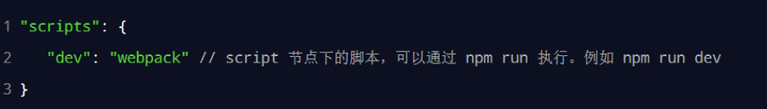
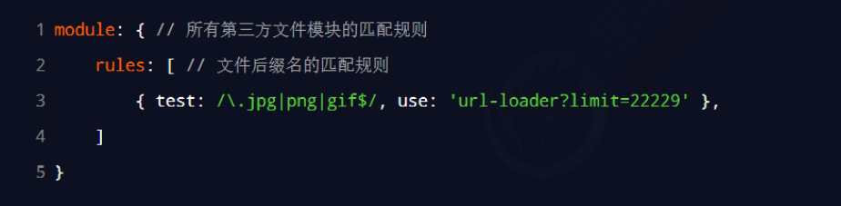
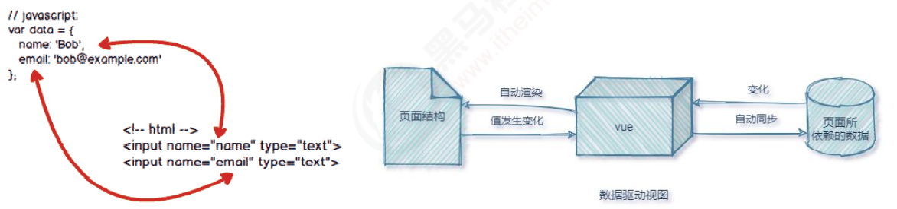
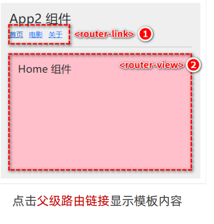

## 前端工程化

### 实际的前端开发：

- ⚫ 模块化（js 的模块化、css 的模块化、资源的模块化）
- ⚫ 组件化（复用现有的 UI 结构、样式、行为）
- ⚫ 规范化（目录结构的划分、编码规范化、接口规范化、文档规范化、 Git 分支管理）
- ⚫ 自动化（自动化构建、自动部署、自动化测试）

### 2. 什么是前端工程化

- 前端工程化指的是：在企业级的前端项目开发中，把前端开发所需的工具、技术、流程、经验等进行规范化、标准化。
- 企业中的 Vue 项目和 React 项目，都是基于工程化的方式进行开发的。
- 好处：前端开发自成体系，有一套标准的开发方案和流程。

### 目前主流的前端工程化解决方案：

- webpack（ https://www.webpackjs.com/ ）
- parcel（ https://zh.parceljs.org/ ）

## webpack

### 网站

- npmjs.com

### webpack 的基本使用

- 1.什么是 webpack

	- 概念

		- webpack 是前端项目工程化的具体解决方案。

	- 主要功能：

		- 它提供了友好的前端模块化开发支持，以及代码压缩混淆、处理浏览器端 JavaScript 的兼容性、性
能优化等强大的功能。

	- 好处

		- 让程序员把工作的重心放到具体功能的实现上，提高了前端开发效率和项目的可维护性

	- 注意：目前 Vue，React 等前端项目，基本上都是基于 webpack 进行工程化开发的

- 2. 创建列表隔行变色项目

	- ① 新建项目空白目录，并运行 npm init –y 命令，初始化包管理配置文件 package.json
② 新建 src 源代码目录
③ 新建 src -> index.html 首页和 src -> index.js 脚本文件
④ 初始化首页基本的结构
⑤ 运行 npm install jquery –S 命令，安装 jQuery
⑥ 通过 ES6 模块化的方式导入 jQuery，实现列表隔行变色效果
	- 结果为语法错误---import浏览器不兼容，需要webpack处理

- 3. 在项目中安装 webpack

	- 在终端运行如下的命令，安装 webpack 相关的两个包：
	- npm install webpack@5.42.1 webpack-cli@4.7.2 -D 

- 4. 在项目中配置 webpack

	- ① 在项目根目录中，创建名为 webpack.config.js 的 webpack 配置文件，并初始化如下的基本配置：
	- 
	- ② 在 package.json 的 scripts 节点下，新增 dev 脚本如下：
	- 
	- ③ 在终端中运行 npm run dev 命令，启动 webpack 进行项目的打包构建

- 4.1 mode 的可选值

	- mode 节点的可选值有两个，分别是：

		- ① development

			- ⚫ 开发环境
			- ⚫ 不会对打包生成的文件进行代码压缩和性能优化
			- ⚫ 打包速度快，适合在开发阶段使用

		- ② production

			- ⚫ 生产环境
			- ⚫ 会对打包生成的文件进行代码压缩和性能优化
			- ⚫ 打包速度很慢，仅适合在项目发布阶段使用

- package.json_

	- dependencies

		- :开发运行都需要的插件-使用-S

	- devDependencies

		- ：仅开发需要，使用-D下载

	- -S是--save简写
	- -D是--save dev简写

- 4.2 webpack.config.js 文件的作用

	- webpack.config.js 是 webpack 的配置文件。webpack 在真正开始打包构建之前，会先读取这个配置文件，
从而基于给定的配置，对项目进行打包。
	- 注意：由于 webpack 是基于 node.js 开发出来的打包工具，因此在它的配置文件中，支持使用 node.js 相关
的语法和模块进行 webpack 的个性化配置。

- 4.3 webpack 中的默认约定

	- 在 webpack 4.x 和 5.x 的版本中，有如下的默认约定：

		- ① 默认的打包入口文件为 src -> index.js
		- ② 默认的输出文件路径为 dist -> main.js

	- 注意：可以在 webpack.config.js 中修改打包的默认约定

- 4.4 自定义打包的入口与出口

	- 在 webpack.config.js 配置文件中，通过 entry 节点指定打包的入口。通过 output 节点指定打包的出口。
	- 

### ◆ webpack 中的插件

- 1. webpack 插件的作用

	- 通过安装和配置第三方的插件，可以拓展 webpack 的能力，从而让 webpack 用起来更方便。最常用的webpack 插件有如下两个：
	- ① webpack-dev-server

		- ⚫ 类似于 node.js 阶段用到的 nodemon 工具
		- ⚫ 每当修改了源代码，webpack 会自动进行项目的打包和构建

	- ② html-webpack-plugin

		- ⚫ webpack 中的 HTML 插件（类似于一个模板引擎插件）
		- ⚫ 可以通过此插件自定制 index.html 页面的内容

- 2. webpack-dev-server

	- webpack-dev-server 可以让 webpack 监听项目源代码的变化，从而进行自动打包构建。
	- 2.1 安装 webpack-dev-server

		- 运行如下的命令，即可在项目中安装此插件：
		- npm install webpack-dev-server@3.11.2 -D

	- 2.2 配置 webpack-dev-server
- ① 修改 package.json -> scripts 中的 dev 命令如下：
		- 
		- ② 再次运行 npm run dev 命令，重新进行项目的打包
		- ③ 在浏览器中访问 http://localhost:8080 地址，查看自动打包效果
	
- 注意：webpack-dev-server 会启动一个实时打包的 http 服务器
	- 2.3 打包生成的文件哪儿去了？
	
	- ① 不配置 webpack-dev-server 的情况下，webpack 打包生成的文件，会存放到实际的物理磁盘上
	
		- ⚫ 严格遵守开发者在 webpack.config.js 中指定配置
			- ⚫ 根据 output 节点指定路径进行存放
	
	- ② 配置了 webpack-dev-server 之后，打包生成的文件存放到了内存中
	
		- ⚫ 不再根据 output 节点指定的路径，存放到实际的物理磁盘上
			- ⚫ 提高了实时打包输出的性能，因为内存比物理磁盘速度快很多
	
- 2.4 生成到内存中的文件该如何访问？
	
	- webpack-dev-server 生成到内存中的文件，默认放到了项目的根目录中，而且是虚拟的、不可见的。
		- ⚫ 可以直接用 / 表示项目根目录，后面跟上要访问的文件名称，即可访问内存中的文件
		- ⚫ 例如 /bundle.js 就表示要访问 webpack-dev-server 生成到内存中的 bundle.js 文件
	
- 3. html-webpack-plugin

	- html-webpack-plugin 是 webpack 中的 HTML 插件，可以通过此插件自定制 index.html 页面的内容。
	- 需求：通过 html-webpack-plugin 插件，将 src 目录下的 index.html 首页，复制到项目根目录中一份！
	- 3.1 安装 html-webpack-plugin

		- 运行如下的命令，即可在项目中安装此插件：

			- npm install html-webpack-plugin@5.3.2 -D

	- 3.2 配置 html-webpack-plugin

		- 

	- 3.3 解惑 html-webpack-plugin

		- ① 通过 HTML 插件复制到项目根目录中的 index.html 页面，也被放到了内存中
		- ② HTML 插件在生成的 index.html 页面，自动注入了打包的 bundle.js 文件

- 4. devServer 节点

	- 在 webpack.config.js 配置文件中，可以通过 devServer 节点对 webpack-dev-server 插件进行更多的配置，
	- 
	- 注意：凡是修改了 webpack.config.js 配置文件，或修改了 package.json 配置文件，必须重启实时打包的服务器，否则最新的配置文件无法生效！

### ◆ webpack 中的 loader

- 在实际开发过程中，webpack 默认只能打包处理以 .js 后缀名结尾的模块。其他非 .js 后缀名结尾的模块，
webpack 默认处理不了，需要调用 loader 加载器才可以正常打包，否则会报错！

- loader 加载器的作用：协助 webpack 打包处理特定的文件模块。比如：

	- ⚫ css-loader 可以打包处理 .css 相关的文件
	- ⚫ less-loader 可以打包处理 .less 相关的文件
	- ⚫ babel-loader 可以打包处理 webpack 无法处理的高级 JS 语法

- 2. loader 的调用过程

	- 

- 3. 打包处理 css 文件

	- ① 运行 npm i style-loader@3.0.0 css-loader@5.2.6 -D 命令，安装处理 css 文件的 loader
	- ② 在 webpack.config.js 的 module -> rules 数组中，添加 loader 规则如下：
	- 
	- 其中，test 表示匹配的文件类型， use 表示对应要调用的 loader
	- 注意：

		- ⚫ use 数组中指定的 loader 顺序是固定的
		- ⚫ 多个 loader 的调用顺序是：从后往前调用

- 4. 打包处理 less 文件

	- ① 运行 npm i less-loader@10.0.1 less@4.1.1 -D 命令
	- ② 在 webpack.config.js 的 module -> rules 数组中，添加 loader 规则如下：
	- 

- 5. 打包处理样式表中与 url 路径相关的文件

	- ① 运行 npm i url-loader@4.1.1 file-loader@6.2.0 -D 命令
	- ② 在 webpack.config.js 的 module -> rules 数组中，添加 loader 规则如下：
	- 
	- 其中 ? 之后的是 loader 的参数项：

		- ⚫ limit 用来指定图片的大小，单位是字节（byte）
		- ⚫ 只有 ≤ limit 大小的图片，才会被转为 base64 格式的图片

- 6. 打包处理 js 文件中的高级语法

	- webpack 只能打包处理一部分高级的 JavaScript 语法。对于那些 webpack 无法处理的高级 js 语法，需要借
	- 助于 babel-loader 进行打包处理。例如 webpack 无法处理下面的 JavaScript 代码

		- 

	- 6.1 安装 babel-loader 相关的包

		- 运行如下的命令安装对应的依赖包：
		- npm i babel-loader@8.2.2 @babel/core@7.14.6 @babel/plugin-proposal-decorators@7.14.5 -D

	- 在 webpack.config.js 的 module -> rules 数组中，添加 loader 规则如下：

		- 

	- 6.2 配置 babel-loader

		- 在项目根目录下，创建名为 babel.config.js 的配置文件，定义 Babel 的配置项如下：
		- 
		- 详情请参考 Babel 的官网 https://babeljs.io/docs/en/babel-plugin-proposal-decorators


### ◆ 打包发布

- 1. 为什么要打包发布

	- 项目开发完成之后，需要使用 webpack 对项目进行打包发布，主要原因有以下两点：

		- ① 开发环境下，打包生成的文件存放于内存中，无法获取到最终打包生成的文件
		- ② 开发环境下，打包生成的文件不会进行代码压缩和性能优化

	- 为了让项目能够在生产环境中高性能的运行，因此需要对项目进行打包发布。

- 2. 配置 webpack 的打包发布

	- 在 package.json 文件的 scripts 节点下，新增 build 命令如下：
	- 
	- --model 是一个参数项，用来指定 webpack 的运行模式。production 代表生产环境，会对打包生成的文件进行代码压缩和性能优化。
	- 注意：通过 --model 指定的参数项，会覆盖 webpack.config.js 中的 model 选项。

- 3. 把 JavaScript 文件统一生成到 js 目录中

	- 在 webpack.config.js 配置文件的 output 节点中，进行如下的配置：
	- 

- 4. 把图片文件统一生成到 image 目录中

	- 修改 webpack.config.js 中的 url-loader 配置项，新增 outputPath 选项即可指定图片文件的输出路径：
	- 

- 5. 自动清理 dist 目录下的旧文件


	- 为了在每次打包发布时自动清理掉 dist 目录中的旧文件，可以安装并配置 clean-webpack-plugin 插件：
	- 


### ◆ Source Map

- 1. 生产环境遇到的问题

	- 前端项目在投入生产环境之前，都需要对 JavaScript 源代码进行压缩混淆，从而减小文件的体积，提高文件的加载效率。此时就不可避免的产生了另一个问题：

		- 前端项目在投入生产环境之前，都需要对 JavaScript 源代码进行压缩混淆，从而减小文件的体积，提高文件的
		- 加载效率。此时就不可避免的产生了另一个问题：

	- ⚫ 变量被替换成没有任何语义的名称
⚫ 空行和注释被剔除


- 2. 什么是 Source Map

	- Source Map 就是一个信息文件，里面储存着位置信息。也就是说，Source Map 文件中存储着压缩混淆后的代码，所对应的转换前的位置。
	- 有了它，出错的时候，除错工具将直接显示原始代码，而不是转换后的代码，能够极大的方便后期的调试

- 3. webpack 开发环境下的 Source Map

	- 在开发环境下，webpack 默认启用了 Source Map 功能。当程序运行出错时，可以直接在控制台提示错误行
	- 的位置，并定位到具体的源代码：
	- 

- 3.1 默认 Source Map 的问题

	- 开发环境下默认生成的 Source Map，记录的是生成后的代码的位置。会导致运行时报错的行数与源代码的行数不一致的问题。

- 3.2 解决默认 Source Map 的问题

	- 开发环境下，推荐在 webpack.config.js 中添加如下的配置，即可保证运行时报错的行数与源代码的行数保持一致
	- 

- 4. webpack 生产环境下的 Source Map

	- 在生产环境下，如果省略了 devtool 选项，则最终生成的文件中不包含 Source Map。这能够防止原始代码通过 Source Map 的形式暴露给别有所图之人。

- 4.1 只定位行数不暴露源码

	- 在生产环境下，如果只想定位报错的具体行数，且不想暴露源码。此时可以将 devtool 的值设置为
nosources-source-map。

		- 

- 4.2 定位行数且暴露源码

	- 在生产环境下，如果想在定位报错行数的同时，展示具体报错的源码。此时可以将 devtool 的值设置为
source-map。

		- 

	- 采用此选项后：你应该将你的服务器配置为，不允许普通用户访问 source map 文件！

- 5. Source Map 的最佳实践

	- ① 开发环境下：

		- ⚫ 建议把 devtool 的值设置为 eval-source-map
		- ⚫ 好处：可以精准定位到具体的错误行

	- ② 生产环境下：

		- ⚫ 建议关闭 Source Map 或将 devtool 的值设置为 nosources-source-map
		- ⚫ 好处：防止源码泄露，提高网站的安全性

### 实际开发中需要自己配置 webpack 吗？

- 答案：不需要！
- ⚫ 实际开发中会使命令行工具（俗称 CLI）一键生成带有 webpack 的项目
- ⚫ 开箱即用，所有 webpack 配置项都是现成的！
- ⚫ 我们只需要知道 webpack 中的基本概念即可！

### 总结

- ① 能够掌握 webpack 的基本使用

	- ⚫ 安装、webpack.config.js、修改打包入口

- ② 了解常用的 plugin 的基本使用

	- ⚫ webpack-dev-server、html-webpack-plugin

- ③ 了解常用的 loader 的基本使用

	- ⚫ loader 的作用、loader 的调用过程

- ④ 能够说出 Source Map 的作用

	- ⚫ 精准定位到错误行并显示对应的源码
	- ⚫ 方便开发者调试源码中的错误

## Vue

### Vue基础

- Vue简介

	- 1. 什么是 vue

		- 官方给出的概念：Vue (读音 /vjuː/，类似于 view) 是一套用于构建用户界面的前端框架
		- 1. JavaScript框架
		- 2. 简化Dom操作
		- 3. 响应式数据驱动

	- 2. vue 的特性

		- ① 数据驱动视图

			- 在使用了 vue 的页面中，vue 会监听数据的变化，从而自动重新渲染页面的结构。示意图如下
			- 
			- 好处：当页面数据发生变化时，页面会自动重新渲染！
			- 注意：数据驱动视图是单向的数据绑定

		- ② 双向数据绑定

			- 在填写表单时，双向数据绑定可以辅助开发者在不操作 DOM 的前提下，自动把用户填写的内容同步到数据源中。
			- 
			- 好处：开发者不再需要手动操作 DOM 元素，来获取表单元素最新的值！

	-  MVVM

		- MVVM 是 vue 实现数据驱动视图和双向数据绑定的核心原理。
		- MVVM 指的是 Model、View 和 ViewModel，它把每个 HTML 页面都拆分成了这三个部分，
		- 
		- Model 表示当前页面渲染时所依赖的数据源。
View 表示当前页面所渲染的 DOM 结构。
ViewModel 表示 vue 的实例，它是 MVVM 的核心。

	-  MVVM 的工作原理

		- ViewModel 作为 MVVM 的核心，是它把当前页面的数据源（Model）和页面的结构（View）连接在了一起。
		- 
		- 当数据源发生变化时，会被 ViewModel 监听到，VM 会根据最新的数据源自动更新页面的结构
		- 当表单元素的值发生变化时，也会被 VM 监听到，VM 会把变化过后最新的值自动同步到 Model 数据源中

	- 基本代码与 MVVM 的对应关系
	
	- 

- vue 的调试工具

	- 1. 安装 vue-devtools 调试工具

		- vue 官方提供的 vue-devtools 调试工具，能够方便开发者对 vue 项目进行调试与开发。
		- Chrome 浏览器在线安装 vue-devtools ：
		- https://chrome.google.com/webstore/detail/vuejs-devtools/nhdogjmejiglipccpnnnanhbledajbpd
		- FireFox 浏览器在线安装 vue-devtools ：
		- https://addons.mozilla.org/zh-CN/firefox/addon/vue-js-devtools/

	- 2. 配置 Chrome 浏览器中的 vue-devtools

		- 点击 Chrome 浏览器右上角的 按钮，选择更多工具 -> 扩展程序 -> Vue.js devtools 详细信息，并勾选
在所有网站上访问
允许访问文件网址

- vue 的基本使用

	- 文档传送门：https://cn.vuejs.org
	- 1. 基本使用步骤

		- ① 导入 vue.js 的 script 脚本文件
		- ② 在页面中声明一个将要被 vue 所控制的 DOM 区域
		- ③ 创建 vm 实例对象（vue 实例对象）
		- 

- 基本使用 ------------------------------------------------------------
- vue-cli

	- 1. 什么是单页面应用程序

		- 单页面应用程序（英文名：Single Page Application）简称 SPA，顾名
思义，指的是一个 Web 网站中只有唯一的一个 HTML 页面，所有的功能
与交互都在这唯一的一个页面内完成。

	- 2. 什么是 vue-cli

		- vue-cli 是 Vue.js 开发的标准工具。它简化了程序员基于 webpack 创建工程化的 Vue 项目的过程。
		- 程序员可以专注在撰写应用上，而不必花好几天去纠结 webpack 配置的问题。
		- 中文官网：https://cli.vuejs.org/zh/

	- 3. 安装和使用

		- vue-cli 是 npm 上的一个全局包，使用 npm install 命令，即可方便的把它安装到自己的电脑上：

			- npm install -g @vue/cli

		- 基于 vue-cli 快速生成工程化的 Vue 项目：

			- vue create 项目的名称

	- 4. vue 项目的运行流程

		- 在工程化的项目中，vue 要做的事情很单纯：通过 main.js 把 App.vue 渲染到 index.html 的指定区域中。
		- 其中：

			- ① App.vue 用来编写待渲染的模板结构
			- ② index.html 中需要预留一个 el 区域
			- ③ main.js 把 App.vue 渲染到了 index.html 所预留的区域中

- ==vue 组件==

	- 1. 什么是组件化开发

		- 组件化开发指的是：根据封装的思想，把页面上可重用的 UI 结构封装为组件，从而方便项目的开发和维护。

	- 2. vue 中的组件化开发

		- vue 是一个支持组件化开发的前端框架。
		- vue 中规定：组件的后缀名是 .vue。之前接触到的 App.vue 文件本质上就是一个 vue 的组件。

	- 3. vue 组件的三个组成部分

		- 每个 .vue 组件都由 3 部分构成，分别是：
		-  template -> 组件的模板结构
		-  script -> 组件的 JavaScript 行为
		-  style -> 组件的样式
		- 其中，每个组件中必须包含 template 模板结构，而 script 行为和 style 样式是可选的组成部分。

	- 3.1 template

		- vue 规定：每个组件对应的模板结构，需要定义到  <i><</i>i> <i><</i> <i><</i>/i>template> 节点中。
		- 
		- 注意：

			-  template 是 vue 提供的容器标签，只起到包裹性质的作用，它不会被渲染为真正的 DOM 元素
			-  template 中只能包含唯一的根节点

		- .vue 组件中的 data 必须是函数

			- vue 规定：.vue 组件中的 data 必须是一个函数，不能直接指向一个数据对象。
			- 因此在组件中定义 data 数据节点时，下面的方式是错误的：
			- 
			- 会导致多个组件实例共用同一份数据的问题，请参考官方给出的示例：
			- https://cn.vuejs.org/v2/guide/components.html#data-必须是一个函数

	- 3.2 script

		- vue 规定：开发者可以在  <i><</i>i> <i><</i> <i><</i>/i>script> 节点中封装组件的 JavaScript 业务逻辑。
		- 

	- 3.3 style

		- vue 规定：组件内的   <i><</i>i> <i><</i> <i><</i>/i>style> 节点是可选的，开发者可以在   <i><</i>i> <i><</i> <i><</i>/i>style> 节点中编写样式美化当前组件的 UI 结构。

			- 

	- 让 style 中支持 less 语法

		- 在   <i><</i>i> <i><</i> <i><</i>/i>style> 标签上添加 lang="less" 属性，即可使用 less 语法编写组件的样式
		- 

	- 组件之间的父子关系

		- 组件在被封装好之后，彼此之间是相互独立的，不存在父子关系
		- 在使用组件的时候，根据彼此的嵌套关系，形成了父子关系、兄弟关系

	- 使用组件的三个步骤

		- 步骤1：使用 import 语法导入需要的组件
		- 步骤2：使用 components 节点注册组件
		- 步骤3：以标签形式使用刚才注册的组件
		- 

	- 通过 components 注册的是私有子组件

		- 在组件 A 的 components 节点下，注册了组件 F。
		- 则组件 F 只能用在组件 A 中；不能被用在组件 C 中

	- 注册全局组件

		- 在 vue 项目的 main.js 入口文件中，通过 Vue.component() 方法，可以注册全局组件。示例代码如下：
		- 

	- 组件之间的样式冲突问题

		- 默认情况下，写在 .vue 组件中的样式会全局生效，因此很容易造成多个组件之间的样式冲突问题
		- 导致组件之间样式冲突的根本原因是

			- ① 单页面应用程序中，所有组件的 DOM 结构，都是基于唯一的 index.html 页面进行呈现的
			- ② 每个组件中的样式，都会影响整个 index.html 页面中的 DOM 元素

		- 解决

			- 为每个组件分配唯一的自定义属性，在编写组件样式时，通过属性选择器来控制样式的作用域，
			- 

		- style 节点的 scoped 属性

			- 为了提高开发效率和开发体验，vue 为 style 节点提供了 scoped 属性，从而防止组件之间的样式冲突问题
			- 

	- 3 /deep/ 样式穿透

		- 如果给当前组件的 style 节点添加了 scoped 属性，则当前组件的样式对其子组件是不生效的。如果想让某些样
		- 式对子组件生效，可以使用 /deep/ 深度选择器
		- 

### ==基本指令==

- 指令的概念

	- 指令（Directives）是 vue 为开发者提供的模板语法，用于辅助开发者渲染页面的基本结构。

- ① 内容渲染指令

  - ⚫v-text

    - 设置标签的文本值(textContent)

      -  ```
            <i><</i>h2 v-text="message+’!’"> <i><</i>/h2>
           ```

      - ```
              var app = new Vue({
          el:"#app",
                  data:{
                      message:"黑马程序员"
                  }
                      })
      ```

    - v-text指令的作用是:设置标签的内容(textContent)
    - v-text 指令会覆盖元素内默认的值。
    -  内部支持写表达式

  - ⚫ {{ }}

  	- vue 提供的 {{ }} 语法，专门用来解决 v-text 会覆盖默认文本内容的问题。这种 {{ }} 语法的专业名称是插值表达式（
  	- 注意：相对于 v-text 指令来说，插值表达式在开发中更常用一些！因为它不会覆盖元素中默认的文本内容。

  - ⚫ v-html

  	- 设置标签的innerHTML

  	  -  ```
  	        <i><</i>p v-html=“content"> <i><</i>/p>
         ```

    - ```
            var app = new Vue({
        el:"#app",
                data:{
                    // content:"黑马程序员"
  	                    content:" <i><</i>a href='#'>黑马程序员 <i><</i>/a>"
  	                }
  	                    })
  	  ```
  	
  	          
  	
  	- v-html指令的作用是:设置元素的innerHTML
  	
  	-  内容中有html结构会被解析为标签
  	
  	-  v-text指令无论内容是什么,只会解析为文本
  	
  	-  解析文本使用v-text,需要解析html结构使用v-html
  	
  	- 要把包含 HTML 标签的字符串渲染为页面的 HTML 元素，

-  ②属性绑定指令

  - ⚫v-bind（简写为英文的 : ）

    - 为元素的属性动态绑定属性值
    - 设置元素的属性(比如:src,title,class)

      - v-bind:属性名=表达式

      -    ```
            <i><</i>div id="app">
                  <i><</i>img :src= "imgSrc" >
                  <i><</i>img :title="imgtitle+’!!!!’">
                  <i><</i>img :class="isActive?'active':‘’”>
                  <i><</i>img :class="{active:isActive}">
                <i><</i>/div>
           ```

      -    ```
           var app = new Vue({
                       el:"#app",
                       data:{
                 imgSrc:"图片地址",
                 imgTitle:"黑马程序员",
                 isActive:false
           }
                   })
           ```

           


		-  v-bind指令的作用是:为元素绑定属性
		-  完整写法是 v-bind:属性名
		-  简写的话可以直接省略v-bind,只保留 :属性名
		-  需要动态的增删class建议使用对象的方式
		- 列表数据使用数组保存
		-  v-bind指令可以设置元素属性,比如src
		- 在 vue 提供的模板渲染语法中，除了支持绑定简单的数据值之外，还支持 Javascript 表达式的运算，

- ③ 事件绑定指令

  - ⚫v-on（简写为英文的 @ ）

    - 为元素绑定事件

      - ```
        
        ```
        <div id="app">
          <input type="button" value="事件绑定" v-on:click=“doIt">
            <input type="button" value="事件绑定" v-on:monseenter=“doIt">
            <input type="button" value="事件绑定" v-on:dblclick=“doIt">
            <input type="button" value="事件绑定" @dblclick=“doIt">
          </div>
        ```
      
      -    ```
          var app = new Vue({
                      el:"#app",
                      methods:{
                        doIt:function(){
                          // 逻辑
                        }
                      }
            })
          ```
      
          


		- v-on指令的作用是:为元素绑定事件
		-  事件名不需要写on
		-  指令可以简写为@
		-  绑定的方法定义在methods属性中
		-  方法内部通过this关键字可以访问定义在data中数据

- 通过 v-on 绑定的事件处理函数，需要在 methods 节点中进行声明：
- 事件参数对象

	- 在原生的 DOM 事件绑定中，可以在事件处理函数的形参处，接收事件参数对象 event。同理，在 v-on 指令
	- （简写为 @ ）所绑定的事件处理函数中，同样可以接收到事件参数对象 event，

		- 

- 绑定事件并传参

	- 在使用 v-on 指令绑定事件时，可以使用 ( ) 进行传参，示例代码如下

- $event

	- $event 是 vue 提供的特殊变量，用来表示原生的事件参数对象 event。$event 可以解决事件参数对象 event 被覆盖的问题。

- 事件修饰符

	- 在事件处理函数中调用 event.preventDefault() 或 event.stopPropagation() 是非常常见的需求。因此，
	
	  vue 提供了事件修饰符的概念，来辅助程序员更方便的对事件的触发进行控制。常用的 5 个事件修饰符如下：


		- 
		- 
		- 
	 - 按键修饰符
	   - 在监听键盘事件时，我们经常需要判断详细的按键。此时，可以为键盘相关的事件添加按键修饰符，


​	

- ④ 双向绑定指令

	- v-model  双向数据绑定

		- 用来辅助开发者在不操作 DOM 的前提下，快速获取表单的数据。
		- 为了方便对用户输入的内容进行处理，vue 为 v-model 指令提供了 3 个修饰符，分别是：
		- 
		- 

- ⑤ 条件渲染指令

	- v-if

		- 根据表达值的真假,切换元素的显示和隐藏(操纵dom元素

			-  ```
			     <i><</i>div id="app">
			             <i><</i>p v-if="true">我是一个p标签 <i><</i>/p>
			             <i><</i>p v-if="isShow">我是一个p标签 <i><</i>/p>
			             <i><</i>p v-if="表达式">我是一个p标签 <i><</i>/p>
			           <i><</i>/div>
			      
			   ```
			
			-  ```
			   var app = new Vue({
			               el:"#app",
			               data:{
			         	isShow:false
			               }
			           })
			   ```

		- v-if指令的作用是:根据表达式的真假切换元素的显示状态
		- 本质是通过操纵dom元素来切换显示状态
		-  表达式的值为true,元素存在于dom树中,为false,从dom树中移除
		-  频繁的切换v-show,反之使用v-if,前者的切换消耗小
	
	

- v-else

	- v-if 可以单独使用，或配合 v-else 指令一起使用：
	- v-else 指令必须配合 v-if 指令一起使用，否则它将不会被识别！

- v-else-if

	- v-else-if 指令，顾名思义，充当 v-if 的“else-if 块”，可以连续使用：
	- v-else-if 指令必须配合 v-if 指令一起使用，否则它将不会被识别

- v-show

	- 根据表达值的真假,切换元素的显示和隐藏

		- ```
		   <i><</i>div id="app">
		         <i><</i>img src="地址" v-show="true">
		         <i><</i>img src="地址" v-show=“isShow">
		         <i><</i>img src="地址" v-show=“age>=18">
		       <i><</i>/div>
		  
		  ```
		
		- ```
		          var app = new Vue({
		                el:"#app",
		                data:{
		    	isShow:false,
		    	age:16
		                }
		            })
		    
		  ```


		- v-show指令的作用是:根据真假切换元素的显示状态
		-  原理是修改元素的display,实现显示隐藏
		-  指令后面的内容,最终都会解析为布尔值
		-  值为true元素显示,值为false元素隐藏
		-  数据改变之后,对应元素的显示状态会同步更新

- ⑥ 列表渲染指令

	- v-for

		- v-for指令的作用是:根据数据生成列表结构

			- 根据数据生成列表结构

				-    ```
				          <i><</i>div id="app">
				            <i><</i>ul>
				               <i><</i>li v-for="(item,index) in arr" :title="item">
				              {{ index }}{{ item }}
				              <i><</i>/li>
				               <i><</i>li v-for="(item,index) in objArr">
				              {{ item.name }}
				              <i><</i>/li>
				            <i><</i>/ul>
				          <i><</i>/div>
				     
				     ```
				
				-    ```
				           var app = new Vue({
				             el: "#app",
				             data: {
				               arr: [1, 2, 3, 4, 5],
				               objArr: [
				                 { name: "jack" }, 
				                 { name: "rose" }
				                 ]
				             }
				           })
				     
				     ```
				
				       数组经常和v-for结合使用
				     	-  语法是( item,index ) in 数据
				     	-  item 和 index 可以结合其他指令一起使用
				     	
				     	-  数组长度的更新会同步到页面上,是响应式的
				     
				     
				     ​	   


- v-for之后需要为每项提供一个唯一的 key 属性：
- key 的注意事项

	- ① key 的值只能是字符串或数字类型
	- ② key 的值必须具有唯一性（即：key 的值不能重复）
	- ③ 建议把数据项 id 属性的值作为 key 的值（因为 id 属性的值具有唯一性）
	- ④ 使用 index 的值当作 key 的值没有任何意义（因为 index 的值不具有唯一性）
	- ⑤ 建议使用 v-for 指令时一定要指定 key 的值（既提升性能、又防止列表状态紊乱）

### 过滤器(3.0已删除)

- 概念

	- 过滤器（Filters）是 vue 为开发者提供的功能，常用于文本的格式化。过滤器可以用在两个地方：插值表达式和 v-bind 属性绑定。
	- 过滤器应该被添加在 JavaScript 表达式的尾部，由“管道符”进行调用，示例代码如下：

	- 

- 2.1 定义过滤器

	- 在创建 vue 实例期间，可以在 filters 节点中定义过滤器，示例代码如下：
	- 

- 2.2 私有过滤器和全局过滤器

	- 在 filters 节点下定义的过滤器，称为“私有过滤器”，因为它只能在当前 vm 实例所控制的 el 区域内使用。如果希望在多个 vue 实例之间共享过滤器，则可以按照如下的格式定义全局过滤器：
	- 

- 2.3 连续调用多个过滤器

	- 过滤器可以串联地进行调用，例如：
	- 
	- 

- 2.4 过滤器传参


	- 过滤器的本质是 JavaScript 函数，因此可以接收参数，格式如下：


- 2.5 过滤器的兼容性


	- 过滤器仅在 vue 2.x 和 1.x 中受支持，在 vue 3.x 的版本中剔除了过滤器相关的功能。
	- 在企业级项目开发中：
	- ⚫ 如果使用的是 2.x 版本的 vue，则依然可以使用过滤器相关的功能
	- ⚫ 如果项目已经升级到了 3.x 版本的 vue，官方建议使用计算属性或方法代替被剔除的过滤器功能
	- 具体的迁移指南，请参考 vue 3.x 的官方文档给出的说明：
	- https://v3.vuejs.org/guide/migration/filters.html#migration-strategy

###  侦听器

- 1. 什么是 watch 侦听器

	- watch 侦听器允许开发者监视数据的变化，从而针对数据的变化做特定的操作。
	- 语法格式如下：
	- 

- 2. 使用 watch 检测用户名是否可用

	- 监听 username 值的变化，并使用 axios 发起 Ajax 请求，检测当前输入的用户名是否可用：
	- 

- 3. immediate 选项

	- 默认情况下，组件在初次加载完毕后不会调用 watch 侦听器。如果想让 watch 侦听器立即被调用，则需要使用 immediate 选项。示例代码如下
	- 

- 4. deep 选项

	- 如果 watch 侦听的是一个对象，如果对象中的属性值发生了变化，则无法被监听到。此时需要使用 deep 选
项，代码示例如下：

	- 

- 5. 监听对象单个属性的变化

	- 

### 计算属性

- 1. 什么是计算属性

	- 计算属性指的是通过一系列运算之后，最终得到一个属性值。
	- 这个动态计算出来的属性值可以被模板结构或 methods 方法使用。
	- 

- 2. 计算属性的特点

	- ① 虽然计算属性在声明的时候被定义为方法，但是计算属性的本质是一个属性
	- ② 计算属性会缓存计算的结果，只有计算属性依赖的数据变化时，才会重新进行运算

### 生命周期 & 数据共享

- 组件的生命周期

  - 概念

  	- 生命周期（Life Cycle）

  		- 指一个组件从创建 -> 运行 -> 销毁的整个阶段，强调的是一个时间段。

  	- 生命周期函数

  		- 是由 vue 框架提供的内置函数，会伴随着组件的生命周期，自动按次序执行。

  	- 注意：生命周期强调的是时间段，生命周期函数强调的是时间点。

  - 图示

    - lifecycle.png
    - 

  - 组件生命周期函数的分类

  	- 组件创建阶段

  		- beforeCreate
  		- created（）{}

  			- 初始化后 DOM未渲染
  			- 常用做 发ajax

  		- beforeMount
  		- mounted（）{}

  			- 操作dom

  	- 组件运行阶段

  		- beforeUpdate

  			- 数据变化后渲染之前

  		- updated

  			- 变化后 渲染后

  	- 组件销毁阶段

  		- beforeDestroy
  		- destroyed

  - vue 官方文档

  	- https://cn.vuejs.org/v2/guide/instance.html#

- 组件之间的数据共享

	- 1. 组件之间的关系

		- ① 父子关系
		- ② 兄弟关系

	- props 

		- 组件的 props

			- props 是组件的自定义属性，在封装通用组件的时候，合理地使用 props 可以极大的提高组件的复用性！
			- 

		-  props 是只读的

			- vue 规定：组件中封装的自定义属性是只读的，程序员不能直接修改 props 的值。否则会直接报错
			- 要想修改 props 的值，可以把 props 的值转存到 data 中，因为 data 中的数据都是可读可写的！

		- props 的 default 默认值

			- 在声明自定义属性时，可以通过 default 来定义属性的默认值。示
			- 

		- props 的 type 值类型

			- 在声明自定义属性时，可以通过 type 来定义属性的值类型。
			- 

		- props 的 required 必填项

			- 在声明自定义属性时，可以通过 required 选项，将属性设置为必填项，强制用户必须传递属性的值。
			- 

	- 2.父 -> 子共享数据

		- 用自定义属性

			- 

	- 3. 子 -> 父共享数据

		- 自定义事件

			- 

	- 4. 兄弟组件之间的数据共享

		- EventBus。

			- 

		- EventBus 的使用步骤

			- ① 创建 eventBus.js 模块，并向外共享一个 Vue 的实例对象
			- ② 在数据发送方，调用 bus.$emit('事件名称', 要发送的数据) 方法触发自定义事件
			- ③ 在数据接收方，调用 bus.$on('事件名称', 事件处理函数) 方法注册一个自定义事件

-  ref 引用

	- 1. 什么是 ref 引用

		- ref 用来辅助开发者在不依赖于 jQuery 的情况下，获取 DOM 元素或组件的引用。
		- 每个 vue 的组件实例上，都包含一个 $refs 对象，
里面存储着对应的 DOM 元素或组件的引用。
默认情况下，组件的 $refs 指向一个空对象。

- 使用ref 引用

	- 1.未组件添加 ref属性 ---ref="aa"
	- 2.通过this.$refs 获取组件实例

-  this.$nextTick(cb) 方法

	- 组件的 $nextTick(cb) 方法，会把 cb 回调推迟到下一个 DOM 更新周期之后执行。
	- 等组件的DOM 更新完成之后，再执行 cb 回调函数。从而能保证 cb 回调函数可以操作到最新的 DOM 元素。

### 动态组件 & 插槽 & 自定义指令

- ◆动态组件

	- 1. 什么是动态组件

		- 动态组件指的是动态切换组件的显示与隐藏。

	- 2. 如何实现动态组件渲染

		- vue 提供了一个内置的   <i><</i>i> <i><</i> <i><</i>/i>component> 组件，专门用来实现动态组件的渲染。示例代码如下：
		- 

	- 3. 使用 keep-alive 保持状态

		- 默认情况下，切换动态组件时无法保持组件的状态。此时可以使用 vue 内置的  <i><</i>keep-alive> 组件保持动态组
		- 件的状态。示例代码如下
		- 

	- 4. keep-alive 对应的生命周期函数

		- 当组件被缓存时，会自动触发组件的 deactivated 生命周期函数。
		- 当组件被激活时，会自动触发组件的 activated 生命周期函数。
		- 

	- 5. keep-alive 的 include 属性

		- include 属性用来指定：只有名称匹配的组件会被缓存。多个组件名之间使用英文的逗号分隔
		- 

- ◆ 插槽

	- 1. 什么是插槽

		- 插槽（Slot）是 vue 为组件的封装者提供的能力。允许开发者在封装组件时，把不确定的、希望由用户指定的部分定义为插槽。
		- 
		- 可以把插槽认为是组件封装期间，为用户预留的内容的占位符。

	- 2. 体验插槽的基础用法

		- 在封装组件时，可以通过  <i><</i>slot> 元素定义插槽，从而为用户预留内容占位符。示例代码如下：
		- 

	- 2.1 没有预留插槽的内容会被丢弃

		- 如果在封装组件时没有预留任何  <i><</i>slot> 插槽，则用户提供的任何自定义内容都会被丢弃。示例代码如下
		- 

	- 2.2 后备内容

		- 封装组件时，可以为预留的  <i><</i>slot> 插槽提供后备内容（默认内容）。如果组件的使用者没有为插槽提供任何
		- 内容，则后备内容会生效。示例代码如下
		- 

	- 3. 具名插槽

		- 如果在封装组件时需要预留多个插槽节点，则需要为每个  <i><</i>slot> 插槽指定具体的 name 名称。这种带有具体
		- 名称的插槽叫做“具名插槽”。
		- 
		- 子主题 4

			- 注意：没有指定 name 名称的插槽，
			- 会有隐含的名称叫做 “default”。

	- 3.1 为具名插槽提供内容

 在向具名插槽提供内容的时候，我们可以在一个  <i><</i>template> 元素上使用 v-slot 指令，并以 v-slot 的参数的形式提供其名称。


- 3.2 具名插槽的简写形式

	- 跟 v-on 和 v-bind 一样，v-slot 也有缩写，即把参数之前的所有内容 (v-slot:) 替换为字符 #。例如 v-slot:header可以被重写为 #header：
	- 

- 4. 作用域插槽

在封装组件的过程中，可以为预留的  <i><</i>slot> 插槽绑定 props 数据，这种带有 props 数据的  <i><</i>slot> 叫做“作用域插槽”。


- 4.1 使用作用域插槽

	- 可以使用 v-slot: 的形式，接收作用域插槽对外提供的数据。
	- 

- 4.2 解构插槽 Prop

	- 作用域插槽对外提供的数据对象，可以使用解构赋值简化数据的接收过程。示例代码如下：
	- 


- ◆ 自定义指令

	- 1. 什么是自定义指令

		- vue 官方提供了 v-text、v-for、v-model、v-if 等常用的指令。除此之外 vue 还允许开发者自定义指令。

	- 2. 自定义指令的分类

		- vue 中的自定义指令分为两类，分别是：

			- ⚫ 私有自定义指令
			- ⚫ 全局自定义指令

	- 3. 私有自定义指令

		- 在每个 vue 组件中，可以在 directives 节点下声明私有自定义指令。示例代码如下

			- 

	- 4. 使用自定义指令

		- 在使用自定义指令时，需要加上 v- 前缀。示例代码如下

			- 

	- 5. 为自定义指令动态绑定参数值

		- 在 template 结构中使用自定义指令时，可以通过等号（=）的方式，为当前指令动态绑定参数值：

			- 

	- 6. 通过 binding 获取指令的参数值

		- 在声明自定义指令时，可以通过形参中的第二个参数，来接收指令的参数值：

			- 

	- 7. update 函数

		- bind 函数只调用 1 次：当指令第一次绑定到元素时调用，当 DOM 更新时 bind 函数不会被触发。 update 函
		- 数会在每次 DOM 更新时被调用。示例代码如下
		- 

	- 8. 函数简写

		- 如果 insert 和update 函数中的逻辑完全相同，则对象格式的自定义指令可以简写成函数格式
		- 

	- 9. 全局自定义指令

		- 全局共享的自定义指令需要通过“Vue.directive()”进行声明，示例代码如下：
		- 

	- 总结

		- ① 能够掌握 keep-alive 元素的基本使用
⚫  <i><</i>keep-alive> 标签、include 属性
		- ② 能够掌握插槽的基本用
⚫  <i><</i>slot> 标签、具名插槽、作用域插槽、后备内容

		- ③ 能够知道如何自定义指令
⚫ 私有自定义指令 directives: { }
⚫ 全局自定义指令 Vue.directive(

### 路由

- ◆ 前端路由的概念与原理

	- 1. 什么是路由

		- 路由（英文：router）就是对应关系。

	- 3. SPA 与前端路由

		- SPA 指的是一个 web 网站只有唯一的一个 HTML 页面，所有组件的展示与切换都在这唯一的一个页面内完成。此时，不同组件之间的切换需要通过前端路由来实现。
		- 结论：在 SPA 项目中，不同功能之间的切换，要依赖于前端路由来完成！

	- 4. 什么是前端路由

		- 通俗易懂的概念：Hash 地址与组件之间的对应关系。

	- 5. 前端路由的工作方式
	
	     ​	① 用户点击了页面上的路由链接
	
	     - ② 导致了 URL 地址栏中的 Hash 值发生了变化
	     - ③ 前端路由监听了到 Hash 地址的变化
	     - ④ 前端路由把当前 Hash 地址对应的组件渲染都浏览器中
	     - 

- 结论：前端路由，指的是 Hash 地址与组件之间的对应关系！
- 6. 实现简易的前端路由

	- 步骤1：通过  <i><</i>component> 标签，结合 comName 动态渲染组件。示例代码如下：
	- 
	- 步骤2：在 App.vue 组件中，为  <i><</i>a> 链接添加对应的 hash 值：
	- 
	- 步骤3：在 created 生命周期函数中，监听浏览器地址栏中 hash 地址的变化，动态切换要展示的组件的名称：
	- 


- ◆ vue-router 的基本使用

	- 1. 什么是 vue-router

		- vue-router 是 vue.js 官方给出的路由解决方案。它只能结合 vue 项目进行使用，能够轻松的管理 SPA 项目中组件的切换。
		- vue-router 的官方文档地址：https://router.vuejs.org/zh/

	- 2. vue-router 安装和配置的步骤

		- ① 安装 vue-router 包
		- ② 创建路由模块
		- ③ 导入并挂载路由模块
		- ④ 声明路由链接和占位符

	- 2.1 在项目中安装 vue-router

		- 在 vue2 的项目中，安装 vue-router 的命令如下：
		- 

	- 2.2 创建路由模块

		- 在 src 源代码目录下，新建 router/index.js 路由模块，并初始化如下的代码：
		- 

	- 2.3 导入并挂载路由模块

		- 在 src/main.js 入口文件中，导入并挂载路由模块。示例代码如下：
		- 

	- 2.4 声明路由链接和占位符

		- 在 src/App.vue 组件中，使用 vue-router 提供的  <i><</i>router-link> 和  <i><</i>router-view> 声明路由链接和占位符：
		- 

	- 3. 声明路由的匹配规则

- 在 src/router/index.js 路由模块中，通过 routes 数组声明路由的匹配规则。示例代码如下：
	
	- 


- ◆ vue-router 的常见用法

	- 1. 路由重定向

		- 路由重定向指的是：用户在访问地址 A 的时候，强制用户跳转到地址 C ，从而展示特定的组件页面。通过路由规则的 redirect 属性，指定一个新的路由地址，可以很方便地设置路由的重定向：
		- 

	- 2. 嵌套路由

		- 通过路由实现组件的嵌套展示，叫做嵌套路由。
		- 

			- 

		- 3.1 声明子路由链接和子路由占位符

			- 在 About.vue 组件中，声明 tab1 和 tab2 的子路由链接以及子路由占位符。示例代码如下
			- 

		- 3.2 通过 children 属性声明子路由规则

			- 在 src/router/index.js 路由模块中，导入需要的组件，并使用 children 属性声明子路由规则：
			- 

	- 4. 动态路由匹配

		- 
		- 4.1 动态路由的概念

			- 动态路由指的是：把 Hash 地址中可变的部分定义为参数项，从而提高路由规则的复用性。
			- 在 vue-router 中使用英文的冒号（:）来定义路由的参数项。示例代码如下：
			- 

	- 4.2 $route.params 参数对象
	
	  - 在动态路由渲染出来的组件中，可以使用 this.$route.params 对象访问到动态匹配的参数值。
	  - 
	
	  4.3 使用 props 接收路由参数
	
	  - 为了简化路由参数的获取形式，vue-router 允许在路由规则中开启 props 传参。示
	  	- 

- 5. 声明式导航 & 编程式导航

- 在浏览器中，点击链接实现导航的方式，叫做声明式导航。例如：

⚫ 普通网页中点击  <i><</i>a> 链接、vue 项目中点击  <i><</i>router-link> 都属于声明式导航
		- 在浏览器中，调用 API 方法实现导航的方式，叫做编程式导航。例如：
⚫ 普通网页中调用 location.href 跳转到新页面的方式，属于编程式导航


- 5.1 vue-router 中的编程式导航 API

- vue-router 提供了许多编程式导航的 API，其中最常用的导航 API 分别是：
	- ① this.$router.push('hash 地址')

⚫ 跳转到指定 hash 地址，并增加一条历史记录
		- ② this.$router.replace('hash 地址')
⚫ 跳转到指定的 hash 地址，并替换掉当前的历史记录
		- ② this.$router.replace('hash 地址')
⚫ 跳转到指定的 hash 地址，并替换掉当前的历史记录


- 5.2 $router.push

- 调用 this.$router.push() 方法，可以跳转到指定的 hash 地址，从而展示对应的组件页面。示
	- 

- 5.3 $router.replace

	- 调用 this.$router.replace() 方法，可以跳转到指定的 hash 地址，从而展示对应的组件页面。
	- push 和 replace 的区别：
⚫ push 会增加一条历史记录
⚫ replace 不会增加历史记录，而是替换掉当前的历史记录

- 5.4 $router.go

	- 调用 this.$router.go() 方法，可以在浏览历史中前进和后退。示例代码如下
	- 

- 5.5 $router.go 的简化用法

- 在实际开发中，一般只会前进和后退一层页面。因此 vue-router 提供了如下两个便捷方法
	- ① $router.back()

⚫ 在历史记录中，后退到上一个页面
		- ② $router.forward()
⚫ 在历史记录中，前进到下一个页面

- 6. 导航守卫

	- 导航守卫可以控制路由的访问权限。示意图如下
	- 

- 6.1 全局前置守卫

	- 每次发生路由的导航跳转时，都会触发全局前置守卫。因此，在全局前置守卫中，程序员可以对每个路由进行访问权限的控制
	- 

- 6.2 守卫方法的 3 个形参

	- 全局前置守卫的回调函数中接收 3 个形参，格
	- 

- 6.3 next 函数的 3 种调用方式

- 参考示意图，分析 next 函数的 3 种调用方式最终导致的结果：
	
- 
	
- 6.4 控制后台主页的访问权限


### 其他

- Vant组件库

	- https://vant-contrib.oschina.io/vant/v3/#/zh-CN
	- 1.安装 npm i vant -s
	- 2.引入

- publicPath

	- 这个值也可以被设置为空字符串 (`''`) 或是相对路径 (`'./'`)，这样所有的资源都会被链接为相对路径，这样打出来的包可以被部署在任意路径，
	- https://cli.vuejs.org/zh/config/#vue-config-js
	- 

## axios

### git

- 1. 调用 axios 方法得到的返回值是 Promise 对象
- axios({
      // 请求方式
      method: 'GET',
      // 请求的地址
      url: 'http://www.liulongbin.top:3006/api/getbooks',
      // URL 中的查询参数
      params: {
        id: 1
      },
      // 请求体参数
      data: {}
    }).then(function (result) {
      console.log(result)
    })

### post

- // 如果调用某个方法的返回值是 Promise 实例，则前面可以添加 await！
-       // await 只能用在被 async “修饰”的方法中
- document.querySelector('#btnPost').addEventListener('click', async function () {
      // 如果调用某个方法的返回值是 Promise 实例，则前面可以添加 await！
      // await 只能用在被 async “修饰”的方法中
      const { data } = await axios({
        method: 'POST',
        url: 'http://www.liulongbin.top:3006/api/post',
        data: {
          name: 'zs',
          age: 20
        }
      })
- document.querySelector('#btnGet').addEventListener('click', async function () {
      // 解构赋值的时候，使用 : 进行重命名
      // 1. 调用 axios 之后，使用 async/await 进行简化
      // 2. 使用解构赋值，从 axios 封装的大对象中，把 data 属性解构出来
      // 3. 把解构出来的 data 属性，使用 冒号 进行重命名，一般都重命名为 { data: res }
      const { data: res } = await axios({
        method: 'GET',
        url: 'http://www.liulongbin.top:3006/api/getbooks'
      })

      console.log(res.data)
  
    })

### 直接发起

- 

### async/await 

- 简化 promise对象
- async function (){
    await axios
}

## eslint

### 

