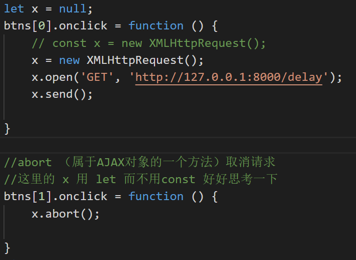
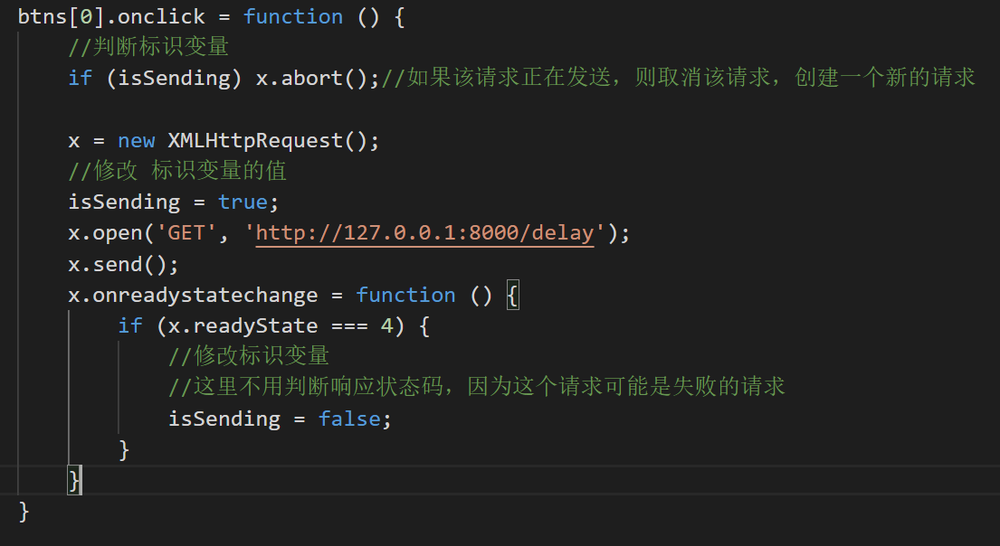

## Ajax

### 1. 前置知识

**服务器**：其实就是提供某种服务的机器

**web服务器**：提供web服务, 如果要成为web服务器,就需要装软件: `apach` `iis` `tomcat`

**web服务器访问流程**：

​	安装`phsStudy`,其实就是为了安装apache,让自己的电脑成为一台服务器.

​	给自己的电脑部署了一个网站 `http://192.168.14.204/pinyougou/index.html`    (地址是自己电脑的ip地址)

​	浏览器输入网址,能访问这个页面.

**请求服务器的几种方式**

​	1.地址栏输入网址回车

​	2.`a`标签`href`的属性

​	3.`window.location.href`

​        相同点: 会发生页面的跳转.

访问服务器,其实就是向服务器要"东西(图片,页面,其他的资源...)"

### 2. Ajax简介

- Ajax全称为`Asynchronous Javascript And XML`，即`异步JS和XML`
- Ajax 是一种在无需重新加载整个网页的情况下，能够更新部分网页的技术。
- 通过Ajax可以在浏览器中向服务器发送异步请求，最大的优势：**无刷新获取数据**
- AJAX不是新的编程语言，而是一种将现有的标准组合在一起使用的新方式

**AJAX 的特点**

- AJAX的优点

  1.可以无刷新页面与服务端进行通信

  2.允许你根据用户事件来更新部分页面内容

- AJAX 的缺点

	1.没有浏览历史，不能回退
	
	2.存在跨域问题（同源）
	
	3.SEO不友好（爬虫获取不到信息）


## 一，Ajax接口调用

### 什么是接口

前后端分离  

web服务器提供的，ajax 请求的网络地址称之为接口，也可以叫做api

但是不是所有的接口直接发送请求就可以获取数据，为了方便开发人员使用，有一种专门的文档，称之为

接口文档，api文档，说明书

### 接口文档

一般的接口文档会告诉你这个接口的地址,

接口的使用方法,   get  post

接口传递的参数.

接口返回的数据类型


接口和接口文档都是后端(java/c#)写的,我们前端(js/html/css)只需要拿来用就可以.            

前台(展示页面)后台(管理页面)


## 二，jQuery发送Ajax请求

### jQuery-get方法

**不带参数**

```js
$.get(); 需要传递一个参数,参数是一个对象.

$.get({
	url:'请求的接口地址',
    //可以自动把json转换为js对象s
    dataType:'json',
	success:function( 响应回来的内容 ){
		//请求成功后的回调函数.
	}
});

```

带参数

```
$.get({
	url:'',
	//请求参数传递第一种方式:
    // url:'https://autumnfish.cn/api/joke/list?num=3',
    //第二种传递参数的方式
	//data:'key=value',
    //第三种传递参数的方式 常用这种
	data:{	
		key : vlaue
	},
	//可以自动把json转换为js对象s
    dataType:'json',
	success:function(backData){
		响应数据的处理
	}	
});

```

### jQuery-post方法

```
$.post({
	url:'接口地址',
	data:{	
		key : value
	},
	//可以自动把json转换为js对象s
    dataType:'json',
	success:function(backData){
		处理回来的数据
	}
});

```

注意:  $.post()的使用和 $.get()的使用是一样的,

​             不同的是$.post()发送的是post的方法.

​                            $.get()发送的是get的方法.

### jQuery-ajax()方法

$.get();  只能发送get的请求

$.post(); 只能发送post的请求

$.ajax();  get请求和post请求 都可以发送.

```
$.ajax({
    type:'post还是get',
    url:'请求的地址',
    data:{
        key:value
    },
    //可以自动把json转换为js对象s
    dataType:'json',
    success:function( 响应回来的数据 ){
        //响应成功后要执行的函数
    }
});

//$.get(); $.post(); $.ajax(); 这三个方法都是jQuery发送ajax请求的方法
```

注意: 

​        请求接口返回的是一个json格式的字符串.

​        如果是用原生js的方式来发送ajax请求,那为了方便操作返回的数据.就要使用JSON.parse()把这个返回的json格式的字符串转成js对象.

​        如果是用jQuery的方式来发送ajax请求,返回的数据是json格式的字符串.那jQuery会自动给我们转成js对象.


## 三，响应的数据格式

常见的json格式和xml格式.

   现在最常见的是json格式的字符串.  xml已经没落了...


json : JavaScript object notation

​          格式的字符串和js对象很像,

​          不一样的是json格式的字符串键都是用双引号引起来的.

优势: 如果返回的是json格式的字符串,如果要去取里面的值,挺难的,要做字符串的截取.

​          json格式的字符串可以转成js对象后再去取


### JSON（重点）

通用的数据格式，很多语言都支持，不同语言中解析他的方式不同

js中对应JSON的使用 2个方法

1. `JSON.parse`('JSON格式的字符串') -- 这个用的 最多
   1. 把JSON格式的字符串转化为对应的js对象（数组）
2. `JSON.stringify`(js对象或者数组) -- 了解即可
   1. 把js对象（数组）转化为对应的JSON格式的字符串

```
let jsonArr ='{"name":"jack","friend":"肉丝"}'
```


### xml(了解)

xml   也是数据格式   以前是非常流行的, 现在不流行了,因为json太优秀了. 

我们的接口有可能会返回带格式的字符串, 比如json,比如xml
	1.xml数据长什么样?

​	     xml和html都是标签,都是用标签来包裹数据的.

​         html标签是固定的,有单标签也有双标签;   

​         xml是可以自定义标签的,只能是双标签

   	  xml必须要在第一行写声明

​		必须要有根标签

​        和json一样,都是一种保存数据的格式,  现在不流行,因为他相对于json而言体积更大.


2. 如何操作xml-xml里面的数据如何取出来使用?

   ​      使用jQuery的方法(get/post/ajax)来发送ajax请求,

   ​      如果响应回来的数据是一个xml格式的,那么jQuery会自动帮我们把这个xml格式的数据转成类似document格式的东西.

   ​      可以像操作dom树一样的去操作他.

```
//补充: jQuery在指定范围内获取元素
console.log($('food',backData));
console.log($('food',backData)[0]);
```


## 四，模板引擎art-template

[art-template (aui.github.io)](http://aui.github.io/art-template/zh-cn/)

通用的解决方案，很多的库都实现了这个功能，有很多的模板引擎

art-template

1. 语法跟之后学习的框架很类似 vue
2. 速度快，使用方便

### 基本使用

```
//模板引擎.
//1.引入他的包,其实就是js文件
//2.写一个模板(固定的html结构),不同数据那个地方用占位符先占位.
//    用script标签  给id  给type='text/html'    
//3.准备数据(自己写的,或者发送ajax请求响应回来的数据)
//4.调用模板的方法 template(模板id,传递的数据);
```

```
//1.导入art-template.js文件
<script src="./template-web.js"></script>

//2.写一个模板
//	1.使用script标签
//	2.给id是为了方便找到这个模板
//	3.给他一个type属性,一般写成text/html; 
//	  不要写成text/javascript,也不要不给.  
//      如果不给type属性,或者给了但是值是text/javascript,那他都会把script标签里面的内容当做js执行
<script id="tem" type="text/html">
  <h2>
    <p>我的名字是:{{name}}</p>
    <h3>我的技能是:{{skill}}</h3>
    <h4>我有一个好朋友{{friend.name}}</h4>
    <h4>他擅长:{{friend.skill}}</h4>
  </h2>
</script>

//3.准备一份数据跟模板关联起来
// 数据必须是对象
	let data = {
        name:'111',
        skill:吃,
        friend:{
        	name：'222'
        	skill：'喝'
        },
    }
//4.调用他提供的核心方法
// 基于模板名渲染模板
// 参数1 模板的id
// 参数2 数据
template(tem, data);
```

### 易错点

1. 模板的定义
   1. script标签
   2. type=text/html
2. 数据的准备
3. 命名
4. template 未定义
   1. 没有导入
   2. 写错了

## 语法补充

判断

```
{{if 条件}}
   //条件满足生成的模板
{{else}}
   //条件不满足生成的模板
{{/if}}
```

循环

```
{{each}}
	{{$value}}  //遍历出来的一个个的对象
	{{$index}}  //遍历出来的对象的下标
{{/each}}
```

声明变量

```
{{set g1 = $value.gender}}
```

## 五，原生js发送ajax请求

```js
//1.创建xhr对象
	var xhr = new XMLHttpRequest();
//2.设置open()方法, get/post  请求的地址
	xhr.open('','');
//3.设置响应成功后的回调函数
    xhr.onload = function(){
		//xhr.response 返回的数据
        //xhr.responseText 
    }
//4.发送
    xhr.send()


//get请求 发送参数
xhr.open('get','地址?key=value&key2=value2');


//post请求 发送参数
xhr.open('post','地址');
//post请求需要设置请求头
xhr.setRequestHeader('Content-Type', 'application/x-www-form-urlencoded');
//参数在send()方法中发送
xhr.send('key=value&key2=value2');

```


### onreadystatechange

1.这个事件会在readyState状态值改变的时候执行.

2.readyState状态值有哪几种状态.

   

3.这个事件会调用三次, 从1到2,  从2到3,  从3到4

​    当readyState为4的时候才会去处理响应回来的内容,因为只有为4的时候,响应内容才下载完成.


4.onload是新式浏览器用来替换这个方法的.


### FormData

formData对象,需要创建.

一次性获取所有的表单元素值

```js
var fd = new FormData(form表单但是需要的是一个dom元素);
```

获取form表单里面标签的值,这些标签必须要有name属性.

​                       这个name属性的值,待会就可以作为存值的键,  存值的是标签value的值.

因为获取到值后,要把值发给接口, 所以name属性的值 和接口的键保持一致.


post发送FormData数据,不需要设置请求头.

```js
xhr.send(fd);
```

如果出现了Illegal invocation(非法调用)这个错误,说明你用jQuery发送请求使用formData,但是你没有设置下面这两句话

```
contentType:false,//不要设置请求头
 processData:false,//不要把传递的数据变成key=value这种格式的字符串
```


## Express

### 链接

- https://www.expressjs.com.cn/

### 安装

- npm i express

### 启动

- node *.js

### 127.0.0.1:8000

### 基本使用

1. 引入express

```js
const { response } = require('express');
const express = require('express');
```

2. 创建应用对象

```js
const app = express();
```

3. 创建路由规则

   ```js
   request 是对请求报文的封装
       response 是对响应报文的封装
      app.get('/',(request, response)=>{
          设置响应
          response.send("HELLO EXPRESS");
   
   });
   ```

4. 监听端口启动服务

   ```js
   app.listen(8000, ()=>{
       console.log("服务已经启动， 8000端口监听中....");
   })
   ```

   

## ajax的使用

### 原生ajax

- GET

  ```js
  //1. 创建AJAX对象
              const xhr = new XMLHttpRequest();
              //2. 设置请求方法和url
              xhr.open('GET','http://127.0.0.1:8000/server?a=100&b=200&C=300');
              //3. 发送
              xhr.send();
              //4. 事件绑定 处理服务端返回的结果
              /*
              on：when：当...时候
              readystate： 是XHR对象中的一个属性，表示状态：
                          0（未初始化） 
                          1（open方法调用完毕） 
                          2（send方法调用完毕） 
                          3（服务端返回部分结果）
                          4（服务端返回所有结果）
              change：改变
              */
              xhr.onreadystatechange = function(){
                  //作判断，是4(服务端返回了所有的结果)才处理数据
                  if(xhr.readyState === 4){
                      //判断响应状态码：200 404 403 401 500
                      //2XX 都是成功
                      if(xhr.status >= 200 && xhr.status < 300){
                          //处理服务端响应结果： 行 头  空行（咱不管） 体
                          //1. 处理响应行
                          // console.log(xhr.status);//状态码
                          // console.log(xhr.statusText);//状态字符串
                          // //2. 所有响应头
                          // console.log(xhr.getAllResponseHeaders());
                          // //3. 响应体
                          // console.log(xhr.response)
                          //设置result的文本
                          result.innerHTML = xhr.response;
                      }else{  
                      }
                  }
              }
              // console.log('test');
          }
  ```

- POST

  ```js
  //1. 创建对象,发送请求
              const xhr = new XMLHttpRequest();
              //2. 初始化 设置请求类型与URL
              xhr.open('POST','http://127.0.0.1:8000/server');
              //设置请求头
              xhr.setRequestHeader('Content-Type','application/x-www-form-urlencoded');
              //设置自定义请求头
              xhr.setRequestHeader('name','superLmk');
   //3.发送
              xhr.send('a=100&b=200&c:300');
              // xhr.send('a:100&b:200&c:300');
              // xhr.send('123456654123');
              //4. 事件绑定
              xhr.onreadystatechange = function () {
                  //判断
                  if (xhr.readyState === 4) {
                      if (xhr.status >= 200 && xhr.status < 300) { 
                          //处理服务端返回的结果
                          result.innerHTML = xhr.response;
                      }
                  }
              }
  ```

- 问题处理方法

	- JSON格式处理

	  - server,js

	    ```
	    //响应一JSON个数据
	        const data = {
	            name: 'sliber'
	    
	        };
	        //对对象进行字符串转化
	        let str = JSON.stringify(data);
	        //设置响应体
	        // response.send("HELLO AJAX JSON");
        response.send(str);
	    ```

	    
	
	  - html
	
	    ```
	    1. 手动对数据进行一个转换
	           let data = JSON.parse(xhr.response);
	           result.innerHTML = data.name;
	       2. 自动转换:直接设置ajax响应数据类型
	    
	      result.innerHTML = xhr.response.name;
    
	    初始化上方设置：
      //设置响应体的数据类型
	                xhr.responseType = 'json';
      ```
    
	    

	- ie缓存问题
	
		-  //AJAX解决IE缓存问题：加一个可变化的参数，比如时间戳
	```xhr.open('GET','http://127.0.0.1:8000/iet='+Date.now());```
	
	- 超时与网络异常
	
	  ```
	  超时设置 2s 设置(2s内服务端不响应，就取消请求)
	              xhr.timeout = 2000;
	              //超时回调
	              xhr.ontimeout = function () {
                  alert('网络异常，请稍后重试!!');
	         }
                  //网络异常回调
	              xhr.onerror = function () {
                      alert('你的网络似乎出了一些问题！');
	                  
                  }
	  ```
	
	         
	
	
	
	- 取消请求
	  
  	- 
	
	- 重复请求
	
		- 
	
	

### jQuery中的AJAX

-  get请求

  ```
  $.get('http://127.0.0.1:8000/jquery-server', {a:100, b:200}, function (data) {
                  console.log(data)
              },'json');
  ```

  

  - 代码实例

    ```
    $.get(url, [data], [callback], [type])
    url: 请求的URL地址
    data: 请求携带的参数
    callbac: 载入成功时回调函数
    type：设置返回内容格式，xml、html、script、json、text、_default
    ```
    
    

- post请求

  ```
  $.post('http://127.0.0.1:8000/jquery-server', {a:100, b:200}, function (data) {
                  console.log(data)
              });
  ```

  

- ajax请求

  ```
  $.ajax({
                  //url
                  url: 'http://127.0.0.1:8000/jquery-server',
                  //参数
                  data: {a:100, b:200},
                  //请求类型
                  type: 'GET',
                  //响应体结果设置
                  dataType: 'json',
                  //成功的回调
                  success: function (data) {
                      console.log(data);
                  },
                  //超时时间
                  timeout: 2000,
                  //失败的回调
                  error: function(){
                      console.log('出错拉~');
                  },
                  //头信息
                  headers: {
                      c: 300,
                      d: 400
                  }
              });
  ```
  
  

### axios

-  get请求

  ```
  axios.get('/axios-server', {
                  //url参数
                  params: {
                      id: 100,
                      vip: 7
                  },
                  //请求头信息
                  headers: {
                      name: 'Nliver',
                      age: 20
                  }
              //Axios是基于Promise作的数据处理
              }).then(value => {
                  console.log(value)
              })
  ```

  

- post请求

  ```
  axios.post('/axios-server', {
                      //请求体
                      username: 'admin',
                      password: '123456'
                  }, {
                      //url 请求行
                      params: {
                          id: 200,
                          vip: 9
                      },
                      //请求头参数
                      headers: {
                          height: 100,
                          weight: 180,
                      }
                  })
  ```

  

- ajax请求

  ```
  axios({
                  //请求方法
                  method: 'POST',
                  //url 请求行
                  url: '/axios-server',
                  //url参数
                  params: {
                      vip:10,
                      level:30
                  },
                  //头信息
                  headers: {
                      a:100,
                      b:200
                  },
                  //请求体参数
                  data: {
                      username: 'admin',
                      password: '123456'
                  }
              }).then(response=>{
                  console.log(response);
                  //响应状态码
                  console.log(response.status);
                  //响应状态字符串
                  console.log(response.statusText);
                  //响应头信息
                  console.log(response.headers);
                  //响应体
                  console.log(response.data);
              })
  ```
  
  

### fetch

```
fetch('http://127.0.0.1:8000/fetch-server?vip=10', {
                //请求方法
                method: 'POST',
                //请求头
                headers: {
                    name: 'Nliver'
                },
                //请求体
                body: 'username=admin&password=admin'
            }).then(response => {
                // console.log(response);
                // return response.text();
                return response.json();
            }).then(response => {
                console.log(response);
            })
```


##  跨域

### 1 同源策略

- 同源策略（Same-Origin Policy）最早由 Netscape 公司提出，是浏览器的一种安全策略。
-  同源：协议、域名、端口号 必须完全相同
- 违背同源策略就是跨域

### 2 如何解决跨域

- JSONP

	- JSONP是什么

	  JSONP (JSON with Padding)，是一个非官方的跨域解决方案，纯粹凭借程序员的聪明才智开发出来，只支持get请求

	- JSONP 怎么工作的

	  在网页有一些标签天生具有跨域能力，比如：img, link, iframe, script
	  JSONP就是利用script标签的跨域能力来发送请求的

	- JSONP的使用

		- 动态的创建一个script标签

		  ```var script = document.createElement("script");```

		- 设置script的src，设置回调函数

		  ```script.src = "http://locallhost:3000/textAJAX?callback=abc"```

- CORS

	- 推荐阅读：

		- http://www.ruanyifeng.com/blog/2016/04/cors.html
		- https://developer.mozilla.org/zh-CN/docs/Web/HTTP/Access_control_CORS

	- CORS是什么？

	  CORS (Cross-Origin Resource Sharing), 跨域资源共享。CORS 是官方的跨域解决方案，它的特点是不需要在客户端做任何特殊的操作，完全在服务器中进行处理，支持 get 和 post 等请求。跨域资源共享标准新增了一组 HTTP  首部字段（响应头），允许服务器声明哪些源站通过浏览器有权限访问哪些资源

	- CORS怎么工作的？

	  CORS 是通过设置一个响应头来告诉浏览器，该请求允许跨域，浏览器收到该响应以后就会对响应放行

	- CORS 的使用

		- 在服务段添加响应头

		  //设置响应头 设置允许跨域
		      ```response.setHeader('Access-Control-Allow-Origin', '*');```

