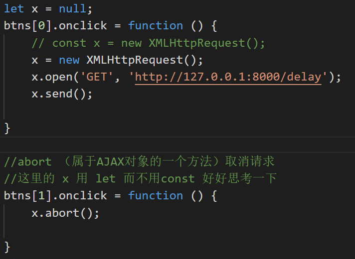

# Ajax

## 简介

### Ajax简介

- - Ajax全称为Asynchronous Javascript And XML，即异步JS和XML
- - 通过Ajax可以在浏览器中向服务器发送异步请求，最大的优势：**无刷新获取数据**
- - AJAX不是新的编程语言，而是一种将现有的标准组合在一起使用的新方式

### AJAX 的特点

- AJAX的优点

	- 1. 可以无刷新页面与服务端进行通信
	- 2. 允许你根据用户事件来更新部分页面内容

- AJAX 的缺点

	- 1. 没有浏览历史，不能回退
	- 2. 存在跨域问题（同源）
	- 3. SEO不友好（爬虫获取不到信息）

### XML简介

- XML：可扩展标记语言
- XML：被设计用来传输和存储数据
- - XML和HTML类似，不同点：HTML中都是预定义标签，XML中没有预定义标签，全是自定义标签，用来表示一些数据
- - 现在已被JSON取代

## Express

### 链接

- https://www.expressjs.com.cn/

### 安装

- npm i express

### 启动

- node *.js

### 127.0.0.1:8000

### 基本使用

1. 引入express

```js
const { response } = require('express');
const express = require('express');
```

2. 创建应用对象

```js
const app = express();
```

3. 创建路由规则

   ```js
   request 是对请求报文的封装
       response 是对响应报文的封装
      app.get('/',(request, response)=>{
          设置响应
          response.send("HELLO EXPRESS");
   
   });
   ```

4. 监听端口启动服务

   ```js
   app.listen(8000, ()=>{
       console.log("服务已经启动， 8000端口监听中....");
   })
   ```

   

## ajax的使用

### 原生ajax

- GET

  ```js
  //1. 创建AJAX对象
              const xhr = new XMLHttpRequest();
              //2. 设置请求方法和url
              xhr.open('GET','http://127.0.0.1:8000/server?a=100&b=200&C=300');
              //3. 发送
              xhr.send();
              //4. 事件绑定 处理服务端返回的结果
              /*
              on：when：当...时候
              readystate： 是XHR对象中的一个属性，表示状态：
                          0（未初始化） 
                          1（open方法调用完毕） 
                          2（send方法调用完毕） 
                          3（服务端返回部分结果）
                          4（服务端返回所有结果）
              change：改变
              */
              xhr.onreadystatechange = function(){
                  //作判断，是4(服务端返回了所有的结果)才处理数据
                  if(xhr.readyState === 4){
                      //判断响应状态码：200 404 403 401 500
                      //2XX 都是成功
                      if(xhr.status >= 200 && xhr.status < 300){
                          //处理服务端响应结果： 行 头  空行（咱不管） 体
                          //1. 处理响应行
                          // console.log(xhr.status);//状态码
                          // console.log(xhr.statusText);//状态字符串
                          // //2. 所有响应头
                          // console.log(xhr.getAllResponseHeaders());
                          // //3. 响应体
                          // console.log(xhr.response)
                          //设置result的文本
                          result.innerHTML = xhr.response;
                      }else{  
                      }
                  }
              }
              // console.log('test');
          }
  ```

- POST

  ```js
  //1. 创建对象,发送请求
              const xhr = new XMLHttpRequest();
              //2. 初始化 设置请求类型与URL
              xhr.open('POST','http://127.0.0.1:8000/server');
              //设置请求头
              xhr.setRequestHeader('Content-Type','application/x-www-form-urlencoded');
              //设置自定义请求头
              xhr.setRequestHeader('name','superLmk');
   //3.发送
              xhr.send('a=100&b=200&c:300');
              // xhr.send('a:100&b:200&c:300');
              // xhr.send('123456654123');
              //4. 事件绑定
              xhr.onreadystatechange = function () {
                  //判断
                  if (xhr.readyState === 4) {
                      if (xhr.status >= 200 && xhr.status < 300) { 
                          //处理服务端返回的结果
                          result.innerHTML = xhr.response;
                      }
                  }
              }
  ```

- 问题处理方法

	- JSON格式处理

	  - server,js

	    ```
	    //响应一JSON个数据
	        const data = {
	            name: 'sliber'
	    
	        };
	        //对对象进行字符串转化
	        let str = JSON.stringify(data);
	        //设置响应体
	        // response.send("HELLO AJAX JSON");
        response.send(str);
	    ```

	    
	
	  - html
	
	    ```
	    1. 手动对数据进行一个转换
	           let data = JSON.parse(xhr.response);
	           result.innerHTML = data.name;
	       2. 自动转换:直接设置ajax响应数据类型
	    
	      result.innerHTML = xhr.response.name;
    
	    初始化上方设置：
      //设置响应体的数据类型
	                xhr.responseType = 'json';
      ```
    
	    

	- ie缓存问题
	
		-  //AJAX解决IE缓存问题：加一个可变化的参数，比如时间戳
	```xhr.open('GET','http://127.0.0.1:8000/iet='+Date.now());```
	
	- 超时与网络异常
	
	  ```
	  超时设置 2s 设置(2s内服务端不响应，就取消请求)
	              xhr.timeout = 2000;
	              //超时回调
	              xhr.ontimeout = function () {
                  alert('网络异常，请稍后重试!!');
	      
              }
	              //网络异常回调
              xhr.onerror = function () {
	                  alert('你的网络似乎出了一些问题！');
                  
	              }
	  ```
	
	  
	
	- 取消请求
	  
		- 
  
	- 重复请求
	
		- 

### jQuery中的AJAX

-  get请求

  ```
  $.get('http://127.0.0.1:8000/jquery-server', {a:100, b:200}, function (data) {
                  console.log(data)
              },'json');
  ```

  

  - 代码实例

    ```
    $.get(url, [data], [callback], [type])
    url: 请求的URL地址
    data: 请求携带的参数
    callbac: 载入成功时回调函数
    type：设置返回内容格式，xml、html、script、json、text、_default
    ```
    
    

- post请求

  ```
  $.post('http://127.0.0.1:8000/jquery-server', {a:100, b:200}, function (data) {
                  console.log(data)
              });
  ```

  

- ajax请求

  ```
  $.ajax({
                  //url
                  url: 'http://127.0.0.1:8000/jquery-server',
                  //参数
                  data: {a:100, b:200},
                  //请求类型
                  type: 'GET',
                  //响应体结果设置
                  dataType: 'json',
                  //成功的回调
                  success: function (data) {
                      console.log(data);
                  },
                  //超时时间
                  timeout: 2000,
                  //失败的回调
                  error: function(){
                      console.log('出错拉~');
                  },
                  //头信息
                  headers: {
                      c: 300,
                      d: 400
                  }
              });
  ```
  
  

### axios

-  get请求

  ```
  axios.get('/axios-server', {
                  //url参数
                  params: {
                      id: 100,
                      vip: 7
                  },
                  //请求头信息
                  headers: {
                      name: 'Nliver',
                      age: 20
                  }
              //Axios是基于Promise作的数据处理
              }).then(value => {
                  console.log(value)
              })
  ```

  

- post请求

  ```
  axios.post('/axios-server', {
                      //请求体
                      username: 'admin',
                      password: '123456'
                  }, {
                      //url 请求行
                      params: {
                          id: 200,
                          vip: 9
                      },
                      //请求头参数
                      headers: {
                          height: 100,
                          weight: 180,
                      }
                  })
  ```

  

- ajax请求

  ```
  axios({
                  //请求方法
                  method: 'POST',
                  //url 请求行
                  url: '/axios-server',
                  //url参数
                  params: {
                      vip:10,
                      level:30
                  },
                  //头信息
                  headers: {
                      a:100,
                      b:200
                  },
                  //请求体参数
                  data: {
                      username: 'admin',
                      password: '123456'
                  }
              }).then(response=>{
                  console.log(response);
                  //响应状态码
                  console.log(response.status);
                  //响应状态字符串
                  console.log(response.statusText);
                  //响应头信息
                  console.log(response.headers);
                  //响应体
                  console.log(response.data);
              })
  ```
  
  

### fetch

```
fetch('http://127.0.0.1:8000/fetch-server?vip=10', {
                //请求方法
                method: 'POST',
                //请求头
                headers: {
                    name: 'Nliver'
                },
                //请求体
                body: 'username=admin&password=admin'
            }).then(response => {
                // console.log(response);
                // return response.text();
                return response.json();
            }).then(response => {
                console.log(response);
            })
```


##  跨域

### 1 同源策略

- 同源策略（Same-Origin Policy）最早由 Netscape 公司提出，是浏览器的一种安全策略。
-  同源：协议、域名、端口号 必须完全相同
- 违背同源策略就是跨域

### 2 如何解决跨域

- JSONP

	- JSONP是什么

	  JSONP (JSON with Padding)，是一个非官方的跨域解决方案，纯粹凭借程序员的聪明才智开发出来，只支持get请求

	- JSONP 怎么工作的

	  在网页有一些标签天生具有跨域能力，比如：img, link, iframe, script
	  JSONP就是利用script标签的跨域能力来发送请求的

	- JSONP的使用

		- 动态的创建一个script标签

		  ```var script = document.createElement("script");```

		- 设置script的src，设置回调函数

		  ```script.src = "http://locallhost:3000/textAJAX?callback=abc"```

- CORS

	- 推荐阅读：

		- http://www.ruanyifeng.com/blog/2016/04/cors.html
		- https://developer.mozilla.org/zh-CN/docs/Web/HTTP/Access_control_CORS

	- CORS是什么？

	  CORS (Cross-Origin Resource Sharing), 跨域资源共享。CORS 是官方的跨域解决方案，它的特点是不需要在客户端做任何特殊的操作，完全在服务器中进行处理，支持 get 和 post 等请求。跨域资源共享标准新增了一组 HTTP  首部字段（响应头），允许服务器声明哪些源站通过浏览器有权限访问哪些资源

	- CORS怎么工作的？

	  CORS 是通过设置一个响应头来告诉浏览器，该请求允许跨域，浏览器收到该响应以后就会对响应放行

	- CORS 的使用

		- 在服务段添加响应头

		  //设置响应头 设置允许跨域
		      ```response.setHeader('Access-Control-Allow-Origin', '*');```

