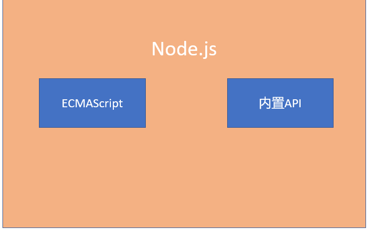

阶段目标

Node.js的基本用法

ES6、数组新方法、Promise…

后端知识

webpack

## 一，Node.js基本认知

### Node.js是什么

> Node.js 是一个基于 Chrome V8 引擎的 JavaScript 运行时环境
>
> 说人话：Node.js 可以运行 JS

JavaScript 与 nodeJS

>浏览器端：ECMAScript 、webAPI
>
>Node.js： ECMAScript 、内置API

综上：

> ECMAScript 两者都可以用
>
> BOM、DOM这些在Node.js中不能用

运行时环境

> 代码正常运行的必要条件
>
> Node.js 和 Chrome 都可以运行 JS

### ChromeV8 引擎

> 不同浏览器使用不同的 JS 解析引擎解析JS
>
> Chrome : V8 性能最好

### Node.js能干啥

Node.js 是只提供了基础功能 和 内置API
基于这些有了很多 工具 和 框架

> web开发 : express/koa
> 桌面应用：electron
> 爬虫 : crawler

我们用它来干啥

> 了解后端接口的实现逻辑
> 了解他如何辅助前端开发

### Node.js的安装

官网下载长期维护版本

默认安装即可

>如非必要，别更改安装目录
>安装完毕，终端输入node –v 确认

## 二，Node.js基本使用

#### 1.Node.js 在 终端中写代码 (不会这么写，相当于记事本写代码)

>任意位置打开终端
>
>输入 node 回车
>
>写 JS 回车解析
>
>ctrl+c 

#### 2.使用Node命令解析 (常用)

>编写 .js 文件
>
>在 .js 文件所在目录打开终端（任意终端）
>
>输入 node .js文件名 回车

#### 3.如何在指定路径打开终端

在文件夹处输入cmd 或者 powershell
vscode 中选择文件 并 鼠标右键打开

​	ctrl+` 快速开关终端窗口

#### 4.常用终端操作

- ↑ / ↓ 切换历史命令
- tab 自动补全
- cls 或 clear 清屏
- cd 路径切换
- …..

