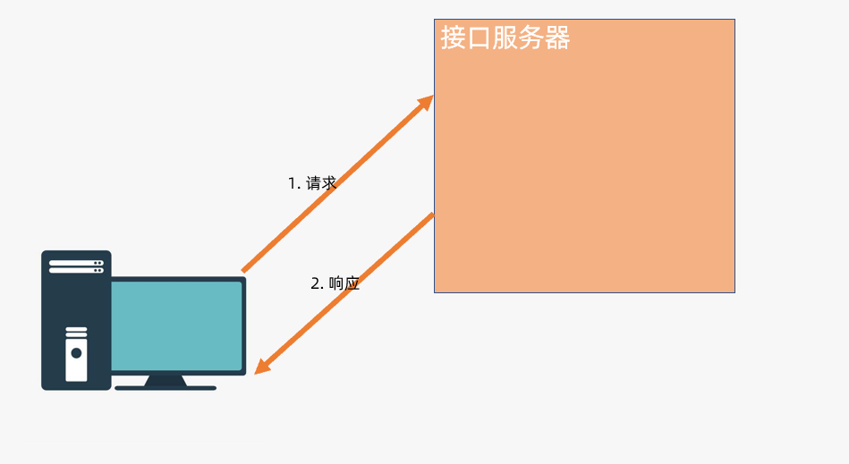
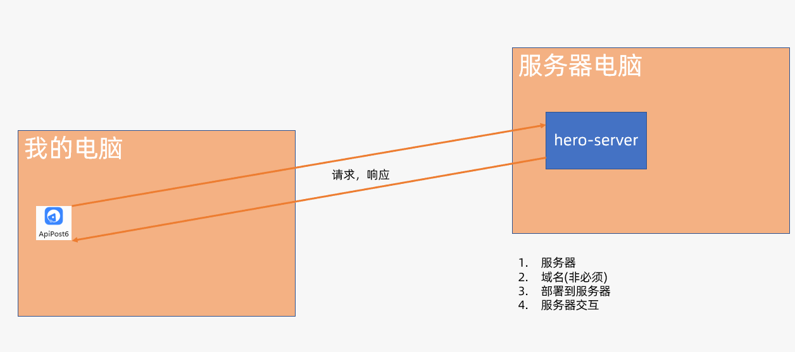
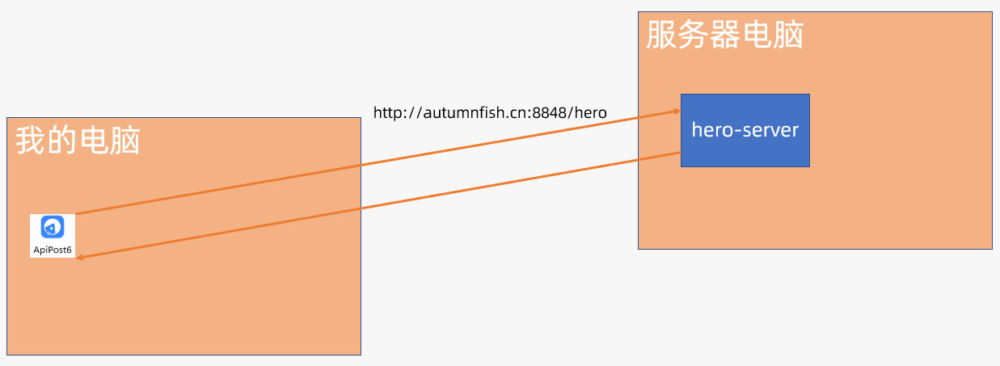
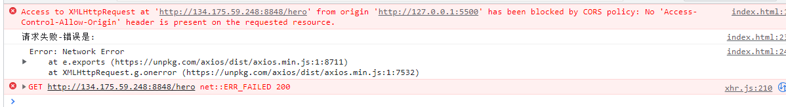
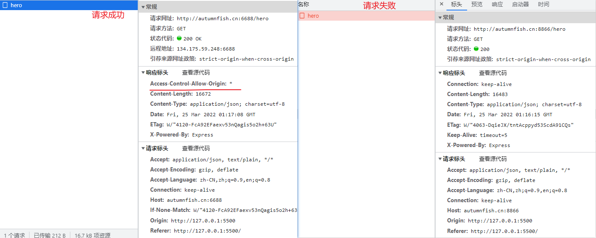
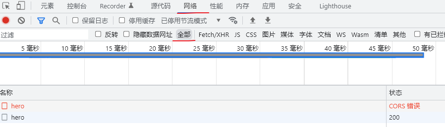
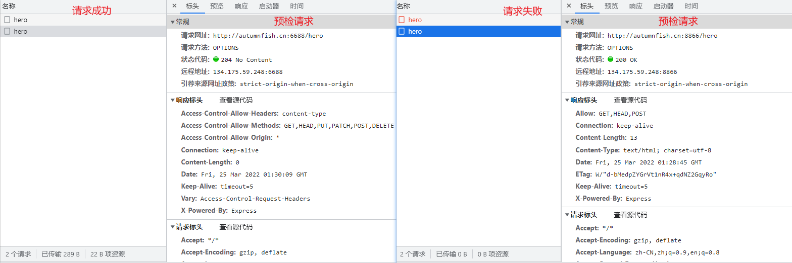

## 接口是个啥

> 接口可以理解为后端提供给咱们的函数

1. 接口可以理解为后端提供给咱们的**函数**
2. 为了调用它，咱们需要知道
   1. **接口地址和请求方法:**-------函数名
   2. **接口参数:**----------函数参数
   3. **返回值:**---------函数的返回值
3. 分析：
   1. **调用接口:**
      1. 如何新增数据，如何删除数据，如何查询数据，咱们并不知道，或者说绝大多数前端并不知道
      2. 但是后端熟悉呀，他们写好了之后，提供接口给咱们
      3. 咱们调用接口，根据接口的需求传递参数，获取返回值
   2. 调用传统函数：
      1. 如何用更简便的方法操纵dom元素，咱们可以自己封装
      2. 也可以调用`jquery`提供的方法
      3. 咱们调用方法，根据方法的需求传递参数，获取返回值


## 前后端交互

> 在开始编码实现接口之前，咱们先得缕一缕当我们在调用接口时的交互流程

### 分析：

1. 不了解服务器时的交互流程



2. 详细一些：
   1. 请求发给服务器中的接口服务
   2. 接口服务，和数据服务进行交互
   3. 进行数据的增删改查操作
   4. 数据处理完毕之后，返回给接口服务
   5. 最终返回给浏览器


3. 接口服务和数据服务
   1. **接口服务：**很多后端开发语言都可以开发接口服务，一会咱们用Node来实现
   2. **数据服务：**传统用的是数据库，一会咱们用昨天写好的基于JSON的增删改查模块来实现


## express 介绍

> 之后的接口咱们通过`express`这个第三方模块来实现，先来认识一下他。
>
> [传送门:Express 官网](http://expressjs.com/)
>
> [传送门:Express 中文文档（非官方）](http://www.expressjs.com.cn/)
>
> [传送门:Express GitHub仓库](https://github.com/expressjs/express)
>
> [传送门:菜鸟教程](https://www.runoob.com/w3cnote/express-4-x-api.html)
>
> [传送门:腾讯云开发者手册](https://cloud.tencent.com/developer/doc/1079)

**介绍**:

- Express 是一个第三方模块，用于快速搭建服务器（替代http模块）
- Express 是一个基于 Node.js 平台，快速、开放、极简的 **web 开发框架**。同类型产品 Koa
- Express保留了http模块的基本API，使用express的时候，也能使用http的API
  - 使用express的时候，仍然可以使用http模块的方法，比如 res.end()、req.url
- express还额外封装了一些新方法，能让我们更方便的搭建服务器
- express提供了中间件功能，其他很多强大的第三方模块都是基于express开发的
- 。。。。 言而总之，简单，易用，强大。powerful！！！


## express安装及创建web服务器

> 接下来咱们来通过`express`创建服务器，提供服务
>
> [传送门:express-安装](http://expressjs.com/en/starter/installing.html)
>
> [传送门:express-helloworld](http://expressjs.com/en/starter/hello-world.html)
>
> [传送门：response.send方法](http://expressjs.com/en/5x/api.html#res.send)


> **步骤**:

1. 创建文件夹，比如`02.express`

2. 终端中输入命令，初始化项目:

   ```bash
   npm init -y
   ```

3. 安装`express`

   ```bash
   npm i express
   ```

4. 创建`/index.js`并拷贝示例代码进去

   ```javascript
   const express = require('express')
   const app = express()
   const port = 3000
   
   app.get('/', (req, res) => {
     res.send('Hello World!')
   })
   
   app.listen(port, () => {
     console.log(`Example app listening on port ${port}`)
   })
   ```

   

5. 执行命令，运行代码:

   ```bash
   node index.js
   ```

6. 打开浏览器输入：

   1. ```
      localhost:3000
      ```

   2. 即可看到`Hello World!`

> 代码解析:

1. `express`是第三方模块，使用时需要导入
2. 调用方法创建服务器对象
3. 开启服务需要选择使用的端口：
   1. 最大 65535
   2. 靠前的端口可能被内置的服务用掉了
   3. 用一些靠后的，`3000`,`8848`，`6666`等等。。都可以
   4. 端口:
      1. 计算机和外界通讯的出入口
         1. 物理端口:网线口，usb，3.5m等等
         2. 虚拟端口:代码中的数字
4. 注册路由：
   1. 注册**请求方法**以及**url地址**和后端逻辑的对应关系
   2. `res.send`
5. 开启监听:
   1. 实例化之后
   2. 通过listen即可开始监听
6. 刚刚的代码运行之后，只要不关闭，服务是一直开启的状态

```javascript
// 导入express模块
const express = require('express')
// 创建服务器实例
const app = express()
// 定义端口
const port = 3000

// 注册路由
app.get('/', (req, res) => {
  // 响应内容
  res.send('Hello World!')
})

// 基于设置的端口开启监听
app.listen(port, () => {
  // 开启成功之后的回调函数
  console.log(`Example app listening on port ${port}`)
})
```


> 注意：

1. 修改代码之后需要`ctrl+c`关闭
2. 再重新运行
3. 因为，修改代码相当于修改了服务器的配置，需要重新运行配置才能够生效


## express的路由机制

> 咱们已经可以提供基础的服务啦，如果要加多几个不同的服务，就需要多注册几个路由，这里的路由不是路由器哦
>
> [传送门:app对象的方法](http://expressjs.com/en/4x/api.html#app)


**概念**:

1. 接口可以理解为后端提供给咱们的**函数**
2. `express`中如果要添加多个接口可以通过注册多个路由的方法来完成
3. 路由：
   1. 可以理解为`路径（接口地址）`以及`HTTP请求方法`（包括 GET、POST 等等）和后端逻辑的对应关系
   2. `路径`以及`HTTP请求方法`合起来可以称之为`API端点`(EndPoint)
   3. 简称:`API`端点和后端逻辑的对应关系
   4. 如果
      1. `API`端点---》函数名
      2. 后端逻辑---》函数体
   5. 又变成了:接口可以理解为后端提供给咱们的**函数**

> 语法:

1. 调用对应的路由方法并添加对应的逻辑即可
2. 方法名就是`请求的方法`
3. 方法中的第一个参数，就是`路由的地址`

```javascript
// 注册路由
app.get('/地址',(req,res)=>{/* 逻辑 */  })
app.post('/地址',(req,res)=>{/* 逻辑 */  })
app.delete('/地址', (req, res) => {/* 逻辑 */ })
// 等等
```


**测试**

1. 注册多几个`get`路由，并测试访问
2. 注册一个`post`路由，测试访问（能访问到吗？）
3. 注册一个`del`路由，测试访问（能访问到吗？）
4. 注册一个`put`路由，测试访问（能访问到吗？）
5. 为啥访问不到呢？


## 接口测试工具

> 上一节注册的`get`以外的路由都无法直接访问，咱们可以写代码来测试，有没有更简单的方法呢？
>
> [传送门:apipost](https://www.apipost.cn/)
>
> [传送门:apifox](https://www.apifox.cn/)
>
> [传送门:postman](https://www.postman.com/)


**介绍**

1. `apipost`,`apifox`，`postman`功能上都是类似的
2. `postman`需要自行汉化，所以后续咱们选用`apipost`，原因：
   1. 有中文
   2. 版本迭代到了6
   3. 功能强大：需要慢慢体会


**基本使用**:

1. 创建项目

   

2. 添加接口

   

3. 调整地址，请求方法

4. 点击发送

   

   

   

5. 测试结果：

   1. 原本无法访问的接口，就可以访问啦


6. 接口基地址

   1. 

   2. 

   3. 修改url地址，删除基础地址部分

      

**交互流程**:

1. 通过`接口测试`工具发送请求到服务器
2. 服务器接收请求并响应内容


## express-get请求传参

> 已经可以不写代码测试接口啦，接下来咱们来继续补充接口部分的知识，如何通过get请求传参


### 概念:

1. 接口可以理解为后端提供给咱们的**函数**
2. 调用**函数**即可获取对应的结果
3. 函数中不确定的值（内容），可以作为参数，由外部传入
4. 接口中不确定的值（内容），也可以由外部传入哦
5. 这一节咱们来学习
   1. `get`传递参数
   2. 接收`get`传递的参数


### 步骤:

1. 提交数据：

   

2. 接收数据

   1. 通过`req.query`即可获取数据
   2. 是`对象`的格式
   3. 通过`.`语法即可获取对应的值
   4. 

3. **代码解析：**

   1. `express`会把`url`中`get`请求提交的数据

   2. 比如:`url?name=jack&age=18&skill=跳舞`

   3. 解析并设置给`req`对象的`query`属性

      ```javascript
      {
          name:'jack',
          age:18,
          skill:'跳舞'
      }
      ```

      

4. **注意：**

   1. 这里没有任何的业务逻辑
   2. 就是如何传递和如何接收
   3. 业务逻辑需要结合需求


## express-post请求传参

> 常见的请求方式还有`post`，接下来咱们来看看如何通过`post`传递数据以及如何获取`post`提交的数据
>
> [传送门：拓展阅读-post提交常见的数据格式](https://juejin.cn/post/6844903870116675597)

### 目标:

1. 能够使用`express`接收post请求提交的数据
2. 能够使用接口测试工具通过`post`请求提交数据


### 步骤

1. `/index.js`

   1. 调整代码:
   2. 重新运行项目

   ```javascript
   // 导入express模块
   const express = require('express')
   // 创建服务器实例
   const app = express()
   // 定义端口
   const port = 3000
   // 让express可以解析 application/json格式的数据
   app.use(express.json())
   
   app.post('/add', (req, res) => {
     console.log('body:', req.body)
     res.send('add' + Date.now())
   })
   
   // 基于设置的端口开启监听
   app.listen(port, () => {
     // 开启成功之后的回调函数
     console.log(`Example app listening on port ${port}`)
   })
   
   ```

   

2. `接口测试`工具按下图设置即可:

   

3. 如果设置没有问题就可以在终端中看到提交的数据啦


## RESTfull架构

> 一种接口风格，咱们实现的这套接口准备使用这种风格，先来认识一下
>
> [传送门:RESTful架构详解](https://www.runoob.com/w3cnote/restful-architecture.html)
>
> [传送门:知乎-如何用通俗的方式解释RESTful](https://www.zhihu.com/question/28557115)

### 目标:

1. 能够用通俗的话来描述`RESTful`架构


### 概念:

1. 就是用URL定位资源，用HTTP描述操作


### 分析:

1. 错误示范:

   1. 地址中包含了动词
   2. 请求方法只用到了`post`和`get`

   ```bash
   post  /addHero # 添加
   post  /delHero # 删除
   get   /heroList # 英雄列表
   post  /updateHero # 修改英雄
   ```

   

2. 推荐:

   1. 地址用名词，表示资源
   2. 通过请求方法确认操作

   ```bash
   post /hero    # 添加
   get  /hero    # 获取
   delete /hero  # 删除
   put    /hero  # 修改
   ```

3. 实际接口

   ```bash
   post /hero    # 添加
   get /hero     # 获取所有英雄 
   get /hero/?q=克 # 查询英雄
   get /hero/3     # 获取 id为3的英雄的详细信息
   delete /hero/1  # 删除 id为1的英雄
   put    /hero/2  # 修改 id为2的英雄
   等等。。。。
   ```

4. 工作中可能会碰到各种风格的接口

5. 目前慢慢的趋于`RESTful`，同时也是面试的一个常见问题


## express - put和delete传参

> 删除和修改接口咱们使用`put`和`delete`作为请求方法，也会涉及到参数的传递，如何使用呢？
>
> [传送门:路由参数](https://www.expressjs.com.cn/guide/routing.html)
>
> [传送门:delete方法](https://www.expressjs.com.cn/4x/api.html#app.delete.method)


### 分析:

1. 方法`delete`,删除
   1. 地址:`/hero/1`或者`/hero/2`
      1. 其中末尾的数字是改变的
2. 方法`put`,修改
   1. 地址:`/hero/1`或者`/hero/2`
      1. 其中末尾的数字是改变的
      2. 一般传递的是`id`
   2. 除了`id`，一般还需要传递需要修改的数据给服务器


### 步骤:

1. `express`中注册路由并定义参数

   1. `:id`：
      1. `:`表示是参数
      2. `id`，是参数名，可以根据需求调整

   ```javascript
   // 可以解析 application/json格式的数据
   app.use(express.json())
   
   app.delete('/dog/:id',(req,res)=>{
       // params获取 /参数这种形式的参数
       // id 和:id是对应的
      console.log(req.params.id)
   })
   app.put('/dog/:id',(req,res)=>{
        // params获取 /参数这种形式的参数
       // id 和:id是对应的
       console.log(req.params.id)
       console.log(req.body)
   })
   ```

   

2. 调用接口时，把`/:id`替换为`/具体的值`即可，比如：

   ```javascript
   delete /dog/1 # id为1
   delete /dog/2 # id为2
   delete /dog/3 # id为3
   put /dog/1 # id为1
   put /dog/2
   put /dog/3
   ```

3. `apipost`中直接在url中添加参数即可

   


4. 依旧可以通过`body`提交数据
   1. 比如`put`请求修改数据时，除了id，一般还需要提交修改的值
   2. 


## 部署

> 接口写好了只有本地可以访问，利于调试，但是不利于理解前后端交互，咱们把他部署到网上吧


**步骤**：

1. 首先要一台服务器
2. 然后要有域名（非必须）
3. 代码部署到服务器
4. 和服务器交互




## 网络基础

> 现在咱们已经把本地的代码部署到了 远程服务器上，也能够通过`apipost`进行测试了。这里面有哪些咱们需要了解的内容呢？
>
> [传送门：掘金-从输入URL开始建立前端体系](https://juejin.cn/post/6935232082482298911#heading-45)




1. 换成在线的接口之后最明显的不同点有2个

   1. 和服务器交互
   2. 请求的url地址改变了

2. **服务器:**

   1. 网络中的一台电脑，一般用来提供一个，或者几个服务，根据提供的服务不同，可以称之为 对应的服务器
   2. 这里因为提供`web`服务，可以称之为`web`服务器

3. **URL:**

   1. 通俗的说，`URL`就是网络当中的地址
   2. 在`WWW`上，每一信息资源都有统一的且在网上唯一的地址，该地址就叫URL（`Uniform Resource Locator`,统一资源定位器），它是`WWW`的统一资源定位标志，就是指网络地址。
   3. URL的一般语法格式为：(带方括号[]的为可选项)：
      - `protocol :// hostname[:port] / path / ?query #fragment`
      - 协议 :// 主机地址[:端口号] / [路径]  [?参数] [#锚点]
   4. 例如：
      - http://www.itcbc.com
      - http://www.itcbc.com:8080/api/login
      - http://www.itcbc.com:3006/api/getbooks?appkey=13200008888
      - http://www.itcbc.com:3006/index.html#top

4. **HTTP:**

   1. **超文本传输协议**，是一个基于请求与响应，无状态的，应用层的协议，常基于TCP/IP协议传输数据，互联网上应用最为广泛的一种网络协议，所有的WWW文件都必须遵守这个标准,

   HTTP协议默认端口号是 80

5. **HTTPS:**

   HTTPS 是身披 SSL外壳的 HTTP。HTTPS是一种通过计算机网络进行安全通信的传输协议，经由HTTP进行通信，利用SSL/TLS建立全信道，加密数据包。HTTPS使用的主要目的是提供对网站服务器的身份认证，同时保护交换数据的隐私与完整性。HTTPS协议默认端口号是 443

6. **主机地址：**

   1. `ip地址:`
      1. IP地址（Internet Protocol Address）是指互联网协议地址，又译为网际协议地址。IP地址是IP协议提供的一种统一的地址格式，它为互联网上的每一个网络和每一台主机分配一个逻辑地址，以此来屏蔽物理地址的差异。

```
  比如生活中的地址，表示地理上的一个位置，通过这个地址可以找到这个地理位置。同样的，互联网中的每一台主机电脑，都有一个地址。通过这个地址可以找到这台主机电脑。**本机IP：127.0.0.1**  
```

2. **域名:**

   1. 形如 [www.xxx.com](www.xxx.com) 这样的就叫做域名，域名需要单独购买。购买后，需要绑定IP地址进行使用。绑定IP地址后，就可以通过域名找到主机电脑了。**本机域名：localhost**

3. **DNS服务器**

   1. 域名和`IP`地址的对应关系，这个对应关系就记录在DNS服务器当中。通过DNS服务器可以解析出 一个域名对应的IP地址。

4. **端口号:**

   1. 电脑和外部通讯的通道，电脑上主要有2类
      1. 物理端口：网卡，3.5mm，usb。。。。
      2. 虚拟端口：软件用的，`0 ~ 65535`
      3. 特点：
         1. 一个端口，一次只能让一个软件，使用
         2. 比较靠前的端口一般被系统软件用了，咱们用比较靠后的即可

   


## 同源策略

> 刚刚咱们把接口部署到了服务器，通过`apipost`也测试通过啦，用`ajax`可以吗？
>
> [传送门：MDN-浏览器同源策略](https://developer.mozilla.org/zh-CN/docs/Web/Security/Same-origin_policy)

### 目标：

1. 在网页中用`ajax`测试接口
2. 理解什么是同源策略
3. 测试用接口：
   1. 地址:http://autumnfish.cn:8866/hero
   2. 方法:get
   3. 参数：q，查询关键字，可以省略


### 步骤：

1. 创建测试页面，并编写测试代码

2. 可以直接使用下面提供的模板：

   ```html
   <!DOCTYPE html>
   <html lang="en">
     <head>
       <meta charset="UTF-8" />
       <meta http-equiv="X-UA-Compatible" content="IE=edge" />
       <meta name="viewport" content="width=device-width, initial-scale=1.0" />
       <title>测试接口调用</title>
     </head>
     <body>
       <button class="list-btn">测试列表接口</button>
       <script src="https://unpkg.com/axios/dist/axios.min.js"></script>
       <script>
         // 测试列表接口
         document.querySelector('.list-btn').onclick = function () {
           axios({
             url: 'http://134.175.59.248:8848/hero',
             method: 'get',
           })
             .then(res => {
               console.log('请求成功-结果为:', res)
             })
             .catch(err => {
               console.log('请求失败-错误是:')
               console.dir(err)
             })
         }
       </script>
     </body>
   </html>
   
   ```

3. 点击发送请求，如果不出以外，应该就可以看到，类似于这样的错误：

   

4. `why`?

### 同源策略

1. 浏览器网络请求时，有一个**同源策略**的机制。即    **默认情况**   下，使用 API 的 Web 应用程序只能从加载应用程序的同一个域请求 HTTP 资源。
2. 在我们使用`apipost`测试时，因为不是**浏览器**，并不存在这个限制
3. 但是刚刚的测试，是通过浏览器进行的，那么他就会受到`同源策略`的限制
4. 目前来看，同源策略会让三种行为受限：
   - Cookie、LocalStorage 和 IndexDB 访问受限
   - 无法操作跨域 DOM（常见于 iframe）
   - Javascript 发起的 XHR 和 Fetch 请求受限
5. 咱们目前主要关注于`Javascript 发起的 XHR 请求`即可，主要指的是两个地址：
   1. web应用地址：说人话---**打开的网页地址**
      1. 目前是：http://127.0.0.1:5500/04.ajaxtest/index.html
         1. 协议：http
         2. 主机：127.0.0.1
         3. 端口：5500
   2. 接口地址：接口地址
      1. 目前是：http://134.175.59.248:8848/hero
         1. 协议：http
         2. 主机：134.175.59.248
         3. 端口：8848
   3. 同源策略比较的是`URL`中的`协议/主机/端口`这3个部分
      1. 3个部分都相同，就是同源
      2. 有任何一个不相同，就不同源
      3. 不同源就会收到`同源策略`的限制
      4. 从而就有了，类似于这样的错误：
      5. 


## 跨域CORS

> 怎么办？跨域了调不了接口啦。。。。咱们之前调过接口吗？有没有跨域？so，虽然有限制，但是有解决方案吗? 自信一点，把 **吗** 去掉
>
> [传送门:MDN-CORS](https://developer.mozilla.org/zh-CN/docs/Web/HTTP/CORS)
>
> [传送门:拓展阅读-掘金](https://juejin.cn/post/6983852288091619342)

### 目标:

1. 了解`CORS`的工作原理


### 基本概念：

1. `CORS`是一个`W3C`标准,全称是"跨域资源共享"（Cross-origin resource sharing），他允许浏览器向跨源服务器发送`XMLHttpRequest`请求，从而克服啦 AJAX 只能同源使用的限制
2. `CORS`需要浏览器和服务器同时支持，整个 `CORS`通信过程，都是浏览器自动完成不需要用户参与。对于前端开发者来说，`CORS`的代码和正常的 `ajax` 没有什么**差别！！！！！！！**
3. **缺点：**
   1. 前所有最新浏览器都支持该功能，但是万恶的`IE`不能低于10，**无所谓啦**
4. 浏览器将`CORS`请求分成两类：**简单请求和非简单请求**

### 工作原理

1. 简单请求：

   1. 发起请求之后在`network`中只能看到一次请求

   2. 流程：

      1. 客户端--->服务器：哪些源可以访问？
      2. 服务器---->客户端：这些可以访问哦
      3. 客户端
         1. 允许：正常访问
         2. 不允许：提示跨域错误

   3. 请求成功和请求失败的截图：

      

2. 非简单请求：

   1. 发起请求之后在`network`中可以看到2次请求

   2. 除去我们发起的请求，还一个请求是：`option`

   3. **注意:**

      1. `option`请求需要`network`切换到全部才可以看到

         

   4. 请求成功和失败的截图

   


### 小结：

1. 工作中如果使用`CORS`这种方案进行跨域，有谁来操作？
2. `get`请求是否会额外的发送一个`option`的请求？


