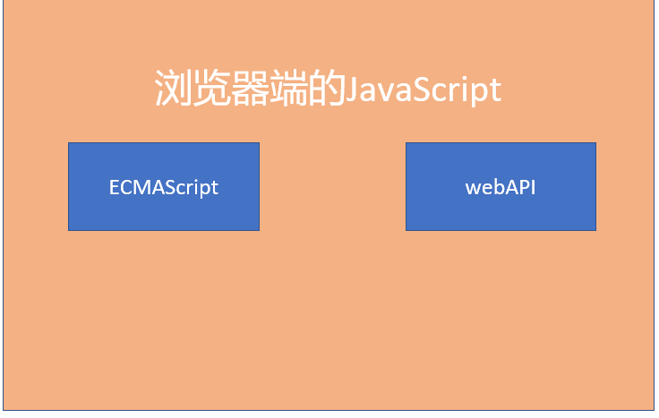
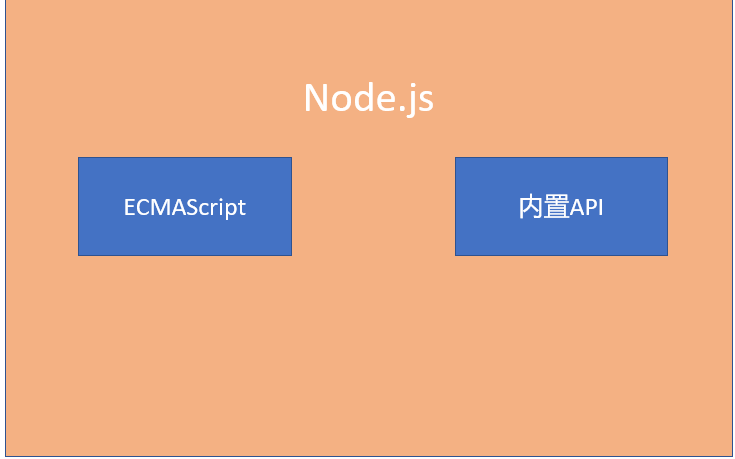
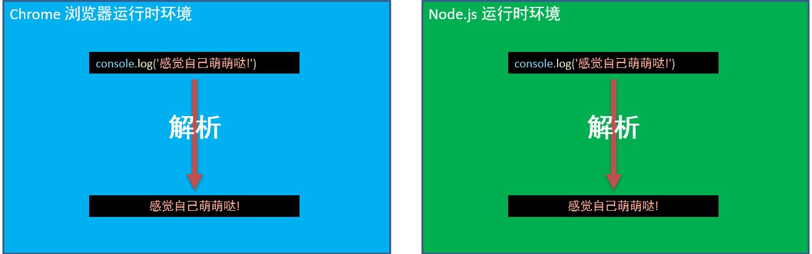
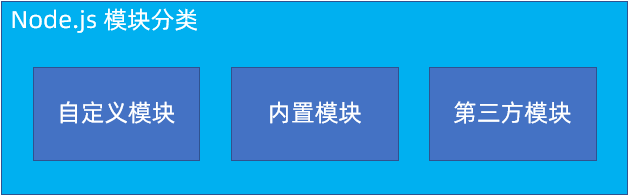
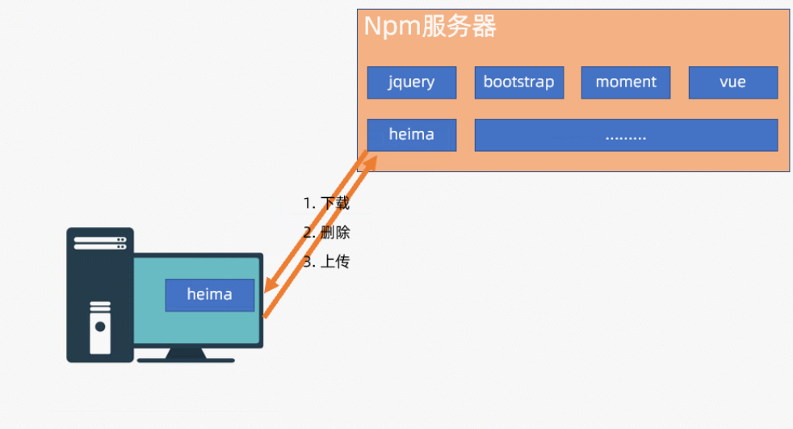

阶段目标

Node.js的基本用法

ES6、数组新方法、Promise…

后端知识

webpack

## 一，Node.js基本认知

### Node.js是什么

> Node.js 是一个基于 Chrome V8 引擎的 JavaScript 运行时环境
>
> 说人话：Node.js 可以运行 JS

JavaScript 与 nodeJS

>浏览器端：ECMAScript 、webAPI
>
>Node.js： ECMAScript 、内置API

综上：

> ECMAScript 两者都可以用
>
> BOM、DOM这些在Node.js中不能用







运行时环境

> 代码正常运行的必要条件
>
> Node.js 和 Chrome 都可以运行 JS




### ChromeV8 引擎

> 不同浏览器使用不同的 JS 解析引擎解析JS
>
> Chrome : V8 性能最好


### Node.js能干啥

Node.js 是只提供了基础功能 和 内置API
基于这些有了很多 工具 和 框架

> web开发 : express/koa
> 桌面应用：electron
> 爬虫 : crawler


我们用它来干啥

> 了解后端接口的实现逻辑
> 了解他如何辅助前端开发


### Node.js的安装

官网下载长期维护版本

默认安装即可

>如非必要，别更改安装目录
>安装完毕，终端输入node –v 确认


## 二，Node.js基本使用

### 1.Node.js 在 终端中写代码 (不会这么写，相当于记事本写代码)

>任意位置打开终端
>
>输入 node 回车
>
>写 JS 回车解析
>
>ctrl+c 

### 2.使用Node命令解析 (常用)

>编写 .js 文件
>
>在 .js 文件所在目录打开终端（任意终端）
>
>输入 node .js文件名 回车

### 3.如何在指定路径打开终端

在文件夹处输入cmd 或者 powershell
vscode 中选择文件 并 鼠标右键打开

​	ctrl+` 快速开关终端窗口


### 4.常用终端操作

- ↑ / ↓ 切换历史命令
- tab 自动补全
- cls 或 clear 清屏
- cd 路径切换
- …..


## 三，模块化

### 1.模块化的概念

> 随着前端代码越来越多，为了更好的管理代码就需要用到模块化
>
> [传送门：掘金前端模块化详解](https://juejin.cn/post/6844903744518389768)

**概念：**

1. 把一个大的程序拆分成`互相依赖`的若干小文件
2. 这些小文件还可以通过特定的语法组合到一起
3. 这个过程称之为模块化
4. **优点：**
   1. 更好维护
   2. 更好的复用性
5. **缺点：**
   1. 没有缺点😁？
   2. 需要学习模块化语法

**分析：**

1. 功能写完只有`10`行代码，模块化没啥必要！
2. 功能写完有`100`行，或者`1000`行代码，里面有`好几段`逻辑在其他地方也要用
   1. `c+v`一把梭？
   2. 模块化！！！！
3. 逻辑都写在一起，并且越写越多


4. 进行模块化之后


**小结：**

1. 所有逻辑都写在一起，是否可以实现功能？
2. 模块化可以让代码更好维护，更好复用性


### 2.模块化的规范

> 前端发展的过程中，出现过一些不同的模块化规范咱们来认识以下他们
>
> [传送门：掘金-前端模块化](https://juejin.cn/post/6844903576309858318)

**前端模块化规范：**

- `AMD`：

  - `AMD`规范采用异步方式加载模块，模块的加载不影响它后面语句的运行。
  - 聊到`AMD`主要指的是通过`require.js`实现的模块化
  - 项目中看到类似代码说明用的是`AMD`规范
  - 目前用的`很少`，`很少`，了解即可

  ```javascript
  // 执行基本操作
  require(["jquery","underscore"],function($,_){
    // some code here
  });
  ```

  

- `CMD`：

  - CMD是另一种js模块化方案，它与AMD很类似。
  - 不同点在于：AMD 推崇依赖前置、提前执行，CMD推崇依赖就近、延迟执行。
  - 项目中看到类似代码说明用的是`CMD`规范
  - 目前用的`很少`，`很少`，`了解`即可

  ```javascript
  define(function(require, exports, module) {
      var a = require('./a'); //在需要时申明
      a.doSomething();
      if (false) {
          var b = require('./b');
          b.doSomething();
      }
  });
  ```

- `CommonJS`

  - `Node.js`是`CommonJS`规范的主要实践者
  - 咱们目前能接触到用`commonJS`规范的也就是`Node.js`

- `ESM`

  - 也叫做`ES6 Module`
  - ES6 在语言标准的层面上，实现了模块功能，逐步会成为浏览器和服务器通用的模块解决方案👍👍
  - 之后基本上所有的代码都是用这个方案！！


**小结：**

1. `Node.js`是哪个规范的主要实践者？
2. `ESM`也叫做什么？


### 3.Node.js中的模块分类

> 学习了模块化之后，咱们写的JS文件就有了一个更好听的名字-模块。当咱们开发中所有的功能都是自己写的吗？别人写的JS文件如何称呼呢？




`Node.js`中的模块主要有3个分类：

- 自定义模块
  - NodeJS中，创建的JS文件都是自定义模块。（也就是处处皆模块）
- [内置模块](http://nodejs.cn/api/)（核心模块）
  - 安装Node之后，自带了很多内置模块。我们可以直接加载使用他们。
- 第三方模块
  - 其他人编写的模块，发布到 [npm 网站](https://www.npmjs.com/) 上，我们可以下载使用。


### 4.CommonJS模块-语法🔴

> `Node.js`是`CommonJS`规范的主要实践者,咱们需要如何使用呢？
>
> [传送门:Node.js-CommonJS模块](https://nodejs.org/api/modules.html)

**目标：**

- 掌握`CommonJS`中的暴露和导入语法

**语法：**

1. 通过`module.exports`导出(暴露)内容
   1. `module` 是Node中的一个全局对象，对象包含当前模块的详细信息。
   2. `module.exports` 是模块的出口，通俗的说，就是导出内容用的，默认值是 `{}`
2. 通过`require`加载内容
   1. `const 结果 = require('模块路径')` 
   2. 可以省略`.js`
   3. `只能`加载模块暴露的内容

```javascript
// 定义 并导出---------------------------
// 文件名叫做a.js
const name = 'jack'
const age = 18
const sayHi = () => {
  console.log('你好吗?')
}

module.exports = {
  name,
  age,
  sayHi,
}

// 加载---------------------------
const a = require('./a.js')
console.log(a) // { name: 'jack', age: 18, sayHi: Function... }

```


### 5.内置模块FS基本使用

> 内置模块是`Node.js` 平台自带的一套基本的 API(功能模块)。也叫做核心模块。
>
> [传送门:Node.js-FS模块](https://nodejs.org/api/fs.html)

**目标：**

1. 了解什么是内置模块
2. 了解FS模块的基本使用


**思考：**

1. 浏览器中的`JS`是否可以读写电脑中的文件？


**语法：**

1. 加载`require('fs')`
   1. 直接写名字，名字不能乱写
   2. 不需要写路径
2. 调用fs模块的方法，下面列举fs模块中的常用方法
3. 注意：
   1. 可以执行`npm i @types/node`让提示更加完美

| API                                         | 作用              | 备注           |
| ------------------------------------------- | ----------------- | -------------- |
| fs.access(path, callback)                   | 判断路径是否存在  |                |
| fs.appendFile(file, data, callback)         | 向文件中追加内容  |                |
| fs.copyFile(src, callback)                  | 复制文件          |                |
| fs.mkdir(path, callback)                    | 创建目录          |                |
| fs.readDir(path, callback)                  | 读取目录列表      |                |
| fs.rename(oldPath, newPath, callback)       | 重命名文件/目录   |                |
| fs.rmdir(path, callback)                    | 删除目录          | 只能删除空目录 |
| fs.stat(path, callback)                     | 获取文件/目录信息 |                |
| fs.unlink(path, callback)                   | 删除文件          |                |
| fs.(filename[, options][, listener])        | 监视文件/目录     |                |
| fs.watchFile(filename[, options], listener) | 监视文件          |                |
| ..... 一大堆                                |                   |                |


```javascript
// readFile -- 异步读取文件
fs.readFile('./test.json', (err, data) => {
    if (err) {
        console.log('读取文件出错');
    } else {
        console.log(data); // 读取到的二进制数据
        console.log(data.toString()); // 得到原始数据
    }
});

fs.readFile('./test.json', 'utf-8', (err, data) => {
    if (err) {
        console.log('读取文件出错');
    } else {
        console.log(data); // 读取到的原始数据
    }
});
```

```javascript
// writeFile -- 异步写入文件
fs.writeFile('./abc.html', 'hello world', (err) => {
    if (err) {
        console.log('写入文件失败');
    } else {
        console.log('文件写入成功');
    }
});
```


### fs模块的Promise版本

> 大部分涉及到异步操作的库，模块。。都提供了基于`Promise`的封装版本，so！！！咱们来看看如何FS模块的Promise版本如何使用
>
> [传送门:fs-promise-example](https://nodejs.org/api/fs.html#promise-example)

目标：

1. 能够使用fs模块提供的`Promise`版本读写文件

语法：

1. 导入的模块为`fs/promises`
2. 调用方法返回的是Promise对象，直接`.then`和`.catch`即可

```javascript
// 1. 导入Promise版本
const fs = require('fs/promises')

// 调用方法，根据情况.then和.catch
fs.readFile('./data/test.txt')
  .then(res => {
    console.log('res:', res.toString())
  })
  .catch(err => {
    console.log('err:', err)
  })

fs.writeFile('./data/test.txt', '🦈🦈')
  .then(res => {
    console.log('res:', res)
  })
  .catch(err => {
    console.log('err:', err)
  })

```


## 四，Node中的路径问题

> Node`中的相对路径相对的是执行命令的终端 ✅
>
> 模块化中的路径要使用绝对路径

### __dirname变量

> 为了更好的处理路径问题，我们先来认识一个`Node`中提供的可以在模块中直接使用的变量`__dirname`
>
> [传送门:__dirname](https://nodejs.org/api/modules.html#__dirname)

**概念**

1. `__dirname`可以获取当前模块所在的目录
2. 获取到的是 绝对路径

**语法**

1. 直接使用`__dirname`即可
2. 注意是两个`_`下划线

```javascript
// 无需声明，直接即可使用
console.log('__dirname:',__dirname)
// 结合字符串拼接 生成完整的路径
console.log(__dirname + '/dogTool/data/dogs.json')
// \ 是转义符，\\ 解析之后生成的是 \ 
console.log(__dirname + '\\dogTool\\data\\dogs.json')
```


### 内置模块Path

> 更好的处理路径问题
>
> [传送门:path模块](https://nodejs.org/api/path.html)

**概念：**

- `path`是`Node`提供的内置Api，专门处理路径相关内容


**使用步骤:**

1. 导入并调用方法即可

```javascript
// 使用核心模块之前，首先加载核心模块
let path = require('path');
// 或者
const path = require('path');
```

2. 下面列举path模块中的几个方法

| 方法                       | 作用                                       |
| -------------------------- | ------------------------------------------ |
| path.basename(path[, ext]) | 返回 path 的最后一部分(文件名)             |
| path.dirname(path)         | 返回目录名                                 |
| path.==extname==(path)     | 返回路径中文件的扩展名(包含.)              |
| path.format(pathObject)    | 将一个对象格式化为一个路径字符串           |
| path.==join==([...paths])  | 拼接路径                                   |
| path.parse(path)           | 把路径字符串解析成对象的格式               |
| path.resolve([...paths])   | 基于当前工作目录拼接路径，生成的是绝对路径 |
| etc......                  |                                            |

3. 使用`path`模块结合`__dirname`生成绝对路径

```
const fs = require('fs')
const path = require('path')
// 生成绝对路径
const fullPath = path.join(__dirname, './data/dogs.json')
```

#### **path.join 和 path.resolve**

1. `path.join`把给定的路径拼接到一起，并规范化生成的路径，重点是:  **拼接**
2. `path.resolve`把给定的路径片段解析为绝对路径，重点是：**绝对路径**

```
// 导入path模块
const path = require('path')

// 1. 测试1，基于 __dirname 生成绝对路径
// 结果一样
console.log(path.join(__dirname, './index.js'))
console.log(path.resolve(__dirname, './index.js'))

// 2. 测试2 都是相对路径，
// path.join只是拼接
// path.resolve 路径片段中没有绝对路径，使用当前目录
console.log(path.join('./a', 'b', 'c', 'd', 'index.js'))
console.log(path.resolve('./a', 'b', 'c', 'd', 'index.js'))

// 3. 测试3 ，路径中有绝对路径
// path.join只是拼接
// path.resolve 路径片段中有绝对路径，使用路径片段中最后一个绝对路径
console.log(path.join('./a', '/b', '/c', 'd', 'index.js'))
console.log(path.resolve('./a', '/b', '/c', 'd', 'index.js'))

```


## 五，`npm`是什么？

### 1.npm是什么？

> 开发中一般不会什么功能都自己写，如何更优美的下载第三方模块呢?
>
> [传送门：如何使用npm](https://docs.npmjs.com/cli/v8/using-npm)

**目标**：

1. 了解`npm`的作用
2. 能够确认`npm`在电脑上是否已经安装

**概念**：

- **npm 是 管理（下载、卸载、发布）第三方模块的工具。**

- npm（node  package  manage）node 包 管理器。管理node包的工具。

- 包是什么？包就是模块。（包约等于模块，一个包可以包括一个或多个模块）

- npm这个工具，在安装 node 的时候，就已经安装到你的计算机中了。（捆绑安装）

- 命令行中执行： `npm -v` ，如果看到版本号，说明安装成功了。

  


### 2.npm基本使用

> 上一节介绍了`npm`的概念，如何使用他呢?

1. 传送门:`package.json`中的属性含义

**目标**：

1. 能够使用`npm`初始化项目
2. 能够下载和移除第三方模块到本地

#### 命令:

npm初始化的项目名中不能有中文


> 1.项目初始化

`npm init –y ：读取目录名，设置为项目名（不要有中文，大写字母，特殊符号…）`

`npm init : 手动输入所有内容`

​    执行完毕之后会在目录生成 package.json 文件

> 2.切换下载源

`npm config set registry https://registry.npm.taobao.org`

> 3.下载包(模块)

完整命令：`npm install 包名`
简写：`npm i 包名`
一次性下载多个：`npm i 包名 包名`

>4.移除包(模块)

完整命令：`npm uninstall 包名`
简写：`npm un 包名`
一次性移除多个：`npm un 包名 包名`


**步骤**：

1. 初始化命令的两种写法

   - **注意：**	

     1. `npm init`默认会读取文件夹名作为`项目名-package name`

     - package name 
       - 不能有中文
       - 不能有特殊符号 
       - 不能和需要安装的第三方模块同名

   ```bash
   npm init -y
   # 或
   npm init
   # 然后一路回车
   ```

2. 初始化之后，会在项目目录中生成 `package.json` 的文件。

3. 初始化完毕之后就可以在当前文件夹安装第三方模块

   1. 为了保证安装速度，建议执行这个命令
   2. 命令的作用是切换第三方模块的下载地址为`淘宝镜像`

   ```bash
   建议在安装第三方模块之前，先执行如下命令。
   下面的命令只需要执行一次即可（不管以后重启vscode还是重启电脑，都不需要执行第二次）
   npm config set registry https://registry.npm.taobao.org
   ```

4. 下载的命令

   ```bash
   # 正常的下载安装
   npm install 模块名
   
   # 简写install为i
   npm i 模块名
   
   # 一次性安装多个模块
   npm i 模块名 模块名 模块名
   ```

5. 安装的命令

   ```bash
   npm uninstall 模块名
   npm un 模块名
   npm un 模块名 模块名 模块名
   ```

6. 测试`下载`和`卸载`

   1. jquery
   2. moment

7. 测试使用

   1. `node`环境
   2. `浏览器`环境

8. 观察下载之后项目中下列文件发生的变化

   1. `package.json`
   2. `package-lock.json`
   3. `node_modules`


### 3.package.json和package-lock.json的作用

> 项目中中多出来的`package.json`和`package-lock.json`的作用是什么呢？
>
> [传送门:package.json](https://docs.npmjs.com/cli/v8/configuring-npm/package-json)
>
> [传送门:package-lock.json](https://docs.npmjs.com/cli/v8/configuring-npm/package-lock-json)
>
> [传送门:详解package.json和package-lock.json](https://juejin.cn/post/6870426598605062152)

**目标**：

1. 能够了解package.json中常见属性的作用
2. 能够了解package-lock.json文件的作用


#### package.json

1. name：项目名
2. version:项目版本
3. description：项目描述
4. main：项目入口
5. `scripts`:
   1. 示例中的:`test`可以通过`npm run test`执行
6. `author`:作者
7. `license`:开源协议

```json
{
  "name": "03",
  "version": "1.0.0",
  "description": "",
  "main": "01.测试狗狗模块.js",
  "scripts": {
    "test": "echo \"Error: no test specified\" && exit 1"
  },
  "author": "",
  "license": "ISC"
}

```

#### package-lock.json

1. 更为详细的模块信息

   

### 4.require的加载机制

> 现在Node种的3种模块咱们都见过啦，使用`require`加载的时候遵循什么顺序呢？
>
> [传送门:require方法](https://nodejs.org/api/modules.html#requireid)
>
> [传送门:从Node_modules加载](https://nodejs.org/api/modules.html#loading-from-node_modules-folders)
>
> [传送门:require的缓存](http://nodejs.cn/api/modules.html#requirecache)

**目标**：

1. 能够了解`require`的加载机制

**加载机制**：

1. **缓存:**

   1. 判断缓存中有没有，如果有，使用缓存中的内容

   2. 缓存中没有，那么表示第一次加载，加载完会缓存

   3. 测试代码:

      ```javascript
      const my = require('./myModule.js')
      const my2 = require('./myModule.js')
      const my3 = require('./myModule.js')
      
      console.log(my === my2) // true
      ```

2. 是否带路径:

   1. **有路径：**
      1. 加载自定义模块
      2. 优先加载同名文件，加载一个叫做 xx 的文件
      3. 再次加载js文件，加载 xx.js 文件
      4. 再次加载json文件，加载 xx.json 文件
      5. 如果上述文件都没有，则报错 “Cannot find module './xx'”
   2. **没有路径：**
      1. 优先加载核心模块，没有核心模块，加载第三方模块

3. 第三方模块的查找方式：

   1. 优先查找当前文件夹中的`nodu_modules`里面查找模块

   2. 如果找不到，依次逐级的向三级目录查找第三方模块

   3. 找到最顶级位置

   4. 确认代码:

      ```javascript
      console.log(module.paths)
      ```


## 六，开发发布包

> 昨天咱们学习了如何下载第三方模块，作为作业咱们写了一个自己的模块，可以发布到网上吗？自信一些！！！
>
> [传送门:package.json说明](https://docs.npmjs.com/cli/v8/configuring-npm/package-json)
>
> [传送门:yarn-创建一个module](https://classic.yarnpkg.com/en/docs/creating-a-package)
>
> [传送门:license许可协议说明]( https://www.jianshu.com/p/23e61804d81e)

**目标**:

1. 了解规范的包(模块)的结构
2. 能够把昨天的作业的解构调整为规范的结构


**规范的包结构**

```
📂 - my_module
    📃 - package.json  （package.json包的配置文件）
    📃 - index.js      （入口文件）
    📃 - README.md     （说明文档）
    
```

一个规范的包结构，需要符合以下 **3 点**:

1. 以单独的目录存在
2. 顶级目录下必须包含 `package.json` 配置文件
3. package.json 中必须包含如下属性
   - `name`: 包的名字，我们使用 require()加载模块的时候，使用的就是这个名字
   - `version` 版本
   - `main` 入口文件。默认是index.js 。如果不是，需要使用main指定

**注意:**以上 3 点要求是一个规范的包结构必须遵守的格式，关于更多的约束，可以参考传送门中的网址:


### 开发属于自己的包

- 1. 初始化 `package.json`
     1. 执行命令`npm init -y`
     2. 然后根据需求调整内部属性即可
     3. **注意，JSON文件不能有注释，下面加注释，是为了理解**。

  ```json
  {
    "name": "my_module",  // 包（模块）的名字，和文件夹同名。别人加载我们的包，找的就是这个文件夹
    "version": "1.0.0",
    "description": "我开发的包哦",
    "main": "index.js", // 别人加载我们的模块用，require加载的就是这里指定的文件
    "scripts": {
      "test": "echo \"Error: no test specified\" && exit 1"
    },
    "keywords": [ // 在npm网站中，通过关键字可以搜索到我们的模块，按情况设置
      "my",
      "itcast",
      "test"
    ],
    "author": "autumnfish", // 作者
    "license": "ISC" // 开源协议
  }
  ```

  

- `index.js` 中定义功能方法

  ```javascript
  // 别人加载入口就是这个文件
  // 添加测试的功能
  function add() {
    console.log('add方法哦👍👍')
  }
  
  function remove() {
    console.log('remove方法哦🦈🦈')
  }
  
  // 暴露出去
  module.exports = { add, remove }
  ```

- 编写`README.md`

  - 包的使用说明文档。
  - 以`markdown`的格式把包的作用、用法、注意事项等描述清楚即可
  - 具体写什么内容，没有强制性的要求
  - 比如

  ~~~markdown
  # 模块说明
  
  > 功能强大的模块
  
  ## 使用步骤:
  
  1. 下载
  
  ````bash
  npm i 模块名
  2. 导入 + 使用
  ```javascript
  const my_module = require('my_module')
  // 调用add方法
  my_module.add()
  // 调用remove方法
  my_module.remove
  3.如果对你有帮助的话，记得点赞哦
  ~~~

#### 结构调整

1. 把昨天的作业调整为规范的包结构


#### 参考内容：

1. `package.json`

   ```json
   {
     "name": "hero-json",  // 包（模块）的名字，和文件夹同名。别人加载我们的包，找的就是这个文件夹
     "version": "1.0.0",
     "description": "基于json的增删改查模块",
     "main": "index.js", // 别人加载我们的模块用，require加载的就是这里指定的文件
     "scripts": {
       "test": "echo \"Error: no test specified\" && exit 1"
     },
     "keywords": [ // 在npm网站中，通过关键字可以搜索到我们的模块，按情况设置
       "hero",
       "lol",
       "itheima",
       "json"
     ],
     "author": "autumnfish", // 作者
     "license": "ISC" // 开源协议
   }
   ```

   

2. `README.md`

   ~~~markdown
   # 模块说明
   
   > 功能强大的模块
   
   ## 使用步骤:
   
   1. 下载
   
   ````bash
   npm i 模块名
   
   ~~~

   2. 导入 + 使用

   ```javascript
   const hero = require('hero-json')
   // 查询方法
   // 参数：查询关键字可以省略，省略返回所有
   // 返回值：Promise
   hero.query()
   
   // 添加方法
   // 参数Object:{name:名字,title:外号,icon:头像}
   // 返回值：Promise
   hero.add({name:'提莫',title:'迅捷斥候',icon:'在线头像地址'})
   
   // 删除方法
   // 参数：删除英雄的id
   // 返回值：Promise
   hero.del(id)
   
   // 修改方法
   // 参数Object:{id:修改的英雄id,name:名字,title:外号,icon:头像}
   // 返回值：Promise
   hero.update({id:3,name:'提莫',title:'迅捷斥候',icon:'在线头像地址'})
   ```

   

   3. 如果对你有帮助的话，记得点赞哦

   


### 发布npm

> 上一节咱们已经把咱们写好的模块调整为较为规范的包的格式啦，接下来咱们把他发布到`npm`上！`(￣y▽￣)╭ Ohohoho.....`
>
> [传送门:Npm命令](https://docs.npmjs.com/cli/v8/commands)

**目标**：

1. 了解发布到`npm`的步骤
2. 能够发布自己的模块到`npm`上


#### 步骤1 - 注册npm账号

- 访问 https://www.npmjs.com/ 网站
- 点击` sign up` 按钮，进入注册用户界面
- 填写账号相关的信息
- 点击 Create an Account 按钮，注册账号
- 注册完账号，需要到邮箱中认证一下

#### 步骤2 - 连接npm

- 执行命令：登录账号

```bash
npm adduser
```

- 这个命令只需要执行一次

- 根据提示依次输入你的注册信息即可

- 

- 看到`Logged in as xxx`最后一行说明成功啦

- 查看用户信息可以使用如下命令

  ```bash
  npm who am i
  ```

- 登出可以使用如下命令

  ```bash
  npm logout
  ```

#### 步骤3 - 确保镜像源是npm

1. 输入如下命令进行确认

```bash
# 查看当前的npm的registry配置，确保是https://registry.npmjs.org
npm config get registry

# 如果不是，可以通过如下命令来设置
npm config set registry https://registry.npmjs.org 

```

#### 步骤4 - 确保包名不重复

1. 方法1:直接去`npm`搜索
2. 方法2:通过命令查看,看到如下图内容说明不存在

```bash
npm view 包名
```


#### 步骤5 - 发布

- 确保上述内容全部完成执行发布命令

  ```bash
   npm publish 
  ```

- 看到类似这样的内容说明发布完成

- 

#### 测试使用

1. 确保上述操作完成之后,即可下载咱们刚刚发布的模块啦

   ```bash
   npm i 模块名
   ```

2. 稍等片刻之后确认

   1. `nodule_modules`
   2. `package.json`
   3. 是否多了刚刚下载的模块
   4. 😁😁😁


#### 常见错误

1. 自己的模块名不能和已存在的模块名同名。（可以先去npm网站搜索是否同名）
2. 24小时内不能重复发布
3. 新注册的账号，必须先邮箱（邮件可能是垃圾邮件）验证，然后才能发布
4. 删除已发布的包
   - 运行 `npm unpublish` 包名 --force 命令，即可从 npm 删除已发布的包。
5. **其他注意事项:**
   - npm unpublish 命令只能删除 72 小时以内发布的包
   - npm unpublish 删除的包，在 24 小时内不允许重复发布
   - 发布包的时候要慎重，尽量不要往 npm 上发布没有意义的包!


### npm更新

> `hero-json`模块咱们虽然已经发布到了`npm`，但是刚刚又更新了一次，如何更新到`npm`上呢？

#### 目标

1. 把上一步的更新同步到`npm`
2. 额外设置包的仓库地址和主页


为了巩固操作，咱们更新两次


#### 步骤-直接更新：

1. 确保`npm`已经登录

2. 更新`package.json`中的版本:`version`,比上一次大，比如;

   ```json
   {
         "version": "1.0.1",
   }
   ```

   

3. 项目根目录执行：

   1. ```bash
      npm publish
      ```

   2. 稍等片刻 即可发布成功


#### 步骤 - 增加仓库地址和主页并发布

1. 项目根目录依次执行:

   1. ```bash
      git init 
      git add .
      git commit -m"完成基础功能"
      ```

2. `gitee`创建远程仓库

3. 根据创建完毕的提示命令把本地内容推送到远程

4. 调整`package.json`

   1. 下面列的只有调整的内容

   ```json
   {
         "version": "1.0.2",
         "homepage": "gitee仓库主页", // 主页默认会读取主页下的README.md
         "repository": {
           "type": "git", // 类型
           "url": "git地址" // git仓库地址
         }
   }
   ```

5. 更新

   ```bash
   npm publish
   ```

6. 去`npm`主页确认结果

#### 易错项

1. 自己的模块名不能和已存在的模块名同名。（可以先去npm网站搜索是否同名）
2. 24小时内不能重复发布
3. 新注册的账号，必须先邮箱（邮件可能是垃圾邮件）验证，然后才能发布
4. 删除已发布的包
   - 运行 `npm unpublish` 包名 --force 命令，即可从 npm 删除已发布的包。
5. **其他注意事项:**
   - npm unpublish 命令只能删除 72 小时以内发布的包
   - npm unpublish 删除的包，在 24 小时内不允许重复发布
   - 发布包的时候要慎重，尽量不要往 npm 上发布没有意义的包!


### 全局模块

> 刚刚咱们把自己写好的模块发布到了线上，可以直接下载并使用了，但是咱们调整了`npm`的源地址，大伙还记得咋改回去吗？
>
> [传送门:nrm官网](https://www.npmjs.com/package/nrm)

**目标**:

1. 了解什么是全局模块什么是本地模块
2. 能够下载并使用`nrm`


#### 和本地模块的差异

- 全局安装的模块，不能通过 `require()` 加载使用。
- 全局安装的模块，一般都是命令或者工具。

#### 安装卸载命令

- 安装命令（多一个 `-g`）

  ```bash
  npm i 模块名 -g
  # 或
  npm i -g 模块名
  
  ### mac 系统如果安装不上，使用下面的命令提高权限
  sudo npm i -g 模块名
  ```

- 卸载命令（也是多一个 `-g`）

  ```bash
  npm un 模块名 -g
  # 或者
  npm uninstall 模块名 -g
  ```

- 全局安装的模块，在系统盘（C盘）

  - 通过命令 `npm root -g` 可以查看全局安装路径

## 七，nrm介绍


`nrm` 是作用是切换镜像源（模块下载地址；模块下载的网站）。

### nrm安装

1. 执行命令
   1. 不需要记忆哪些模块需要`-g`或者不需要
   2. 直接可以通过[官方文档](https://www.npmjs.com/package/nrm)确认

```bash
npm i -g nrm   （mac系统前面加 sudo）
```

2. 使用nrm

```bash
nrm --help   # 查看帮助
nrm ls    # 查看全部可用的镜像源
nrm test # 测试各个源的速度
nrm use taobao  # 切换到淘宝镜像
nrm use npm  # 切换到npm主站

```

### 常见错误及解决方案:

- 运行 `nrm ls` 或者 `nrm use taobao` 等命令，如果报错如下：

  “无法加载文件 C:......................，**因为在此系统上禁止运行脚本**。................”

  - **解决办法：**
    - `管理员`方式，打开命令行（powershell）窗口
    - 执行 `set-ExecutionPolicy RemoteSigned;` 
    - 在出现的选项中，输入 `A`，回车。即可。

- 如果报错如下: “**无法将 nrm 识别为 cmdlet、函数、脚本文件或可运行程序的名称**。xxxxxxxxxxx”

  - **解决办法:**
    - 重启vscode，win7可能要重启电脑。

