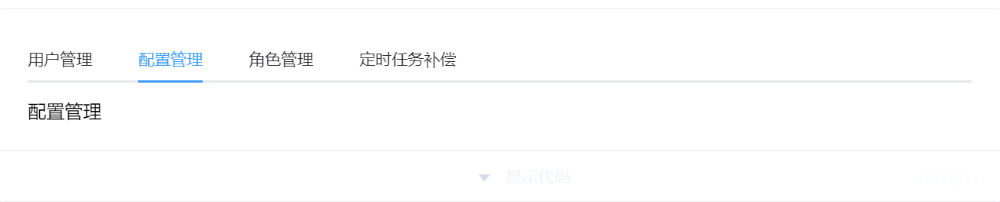
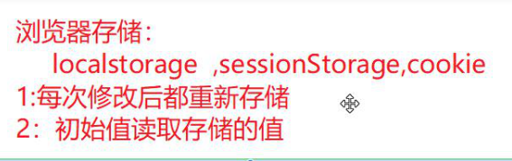

## 

## element-ui

### el-tabs   标签页



**属性**：v-model="默认选是哪个tab,它的值是与子项el-tab-pane的name值相对应"

**子项**：el-tab-pane  name属性，它的值与el-tabs上的v-model的值对应

```
重点属性：lazy:是否延迟渲染(默认是false)
```

```
el-tabs  v-mode:对于子选项的值
	el-tab-pane   label:标题  name:选中该项的值  (默认插槽)
```

```vue
//不写mode 与 name(子组件不写)  默认选中第一页
<el-tabs>
<el-tab-pane label="角色管理">角色管理</el-tab-pane>
<el-tab-pane label="配置管理">配置管理</el-tab-pane>
</el-tabs>

```


### el-table  表格

```
el-table
        data:表格的数据
       el-table-column  每一列
           label:当前列的标题
           prop:当前列对应的字段名
           width:设置宽度
      序号：
         el-table-column  type="index"
      自定义栏
        el-table-column  作用域插槽
          template v-slot="{$index,row}"
          $index:索引下标
          row:当前行数据

          forEach((item,index)=>{
            item===row
            index===$index
          })
```


### el-pagination  分页组件

```

     组件名：el-pagination
             current-page：默认页码
             page-sizes：页容量选项
             page-size:默认页容量
             layout：功能布局
             total：总条数
          @size-change： 页容量改变后的回调函数
          @current-change：页码改变后的回调函数
```


## cookie 持久化




## day03

### 1.环境变量

**开发环境**：运行npm run serve/npm run dev的环境

`.env.development `文件

配制：

1. 在根目录(package.json同级目录)创建一个文件  .env.development 
2. 设置开发环境的变量值，比如接口基地址
   1. 设置变量的要求：  以VUE_APP_变量名="值"

访问：process.env.VUE_APP_变量名   开发环境配制只只能用于开发环境


**生产环境**  运行npm run build打包后的环境

`.env.production`

配制：

1. 在根目录(package.json同级目录)创建一个文件  .env.production 

2. 设置开发环境的变量值，比如接口基地址
 1. 设置变量的要求：  以VUE_APP_变量名="值"

访问：`process.env.VUE_APP_变量名`   生产环境配制只只能用于生产环境（上线正式环境使用）

**注意：修改了环境变量一定要重启脚手架**


### 2.代理服务器解决跨域问题

```
1:修改开发环境接口基地址为一个相对值   
http:开头就是绝对值，
我们开发环境要去请求localhost前端服务器，以/开头就是一个相对址
比如:'/xxx',值的名字没有限制 
2：配制开发环境的服务器proxy
   vue.config.js
      module.exports={
           // 开发环境的服务器
          devServer:{
             proxy:{
               '/xxx':{
                  target:'真实接口基地址'，
                  // 当使用代理时，它会去调用真实接口基地址值，它内部会做一个拼接
                  // 拼接方式：真实接口基地址+'/xxx',
                  // 实际没有/xxx,我们需要去掉/xxx
                  pathRewrite:{
                    '^/xxx':''
                  }
               }
             }
    
          }
      }

```

```js
//优化方法
//对象中的使用 [] 定义的变量类型的key
//使用[process.env.VUE_APP_开发环境接口基地址变量名]代替写死的'/xxx'
proxy:{
   [process.env.VUE_APP_开发环境接口基地址变量名]:{
      target:'真实接口基地址'，
      pathRewrite:{
      ["^"+process.env.VUE_APP_开发环境接口基地址变量名]:''
      }
   }
   // 如果基地址是真实地址的后面关键字，是可以省掉pathRewrite
   // 比如：真实基地址是:  http://localhost:3000/api
   // 将基地址设置成  VUE_APP_URL="/api"
   // 配制时就不用使用pathRewrite
    [process.env.VUE_APP_URL]:{
      target:'http://localhost:3000'，  
   }
}
```


## form表单基本表单验证

1. el-form绑定表单元素的对象值   :model="表单元素对象值"
2. el-form上绑定表彰验证的规则   :rules="验证规则"

```Vue
rules:{
   prop的值:[
      {required:true,message:'必填',trigger:'触发条件blur/change'},
      {min:最小长度,max:最大长度,trigger:'blur/change'},
      {pattern:正则表达式,message:错误信息,trigger:'blur/change'}
   ]
}
```

1. el-form-item绑定prop   prop="需要验证项的字段名"

```Vue
<!DOCTYPE html>
<html lang="en">
  <head>
    <meta charset="UTF-8" />
    <meta http-equiv="X-UA-Compatible" content="IE=edge" />
    <meta name="viewport" content="width=device-width, initial-scale=1.0" />
    <title>Document</title>
  </head>
  <body>
    <div id="app">
      <!-- form表单
       组件名:el-form
                  label-width:表单内的标题的宽度,默认值为0，如果没有宽度它会另起一行，
            表单的每一项：el-form-item
                                label:'当前项的标题'
       基本表单验证
           1：el-form绑定表单元素的对象值
                :model="表单元素的对象"  
           2:el-form绑定表单验证的规则
                :rules="rules规则" 
           3：el-form-item绑定prop
              需要进行表单验证的项就绑定对应的prop
              prop的值就是需要验证的表单元素的字段名  
              
           rules规则:{
               prop的值:[
               {required:true,message:'错误信息',trigger:'触发条件(blur/change)'},  // 必填
               {min:最小长度,max:最大长度,message:'不在相应长度内的错误信息',trigger:'change'}，
               {pattern:正则表达式,message:'错误信息',trigger:'blur/change'}
               ]
           }
    
    -->
      <el-form label-width="100px" :model="form" :rules="rules">
        <el-form-item label="活动名称" prop="name">
          <el-input v-model="form.name"></el-input>
        </el-form-item>
      </el-form>
    </div>
    <script src="./vue.js"></script>
    <!-- 引入样式 -->
    <link
      rel="stylesheet"
      href="https://unpkg.com/element-ui/lib/theme-chalk/index.css"
    />
    <!-- 引入组件库 -->
    <script src="https://unpkg.com/element-ui/lib/index.js"></script>
    <script>
      new Vue({
        el: '#app',
        data: {
          form: {
            name: '' // 活动名称
          },
          rules: {
            // 表单验证规则
            name: [
              { required: true, message: '请输入活动名称', trigger: 'change' },
              //   {
              //     min: 3,
              //     max: 6,
              //     message: '请输入3-6个字符的活动名称',
              //     trigger: 'change'
              //   },
              {
                pattern: /^\S{3,6}$/,
                message: '请输入3-6字符',
                trigger: 'change'
              }
            ]
          }
        }
      })
    </script>
  </body>
</html>
```

### 全局表单验证

1. el-form标签  绑定  ref="xxx"
2. js代码中做全局表单验证触发（调用el-form组件 内的validate方法）

```Vue
this.$refs.xxx.validate((result)=>{
   result:验证结果 
    true:验证成功
    false:验证失败
})
```

### 自定义表单验证

**el-form绑定了rules规则，前面使用规则虽然可以解决大部分验证，但不是所有**

比如：验证二次验证密码是否一致

配制

```Vue
rules:{
   prop的值:[
     {required:true,message:'必填',trigger:'change'},
     {validator:(rule,value,callback)=>{
       rule:当前验证规则，基本不用
       value:当前验证项的值
       callback:回调函数
          如果验证成功  callback()
          如果验证失败  callback(new Error('错误信息'))
     },trigger:'change/blue'}
   ]
}
```


## 储存token

在vuex中调用api

在login页调用vuex actions


## api统一错误处理

在request 中建立响应拦截

响应正常时 200

​    登录成功 直接   放行 

​	响应正常 但是登录失败时

响应错误 401 403 无权限 404页面丢失

​	正常进入错误

```js
submit() {
      this.$refs.form.validate(async(res) => {
        if (res) {
          this.loading = true
        // await返回的错误被try捕获 
          try {
            //加await 变异步被 捕获 
            await this.$store.dispatch('user/toLogin', this.form)
            this.$message.success('登录成功')
          } catch (e) {
            this.loading = false
          }
        } else {
          this.$message.error('登录失败')
        }
      })
    }
```


## vuex-persistedstate插件实现vuex数据持久化


1. 安装插件  npm i **vuex-persistedstate**
2. 在vuex的根模块下导入 
   1. import **persistedstate** from 'vuex-**persistedstate**'
3. 配制

```Vue
{
  state:{}...
  plugins:[
  persistedstate({
    paths:['需要持久化的模块名','需要持久化的模块名.模块内的字段名']
    // 需要持久化的模块名:针对 整个模块持久化
    // 需要持久化的模块名.模块内的字段名：模块内某个数据持久化
  })
  ]
}
```

**注意点：用了该插件，Vue.js devtools浏览器插件在数据获取时会不准确 **


## 导航守卫登陆权限处理

```js
const whitePage = ['/login', '/404']
// 导航守卫
router.beforeEach((to, from, next) => {
  // 有token 不让去login
  if (store.state.user.token) {
    if (to.path.toLowerCase() === '/login') {
      next({ path: '/' })
    } else {
      next()
    }
    // 无token 只能去login 与404
  } else {
    if (whitePage.includes(to.path.toLowerCase())) {
      next()
    } else {
      next('/login')
    }
  }
})
```


## log设置

`object-fit:`

**用于规定应如何调整  或 <video> 的大小来适应其容器。**

类似与`background-size:`

类似与

```
fill - 默认值。调整替换后的内容大小，以填充元素的内容框。如有必要，将拉伸或挤压物体以适应该对象。
contain - 缩放替换后的内容以保持其纵横比，同时将其放入元素的内容框。
cover - 调整替换内容的大小，以在填充元素的整个内容框时保持其长宽比。该对象将被裁剪以适应。
none - 不对替换的内容调整大小。
scale-down - 调整内容大小就像没有指定内容或包含内容一样（将导致较小的具体对象尺寸）
```

# dropdown

**组件名：el-dropdown**

**默认插槽**：默认文本显示

**具名插槽(dropdown)**：下拉菜单项的显示

- el-dropdown-menu 
  - el-dropdown-item  用于下拉菜单子项的显示

**el-dropdown菜单点击处理**

1. el-dropdon-item  绑定  command="xxx"
2. el-dropdown绑定事件  @command="(command)=>{command的值就是点击项的command属性的值}"

`navbar下拉菜单的使用`：

```Vue
 <el-dropdown @command="commandEvent">
      <div class="right">
        
        <span class="username">管理xxx</span>
        <i class="el-icon-arrow-down icon-color" />
      </div>
      <template #dropdown>
        <el-dropdown-menu>
          <el-dropdown-item command="home">首页</el-dropdown-item>
          <el-dropdown-item command="exit">退出登陆</el-dropdown-item>
        </el-dropdown-menu>
      </template>
    </el-dropdown>
    
    
 methods: {
    commandEvent(command) {
      console.log(command)
    }
  }
```


## 统一token处理

1. 在响应拦截统一处理token超时

```Vue
import store from '@/store' // store====this.$store
import router from '@/router' // router===this.$router
  (error) => {
    // 接口状态码以非2开头走error
    // console.dir(error)
    // console.log('log', [error])
    if (error.response.status === 401) {
      // token超时了
      // 1:删除token  2:删除用户信息 3：错误提示 4：跳转到登陆页
      store.commit('user/logout')
      Message.error('登陆超时了')
      router.push('/login')
    }
    return Promise.reject(error)
  }
```

1. 导航守卫 中调用接口获取用户信息时不用再关心token超时问题了

```Vue
//  最近父级要加入async
 await store.dispatch('user/getUserInfo')
 // 调用获取用户信息成功了
   next()
  
```

# 统一token处理

1. 任意接口加入token都不报错，直接在请求拦截加入token就可以了
2. 不需要token的接口加了会报错 
   1. 接口地址有规律的，就通过请求中通过url规律做判断
   2. 没有规律的就在api中加入一个特别字段后在请求拦截中判断 就可以了

```Vue
_axios.interceptors.request.use(
  (config) => {
    // 统一token处理
    /*
    实际 开发有二种接口情况
    1：接口不需要token你加了没事
    config.headers.Authorization = `Bearer ${store.state.user.token}`
    2：接口不需要token你加了它就报错
      解决方式：
         不需要的接口可以加入一个特别字段在请求拦截识别到后处理
               {
                 method:'post',
                 url...,
                 noToken:true,// 不需要token
               }
               if(!config.noToken){
                 // 加入token处理
               }
         接口地址有规律，根据规律处理
            以/xxx开头的都不需要接口，其它的都要token
            if(!config.url.startsWith('/xxx')){
                // 加入token处理
            }
    */
    // if (!config.noToken) {
    config.headers.Authorization = `Bearer ${store.state.user.token}`
    // }
    return config
  },
  (error) => {
    return Promise.reject(error)
  }
)
```