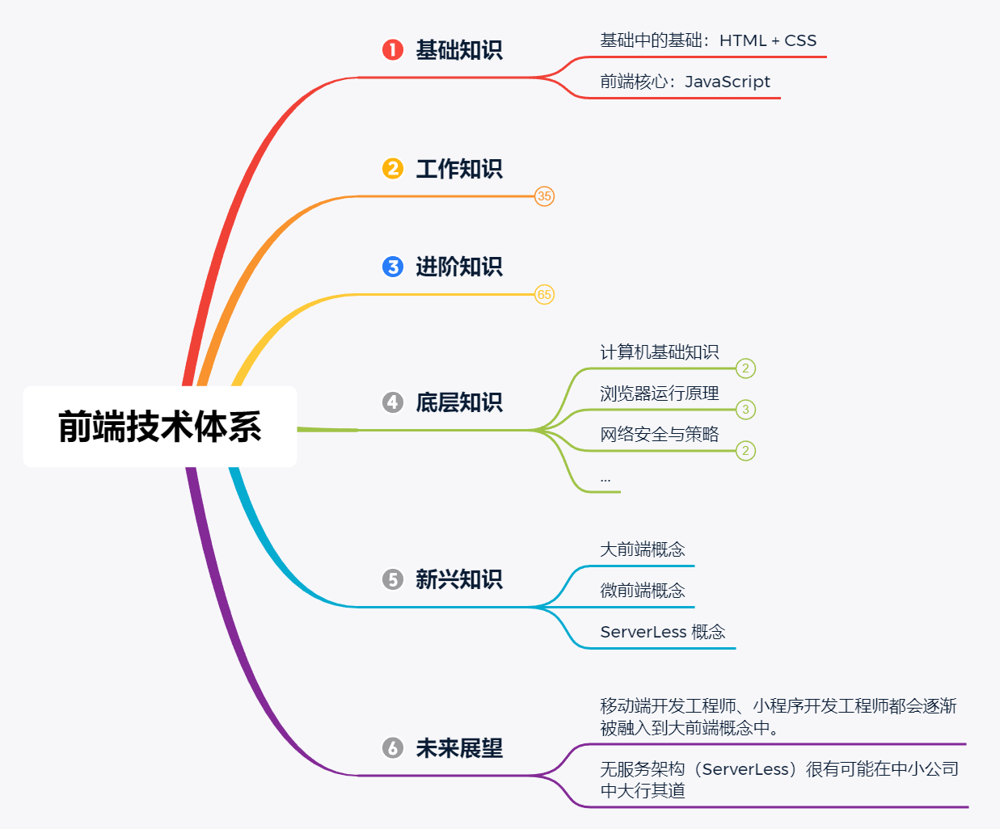

# 前端技术体系

# 总览

## 基础知识

### 基础中的基础：HTML + CSS

### 前端核心：JavaScript

## 工作知识

### jQuery 为代表的一众高兼容库

- 模板引擎库（art-template、handlebars）
- 模块化工具（CMD、CommonJS）
- 工程化工具（Gulp、Grunt）
- MVC 框架（Backbone）
- UI 库（Bootstrap、LayUI）
- ...

### Angular、React、Vue（首推） 三选一

- 
- 

### 常见的 UI 库

- Element UI
- vuetify
- Ant Design
- Bootstrap
- Lyui
- Vant UI
- Framework7
- WEUI

### 小程序技术 || 跨平台技术

- 小程序技术
  - 以微信小程序为例
    - 小程序原生开发
    - 小程序框架开发
      - wepy
      - mpvue
    - 小程序 UI 库
      - WeUI
      - Vant weapp
      - iView Weapp
- 跨平台技术
  - React Native
  - Weex
  - Flutter
  - uni-app

## 进阶知识

### 编程语言

- TypeScript
- JAVA
- Go

### 服务端技术

- Node
  - Express
  - KOA
- 数据库
  - SQL 型数据库
    - MySQL
  - NO SQL 型数据库
    - MongoDB
    - Redis
- Nginx
  - web服务器
- 云概念
  - 云服务器
    - 标准 ECS 云服务器
    - 应用云服务器
  - 云数据库
  - 云存储服务
    - OSS：对象存储
    - NAS：文件存储
  - ServerLess
  - CDN 服务

### 优化技术

- 网页访问速度优化
  - 静态资源优化
    - 合并 css、js 文件
    - 雪碧图
    - 文件压缩、图片压缩、gzip压缩
    - cdn 分发 + 适当的缓存
  - 接口访问优化
    - 接口合并
    - 数据结构处理
  - 页面渲染速度优化
    - 首屏优化方案
      - 基于 webview 嵌入的优化
      - 基于跨平台技术的优化
    - 懒加载
      - 组件懒加载
      - 路由懒加载
- 用户误操作规避优化
  - 防抖 
  - 节流
- ...

### 监控技术

- 数据埋点
- 异常数据监控
- 行为数据监控
- 性能数据跟踪
- 数据可视化
- ...

### 工程化技术

- 基于 Gitlab 自建代码托管平台
- 基于 jenkins 自动化工具
  - 合规检测
  - 自动化测试
  - 自动化部署
- 脚手架工具
- ...

### 源码（思想）层面

- 阅读源码

### ...

## 底层知识

### 计算机基础知识

- 数据结构
- 算法

### 浏览器运行原理

- 浏览器的渲染原理
- 浏览器加载白屏的原因
- 浏览器的缓存机制

### 网络安全与策略

- 网络基础
- 网络攻击

### ...

## 新兴知识

### 大前端概念

### 微前端概念

### ServerLess 概念

## 未来展望

### 移动端开发工程师、小程序开发工程师都会逐渐被融入到大前端概念中。

### 无服务架构（ServerLess）很有可能在中小公司中大行其道

