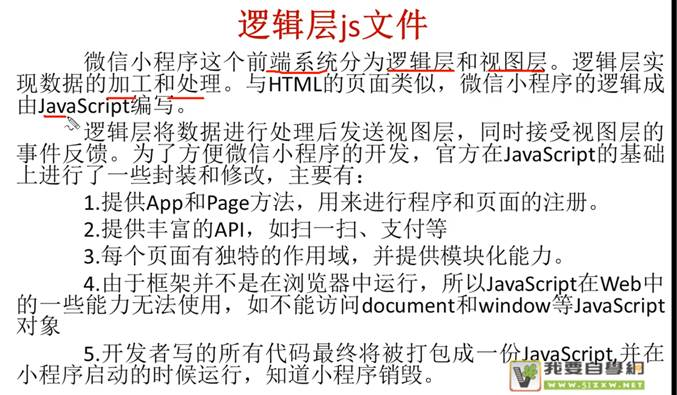
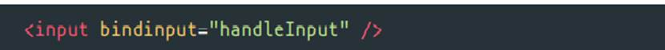
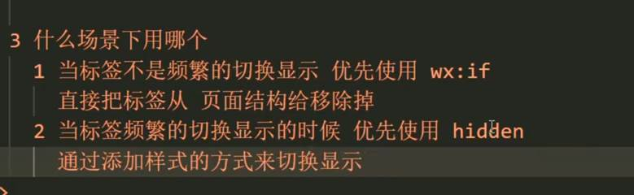
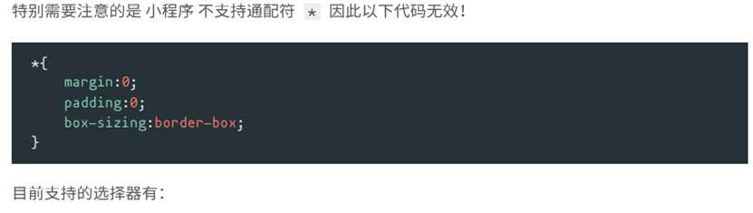
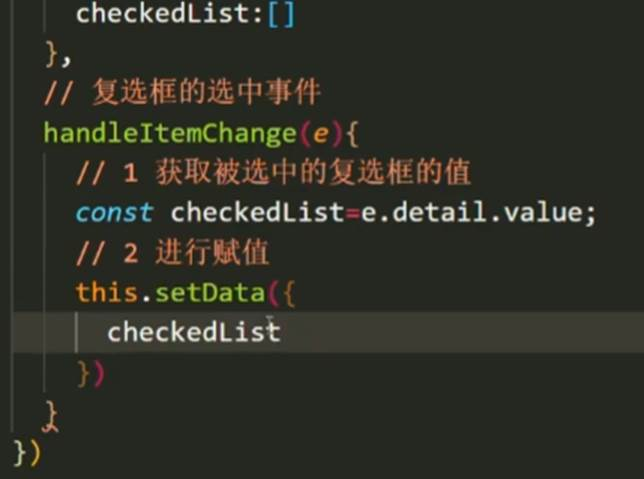
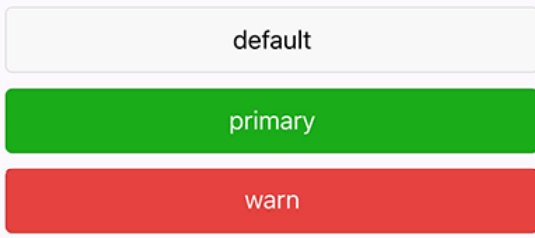

# 1.小程序结构


```
App.json 主配置

App.js 主逻辑

App.wxss 主样式

 Utlis 公共文件

 

*.js       主要负责页面的业务逻辑

*.json     主要用于描述页面属性

 *.wxml    主要负责本页面的界面展示，以及事件的绑定等等。

 *.wxss    主要用于与wxml文件一起使用，优化wxml页面

 音频 图片自行创建文件夹

```


## 1.1⼩程序配置⽂件


## 1.1.1APP.JS




 


## 1.1.2 APP.json([全局配置](https://developers.weixin.qq.com/miniprogram/dev/framework/config.html))

app.json 是当前⼩程序的全局配置，包括了⼩程序的所有⻚⾯路径、界⾯表现、⽹络超时时间、底 部 tab 等。普通快速启动项⽬⾥边的 app.json 配置


 

(1)    全局Pages： 

⽤于描述当前⼩程序所有⻚⾯路径，这是为了让微信客⼾端知道当前你的⼩程序 ⻚⾯定义在哪个⽬录。

所以页面都要在pages项目下注册

首先显示第一行页面

一个文件夹对应一个页面（相同文件下，相同名字）


(2)    Window：

window 字段⸺定义⼩程序所有⻚⾯的顶部背景颜⾊，⽂字颜⾊定义等。


 

 

(3)⻚⾯配置page.json 

⼀个⼩程序应⽤程序会包括最基本的两种配置⽂件。

⼀种是全局的 app.json 和 ⻚⾯⾃⼰的 page.json

开发者可以独⽴定义每个⻚⾯的⼀些属性，如顶部颜⾊、是否允许下拉刷新等等。 ⻚⾯的配置只能设置 app.json 中部分 window 配置项的内容，⻚⾯中配置项会覆盖 app.json 的 window 中相同的配置项。

 


例：


 

 

(3)    Tabbar: 底部选项

 


 


注:


3.pages 第一项 必须在 tabBar的list数组中

 

 

例：


 

 

# 2.数据类型

 


 

# 3.数据绑定

页面所有数据都来自于JS中Page

 ```
Page{
data：

}      
 ```


3.1 普通写法


3.2组件属性


3.3bool类型


3.4运算

 (1)三元运算


(2)算数运算


3.5逻辑判断


3.6字符串运算


注意 ：花括号和引号之间如果有空格，将最终被解析成为字符串

 

 

 

# 4.[⼩程序事件的绑定](https://developers.weixin.qq.com/miniprogram/dev/framework/view/wxml/event.html)

⼩程序中绑定事件，通过bind关键字来实现，如 bindtap ，bindinput ，bindchange 等 


不同的组件⽀持不同的事件，具体看组件的说明即可。


注:

1.绑定事件时不能带参数 不能带括号 以下为错误写法


2事件传值 通过标签⾃定义属性的⽅式 和 value


3事件触发时获取数据


 

例：


 




```
获取值:  var num2=this.data.num;

而不是  var num2=num;

设置值

this.setData({    

​    })
```


 

 

 

# 5.列表渲染wx:for 


wx:key ⽤来提⾼数组渲染的性能

 wx:key 绑定的值 有如下选择

1. string 类型，表⽰ 循环项中的唯⼀属性 如


2. 保留字 *this ，它的意思是 item 本⾝ ，*this 代表的必须是 唯⼀的字符串和数组。


 

例：


 


 

 


 

Block 统一到一个目录下

渲染⼀个包含多节点的结构块 block最终不会变成真正的dom元素


 

# 6.条件渲染


 

 


 

 

 

 Hidden




 

# 7[.样式 WXSS](https://developers.weixin.qq.com/miniprogram/dev/framework/view/wxss.html)

WXSS( WeiXin Style Sheets )是⼀套样式语⾔，⽤于描述 WXML 的组件样式。

[微信小程序 wxss样式 - 简书 (jianshu.com)](https://www.jianshu.com/p/83b85f321570)

 

## 7.1尺寸单位


 

 

 

 

## 7.2样式导入


 

wxss中直接就⽀持，样式导⼊功能。 

也可以和 less中的导⼊混⽤。 

使⽤ @import 语句可以导⼊外联样式表，只⽀持相对路径。


## 7.3选择器



 

 


 

## 7.4模板：


## 7.5引用其他页面文件：

 


# 8.常用[组件](https://developers.weixin.qq.com/miniprogram/dev/component/)：


 

 

## 8.1:View(flex盒子)


居中

：flex-end 右对齐

：flex-start 左对齐


## 8.2text

1.⽂本标签 

2.只能嵌套text 

3.⻓按⽂字可以复制（只有该标签有这个功能） 

4.可以对空格 回⻋ 进⾏编码


例：

 

## 8.3:image

1. 图⽚标签，image组件默认宽度320px、⾼度240px 

2. ⽀持懒加载


mode 有效值：mode 有 13 种模式，其中 4 种是缩放模式，9种是裁剪模式。


 


 

 

## 8.4 Swiper: 微信内置轮播图组件

搭配swiper-item使用

swiper-item：默认宽度和⾼度都是100%

 


默认宽度 100% ⾼度 150px


 

 


 

 

## 8.5. navigator 导航组件 类似超链接标签


open-type 有效值：


 

 

10.6. rich-text富文本标签

 

可以将字符串解析成 对应标签，类似 vue中 v--html 功能


nodes 属性⽀持 字符串 和 标签节点数组


⽂本节点：type = text


nodes 不推荐使⽤ String 类型，性能会有所下降。 

rich--text 组件内屏蔽所有节点的事件。 

attrs 属性不⽀持 id ，⽀持 class.

name 属性⼤⼩写不敏感。 

如果使⽤了不受信任的 HTML 节点，该节点及其所有⼦节点将会被移除。 

img 标签仅⽀持⽹络图⽚。

 

 

## 10.7:Radio：单选  checkbox复选

可以通过 color属性来修改颜色 

**单**选需要搭配 radio-group ⼀起使⽤

复选需要搭配 checkbox-group ⼀起使⽤

 


​                                                                                              


单选例：


 

复选例:




 

 

 

## 10.8:Button：




open-type 的合法值


open-type 的 contact的实现流程

1. 将⼩程序 的 appid 由测试号改为 ⾃⼰的 appid 

2. 登录微信⼩程序官⽹，添加 客服 -- 微信 

3. 为了⽅便演⽰，⽼师⾃⼰准备了两个账号 

1. 普通⽤⼾ 

A 2. 客服-微信 B

4. 就是⼲！

 


## 10.9Input：

 


 

 

 

## 10.10. icon


代码:


 


 

## 10.11. ⾃定义组件

⼩程序允许我们使⽤⾃定义组件的⽅式来构建⻚⾯。

1创建⾃定义组件 

类似于页面，一个自定义组件由 json wxml wxss js 4个文件组成

可以在微信开发者⼯具中快速创建组件的⽂件结构

 


在⽂件夹内 components/myHeader ，创建组件 名为 myHeader


2.声明组件

⾸先需要在组件的 json ⽂件中进⾏⾃定义组件声明


3. 编辑组件

同时，还要在组件的 wxml ⽂件中编写组件模板，在 wxss ⽂件中加⼊组件样式 slot 表⽰插槽，类似vue中的slot


在组件的 wxss ⽂件中编写样式


4.注册组件                         

在组件的 js ⽂件中，需要使⽤ Component() 来注册组件，并提供组件的属性定义、内部数据和 ⾃定义⽅法


 

5.声明引⼊⾃定义组件


6.⻚⾯中使⽤⾃定义组件


 

其他属性

定义段与⽰例⽅法

Component 构造器可⽤于定义组件，调⽤ Component 构造器时可以指定组件的属性、数据、⽅法 等。


 

. 组件-⾃定义组件传参

1. ⽗组件通过属性的⽅式给⼦组件传递参数 

2. ⼦组件通过事件的⽅式向⽗组件传递参数

过程

1. ⽗组件 把数据 {{tabs}} 传递到 ⼦组件的 tabItems 属性中 

2. ⽗组件 监听 onMyTab 事件

3. ⼦组件 触发 bindmytap 中的 mytap 事件

1. ⾃定义组件触发事件时，需要使⽤ triggerEvent ⽅法，指定 事件名 、 detail 对象

4. ⽗ -> ⼦ 动态传值 this.selectComponent("#tabs");


1. 标签名 是 中划线的⽅式 2. 属性的⽅式 也是要中划线的⽅式 3. 其他情况可以使⽤驼峰命名 1. 组件的⽂件名如 myHeader.js 的等 2. 组件内的要接收的属性名 如 innerText

 

 

# 9⼩程序⽣命周期

分为应⽤⽣命周期和⻚⾯⽣命周期

12.1. 应⽤⽣命周期


12.2. ⻚⾯⽣命周期


 

 

 

# 其他

## 全局变量


 

## wx.showModal(Object object)

```wx.showModal(Object object)```

中无法使用this调用自定义函数

解决方法

在wx.showModal(Object object)前定义

```Var that=this```

之后在wx.showModal(Object object)中

用 ```that.function()```调用自定义函数

 

全局变量

 

我们定义一个全局变量g_isPlayingMusic来保存播放状态，默认为false。

 

```
App({

  onLaunch: function () {

 

  },

  globalData: {

​    g_isPlayingMusic: false

  }

})
```

在需要获取该变量的页面.js文件中按照如下代码即可获取。

```


var app = getApp();

Page({

 

  data: {

​    isPlayingMusic: app.globalData.g_isPlayingMusic

  }

}）
```


获取之后进行修改也很简单，只需赋值即可。

 

```pp.globalData.g_isPlayingMusic = true;```